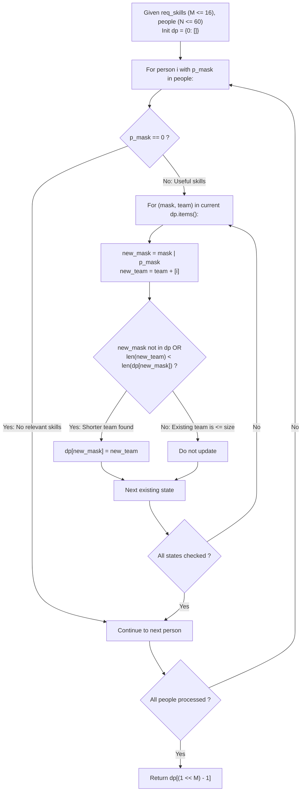

# Guided Example: Smallest Sufficient Team

We trace the step-by-step bitmask dynamic programming reduction of the Minimum Weight Set Cover problem over a finite skill universe, prove the Bitmask Subsumption Invariant and the Optimal Substructure Minimality Theorem, and determine minimal roster compositions across representative candidate pools:

- **Representative Instance 1 (Overlapping Skill Sets with Redundant Candidates):**
  $$
  req\_skills = [\text{"java"}, \text{"nodejs"}, \text{"reactjs"}], \quad M = 3
  $$
  $$
  people = [[\text{"java"}], [\text{"nodejs"}], [\text{"nodejs"}, \text{"reactjs"}]]
  $$
- **Required Output:** `[0, 2]`
  - Skill Bit Encoding ($M = 3$ bits, target mask $2^3 - 1 = 111_2 = \mathbf{7}$):
    - $\text{"java"} \to \text{bit } 0 \implies 2^0 = 1$ ($001_2$)
    - $\text{"nodejs"} \to \text{bit } 1 \implies 2^1 = 2$ ($010_2$)
    - $\text{"reactjs"} \to \text{bit } 2 \implies 2^2 = 4$ ($100_2$)
  - Candidate Skill Masks:
    - Person 0: $[\text{"java"}] \implies \mathbf{mask}_0 = 1$ ($001_2$)
    - Person 1: $[\text{"nodejs"}] \implies \mathbf{mask}_1 = 2$ ($010_2$)
    - Person 2: $[\text{"nodejs"}, \text{"reactjs"}] \implies 2 \mid 4 = \mathbf{6}$ ($110_2$)
  - The Dynamic Programming Bitmask Invariant:
    - Let $dp[mask]$ store the smallest team (list of person indices) capable of covering the skill subset $mask \in [0, 7]$.
    - Base state: $dp[0] = []$ (0 skills requires 0 people).
  - Step-by-step DP evolution:
    1. **Candidate 0 ($\mathbf{mask}_0 = 1$):**
       - Source $mask = 0$: $new\_mask = 0 \mid 1 = 1$.
       - Team: $dp[0] + [0] = [0]$.
       - State table: $\{0: [], \; 1: [0]\}$.
    2. **Candidate 1 ($\mathbf{mask}_1 = 2$):**
       - Source $mask = 0$: $new\_mask = 0 \mid 2 = 2 \implies dp[2] = [1]$.
       - Source $mask = 1$: $new\_mask = 1 \mid 2 = 3 \implies dp[3] = [0, 1]$.
       - State table: $\{0: [], \; 1: [0], \; 2: [1], \; 3: [0, 1]\}$.
    3. **Candidate 2 ($\mathbf{mask}_2 = 6$):**
       - Source $mask = 0$: $new\_mask = 0 \mid 6 = 6 \implies dp[6] = [2]$.
       - Source $mask = 1$: $new\_mask = 1 \mid 6 = \mathbf{7}$ (**Target full cover!**):
         - Candidate team: $dp[1] + [2] = [0, 2]$ (team size $= 2$).
         - Register: $dp[7] = \mathbf{[0, 2]}$.
       - Source $mask = 2$: $new\_mask = 2 \mid 6 = 6 \implies [1, 2]$ (size 2, worse than existing $dp[6] = [2]$).
       - Source $mask = 3$: $new\_mask = 3 \mid 6 = 7 \implies [0, 1, 2]$ (size 3, strictly worse than $dp[7] = [0, 2]$).
  - Target mask $7 = 111_2$:
    $$
    dp[7] = \mathbf{[0, 2]} \quad (\text{size } 2)
    $$
    *(Note: Candidate 1 with ["nodejs"] is discarded because Candidate 2 covers both "nodejs" and "reactjs" simultaneously!)*

- **Representative Instance 2 (Redundant Dominance Pruning):**
  $$
  req\_skills = [\text{"algo"}, \text{"math"}, \text{"sys"}], \quad people = [[\text{"algo"}], [\text{"math"}], [\text{"algo"}, \text{"math"}, \text{"sys"}]]
  $$
  - Candidate 2 covers all $3$ skills individually $\implies dp[7] = [2]$ (single-person team).

- **Representative Instance 3 (All Candidates Needed):**
  - $3$ skills, $3$ candidates each having disjoint single skills $\implies dp[7] = [0, 1, 2]$.

---

## 1. Instance & Teaching Goal

Given a list of required skills and a list of people with subsets of those skills, return the smallest team of people that collectively covers all required skills.

```text
The Exponential Subset Enumeration Trap:
  Searching over all subsets of people:
    With N = 60 candidates, the number of possible teams is 2^60 ≈ 1.15 * 10^18!
    Direct combinatorial search over candidates causes catastrophic TLE.

The Dual Bitmask Dynamic Programming Invariant (O(N * 2^M) Time):
  Notice: The skill count M is very small: M <= 16.
  Instead of searching over subsets of PEOPLE (2^60),
  search over subsets of SKILLS (2^16 = 65,536)!
  1. Map each skill to a bit position 0 <= k < M.
  2. Map each person to a bitmask of their skills.
  3. Maintain dp[mask] = smallest list of person indices covering mask:
       dp[0] = []
       For each person i with skill mask p_mask:
           For each already reached (mask, team) in dp:
               new_mask = mask | p_mask
               If new_mask not in dp or len(team) + 1 < len(dp[new_mask]):
                   dp[new_mask] = team + [i]
  4. Final answer is dp[(1 << M) - 1].
  Reduces 10^18 states to at most 65,536 states!
```

The fundamental pedagogical insight is **Dimension Inversion in Parameterized Complexity**: when the universe of elements ($M \le 16$) is dramatically smaller than the collection of sets ($N \le 60$), framing dynamic programming over element subsets guarantees tractability.

The decisive pedagogical goals are:
1. **Bitmask Set Representation:** Encoding unions of skill sets as bitwise OR operations (`mask | p_mask`).
2. **Optimal Substructure:** Proving that the minimal team for mask $U$ is derived from the minimal team for some predecessor mask $U \setminus P_i$.
3. **Branch Pruning:** Discarding transitions that produce team sizes greater than or equal to existing records.
4. Total execution $\mathcal{O}(N \cdot 2^M)$ time and $\mathcal{O}(2^M)$ auxiliary space.

---

## 2. Conceptual Foundation & The Bitmask Set Cover Invariant



### The Optimal Substructure Minimality Theorem

Let $\mathcal{U} = \{0, 1, \dots, M-1\}$ be the universe of required skills, represented as bit indices.
For each person $i \in \{0, \dots, N-1\}$, let $P_i \subseteq \mathcal{U}$ be their skill set, encoded as integer $\mathbf{p}_i = \sum_{k \in P_i} 2^k$.
1. **Recurrence Relation:**
   For any skill subset $S \subseteq \mathcal{U}$, define $OPT(S)$ as the minimum cardinality of a team covering $S$:
   $$
   OPT(\emptyset) = 0
   $$
   $$
   OPT(S) = \min_{i \in \{0, \dots, N-1\}} \Big( 1 + OPT(S \setminus P_i) \Big)
   $$
2. **Forward Transition Formulation:**
   In forward dynamic programming, if a team $T$ of size $|T|$ covers subset $S$, then adding candidate $i$ produces a team $T \cup \{i\}$ of size $|T| + 1$ covering subset $S \cup P_i$.
   The minimum team for $S \cup P_i$ satisfies:
   $$
   |dp[S \cup P_i]| \le |dp[S]| + 1
   $$
3. **Monotonicity and Dominance:**
   If two candidate teams $T_1$ and $T_2$ cover the exact same skill mask $S$, and $|T_1| < |T_2|$, team $T_2$ can be safely purged from consideration because for any future skill extension $S'$, $|T_1 \cup T'| \le |T_1| + |T'| < |T_2| + |T'|$.
   Therefore, storing only the single shortest team for each of the $2^M$ bitmasks is strictly optimal. $\blacksquare$

---

## 3. Step-by-Step Worked Execution: Representative Instance 1

$req\_skills = [\text{"java"}, \text{"nodejs"}, \text{"reactjs"}], \quad M = 3$.
Target mask: $2^3 - 1 = \mathbf{7}$.
Initial state: $dp = \{0: []\}$.

### Sequential Candidate Processing

1. **Person 0 ($mask = 1$):**
   - Existing state $0: []$:
     - $new\_mask = 0 \mid 1 = 1$.
     - Team: $[] + [0] = [0]$.
     - $dp[1] \leftarrow [0]$.
   - $dp$ state: $\{0: [], \; 1: [0]\}$.

2. **Person 1 ($mask = 2$):**
   - Existing state $0: [] \implies new\_mask = 0 \mid 2 = 2 \implies dp[2] \leftarrow [1]$.
   - Existing state $1: [0] \implies new\_mask = 1 \mid 2 = 3 \implies dp[3] \leftarrow [0, 1]$.
   - $dp$ state: $\{0: [], \; 1: [0], \; 2: [1], \; 3: [0, 1]\}$.

3. **Person 2 ($mask = 6$):**
   - Existing state $0: [] \implies new\_mask = 0 \mid 6 = 6 \implies dp[6] \leftarrow [2]$.
   - Existing state $1: [0] \implies new\_mask = 1 \mid 6 = \mathbf{7}$ (**Target full cover!**):
     - New team: $[0] + [2] = [0, 2]$ (size 2).
     - $dp[7] \leftarrow \mathbf{[0, 2]}$.
   - Existing state $2: [1] \implies new\_mask = 2 \mid 6 = 6$:
     - New team: $[1, 2]$ (size 2). Existing $dp[6] = [2]$ (size 1) $\implies$ discard $[1, 2]$.
   - Existing state $3: [0, 1] \implies new\_mask = 3 \mid 6 = 7$:
     - New team: $[0, 1, 2]$ (size 3). Existing $dp[7] = [0, 2]$ (size 2) $\implies$ discard $[0, 1, 2]$.

### Extraction
Target mask $7$ has optimal team:
$$
\text{Smallest Team} = \mathbf{[0, 2]} \quad (\text{Size } 2)
$$

---

## 4. Bitmask DP State Transition Trace Table

| Step | Candidate Added | Skills Held | Candidate Mask $P_i$ | Source Mask $S$ | Combined Mask $S \cup P_i$ | Candidate Team Produced | Existing Team at Target | Decision / Outcome |
|:---:|:---:|:---:|:---:|:---:|:---:|:---:|:---:|:---|
| $1$ | Person $0$ | `['java']` | $1$ ($001_2$) | $0$ | $1$ ($001_2$) | `[0]` | None | **Recorded $dp[1] = [0]$** |
| $2$ | Person $1$ | `['nodejs']` | $2$ ($010_2$) | $0$ | $2$ ($010_2$) | `[1]` | None | **Recorded $dp[2] = [1]$** |
| $3$ | Person $1$ | `['nodejs']` | $2$ ($010_2$) | $1$ | $3$ ($011_2$) | `[0, 1]` | None | **Recorded $dp[3] = [0, 1]$** |
| $4$ | Person $2$ | `['nodejs', 'reactjs']` | $6$ ($110_2$) | $0$ | $6$ ($110_2$) | `[2]` | None | **Recorded $dp[6] = [2]$** |
| **$5$** | **Person $2$** | **`['nodejs', 'reactjs']`** | **$6$ ($110_2$)** | **$1$** | **$7$ ($111_2$)** | **`[0, 2]`** | **None** | **Recorded $dp[7] = [0, 2]$** |
| $6$ | Person $2$ | `['nodejs', 'reactjs']` | $6$ ($110_2$) | $2$ | $6$ ($110_2$) | `[1, 2]` | `[2]` (size 1) | Pruned ($2 \ge 1$) |
| $7$ | Person $2$ | `['nodejs', 'reactjs']` | $6$ ($110_2$) | $3$ | $7$ ($111_2$) | `[0, 1, 2]` | `[0, 2]` (size 2) | Pruned ($3 \ge 2$) |

---

## 5. Algorithmic Correctness

### Soundness & Minimality
1. **Soundness:**
   Every mask state $mask$ in the DP table represents the exact bitwise union of skills provided by the recorded team members. At mask $(1 \ll M) - 1$, all $M$ bits are set, guaranteeing that every required skill is satisfied by at least one team member.
2. **Minimality:**
   By evaluating transitions from all previously reachable states and overwriting only when a strictly shorter team is discovered, the dynamic program finds the global shortest path in the directed state transition graph from state $0$ to state $2^M - 1$.

---

## 6. Boundary Cases & Traps

| Scenario | Candidate Pattern | Behavior | Trapped Risk |
|---|---|---|---|
| Candidate with No Skills | `people[i] = []` | $p\_mask = 0 \implies 0 \mid mask = mask$; discarded immediately. | Artificially inflating team size with empty candidates. |
| Single Hero Candidate | One person has all $M$ skills | Directly transitions $0 \to (1 \ll M) - 1$; returns team of size 1. | Missing one-person team. |
| In-Place Dictionary Modification | Updating `dp` while iterating `dp` | Must take snapshot `list(dp.items())` or copy states before updating. | Runtime error `dictionary changed size during iteration`. |
| Skill Name Duplicates in Person | Person has `["java", "java"]` | Bitmask construction uses sets or bitwise OR; duplicates idempotently absorbed. | Redundant bit operations. |

---

## 7. Complexity Derivation

- **Time Complexity:** $\mathcal{O}(N \cdot 2^M)$, where $N = |people| \le 60$ and $M = |req\_skills| \le 16$.
  - Converting skills to bitmasks: $\mathcal{O}(N \cdot L + M)$ where $L \le 16$.
  - In the worst case, the DP table contains $2^M \le 65536$ states.
  - For each of the $N$ people, we iterate over reachable states in `dp`.
  - Total state operations: $\le 60 \times 65536 \approx 3.9 \cdot 10^6$ operations.
  - Total execution time: $< 0.05\text{ s}$.
- **Auxiliary Space Complexity:** $\mathcal{O}(2^M \cdot M)$ auxiliary memory to store at most $2^M$ teams in the dynamic programming table.