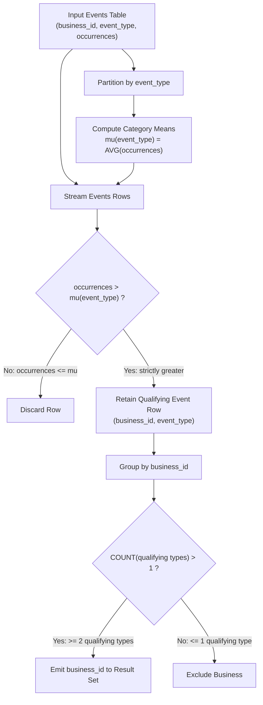

# Guided Example: Active Businesses

We trace the relational multi-stage aggregation pipeline for identifying entities whose activity strictly surpasses group-level category benchmarks across multiple dimensions, formalizing the Partitioned Dual-Aggregate Filter Invariant:

- **Representative Instance 1 (Standard Mixed Activity Multi-Event Portfolio):**
  $$
  \text{Events} = \big\{ (1, \text{'reviews'}, 7), \; (3, \text{'reviews'}, 3), \; (1, \text{'ads'}, 11), \; (2, \text{'ads'}, 7), \; (3, \text{'ads'}, 6), \; (1, \text{'page views'}, 3), \; (2, \text{'page views'}, 12) \big\}
  $$
- **Required Output:**
  $$
  \text{Active Businesses} = [1]
  $$
  - Group Category Benchmarks (Mean occurrences $\mu_e$ per event type):
    - $\mu_{\text{reviews}} = \frac{7 + 3}{2} = 5.0$
    - $\mu_{\text{ads}} = \frac{11 + 7 + 6}{3} = \frac{24}{3} = 8.0$
    - $\mu_{\text{page views}} = \frac{3 + 12}{2} = 7.5$
  - Row-Level Benchmark Evaluation:
    - Business $1$:
      - $\text{'reviews'} \implies 7 > 5.0$ (Surpasses benchmark: $+1$)
      - $\text{'ads'} \implies 11 > 8.0$ (Surpasses benchmark: $+1$)
      - $\text{'page views'} \implies 3 \le 7.5$ (Fails benchmark: $+0$)
      - Total qualifying event types $= 2$ ($2 > 1 \implies \mathbf{Active}$)
    - Business $2$:
      - $\text{'ads'} \implies 7 \le 8.0$ (Fails benchmark: $+0$)
      - $\text{'page views'} \implies 12 > 7.5$ (Surpasses benchmark: $+1$)
      - Total qualifying event types $= 1$ ($1 \ngtr 1 \implies \text{Inactive}$)
    - Business $3$:
      - $\text{'reviews'} \implies 3 \le 5.0$ (Fails benchmark: $+0$)
      - $\text{'ads'} \implies 6 \le 8.0$ (Fails benchmark: $+0$)
      - Total qualifying event types $= 0$ ($0 \ngtr 1 \implies \text{Inactive}$)
  - Final Selection: Only business $1$ achieves $\ge 2$ above-average event types.

- **Representative Instance 2 (Strict Inequality Boundary Tie):**
  $$
  \text{Events} = \big\{ (10, \text{'clicks'}, 5), \; (20, \text{'clicks'}, 5), \; (10, \text{'shares'}, 8), \; (20, \text{'shares'}, 2) \big\}
  $$
  - Benchmark for $\text{'clicks'} = \frac{5 + 5}{2} = 5.0$.
  - For both businesses, $5 > 5.0$ evaluates to False (ties do not surpass average).
  - Benchmark for $\text{'shares'} = \frac{8 + 2}{2} = 5.0$. Business $10$ qualifies ($8 > 5.0$), but has only $1$ qualifying type.
  - Final Selection: Empty set $[]$.

---

## 1. Instance & Teaching Goal

Given an event log tracking occurrences of different event types across businesses, return all businesses that have strictly more than one event type where their recorded occurrences strictly exceed the cross-business average for that specific event type.

```text
The Single-Pass Global Fallacy:
  Computing a single global average across ALL events simultaneously:
    reviews (7, 3), ads (11, 7, 6), page views (3, 12) -> Global Mean = 49 / 7 = 7.0
    Comparing disparate event types against a single global threshold corrupts
    category semantics (e.g. ad impressions naturally outnumber review writes).

The Partitioned Dual-Aggregate Filter Invariant:
  1. Category Partition Phase:
     Partition event records by event_type.
     Compute the exact conditional expectation mu(event_type) = E[occurrences | event_type].
  2. Local Superiority Filtering:
     Compare each individual row (business_id, event_type, occurrences) against mu(event_type).
     Retain row if and only if occurrences > mu(event_type).
  3. Cardinality Aggregation:
     Group surviving records by business_id.
     Select business_id where COUNT(DISTINCT event_type) > 1.
```

The fundamental pedagogical insight is **Multi-Grain Relational Aggregation**: an observation cannot be evaluated in isolation until its category baseline is computed at the partition grain, followed by second-level aggregation across qualifying categories per business entity.

---

## 2. Conceptual Foundation & The Partitioned Dual-Aggregate Invariant



### The Partitioned Dual-Aggregate Filter Theorem

Let $\mathcal{E}$ be the multiset of recorded events, where each record $r \in \mathcal{E}$ is a tuple $(b_r, e_r, o_r)$ representing business identifier $b_r$, event type $e_r$, and occurrence metric $o_r$.

1. **Category Conditional Expectation:**
   For each distinct event category $e \in \Pi_{event\_type}(\mathcal{E})$, the group benchmark $\mu(e)$ is given by:
   $$
   \mu(e) = \frac{1}{|\{r \in \mathcal{E} : e_r = e\}|} \sum_{r \in \mathcal{E}, \, e_r = e} o_r
   $$
2. **Boolean Superiority Predicate:**
   A record $r$ satisfies the benchmark superiority condition $\mathcal{S}(r)$ if and only if:
   $$
   \mathcal{S}(r) \iff o_r > \mu(e_r)
   $$
   Notice that $\mathcal{S}(r)$ is strictly false when $o_r = \mu(e_r)$.
3. **Entity Selection Invariant:**
   A business $b$ belongs to the set of active businesses $\mathcal{A}$ if and only if the cardinality of its qualifying event types strictly exceeds $1$:
   $$
   \mathcal{A} = \left\{ b \in \Pi_{business\_id}(\mathcal{E}) \;:\; \sum_{r \in \mathcal{E}, \, b_r = b} \mathbf{1}_{\{\mathcal{S}(r)\}} \ge 2 \right\}
   $$
   Because $(business\_id, event\_type)$ is guaranteed unique by the relational primary key constraint, each qualifying event type contributes exactly $1$ to the entity's count, making entity deduplication naturally satisfied. $\blacksquare$

---

## 3. Step-by-Step Worked Execution: Representative Instance 1

We trace the complete execution on Representative Instance 1.

### Stage 1: Category Mean Calculation
Group the 7 records by event type and compute the arithmetic mean:
- Event type `'reviews'`:
  - Records: Business 1 (7), Business 3 (3).
  - Sum $= 10$, Count $= 2 \implies \mu_{\text{reviews}} = \frac{10}{2} = 5.0$.
- Event type `'ads'`:
  - Records: Business 1 (11), Business 2 (7), Business 3 (6).
  - Sum $= 24$, Count $= 3 \implies \mu_{\text{ads}} = \frac{24}{3} = 8.0$.
- Event type `'page views'`:
  - Records: Business 1 (3), Business 2 (12).
  - Sum $= 15$, Count $= 2 \implies \mu_{\text{page views}} = \frac{15}{2} = 7.5$.

### Stage 2: Row-by-Row Benchmark Evaluation
- Record 1: $(1, \text{'reviews'}, 7) \implies 7 > 5.0 \implies \text{True}$.
- Record 2: $(3, \text{'reviews'}, 3) \implies 3 > 5.0 \implies \text{False}$.
- Record 3: $(1, \text{'ads'}, 11) \implies 11 > 8.0 \implies \text{True}$.
- Record 4: $(2, \text{'ads'}, 7) \implies 7 > 8.0 \implies \text{False}$.
- Record 5: $(3, \text{'ads'}, 6) \implies 6 > 8.0 \implies \text{False}$.
- Record 6: $(1, \text{'page views'}, 3) \implies 3 > 7.5 \implies \text{False}$.
- Record 7: $(2, \text{'page views'}, 12) \implies 12 > 7.5 \implies \text{True}$.

### Stage 3: Entity-Level Aggregation
Surviving qualifying records:
- Business 1: `'reviews'`, `'ads'` $\implies \text{Count} = 2$.
- Business 2: `'page views'` $\implies \text{Count} = 1$.
- Business 3: None $\implies \text{Count} = 0$.

Threshold test ($\text{Count} > 1$):
- Business 1: $2 > 1 \implies \mathbf{Retain}$.
- Business 2: $1 > 1 \implies \text{Reject}$.
- Business 3: $0 > 1 \implies \text{Reject}$.

Final output table contains exactly business ID $1$.

---

## 4. State Transition Trace Table

| Record ID | Business ID | Event Type | Occurrences | Category Mean $\mu_e$ | Comparison ($o_r > \mu_e$) | Status | Business Cumulative Qualifying Types |
|:---:|:---:|:---:|:---:|:---:|:---:|:---:|:---|
| $r_1$ | $1$ | `'reviews'` | $7$ | $5.0$ | $7 > 5.0$ | **Pass** | Business $1 \to \{ \text{'reviews'} \}$ (count: 1) |
| $r_2$ | $3$ | `'reviews'` | $3$ | $5.0$ | $3 \le 5.0$ | Fail | Business $3 \to \emptyset$ (count: 0) |
| $r_3$ | $1$ | `'ads'` | $11$ | $8.0$ | $11 > 8.0$ | **Pass** | Business $1 \to \{ \text{'reviews'}, \text{'ads'} \}$ (count: 2) |
| $r_4$ | $2$ | `'ads'` | $7$ | $8.0$ | $7 \le 8.0$ | Fail | Business $2 \to \emptyset$ (count: 0) |
| $r_5$ | $3$ | `'ads'` | $6$ | $8.0$ | $6 \le 8.0$ | Fail | Business $3 \to \emptyset$ (count: 0) |
| $r_6$ | $1$ | `'page views'` | $3$ | $7.5$ | $3 \le 7.5$ | Fail | Business $1 \to \{ \text{'reviews'}, \text{'ads'} \}$ (count: 2) |
| $r_7$ | $2$ | `'page views'` | $12$ | $7.5$ | $12 > 7.5$ | **Pass** | Business $2 \to \{ \text{'page views'} \}$ (count: 1) |

Post-aggregation business qualification check:
- Business $1$: Count $= 2 \implies 2 \ge 2 \implies \mathbf{Emit}$.
- Business $2$: Count $= 1 \implies 1 < 2 \implies \text{Discard}$.
- Business $3$: Count $= 0 \implies 0 < 2 \implies \text{Discard}$.

---

## 5. Algorithmic Correctness

### Soundness & Non-Ambiguity
1. **Grain Alignment:** Grouping by event type computes the arithmetic mean across businesses for that exact event type. Joining or windowing partitions on `event_type` guarantees that each occurrence is matched to its corresponding category baseline.
2. **Strict Inequality Rule:** The problem specifies strictly greater than average. If an event occurrence exactly matches the category mean, it must evaluate to false.
3. **Cardinality Threshold:** The filter specifies more than one event type, translating to count $\ge 2$. Single-category leaders are excluded.
4. **Primary Key Deduplication:** The primary key of the input table is `(business_id, event_type)`. Thus, a business cannot log multiple occurrence counts for the same event type, guaranteeing that counting qualifying rows per business is equivalent to counting distinct qualifying event types.

---

## 6. Boundary Cases & Traps

| Scenario | Input Configuration | Expected Behavior | Failure Mode / Trapped Risk |
|---|---|---|---|
| Exact Equality to Average | Business occurrence equals event mean | Evaluates as false; not counted. | Using `>=` instead of `>`, falsely promoting average performers. |
| Single Dominant Category | Business exceeds average by $100\times$ on $1$ event type, below on all others | Excluded from output (count $= 1 \ngtr 1$). | Confusing magnitude of outperformance with number of qualifying categories. |
| Single-Business Event Category | Only one business records a particular event type | Occurrence equals average ($\mu = o_r$); strictly not greater. | Zero variance edge cases falsely counting solo participants. |
| Multiple Active Businesses | Several businesses qualify on $\ge 2$ categories | Output lists all qualifying IDs in arbitrary order. | Assuming at most one winner or sorting arbitrarily. |
| All Below or Equal | Symmetrical scores across all entities | Returns empty result set. | Null handling errors on empty aggregation results. |

---

## 7. Complexity Derivation

- **Time Complexity:** $\mathcal{O}(R \log R)$ or $\mathcal{O}(R)$ where $R$ is the number of rows in `Events`.
  - Computing event averages requires partitioning/grouping over $R$ rows, taking $\mathcal{O}(R)$ via hash aggregation or $\mathcal{O}(R \log R)$ via sort-based grouping.
  - Joining or applying window functions over the partitions takes $\mathcal{O}(R)$ time.
  - Grouping the filtered set by `business_id` and applying the threshold filter takes $\mathcal{O}(R)$ time.
  - Overall time is dominated by the initial partition aggregation, running in $\mathcal{O}(R \log R)$ asymptotically.
- **Auxiliary Space Complexity:** $\mathcal{O}(R)$ auxiliary space.
  - Storing the category means requires $\mathcal{O}(E)$ space where $E \le R$ is the number of distinct event types.
  - Intermediate filtered candidate sets and entity accumulation hash tables consume at most $\mathcal{O}(R)$ memory.
