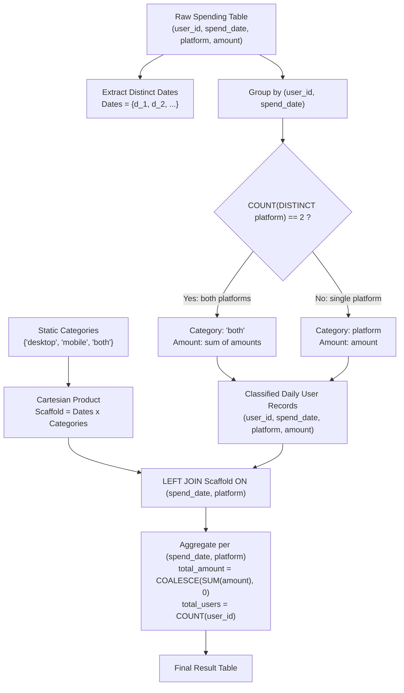

# Guided Example: User Purchase Platform

We trace the relational multi-stage pipeline for partitioning, classifying, and reporting daily platform activity across online shopping channels, establishing the Dense Cartesian Grid Left-Join Invariant:

- **Representative Instance 1 (Multi-Day Multi-User Cross-Platform Mix):**
  $$
  \text{Spending} = \begin{pmatrix}
  (1, \text{'2019-07-01'}, \text{'mobile'}, 100), & (1, \text{'2019-07-01'}, \text{'desktop'}, 100), \\
  (2, \text{'2019-07-01'}, \text{'mobile'}, 100), & (2, \text{'2019-07-02'}, \text{'mobile'}, 100), \\
  (3, \text{'2019-07-01'}, \text{'desktop'}, 100), & (3, \text{'2019-07-02'}, \text{'desktop'}, 100)
  \end{pmatrix}
  $$
- **Required Output:**
  $$
  \begin{array}{|c|c|c|c|}
  \hline
  \text{spend\_date} & \text{platform} & \text{total\_amount} & \text{total\_users} \\
  \hline
  \text{'2019-07-01'} & \text{'desktop'} & 100 & 1 \\
  \text{'2019-07-01'} & \text{'mobile'} & 100 & 1 \\
  \text{'2019-07-01'} & \text{'both'} & 200 & 1 \\
  \text{'2019-07-02'} & \text{'desktop'} & 100 & 1 \\
  \text{'2019-07-02'} & \text{'mobile'} & 100 & 1 \\
  \text{'2019-07-02'} & \text{'both'} & 0 & 0 \\
  \hline
  \end{array}
  $$
  - Daily User Activity Classification:
    - On $\text{'2019-07-01'}$:
      - User $1$: purchased on both $\text{'mobile'}$ and $\text{'desktop'}$ $\implies$ classified as $\text{'both'}$ with amount $100 + 100 = 200$.
      - User $2$: purchased on $\text{'mobile'}$ only $\implies$ classified as $\text{'mobile'}$ with amount $100$.
      - User $3$: purchased on $\text{'desktop'}$ only $\implies$ classified as $\text{'desktop'}$ with amount $100$.
    - On $\text{'2019-07-02'}$:
      - User $2$: purchased on $\text{'mobile'}$ only $\implies$ classified as $\text{'mobile'}$ with amount $100$.
      - User $3$: purchased on $\text{'desktop'}$ only $\implies$ classified as $\text{'desktop'}$ with amount $100$.
      - No user purchased on both platforms on this date $\implies$ total amount $0$, total users $0$.
  - Notice: Every date in the spending table MUST produce exactly three rows (`desktop`, `mobile`, `both`), even when a category has zero recorded spending.

- **Representative Instance 2 (All Users On Both Channels):**
  - If every user on date $D$ purchases on both desktop and mobile, all users map to `'both'`.
  - The rows for `desktop` and `mobile` on date $D$ must still appear in the output with amount $0$ and users $0$.

---

## 1. Instance & Teaching Goal

Given daily purchase transactions for users across desktop and mobile platforms, calculate the total spend and total number of distinct users who bought items using mobile only, desktop only, or both platforms together for each date recorded in the dataset.

```text
The Sparse-Aggregation Trap:
  Grouping Spending by spend_date and platform:
    Date 2019-07-02 has NO rows for 'both'.
    Direct inner GROUP BY omits the ('2019-07-02', 'both') row entirely!
    The problem contract requires returning all three platforms for every date.

The Double-Counting Hazard:
  User 1 on 2019-07-01 bought on desktop and mobile.
  If User 1 is tallied in 'desktop' AND 'mobile', their spending is counted twice,
  and they are not captured under the requested mutually exclusive 'both' tier.

The Dense Cartesian Grid Left-Join Invariant:
  1. User-Date Grain Disambiguation:
     Group transactions by (user_id, spend_date).
     If platform count == 2 -> platform = 'both', amount = SUM(amount).
     Else -> platform = single recorded platform, amount = amount.
  2. Dense Scaffold Construction:
     Form the full Cartesian product of all distinct dates with the 3 categories:
       Scaffold = (DISTINCT spend_date) x {'desktop', 'mobile', 'both'}
  3. Left-Join and Null-Safe Accumulation:
     LEFT JOIN the scaffold with classified user records on (spend_date, platform).
     Aggregate with COALESCE(SUM(amount), 0) and COUNT(user_id).
```

The key pedagogical takeaways are:
1. **Mutually Exclusive Categorization:** User activity on a single day collapses into exactly one category ($\text{desktop-only}$, $\text{mobile-only}$, or $\text{both}$).
2. **Dense Domain Scaffold:** Generating a Cartesian cross-product scaffold ensures that unpopulated category cells appear with zero counts rather than vanishing from the result.

---

## 2. Conceptual Foundation & The Dense Cartesian Grid Invariant



### Mutually Exclusive Daily Classification & Dense Lattice Theorem

Let $\mathcal{D} = \Pi_{spend\_date}(\text{Spending})$ be the set of distinct transaction dates, and let $\mathcal{P} = \{\text{'desktop'}, \text{'mobile'}, \text{'both'}\}$ be the universe of platform categories.

1. **Daily User Partitioning:**
   For each user $u$ and date $d \in \mathcal{D}$, let $P(u, d) \subseteq \{\text{'desktop'}, \text{'mobile'}\}$ denote the set of platforms on which user $u$ transacted on date $d$.
   The classification mapping $\mathcal{C}(u, d)$ is defined as:
   $$
   \mathcal{C}(u, d) = \begin{cases}
   \text{'both'}, & \text{if } |P(u, d)| = 2 \\
   p, & \text{if } P(u, d) = \{p\}
   \end{cases}
   $$
   Because $|P(u, d)| \in \{1, 2\}$, $\mathcal{C}(u, d)$ is a well-defined function that assigns each active daily user to exactly one partition in $\mathcal{P}$.
2. **Aggregated Daily Measures:**
   For each lattice point $(d, c) \in \mathcal{D} \times \mathcal{P}$:
   $$
   \text{total\_users}(d, c) = \big| \{ u : \mathcal{C}(u, d) = c \} \big|
   $$
   $$
   \text{total\_amount}(d, c) = \sum_{u : \mathcal{C}(u, d) = c} \sum_{r \in \text{Spending}(u, d)} \text{amount}_r
   $$
3. **Completeness via Dense Scaffold:**
   If $\{ u : \mathcal{C}(u, d) = c \} = \emptyset$, a standard inner grouping drops the pair $(d, c)$.
   Forming the Cartesian scaffold $\mathcal{D} \times \mathcal{P}$ and performing a left join guarantees that every pair $(d, c)$ is evaluated, yielding $\text{total\_amount} = 0$ and $\text{total\_users} = 0$ when no rows join. $\blacksquare$

---

## 3. Step-by-Step Worked Execution: Representative Instance 1

We trace the step-by-step resolution of Representative Instance 1.

### Stage 1: Daily User Classification
- Group by `(user_id, spend_date)`:
  1. User $1$ on `2019-07-01`: Platforms recorded are `{'mobile', 'desktop'}` (size 2).
     - Category $\leftarrow$ `'both'`.
     - Amount $\leftarrow 100 + 100 = 200$.
  2. User $2$ on `2019-07-01`: Platform recorded is `{'mobile'}` (size 1).
     - Category $\leftarrow$ `'mobile'`.
     - Amount $\leftarrow 100$.
  3. User $3$ on `2019-07-01`: Platform recorded is `{'desktop'}` (size 1).
     - Category $\leftarrow$ `'desktop'`.
     - Amount $\leftarrow 100$.
  4. User $2$ on `2019-07-02`: Platform recorded is `{'mobile'}` (size 1).
     - Category $\leftarrow$ `'mobile'`.
     - Amount $\leftarrow 100$.
  5. User $3$ on `2019-07-02`: Platform recorded is `{'desktop'}` (size 1).
     - Category $\leftarrow$ `'desktop'`.
     - Amount $\leftarrow 100$.

### Stage 2: Scaffold Generation
Distinct dates: `{'2019-07-01', '2019-07-02'}`.
Categories: `{'desktop', 'mobile', 'both'}`.
Scaffold rows $= 2 \times 3 = 6$ cells:
- `('2019-07-01', 'desktop')`
- `('2019-07-01', 'mobile')`
- `('2019-07-01', 'both')`
- `('2019-07-02', 'desktop')`
- `('2019-07-02', 'mobile')`
- `('2019-07-02', 'both')`

### Stage 3: Left Join & Metric Aggregation
1. `('2019-07-01', 'desktop')`: Matches User 3. Users $= 1$, Amount $= 100$.
2. `('2019-07-01', 'mobile')`: Matches User 2. Users $= 1$, Amount $= 100$.
3. `('2019-07-01', 'both')`: Matches User 1. Users $= 1$, Amount $= 200$.
4. `('2019-07-02', 'desktop')`: Matches User 3. Users $= 1$, Amount $= 100$.
5. `('2019-07-02', 'mobile')`: Matches User 2. Users $= 1$, Amount $= 100$.
6. `('2019-07-02', 'both')`: No match (NULL). `COALESCE(SUM, 0) = 0`, `COUNT(user_id) = 0`.

---

## 4. State Transition Trace Tables

### Table 1: Daily User Classification Sub-States

| User ID | Spend Date | Platforms Observed | Distinct Platform Count | Assigned Category | Combined Daily Amount |
|:---:|:---:|:---:|:---:|:---:|:---:|
| $1$ | `'2019-07-01'` | `{'mobile', 'desktop'}` | $2$ | **'both'** | $100 + 100 = 200$ |
| $2$ | `'2019-07-01'` | `{'mobile'}` | $1$ | **'mobile'** | $100$ |
| $3$ | `'2019-07-01'` | `{'desktop'}` | $1$ | **'desktop'** | $100$ |
| $2$ | `'2019-07-02'` | `{'mobile'}` | $1$ | **'mobile'** | $100$ |
| $3$ | `'2019-07-02'` | `{'desktop'}` | $1$ | **'desktop'** | $100$ |

### Table 2: Dense Scaffold Left-Join & Aggregation Trace

| Scaffold Date | Scaffold Platform | Matched Classified Records | User Count `COUNT(user_id)` | Total Amount `COALESCE(SUM, 0)` | Final Status |
|:---:|:---:|:---|:---:|:---:|:---|
| `'2019-07-01'` | `'desktop'` | User $3$ (Amount: $100$) | $1$ | $100$ | Populated |
| `'2019-07-01'` | `'mobile'` | User $2$ (Amount: $100$) | $1$ | $100$ | Populated |
| `'2019-07-01'` | `'both'` | User $1$ (Amount: $200$) | $1$ | $200$ | Populated |
| `'2019-07-02'` | `'desktop'` | User $3$ (Amount: $100$) | $1$ | $100$ | Populated |
| `'2019-07-02'` | `'mobile'` | User $2$ (Amount: $100$) | $1$ | $100$ | Populated |
| `'2019-07-02'` | `'both'` | None ($\text{NULL}$) | **$0$** | **$0$** | **Zero-Filled Scaffold Row** |

---

## 5. Algorithmic Correctness

### Soundness & Completeness
1. **Mutual Exclusion:** By computing the platform classification at the `(user_id, spend_date)` grain, each user is mapped to exactly one category on any given date. If a user purchased on both platforms, they are mapped to `'both'` and excluded from both `'desktop'` and `'mobile'`.
2. **Dense Domain Guarantee:** Generating the scaffold $\mathcal{D} \times \{\text{'desktop'}, \text{'mobile'}, \text{'both'}\}$ guarantees that exactly $3$ rows are present for every date occurring in the dataset.
3. **Null-Safety:** Aggregating with `COUNT(t.user_id)` treats unmatched rows as $0$ rather than $1$, and `COALESCE(SUM(amount), 0)` converts $\text{NULL}$ sums to $0$.

---

## 6. Boundary Cases & Traps

| Scenario | Input Feature | Expected Behavior | Failure Mode / Trapped Risk |
|---|---|---|---|
| Unused Platform on a Date | No user purchases on 'both' on date $D$ | Output row $(D, \text{'both'}, 0, 0)$ is generated. | Omitting row entirely due to inner join. |
| User with Dual Purchases on Same Platform | User has two transactions on mobile in one day | Handled under primary key or grouped as single platform. | Counting duplicate transactions as multiple platforms. |
| `COUNT(*)` vs `COUNT(column)` | Empty left-join match yields a single row with NULL values | `COUNT(t.user_id)` returns 0; `COUNT(*)` would return 1! | Reporting 1 user when 0 users transacted. |
| All Users on 'both' | Every customer buys on both mobile and desktop | 'desktop' and 'mobile' rows both output 0 users and 0 amount. | Double-counting users across multiple buckets. |
| Multiple Dates with Distinct Spends | Irregular date distribution | Every distinct date has exactly 3 rows. | Missing scaffold date cross-joins. |

---

## 7. Complexity Derivation

- **Time Complexity:** $\mathcal{O}(R \log R)$ where $R$ is the number of rows in `Spending`.
  - Grouping by `(user_id, spend_date)` to classify platforms takes $\mathcal{O}(R)$ via hash table or $\mathcal{O}(R \log R)$ via sorting.
  - Generating distinct dates takes $\mathcal{O}(D \log D)$ where $D$ is the number of distinct dates ($D \le R$).
  - Cartesian product produces $3 \times D$ scaffold rows.
  - Left joining and aggregating the $3D$ scaffold rows with classified records takes $\mathcal{O}(R + D)$ time.
  - Overall execution time is dominated by the initial grouping: $\mathcal{O}(R \log R)$.
- **Auxiliary Space Complexity:** $\mathcal{O}(R + D)$ auxiliary memory to store intermediate user-date groupings and the $3D$-row dense scaffold.
