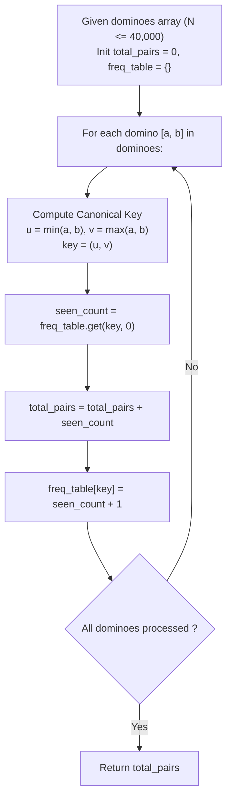

# Guided Example: Number of Equivalent Domino Pairs

We trace the linear-time canonical frequency hashing method for counting rotationally symmetric pairs, establishing the Canonical Min-Max Invariant and Combinatorial Pair Accumulation:

- **Representative Instance 1 (Mixed Equivalent and Unique Tiles):**
  $$
  \text{dominoes} = [[1, 2], [2, 1], [3, 4], [5, 6]], \quad N = 4
  $$
- **Required Output:** `1`
  - Canonical Ordering Mapping:
    - $[1, 2] \to (\min(1, 2), \max(1, 2)) = (1, 2)$
    - $[2, 1] \to (\min(2, 1), \max(2, 1)) = (1, 2)$
    - $[3, 4] \to (\min(3, 4), \max(3, 4)) = (3, 4)$
    - $[5, 6] \to (\min(5, 6), \max(5, 6)) = (5, 6)$
  - Matching Equivalence:
    - Tile $0$ and Tile $1$ both map to canonical form $(1, 2)$.
    - Number of equivalent pairs: $\binom{2}{2} = 1$.

- **Representative Instance 2 (Repeated Duplicates with Self-Symmetric Pairs):**
  $$
  \text{dominoes} = [[1, 2], [1, 2], [1, 1], [1, 2], [2, 2]], \quad N = 5
  $$
- **Required Output:** `3`
  - Step-by-step prefix accumulation:
    1. Tile $0 = [1, 2] \to (1, 2)$: seen $0$ times before $\implies +0$ pairs, count is now $1$.
    2. Tile $1 = [1, 2] \to (1, 2)$: seen $1$ time before $\implies +1$ pair (with tile 0), count is now $2$. Running total $= 1$.
    3. Tile $2 = [1, 1] \to (1, 1)$: seen $0$ times before $\implies +0$ pairs, count is now $1$. Running total $= 1$.
    4. Tile $3 = [1, 2] \to (1, 2)$: seen $2$ times before $\implies +2$ pairs (with tiles 0 and 1), count is now $3$. Running total $= 1 + 2 = 3$.
    5. Tile $4 = [2, 2] \to (2, 2)$: seen $0$ times before $\implies +0$ pairs, count is now $1$. Running total $= 3$.
  - Total equivalent pairs: $3$.

---

## 1. Instance & Teaching Goal

Given a collection of dominoes where each domino contains two numbers, count the number of unordered pairs of distinct domino indices $(i, j)$ such that domino $i$ can be rotated into domino $j$.

```text
The Quadratic Pairwise Comparison Trap:
  Comparing every pair (i, j) with 0 <= i < j < N:
    For N = 40,000, pair comparisons = N * (N - 1) / 2 ≈ 8 * 10^8 operations!
    Direct double-loop pair checking exceeds runtime limits (TLE).

The Canonical Hash & Combinatorial Accumulation Invariant (O(N) Time, O(1) Space):
  1. Equivalence Normalization:
     Since rotation swaps elements, [a, b] and [b, a] are identical.
     Map every domino [a, b] to unique canonical tuple:
       key = (min(a, b), max(a, b))  or  key = 10 * min(a, b) + max(a, b)
  2. Bounded Key Space:
     Values satisfy 1 <= a, b <= 9.
     There are at most 9 * 10 / 2 = 45 possible canonical domino types!
  3. Online Pair Counting:
     When processing a domino with key K:
       If K was previously seen c times, it forms c new valid pairs with all c predecessors.
       total_pairs += c
       count[K] += 1
```

The key pedagogical takeaways are:
1. **Canonical Representative Function:** Factoring out symmetry by sorting components into $(\min, \max)$ maps equivalent orbits to a single hashable key.
2. **Online Triangular Summation:** Adding the previous frequency count $c$ on-the-fly avoids an extra summation pass and cleanly realizes $\sum_{k=1}^{C-1} k = \frac{C(C - 1)}{2}$.

---

## 2. Conceptual Foundation & The Canonical Min-Max Invariant



### The Equivalence Partitioning & Pair Count Theorem

Let $\mathcal{D} = \{d_0, d_1, \dots, d_{N-1}\}$ be the sequence of dominoes, where $d_i = [a_i, b_i]$ with $a_i, b_i \in \{1, \dots, 9\}$.

1. **Equivalence Relation:**
   Define binary relation $\sim$ on dominoes by:
   $$
   [a, b] \sim [c, d] \iff (a = c \land b = d) \lor (a = d \land b = c)
   $$
   Relation $\sim$ is reflexive, symmetric, and transitive, partitioning $\mathcal{D}$ into disjoint equivalence classes.
2. **Canonical Injective Map:**
   Define the projection $f: \{1, \dots, 9\}^2 \to \mathbb{Z}$:
   $$
   f([a, b]) = 10 \cdot \min(a, b) + \max(a, b)
   $$
   Because $\min(a, b) \le \max(a, b)$, $f(d_i) = f(d_j)$ if and only if $d_i \sim d_j$.
3. **Combinatorial Pair Count:**
   If an equivalence class with key $k$ contains $C_k$ dominoes, the number of distinct unordered index pairs $(i, j)$ within this class is:
   $$
   \binom{C_k}{2} = \frac{C_k(C_k - 1)}{2} = \sum_{t=0}^{C_k - 1} t
   $$
   Summing across all disjoint equivalence classes:
   $$
   \text{Total Pairs} = \sum_{k} \binom{C_k}{2}
   $$
   Accumulating the prefix count $t$ dynamically as each element arrives computes this sum in a single pass. $\blacksquare$

---

## 3. Step-by-Step Worked Execution: Representative Instance 2

We trace execution on:
$$
\text{dominoes} = [[1, 2], [1, 2], [1, 1], [1, 2], [2, 2]]
$$
Initial state: $\text{total\_pairs} = 0$, $\text{freq} = \{\}$.

### Sequential Domino Processing
1. **Index 0: Tile $[1, 2]$**
   - Canonical key: $10 \times \min(1, 2) + \max(1, 2) = 12$.
   - Current count for $12$: $0$.
   - Pairs added: $+0$. Total pairs $= 0$.
   - Update: $\text{freq}[12] = 1$.
2. **Index 1: Tile $[1, 2]$**
   - Canonical key: $12$.
   - Current count for $12$: $1$ (from tile 0).
   - Pairs added: $+1$. Pair formed: $(0, 1)$. Total pairs $= 1$.
   - Update: $\text{freq}[12] = 2$.
3. **Index 2: Tile $[1, 1]$**
   - Canonical key: $10 \times 1 + 1 = 11$.
   - Current count for $11$: $0$.
   - Pairs added: $+0$. Total pairs $= 1$.
   - Update: $\text{freq}[11] = 1$.
4. **Index 3: Tile $[1, 2]$**
   - Canonical key: $12$.
   - Current count for $12$: $2$ (from tiles 0 and 1).
   - Pairs added: $+2$. Pairs formed: $(0, 3)$ and $(1, 3)$. Total pairs $= 1 + 2 = 3$.
   - Update: $\text{freq}[12] = 3$.
5. **Index 4: Tile $[2, 2]$**
   - Canonical key: $10 \times 2 + 2 = 22$.
   - Current count for $22$: $0$.
   - Pairs added: $+0$. Total pairs $= 3$.
   - Update: $\text{freq}[22] = 1$.

Final total pairs $= \mathbf{3}$.

---

## 4. State Transition Trace Table

| Step $i$ | Tile Input $[a, b]$ | $(\min, \max)$ | Encoded Key | Prior Frequency $c$ | Pairs Contributed | Cumulative Total Pairs | Updated Frequency Map |
|:---:|:---:|:---:|:---:|:---:|:---:|:---:|:---|
| $0$ | $[1, 2]$ | $(1, 2)$ | $12$ | $0$ | $+0$ | $0$ | $\{12: 1\}$ |
| $1$ | $[1, 2]$ | $(1, 2)$ | $12$ | $1$ | $+1$ | $1$ | $\{12: 2\}$ |
| $2$ | $[1, 1]$ | $(1, 1)$ | $11$ | $0$ | $+0$ | $1$ | $\{12: 2, 11: 1\}$ |
| **$3$** | **$[1, 2]$** | **$(1, 2)$** | **$12$** | **$2$** | **$+2$** | **$3$** | **$\{12: 3, 11: 1\}$** |
| $4$ | $[2, 2]$ | $(2, 2)$ | $22$ | $0$ | $+0$ | $3$ | $\{12: 3, 11: 1, 22: 1\}$ |

Verification via direct binomial coefficients:
$$
\binom{3}{2}_{\text{key 12}} + \binom{1}{2}_{\text{key 11}} + \binom{1}{2}_{\text{key 22}} = 3 + 0 + 0 = 3
$$

---

## 5. Algorithmic Correctness

### Soundness & Completeness
1. **Symmetry Invariance:** Any tile $[a, b]$ satisfies $[a, b] \sim [b, a]$. The canonical key function mapping both $[a, b]$ and $[b, a]$ to $(\min(a, b), \max(a, b))$ is invariant under rotation.
2. **Distinguishability:** If $[a, b] \not\sim [c, d]$, then their sorted pairs are distinct, yielding different keys.
3. **No Double Counting:** Processing each tile from left to right and adding only the count of previously seen tiles ensures that each index pair $(i, j)$ with $i < j$ is counted exactly once when $j$ is processed.

---

## 6. Boundary Cases & Traps

| Scenario | Input Example | Expected Behavior | Trap / Bug Avoided |
|---|---|---|---|
| Pure Self-Symmetric Tile | $[[1, 1], [1, 1]]$ | Encodes to key $11$; pairs counted $= 1$. | Overlooking double identical values. |
| Inverted Rotation Pair | $[[1, 2], [2, 1]]$ | Both map to $12$; pairs counted $= 1$. | Treating $(1, 2)$ and $(2, 1)$ as distinct hash keys. |
| All Tiles Identical | $N$ copies of $[3, 4]$ | Output $= \frac{N(N - 1)}{2}$. | Integer overflow if not using 64-bit integer (max $\approx 8 \times 10^8$, fits in standard 64-bit). |
| All Unique Tiles | $[[1, 2], [3, 4], [5, 6]]$ | Output $= 0$. | Adding false positives. |
| Single Domino | $[[1, 2]]$ | Loop executes once, output $= 0$. | Off-by-one boundary crashes. |

---

## 7. Complexity Derivation

- **Time Complexity:** $\mathcal{O}(N)$ where $N \le 40,000$ is the number of dominoes.
  - For each domino, computing $\min$ and $\max$ takes $\mathcal{O}(1)$ arithmetic operations.
  - Key encoding and hash table/array lookup takes $\mathcal{O}(1)$ time.
  - Total time across all $N$ dominoes is strictly linear: $\mathcal{O}(N)$.
- **Auxiliary Space Complexity:** $\mathcal{O}(1)$ auxiliary space.
  - The values $a, b$ are bounded by $1 \le a, b \le 9$.
  - The total number of distinct canonical pairs is $\binom{9+1}{2} = 45$.
  - An array of size $100$ or a hash table containing at most $45$ entries occupies strictly bounded $\mathcal{O}(1)$ memory.
