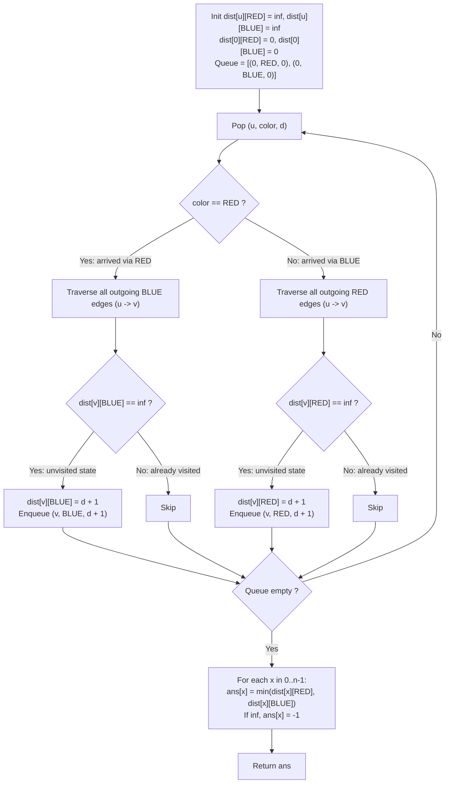

# Guided Example: Shortest Path with Alternating Colors

We trace the step-by-step state-expanded Breadth-First Search (BFS) over a two-colored directed multigraph, proving the Bicolor State Expansion Invariant and the Layered Distance Minimality Theorem:

- **Representative Instance 1 (Branching Alternations with Competing Paths):**
  $$
  n = 4, \quad \text{redEdges} = [[0, 1], [2, 3]], \quad \text{blueEdges} = [[1, 2], [1, 3]]
  $$
- **Required Output:** `[0, 1, 2, 2]`
  - Expanded State Graph Definition:
    - Each physical node $u \in \{0, 1, 2, 3\}$ is split into two arrival states:
      - $(u, \text{RED})$: node $u$ arrived at via a red edge. Next transition must use a **BLUE** edge.
      - $(u, \text{BLUE})$: node $u$ arrived at via a blue edge. Next transition must use a **RED** edge.
  - BFS Queue Evolution:
    - Base State: Node $0$ is reachable in $0$ steps with either color as prior context.
      - Queue: $[(0, \text{RED}, 0), \; (0, \text{BLUE}, 0)]$.
      - Distance arrays initialized to $\infty$:
        - $dist_{\text{red}} = [0, \infty, \infty, \infty]$
        - $dist_{\text{blue}} = [0, \infty, \infty, \infty]$
    - Step 1: Pop $(0, \text{RED}, 0)$. Incoming was RED $\implies$ must traverse BLUE outgoing edges from $0$.
      - Outgoing blue from $0$: None.
    - Step 2: Pop $(0, \text{BLUE}, 0)$. Incoming was BLUE $\implies$ must traverse RED outgoing edges from $0$.
      - Outgoing red from $0$: Edge $0 \to 1$.
      - Destination state: $(1, \text{RED})$. Distance: $0 + 1 = 1$.
      - $dist_{\text{red}}[1] \leftarrow 1$. Enqueue $(1, \text{RED}, 1)$.
    - Step 3: Pop $(1, \text{RED}, 1)$. Incoming was RED $\implies$ must traverse BLUE outgoing edges from $1$.
      - Outgoing blue from $1$: Edge $1 \to 2$ and Edge $1 \to 3$.
      - Destination state $(2, \text{BLUE})$: Distance $1 + 1 = 2 \implies dist_{\text{blue}}[2] \leftarrow 2$. Enqueue $(2, \text{BLUE}, 2)$.
      - Destination state $(3, \text{BLUE})$: Distance $1 + 1 = 2 \implies dist_{\text{blue}}[3] \leftarrow 2$. Enqueue $(3, \text{BLUE}, 2)$.
    - Step 4: Pop $(2, \text{BLUE}, 2)$. Incoming was BLUE $\implies$ must traverse RED outgoing edges from $2$.
      - Outgoing red from $2$: Edge $2 \to 3$.
      - Destination state $(3, \text{RED})$: Distance $2 + 1 = 3 \implies dist_{\text{red}}[3] \leftarrow 3$. Enqueue $(3, \text{RED}, 3)$.
    - Step 5: Pop $(3, \text{BLUE}, 2)$. Outgoing red from $3$: None.
    - Step 6: Pop $(3, \text{RED}, 3)$. Outgoing blue from $3$: None.
    - Queue empty.
  - Final Distance Extraction for each node $x$:
    $$
    ans[x] = \min(dist_{\text{red}}[x], dist_{\text{blue}}[x]) \quad (\text{or } -1 \text{ if } \infty)
    $$
    - Node $0: \min(0, 0) = \mathbf{0}$
    - Node $1: \min(1, \infty) = \mathbf{1}$
    - Node $2: \min(\infty, 2) = \mathbf{2}$
    - Node $3: \min(3, 2) = \mathbf{2}$
    - Answer: `[0, 1, 2, 2]`.

- **Representative Instance 2 (Monochromatic Blockade Trap):**
  $$
  n = 3, \quad \text{redEdges} = [[0, 1], [1, 2]], \quad \text{blueEdges} = []
  $$
  - Path $0 \to 1$ is RED (length 1).
  - From node 1, only RED edge $1 \to 2$ exists. But alternating condition demands a BLUE edge!
  - Node 2 cannot be reached via an alternating path $\implies ans[2] = \mathbf{-1}$.
  - Answer: `[0, 1, -1]`.

---

## 1. Instance & Teaching Goal

Given a directed graph where edges are colored either red or blue, find the shortest path from node `0` to every node `x` such that the colors of edges strictly alternate along the path.

```text
The Single-Node Visited Set Trap:
  Standard BFS marking nodes visited: [visited[u] = True]
    If node 1 is reached via a RED edge, marking visited[1] = True prevents
    visiting node 1 later via a BLUE edge.
    However, visiting node 1 via BLUE might be the ONLY way to unlock an outgoing RED edge!
    Prematurely marking node 1 as visited truncates valid alternating extensions.

The State Expansion Invariant (O(V + E) Time, O(V) Space):
  Transform the graph into a bipartite color product graph:
    State Space = { (u, c) | u in {0, ..., n-1}, c in {RED, BLUE} }
    Total States = 2 * n.
    1. A state (u, RED) transitions exclusively to (v, BLUE) along BLUE edges (u -> v).
    2. A state (u, BLUE) transitions exclusively to (v, RED) along RED edges (u -> v).
    3. Run unweighted BFS starting simultaneously from (0, RED) and (0, BLUE) at distance 0.
    4. First arrival at state (u, c) is guaranteed minimal.
    5. Result for node x is min(dist[x][RED], dist[x][BLUE]).
```

The key pedagogical takeaways are:
1. **Context-Dependent Transitions:** Edge validity depends on the immediately preceding transition color, necessitating state augmentation.
2. **Product Graph BFS:** Lifting $V$ physical vertices to $2V$ augmented state vertices preserves standard BFS shortest-path optimality guarantees.

---

## 2. Conceptual Foundation & The State Expansion BFS Invariant



### The State Expansion & BFS Monotonicity Theorem

Let $G = (V, E_R \cup E_B)$ be the input directed multigraph.

1. **Augmented State Digraph:**
   Construct directed graph $\mathcal{G}^* = (\mathcal{V}^*, \mathcal{E}^*)$ where:
   $$
   \mathcal{V}^* = V \times \{R, B\}
   $$
   $$
   \mathcal{E}^* = \big\{ ((u, R), (v, B)) : (u, v) \in E_B \big\} \cup \big\{ ((u, B), (v, R)) : (u, v) \in E_R \big\}
   $$
2. **Alternating Path Equivalence:**
   A sequence of edges $e_1, e_2, \dots, e_k$ in $G$ starting from $0$ forms an alternating path if and only if there exists a directed path in $\mathcal{G}^*$ from either $(0, R)$ or $(0, B)$ to $(v, c)$, where $c \in \{R, B\}$ matches the color of $e_k$.
3. **Optimality of Unweighted BFS:**
   Because all edge weights in $\mathcal{G}^*$ are unit length ($w = 1$), standard breadth-first search initialized with source set $\mathcal{S} = \{(0, R), (0, B)\}$ at distance $0$ explores vertices in non-decreasing order of path length.
   When a state $(v, c)$ is first dequeued, the recorded distance $dist[v][c]$ is globally minimal.
   Taking $\min(dist[x][R], dist[x][B])$ yields the shortest valid alternating path length to physical node $x$. $\blacksquare$

---

## 3. Step-by-Step Worked Execution: Representative Instance 1

$n = 4, \quad \text{redEdges} = [[0, 1], [2, 3]], \quad \text{blueEdges} = [[1, 2], [1, 3]]$.

### Setup & Initialization
- State distance table:
  - $dist[\cdot][R] = [0, \infty, \infty, \infty]$
  - $dist[\cdot][B] = [0, \infty, \infty, \infty]$
- Initial queue: $[(0, R, 0), \; (0, B, 0)]$.

### Step-by-Step Iteration
1. **Pop $(0, R, 0)$:** Color is $R$. Must follow $B$ edges from $0$.
   - $E_B$ outgoing from $0$: None.
2. **Pop $(0, B, 0)$:** Color is $B$. Must follow $R$ edges from $0$.
   - $E_R$ outgoing from $0$: $0 \to 1$.
   - Target state: $(1, R)$. Current $dist[1][R] = \infty$.
   - Update: $dist[1][R] \leftarrow 0 + 1 = 1$.
   - Enqueue $(1, R, 1)$.
3. **Pop $(1, R, 1)$:** Color is $R$. Must follow $B$ edges from $1$.
   - $E_B$ outgoing from $1$: $1 \to 2$ and $1 \to 3$.
   - Target $(2, B)$: $dist[2][B] = \infty \implies dist[2][B] \leftarrow 2$. Enqueue $(2, B, 2)$.
   - Target $(3, B)$: $dist[3][B] = \infty \implies dist[3][B] \leftarrow 2$. Enqueue $(3, B, 2)$.
4. **Pop $(2, B, 2)$:** Color is $B$. Must follow $R$ edges from $2$.
   - $E_R$ outgoing from $2$: $2 \to 3$.
   - Target $(3, R)$: $dist[3][R] = \infty \implies dist[3][R] \leftarrow 2 + 1 = 3$. Enqueue $(3, R, 3)$.
5. **Pop $(3, B, 2)$:** Color is $B$. Must follow $R$ edges from $3$.
   - $E_R$ outgoing from $3$: None.
6. **Pop $(3, R, 3)$:** Color is $R$. Must follow $B$ edges from $3$.
   - $E_B$ outgoing from $3$: None.
7. Queue is empty.

### Final Result Assembly
- $ans[0] = \min(0, 0) = 0$
- $ans[1] = \min(1, \infty) = 1$
- $ans[2] = \min(\infty, 2) = 2$
- $ans[3] = \min(3, 2) = 2$

Output: `[0, 1, 2, 2]`.

---

## 4. State Transition Trace Table

| Step | State Dequeued $(u, c, d)$ | Mandatory Next Color | Edges Inspected | Target State $(v, c')$ | Prior Distance | New Distance | Queue After Step |
|:---:|:---:|:---:|:---|:---:|:---:|:---:|:---|
| $1$ | $(0, \text{RED}, 0)$ | BLUE | None from $0$ | — | — | — | $[(0, \text{BLUE}, 0)]$ |
| $2$ | $(0, \text{BLUE}, 0)$ | RED | $0 \xrightarrow{\text{RED}} 1$ | $(1, \text{RED})$ | $\infty$ | $1$ | $[(1, \text{RED}, 1)]$ |
| $3$ | $(1, \text{RED}, 1)$ | BLUE | $1 \xrightarrow{\text{BLUE}} 2$ | $(2, \text{BLUE})$ | $\infty$ | $2$ | $[(2, \text{BLUE}, 2)]$ |
| — | — | — | $1 \xrightarrow{\text{BLUE}} 3$ | $(3, \text{BLUE})$ | $\infty$ | $2$ | $[(2, \text{BLUE}, 2), (3, \text{BLUE}, 2)]$ |
| $4$ | $(2, \text{BLUE}, 2)$ | RED | $2 \xrightarrow{\text{RED}} 3$ | $(3, \text{RED})$ | $\infty$ | $3$ | $[(3, \text{BLUE}, 2), (3, \text{RED}, 3)]$ |
| $5$ | $(3, \text{BLUE}, 2)$ | RED | None from $3$ | — | — | — | $[(3, \text{RED}, 3)]$ |
| $6$ | $(3, \text{RED}, 3)$ | BLUE | None from $3$ | — | — | — | $[\,]$ |

---

## 5. Algorithmic Correctness

### Soundness & Optimality
1. **Exact Alternation Invariant:** By construction, transitions from $(u, \text{RED})$ only traverse blue edges to reach $(v, \text{BLUE})$, and transitions from $(u, \text{BLUE})$ only traverse red edges to reach $(v, \text{RED})$. Consecutive edges of the same color are structurally impossible.
2. **Cycle Safety:** Because distances are monotonically increasing and states $(u, c)$ are marked visited upon initial discovery, graph cycles (including alternating 2-cycles and self-loops) terminate safely without infinite recursion.
3. **Global Minimality:** Standard FIFO queue properties ensure that the first time any state $(u, c)$ is reached, its path length is minimal. Comparing the two terminal color states at node $x$ computes $\min(dist[x][\text{RED}], dist[x][\text{BLUE}])$.

---

## 6. Boundary Cases & Traps

| Scenario | Graph Configuration | Expected Behavior | Failure Mode / Trapped Risk |
|---|---|---|---|
| Self-Loop on Source | Red self-edge $0 \to 0$ | Can be traversed if next edge is blue | Infinite loop if visited state is omitted |
| Disconnected Node | No edges reaching node $k$ | Output is $-1$ | Unhandled $\infty$ returning wrong sentinel |
| Multiple Parallel Edges | Red and blue edges both connecting $u \to v$ | Both states $(v, \text{RED})$ and $(v, \text{BLUE})$ reachable | Dropping parallel edges during graph construction |
| Start Node $0$ | Trivial distance to origin | Always $0$ regardless of edges | Returning $-1$ for node $0$ |
| Monochromatic Path Only | Path from $0 \to v$ exists but has 2 consecutive red edges | Discarded; returns $-1$ if no alternating path exists | Collapsing to standard BFS without color context |

---

## 7. Complexity Derivation

- **Time Complexity:** $\mathcal{O}(V + E)$ where $V = n \le 100$ and $E = |redEdges| + |blueEdges| \le 800$.
  - Constructing adjacency lists for red and blue edges takes $\mathcal{O}(E)$ time.
  - The augmented state graph has $|\mathcal{V}^*| = 2n \le 200$ states and $|\mathcal{E}^*| \le E \le 800$ transitions.
  - Each augmented state $(u, c)$ is enqueued at most once and each incident edge is traversed at most once.
  - Extracting the minimum distance for each of the $n$ nodes takes $\mathcal{O}(n)$ time.
  - Total time is $\mathcal{O}(V + E)$, completing in $< 1\text{ ms}$.
- **Auxiliary Space Complexity:** $\mathcal{O}(V + E)$ auxiliary space.
  - Adjacency lists store $E$ edges.
  - Distance arrays and queue store at most $2n$ states.
