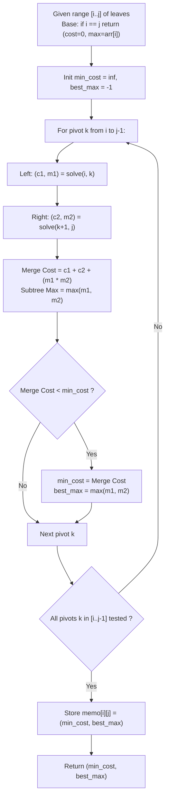

# Guided Example: Minimum Cost Tree From Leaf Values

We trace the structural decomposition of full binary trees over fixed in-order leaf sequences, establishing the Interval Partition Dynamic Programming Invariant and the Greedy Local Minimum Elimination Principle:

- **Representative Instance 1 (Three-Leaf Classical Asymmetry):**
  $$
  arr = [6, 2, 4], \quad N = 3
  $$
- **Required Output:** `32`
  - The two valid full binary tree topologies for 3 ordered leaves:
    - **Topology 1 (Left-Heavy Tree: $((6, 2), 4)$):**
      - Left subtree combines leaves $6$ and $2$:
        - Non-leaf node value $= 6 \times 2 = 12$.
        - Subtree maximum leaf $= \max(6, 2) = 6$.
      - Root node combines left subtree (max leaf $6$) and right leaf $4$:
        - Root non-leaf value $= 6 \times 4 = 24$.
      - Total non-leaf cost $= 12 + 24 = \mathbf{36}$.
    - **Topology 2 (Right-Heavy Tree: $(6, (2, 4))$):**
      - Right subtree combines leaves $2$ and $4$:
        - Non-leaf node value $= 2 \times 4 = 8$.
        - Subtree maximum leaf $= \max(2, 4) = 4$.
      - Root node combines left leaf $6$ and right subtree (max leaf $4$):
        - Root non-leaf value $= 6 \times 4 = 24$.
      - Total non-leaf cost $= 8 + 24 = \mathbf{32}$.
  - Comparison: $\min(36, 32) = \mathbf{32}$ (Topology 2 is strictly optimal).

- **Representative Instance 2 (Two-Leaf Trivial Boundary):**
  $$
  arr = [4, 11], \quad N = 2 \implies \text{Cost} = 4 \times 11 = \mathbf{44}
  $$

- **Representative Instance 3 (Four-Leaf Monotonic Array):**
  $$
  arr = [6, 2, 4, 8], \quad N = 4
  $$
  - Subproblem optimal combinations:
    - Merge $2$ with $\min(6, 4) = 4 \implies \text{cost } 2 \times 4 = 8$, remaining leaves: $[6, 4, 8]$.
    - Merge $4$ with $\min(6, 8) = 6 \implies \text{cost } 4 \times 6 = 24$, remaining leaves: $[6, 8]$.
    - Merge $6$ with $8 \implies \text{cost } 6 \times 8 = 48$.
    - Total sum $= 8 + 24 + 48 = \mathbf{80}$.

---

## 1. Instance & Teaching Goal

Given an array of positive integers representing the ordered leaves of a full binary tree in an in-order traversal, construct a tree that minimizes the sum of all internal (non-leaf) node values, where each internal node equals the product of the maximum leaves in its left and right subtrees.

```text
The Catalan Combinatorial Tree Enumeration Trap:
  The number of distinct full binary trees with N leaves is given by
  the Catalan number C_{N-1} = (1 / N) * (2N - 2 choose N - 1).
  For N = 40:
    C_{39} ≈ 3.4 * 10^21 trees!
    Brute-force generation of all tree geometries causes infinite timeout.

The Interval Partition Dynamic Programming Invariant (O(N^3) Time, O(N^2) Space):
  Notice: An in-order traversal means that any subtree corresponds to a
  CONTIGUOUS slice arr[i..j].
  1. The root of subtree arr[i..j] splits the leaves into a left child
     arr[i..k] and a right child arr[k+1..j] for some pivot k in [i, j-1].
  2. The non-leaf cost of combining these two subtrees is:
       cost(i, j) = min_{i <= k < j} { cost(i, k) + cost(k+1, j) + max(arr[i..k]) * max(arr[k+1..j]) }
  3. Base cases: For a single leaf, cost(i, i) = 0, and max_leaf(i, i) = arr[i].

The Dual Greedy Local Minimum Perspective (O(N) Time):
  Every internal node represents the destruction of one leaf (the smaller one),
  leaving the larger one to participate in higher-level products.
  To minimize overall sum, the globally smallest leaf should be destroyed
  immediately by multiplying it by its smaller immediate neighbor!
```

The fundamental pedagogical insights are:
1. **Contiguity Invariant:** Subtrees are strictly contiguous intervals of the original leaf sequence.
2. **Optimal Substructure:** The optimal tree for range $[i..j]$ is composed of optimal subtrees for $[i..k]$ and $[k+1..j]$.
3. **Small Leaf Suppression:** Smaller leaves should be placed deeper in the tree so their values do not cascade into higher-level multiplications.

---

## 2. Conceptual Foundation & The Subtree Partition Invariant



### Interval Subtree Decomposition & Cost Recurrence Theorem

Let $A = [a_0, a_1, \dots, a_{N-1}]$ denote the sequence of leaf values.

1. **Subtree Leaf Contiguity:**
   In any binary tree whose in-order traversal of leaves yields $A$, every node $u$ spans a contiguous range of leaves $A[i..j]$. If $u$ is an internal node, its left child spans $A[i..k]$ and its right child spans $A[k+1..j]$ for some unique $k \in \{i, \dots, j-1\}$.
2. **Subtree Maximum Invariant:**
   For any range $[i..j]$, the maximum leaf value is fixed and invariant under tree structure:
   $$
   M(i, j) = \max_{t \in [i, j]} A[t]
   $$
3. **Dynamic Programming Recurrence:**
   Let $C(i, j)$ denote the minimum total cost of internal nodes for the subtree spanning $A[i..j]$:
   $$
   C(i, i) = 0
   $$
   $$
   C(i, j) = \min_{i \le k < j} \Big( C(i, k) + C(k+1, j) + M(i, k) \cdot M(k+1, j) \Big)
   $$
   Because subproblems depend only on strictly smaller interval lengths $L = j - i + 1$, the recurrence defines a directed acyclic graph (DAG), guaranteeing termination and optimality. $\blacksquare$

---

## 3. Step-by-Step Worked Execution: Representative Instance 1

We trace the interval evaluation for $arr = [6, 2, 4]$ ($N = 3$).

### Base Cases (Length $L = 1$)
- $[0..0]: arr[0] = 6 \implies C(0, 0) = 0, \; M(0, 0) = 6$
- $[1..1]: arr[1] = 2 \implies C(1, 1) = 0, \; M(1, 1) = 2$
- $[2..2]: arr[2] = 4 \implies C(2, 2) = 0, \; M(2, 2) = 4$

### Intervals of Length $L = 2$
1. **Range $[0..1]$ ($[6, 2]$):**
   - Single split: $k = 0$.
   - Cost: $C(0, 0) + C(1, 1) + M(0, 0) \times M(1, 1) = 0 + 0 + 6 \times 2 = 12$.
   - Subtree max: $\max(6, 2) = 6$.
   - $C(0, 1) = 12, \; M(0, 1) = 6$.
2. **Range $[1..2]$ ($[2, 4]$):**
   - Single split: $k = 1$.
   - Cost: $C(1, 1) + C(2, 2) + M(1, 1) \times M(2, 2) = 0 + 0 + 2 \times 4 = 8$.
   - Subtree max: $\max(2, 4) = 4$.
   - $C(1, 2) = 8, \; M(1, 2) = 4$.

### Intervals of Length $L = 3$ (Full Array $[0..2]$: $[6, 2, 4]$)
- Pivot candidate $k = 0$ (Split into $[0..0]$ and $[1..2]$):
  - Left child: $[0..0] \implies C(0, 0) = 0, \; M(0, 0) = 6$.
  - Right child: $[1..2] \implies C(1, 2) = 8, \; M(1, 2) = 4$.
  - Root internal node product: $M(0, 0) \times M(1, 2) = 6 \times 4 = 24$.
  - Candidate total cost: $0 + 8 + 24 = \mathbf{32}$.
- Pivot candidate $k = 1$ (Split into $[0..1]$ and $[2..2]$):
  - Left child: $[0..1] \implies C(0, 1) = 12, \; M(0, 1) = 6$.
  - Right child: $[2..2] \implies C(2, 2) = 0, \; M(2, 2) = 4$.
  - Root internal node product: $M(0, 1) \times M(2, 2) = 6 \times 4 = 24$.
  - Candidate total cost: $12 + 0 + 24 = \mathbf{36}$.

Optimal selection:
$$
C(0, 2) = \min(32, 36) = \mathbf{32}
$$

---

## 4. State Transition Trace Table

| Interval $[i..j]$ | Subarray Leaves | Pivot $k$ | Left Subtree $[i..k]$ | Right Subtree $[k+1..j]$ | Root Product $M_L \times M_R$ | Total Candidate Cost | Optimal Sub-Cost $C(i, j)$ | Subtree Max $M(i, j)$ |
|:---:|:---:|:---:|:---:|:---:|:---:|:---:|:---:|:---:|
| $[0..0]$ | `[6]` | — | — | — | — | — | $0$ | $6$ |
| $[1..1]$ | `[2]` | — | — | — | — | — | $0$ | $2$ |
| $[2..2]$ | `[4]` | — | — | — | — | — | $0$ | $4$ |
| $[0..1]$ | `[6, 2]` | $0$ | $[0..0]$ ($C=0, M=6$) | $[1..1]$ ($C=0, M=2$) | $6 \times 2 = 12$ | $0 + 0 + 12 = 12$ | **$12$** | $6$ |
| $[1..2]$ | `[2, 4]` | $1$ | $[1..1]$ ($C=0, M=2$) | $[2..2]$ ($C=0, M=4$) | $2 \times 4 = 8$ | $0 + 0 + 8 = 8$ | **$8$** | $4$ |
| **$[0..2]$** | **`[6, 2, 4]`** | **$0$** | **$[0..0]$ ($C=0, M=6$)** | **$[1..2]$ ($C=8, M=4$)** | **$6 \times 4 = 24$** | **$0 + 8 + 24 = 32$** | **$32$** | **$6$** |
| $[0..2]$ | `[6, 2, 4]` | $1$ | $[0..1]$ ($C=12, M=6$) | $[2..2]$ ($C=0, M=4$) | $6 \times 4 = 24$ | $12 + 0 + 24 = 36$ | Discarded ($36 > 32$) | — |

---

## 5. Algorithmic Correctness

### Soundness & Optimality
1. **Exhaustive Decomposition:** Any valid full binary tree must split its root into two non-empty left and right subtrees. Since in-order traversal preservation is mandatory, the split point $k$ must be an index between $i$ and $j-1$. Testing all possible $k$ guarantees that the global minimum tree is evaluated.
2. **Subtree Independence:** Once the pivot $k$ is chosen, the internal structure of the left subtree and the right subtree do not affect each other's internal node products; they interact only via their maximum leaf values $M(i, k)$ and $M(k+1, j)$, which are constants for fixed ranges.
3. **Memoization:** Subproblems defined by index pairs $(i, j)$ are solved at most once and cached, eliminating redundant exponential recomputation.

---

## 6. Boundary Cases & Traps

| Scenario | Input | Expected Output | Failure Mode / Trapped Risk |
|---|---|---|---|
| Minimal Array ($N = 2$) | `arr = [4, 11]` | $4 \times 11 = 44$ | Loop boundary errors on 2-element base case |
| Strictly Decreasing | `arr = [5, 4, 3, 2]` | Merge from right: $2 \times 3 + 3 \times 4 + 4 \times 5 = 38$ | Assuming symmetric balanced trees are always best |
| Strictly Increasing | `arr = [2, 3, 4, 5]` | Merge from left: $2 \times 3 + 3 \times 4 + 4 \times 5 = 38$ | Directional bias in pivot search |
| Equal Leaf Values | `arr = [3, 3, 3]` | $3 \times 3 + 3 \times 3 = 18$ | Strict inequality check bugs |
| Peak in the Middle | `arr = [2, 10, 2]` | $2 \times 10 + 10 \times 2 = 40$ | Incorrect leaf pairing across peak |

---

## 7. Complexity Derivation

- **Time Complexity:**
  - **Interval DP:** $\mathcal{O}(N^3)$ where $N = |arr| \le 40$.
    - Number of intervals $[i..j]$ is $\frac{N(N + 1)}{2} \approx 820$ states.
    - For each interval of length $L$, the pivot $k$ iterates through $L - 1$ values ($\le N$).
    - Total operations: $\sum_{L=2}^N (N - L + 1)(L - 1) = \frac{(N-1)N(N+1)}{6} \approx \frac{40^3}{6} \approx 10,660$ iterations.
    - Execution time is $< 5\text{ ms}$.
  - **Greedy Monotonic Stack:** $\mathcal{O}(N)$ time.
    - Each element is pushed and popped from the stack at most once.
- **Auxiliary Space Complexity:**
  - **Interval DP:** $\mathcal{O}(N^2)$ auxiliary memory for the memoization table and recursion stack of depth $\mathcal{O}(N)$.
  - **Greedy Monotonic Stack:** $\mathcal{O}(N)$ auxiliary memory for the stack.
