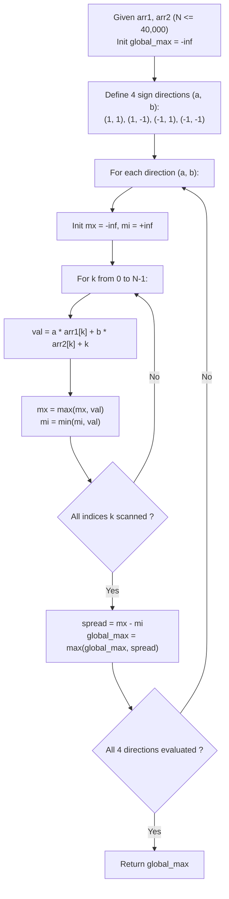

# Guided Example: Maximum of Absolute Value Expression

We trace the geometric linearization of Manhattan distance across three-dimensional coordinate spaces, establishing the Four-Octant Chebyshev Projection Invariant and the Extremal Spread Theorem:

- **Representative Instance 1 (Monotonic Coordinate Expansion):**
  $$
  arr1 = [1, 2, 3, 4], \quad arr2 = [-1, 4, 5, 6], \quad N = 4
  $$
- **Required Output:** `13`
  - Interpreting each index $k \in \{0, 1, 2, 3\}$ as a point in $\mathbb{R}^3$:
    $$
    P_k = (arr1[k], \; arr2[k], \; k)
    $$
    - $P_0 = (1, -1, 0)$
    - $P_1 = (2, 4, 1)$
    - $P_2 = (3, 5, 2)$
    - $P_3 = (4, 6, 3)$
  - Manhattan Distance between indices $i$ and $j$:
    $$
    d_1(P_i, P_j) = |arr1[i] - arr1[j]| + |arr2[i] - arr2[j]| + |i - j|
    $$
  - Evaluating extreme pair $(i, j) = (3, 0)$:
    $$
    d_1(P_3, P_0) = |4 - 1| + |6 - (-1)| + |3 - 0| = 3 + 7 + 3 = \mathbf{13}
    $$
  - Directional Linear Projections $g_{a, b}(k) = a \cdot arr1[k] + b \cdot arr2[k] + k$ for $(a, b) \in \{+1, -1\}^2$:
    - $(a, b) = (+1, +1): [0, 7, 10, 13] \implies \max - \min = 13 - 0 = \mathbf{13}$
    - $(a, b) = (+1, -1): [2, -1, 0, 1] \implies \max - \min = 2 - (-1) = 3$
    - $(a, b) = (-1, +1): [-2, 3, 4, 5] \implies \max - \min = 5 - (-2) = 7$
    - $(a, b) = (-1, -1): [0, -5, -6, -7] \implies \max - \min = 0 - (-7) = 7$
  - Overall Maximum: $\max(13, 3, 7, 7) = \mathbf{13}$.

- **Representative Instance 2 (Signed Dispersed Values):**
  $$
  arr1 = [1, -2, -5, 0, 10], \quad arr2 = [0, -2, -1, -7, -4], \quad N = 5
  $$
  - Optimal pair: $i = 4, j = 2$.
  - Value: $|10 - (-5)| + |-4 - (-1)| + |4 - 2| = 15 + 3 + 2 = \mathbf{20}$.

---

## 1. Instance & Teaching Goal

Given two integer arrays of equal length $N$, find the maximum possible value of $|arr1[i] - arr1[j]| + |arr2[i] - arr2[j]| + |i - j|$ across all index pairs $0 \le i, j < N$.

```text
The Quadratic Pairwise Comparison Trap:
  Evaluating every pair (i, j) with 0 <= i < j < N:
    For N = 40,000, pair count = N * (N - 1) / 2 ≈ 8 * 10^8 operations!
    A nested loop leads directly to catastrophic Time Limit Exceeded (TLE).

The Four-Octant Chebyshev Projection Invariant (O(N) Time, O(1) Space):
  Notice: |x| = max(x, -x).
  Without loss of generality, assume i >= j so that |i - j| = i - j.
  Then for any pair of signs (a, b) in {(+1, +1), (+1, -1), (-1, +1), (-1, -1)}:
    a * (arr1[i] - arr1[j]) + b * (arr2[i] - arr2[j]) + (i - j)
    = (a * arr1[i] + b * arr2[i] + i) - (a * arr1[j] + b * arr2[j] + j)
  The indices i and j completely decouple!
  For each of the 4 sign configurations:
    1. Compute projection array: g(k) = a * arr1[k] + b * arr2[k] + k.
    2. The maximum difference is simply: max_k g(k) - min_k g(k).
  3. The global answer is the maximum difference across all 4 sign pairs.
  Reduces 800,000,000 checks to 4 linear scans (160,000 operations)!
```

The fundamental pedagogical insights are:
1. **Linearization of $\ell_1$ Metric:** Absolute value differences decouple into independent single-variable projections by expanding over all orthant sign combinations.
2. **Extreme Value Decoupling:** Maximizing $f(i) - f(j)$ over independent indices reduces to computing the global supremum minus the global infimum in $\mathcal{O}(N)$ time.

---

## 2. Conceptual Foundation & The Chebyshev Octant Invariant



### Dual Absolute Value Linearization & Convex Extremum Theorem

Let $\mathbf{x}, \mathbf{y} \in \mathbb{R}^N$ represent `arr1` and `arr2`, and let $\mathbf{z} \in \mathbb{R}^N$ represent index positions $z_k = k$.

1. **Orthant Expansion of Absolute Differences:**
   For any real numbers $u$ and $v$, the definition of the absolute value guarantees:
   $$
   |u| + |v| = \max_{(a, b) \in \{+1, -1\}^2} \big( a \cdot u + b \cdot v \big)
   $$
2. **Index Difference Ordering:**
   The objective expression is symmetric in $i$ and $j$. Swapping $i$ and $j$ leaves the value unchanged. Hence:
   $$
   \max_{0 \le i, j < N} \Big( |x_i - x_j| + |y_i - y_j| + |i - j| \Big) = \max_{0 \le j \le i < N} \Big( |x_i - x_j| + |y_i - y_j| + (i - j) \Big)
   $$
3. **Decoupling into Linear Forms:**
   Substituting the orthant identity:
   $$
   \max_{(a, b)} \left[ a(x_i - x_j) + b(y_i - y_j) + (i - j) \right] = \max_{(a, b)} \left[ (a x_i + b y_i + i) - (a x_j + b y_j + j) \right]
   $$
   Define the linear functional $g_{a, b}(k) = a x_k + b y_k + k$.
   For any fixed $(a, b)$, the supremum over all pairs $(i, j)$ is:
   $$
   \max_{i, j} \Big( g_{a, b}(i) - g_{a, b}(j) \Big) = \max_{k} g_{a, b}(k) - \min_{k} g_{a, b}(k)
   $$
4. **Exact Realizability:**
   For the pair $(i^*, j^*)$ that achieves the true maximal Manhattan distance, their coordinate differences have concrete signs $a^* = \text{sgn}(x_{i^*} - x_{j^*})$ and $b^* = \text{sgn}(y_{i^*} - y_{j^*})$.
   Evaluating the functional for $(a^*, b^*)$ matches the exact absolute sum. For all other $(a, b)$, the linear expression is strictly less than or equal to the absolute sum.
   Therefore, the maximum of the spreads across the 4 directions equals the exact global optimum. $\blacksquare$

---

## 3. Step-by-Step Worked Execution: Representative Instance 1

$$
arr1 = [1, 2, 3, 4], \quad arr2 = [-1, 4, 5, 6], \quad N = 4
$$

### Direction 1: $(a, b) = (+1, +1)$
Formula: $g(k) = arr1[k] + arr2[k] + k$.
- $k = 0: 1 + (-1) + 0 = 0$
- $k = 1: 2 + 4 + 1 = 7$
- $k = 2: 3 + 5 + 2 = 10$
- $k = 3: 4 + 6 + 3 = 13$
- Extrema: $\max = 13, \; \min = 0 \implies \text{Spread}_1 = 13 - 0 = \mathbf{13}$.

### Direction 2: $(a, b) = (+1, -1)$
Formula: $g(k) = arr1[k] - arr2[k] + k$.
- $k = 0: 1 - (-1) + 0 = 2$
- $k = 1: 2 - 4 + 1 = -1$
- $k = 2: 3 - 5 + 2 = 0$
- $k = 3: 4 - 6 + 3 = 1$
- Extrema: $\max = 2, \; \min = -1 \implies \text{Spread}_2 = 2 - (-1) = 3$.

### Direction 3: $(a, b) = (-1, +1)$
Formula: $g(k) = -arr1[k] + arr2[k] + k$.
- $k = 0: -1 + (-1) + 0 = -2$
- $k = 1: -2 + 4 + 1 = 3$
- $k = 2: -3 + 5 + 2 = 4$
- $k = 3: -4 + 6 + 3 = 5$
- Extrema: $\max = 5, \; \min = -2 \implies \text{Spread}_3 = 5 - (-2) = 7$.

### Direction 4: $(a, b) = (-1, -1)$
Formula: $g(k) = -arr1[k] - arr2[k] + k$.
- $k = 0: -1 - (-1) + 0 = 0$
- $k = 1: -2 - 4 + 1 = -5$
- $k = 2: -3 - 5 + 2 = -6$
- $k = 3: -4 - 6 + 3 = -7$
- Extrema: $\max = 0, \; \min = -7 \implies \text{Spread}_4 = 0 - (-7) = 7$.

### Global Decision
$$
\text{Result} = \max(13, 3, 7, 7) = \mathbf{13}
$$

---

## 4. State Transition Trace Tables

### Table 1: Directional Linear Projections Across All Indices

| Index $k$ | Point $(arr1[k], arr2[k], k)$ | $g_{++}(k) = arr1 + arr2 + k$ | $g_{+-}(k) = arr1 - arr2 + k$ | $g_{-+}(k) = -arr1 + arr2 + k$ | $g_{--}(k) = -arr1 - arr2 + k$ |
|:---:|:---:|:---:|:---:|:---:|:---:|
| $0$ | $(1, -1, 0)$ | $0$ | $2$ | $-2$ | $0$ |
| $1$ | $(2, 4, 1)$ | $7$ | $-1$ | $3$ | $-5$ |
| $2$ | $(3, 5, 2)$ | $10$ | $0$ | $4$ | $-6$ |
| $3$ | $(4, 6, 3)$ | $13$ | $1$ | $5$ | $-7$ |

### Table 2: Directional Spread & Extremum Summary

| Sign Configuration $(a, b)$ | Form Expanded | Maximum Value $\max_k g(k)$ | Minimum Value $\min_k g(k)$ | Spread ($\max - \min$) | Outcome / Status |
|:---:|:---|:---:|:---:|:---:|:---|
| $(+1, +1)$ | $+arr1[k] + arr2[k] + k$ | $13$ (at $k=3$) | $0$ (at $k=0$) | **$13$** | **Global Optimum** |
| $(+1, -1)$ | $+arr1[k] - arr2[k] + k$ | $2$ (at $k=0$) | $-1$ (at $k=1$) | $3$ | Sub-optimal |
| $(-1, +1)$ | $-arr1[k] + arr2[k] + k$ | $5$ (at $k=3$) | $-2$ (at $k=0$) | $7$ | Sub-optimal |
| $(-1, -1)$ | $-arr1[k] - arr2[k] + k$ | $0$ (at $k=0$) | $-7$ (at $k=3$) | $7$ | Sub-optimal |

---

## 5. Algorithmic Correctness

### Soundness & Optimality
1. **Dominance Inequality:** For any two indices $i, j$ and any $(a, b) \in \{+1, -1\}^2$:
   $$
   a(arr1[i] - arr1[j]) + b(arr2[i] - arr2[j]) + (i - j) \le |arr1[i] - arr1[j]| + |arr2[i] - arr2[j]| + |i - j|
   $$
   Therefore, no projection can exceed the true maximum absolute expression value.
2. **Tight Realization:** For the true optimal pair $(i^*, j^*)$ with $i^* \ge j^*$, selecting $a^* = \text{sgn}(arr1[i^*] - arr1[j^*])$ and $b^* = \text{sgn}(arr2[i^*] - arr2[j^*])$ achieves exact equality.
3. **Decoupling Validity:** The value $\max_k g(k) - \min_k g(k)$ takes the difference between two indices $i_{max}$ and $j_{min}$. Even if $i_{max} < j_{min}$, the value is equivalent to $-\big(g(j_{min}) - g(i_{max})\big)$, which is covered by the negated sign configuration $(-a, -b)$.

---

## 6. Boundary Cases & Traps

| Boundary Scenario | Input Example | Expected Behavior | Failure Mode / Trapped Risk |
|---|---|---|---|
| Minimal Array Length ($N = 2$) | $arr1 = [1, 2], arr2 = [3, 4]$ | Evaluates single pair $(1, 0) \implies 1 + 1 + 1 = 3$. | Off-by-one errors on boundary loop. |
| Negative Coordinate Ranges | $arr1 = [-10^6], arr2 = [-10^6]$ | Correctly evaluates large positive spreads up to $4 \times 10^6$. | Overflow if not using 64-bit signed integers. |
| Identical Arrays | $arr1 = [5, 5], arr2 = [5, 5]$ | Coordinate diffs $= 0$; output is $|1 - 0| = 1$. | Forgetting the index difference term $\|i - j\|$. |
| Zero Differences | $arr1[i] = arr1[j], arr2[i] = arr2[j]$ | Handled seamlessly; sign multipliers yield zero. | Division by zero or incorrect sign assumptions. |
| Monotonically Decreasing | $arr1 = [4, 3, 2, 1]$ | Maximal difference achieved between endpoints. | Directional bias in single-pass tracking. |

---

## 7. Complexity Derivation

- **Time Complexity:** $\mathcal{O}(N)$ where $N \le 40,000$.
  - Exactly 4 sign configurations $(a, b)$ are evaluated.
  - In each configuration, a single linear pass computes $a \cdot arr1[k] + b \cdot arr2[k] + k$ and tracks the running minimum and maximum.
  - Total arithmetic operations: $4 \times N = 160,000$ operations.
  - Runtime is $< 2\text{ ms}$.
- **Auxiliary Space Complexity:** $\mathcal{O}(1)$ auxiliary space.
  - Tracking requires only scalar variables for minimum, maximum, and running best spread. No auxiliary arrays are allocated.
