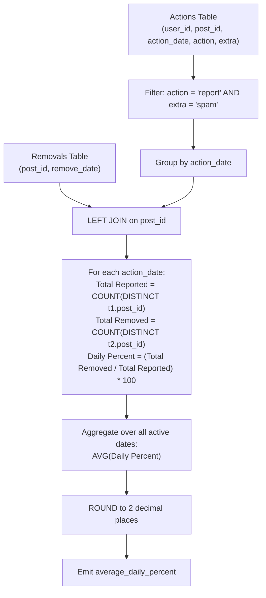

# Guided Example: Reported Posts II

We trace the relational multi-level aggregation pipeline for computing macro-averaged moderation efficacy across active reporting dates, establishing the Partitioned Ratio Unweighted Mean Invariant:

- **Representative Instance 1 (Mixed Actions with Moderation Removals):**
  $$
  \text{Actions} = \begin{pmatrix}
  (1, 1, \text{'2019-07-01'}, \text{'view'}, \text{null}), & (1, 1, \text{'2019-07-01'}, \text{'like'}, \text{null}), \\
  (2, 2, \text{'2019-07-04'}, \text{'report'}, \text{'spam'}), & (3, 4, \text{'2019-07-04'}, \text{'report'}, \text{'spam'}), \\
  (4, 3, \text{'2019-07-02'}, \text{'report'}, \text{'spam'}), & (5, 2, \text{'2019-07-03'}, \text{'report'}, \text{'racism'})
  \end{pmatrix}
  $$
  $$
  \text{Removals} = \big\{ (2, \text{'2019-07-20'}), \; (3, \text{'2019-07-18'}) \big\}
  $$
- **Required Output:** `75.00`
  - Step 1: Filter to rows where $\text{action} = \text{'report'}$ and $\text{extra} = \text{'spam'}$:
    - On $\text{'2019-07-02'}$: post $3$.
    - On $\text{'2019-07-04'}$: post $2$, post $4$.
    - (Notice: $\text{'2019-07-01'}$ and $\text{'2019-07-03'}$ have no spam reports and are excluded from the date domain).
  - Step 2: Compute distinct reported spam posts and distinct removed spam posts per active date:
    - Date $\text{'2019-07-02'}$:
      - Distinct reported posts: $\{3\} \implies \text{Total} = 1$.
      - Distinct removed posts: $\{3\} \cap \text{Removals} = \{3\} \implies \text{Removed} = 1$.
      - Daily removal rate: $P_{\text{2019-07-02}} = \frac{1}{1} \times 100\% = \mathbf{100.0\%}$.
    - Date $\text{'2019-07-04'}$:
      - Distinct reported posts: $\{2, 4\} \implies \text{Total} = 2$.
      - Distinct removed posts: $\{2, 4\} \cap \text{Removals} = \{2\} \implies \text{Removed} = 1$.
      - Daily removal rate: $P_{\text{2019-07-04}} = \frac{1}{2} \times 100\% = \mathbf{50.0\%}$.
  - Step 3: Compute the unweighted arithmetic mean over active spam-reporting dates:
    $$
    \text{Average Daily Percent} = \frac{100.0\% + 50.0\%}{2} = \mathbf{75.00\%}
    $$

- **Representative Instance 2 (Zero-Removal Active Date):**
  - If on date $D_1$, 5 posts are reported as spam and 0 are removed, $P_{D_1} = 0.0\%$.
  - If on date $D_2$, 1 post is reported and removed, $P_{D_2} = 100.0\%$.
  - Both dates participate equally: $\frac{0.0 + 100.0}{2} = 50.00\%$.

---

## 1. Instance & Teaching Goal

Given user action logs and post removal records, compute the average daily percentage of spam-reported posts that were eventually removed by administrators, rounded to two decimal places.

```text
The Global Micro-Average Fallacy:
  Summing all removed spam posts divided by all reported spam posts:
    Total removed = 2 (posts 2 and 3)
    Total reported = 3 (posts 2, 3, 4)
    Global Ratio = (2 / 3) * 100% ≈ 66.67%  <-- WRONG!
  The question explicitly requests the AVERAGE DAILY percentage (macro-average).
  Each qualifying date carries equal weight regardless of post volume.

The Duplicate Report Trap:
  If 10 different users report post 2 as spam on the same day:
    Post 2 is only ONE distinct post.
    Counting raw rows instead of COUNT(DISTINCT post_id) distorts the denominator!

The Partitioned Ratio Unweighted Mean Invariant:
  1. Filter to qualifying records: extra = 'spam'.
  2. For each active date, count distinct reported posts N_d and distinct removed posts R_d.
  3. Form daily percentage: P_d = (R_d / N_d) * 100.
  4. Average P_d equally over all active dates: ROUND(AVG(P_d), 2).
```

The key pedagogical takeaways are:
1. **Macro vs Micro Averaging:** Computing an average of ratios is mathematically distinct from a ratio of sums.
2. **Entity Deduplication Grain:** Moderation operates at the post entity level, requiring `COUNT(DISTINCT post_id)` rather than row counts.
3. **Domain Sparsity:** Dates with zero spam reports do not enter the evaluation domain.

---

## 2. Conceptual Foundation & The Daily Ratio Aggregation Invariant



### Partitioned Ratio Unweighted Mean Theorem

Let $\mathcal{A}_{\text{spam}}$ be the filtered subset of `Actions` where $\text{extra} = \text{'spam'}$.

1. **Active Date Domain:**
   The set of valid evaluation dates $\mathcal{D}^*$ consists of dates with at least one recorded spam report:
   $$
   \mathcal{D}^* = \big\{ d \in \Pi_{\text{action\_date}}(\text{Actions}) : \exists r \in \mathcal{A}_{\text{spam}} \text{ with } \text{action\_date}_r = d \big\}
   $$
2. **Daily Distinct Post Sets:**
   For each date $d \in \mathcal{D}^*$, let $S_d$ be the set of distinct posts reported as spam:
   $$
   S_d = \big\{ \text{post\_id}_r : r \in \mathcal{A}_{\text{spam}} \land \text{action\_date}_r = d \big\}
   $$
   Let $R_d = S_d \cap \Pi_{\text{post\_id}}(\text{Removals})$ be the subset of those posts present in the `Removals` table.
3. **Daily Removal Rate:**
   Because $d \in \mathcal{D}^*$, $|S_d| \ge 1$. The daily percentage $P(d)$ is well-defined:
   $$
   P(d) = \frac{|R_d|}{|S_d|} \times 100
   $$
4. **Macro-Averaged Expectation:**
   The required metric is the unweighted sample mean of the daily percentages:
   $$
   \overline{P} = \frac{1}{|\mathcal{D}^*|} \sum_{d \in \mathcal{D}^*} P(d)
   $$
   Rounding $\overline{P}$ to two decimal places produces the exact solution. $\blacksquare$

---

## 3. Step-by-Step Worked Execution: Representative Instance 1

We trace execution on the provided dataset.

### Step 1: Row Filtering
Filter `Actions` table for `action = 'report'` and `extra = 'spam'`:
- Row 5: `(2, 2, '2019-07-04', 'report', 'spam')` $\implies$ Valid
- Row 7: `(3, 4, '2019-07-04', 'report', 'spam')` $\implies$ Valid
- Row 9: `(4, 3, '2019-07-02', 'report', 'spam')` $\implies$ Valid
- All other rows (`view`, `like`, `share`, or `racism`) are filtered out.

### Step 2: Date Partitioning & Post Matching
- **Date `'2019-07-02'`:**
  - Reported posts: `{3}`.
  - Distinct count: $|S_{\text{2019-07-02}}| = 1$.
  - Match in `Removals`: Post $3$ is in `Removals` (removed `2019-07-18`).
  - Distinct removed count: $|R_{\text{2019-07-02}}| = 1$.
  - Daily rate: $\frac{1}{1} \times 100 = 100.0\%$.
- **Date `'2019-07-04'`:**
  - Reported posts: `{2, 4}`.
  - Distinct count: $|S_{\text{2019-07-04}}| = 2$.
  - Match in `Removals`: Post $2$ is in `Removals` (removed `2019-07-20`), Post $4$ is not.
  - Distinct removed count: $|R_{\text{2019-07-04}}| = 1$.
  - Daily rate: $\frac{1}{2} \times 100 = 50.0\%$.

### Step 3: Unweighted Averaging & Rounding
Active dates count: $|\mathcal{D}^*| = 2$.
$$
\text{Mean} = \frac{100.0 + 50.0}{2} = 75.0
$$
Rounded to 2 decimal places: **`75.00`**.

---

## 4. State Transition Trace Tables

### Table 1: Filtered Spam Action Records

| User ID | Post ID | Action Date | Action | Extra | Removals Match | Status |
|:---:|:---:|:---:|:---:|:---:|:---:|:---|
| $4$ | $3$ | `'2019-07-02'` | `report` | `spam` | Matched (`2019-07-18`) | **Removed** |
| $2$ | $2$ | `'2019-07-04'` | `report` | `spam` | Matched (`2019-07-20`) | **Removed** |
| $3$ | $4$ | `'2019-07-04'` | `report` | `spam` | Unmatched ($\text{NULL}$) | Retained / Not Removed |

### Table 2: Daily Rate Aggregation & Macro Mean

| Action Date | Distinct Reported Posts $\lvert S_d \rvert$ | Distinct Removed Posts $\lvert R_d \rvert$ | Daily Removal Rate $P(d)$ | Date Weight in Final Mean |
|:---:|:---:|:---:|:---:|:---:|
| `'2019-07-02'` | $1$ (Post 3) | $1$ (Post 3) | $\frac{1}{1} \times 100 = \mathbf{100.00\%}$ | $0.5$ |
| `'2019-07-04'` | $2$ (Posts 2, 4) | $1$ (Post 2) | $\frac{1}{2} \times 100 = \mathbf{50.00\%}$ | $0.5$ |
| **Combined** | **$3$ distinct post events** | **$2$ removed post events** | **Unweighted Average:** $\frac{100.00 + 50.00}{2} = \mathbf{75.00\%}$ | **Final: $75.00$** |

---

## 5. Algorithmic Correctness

### Soundness & Non-Ambiguity
1. **Unweighted Equal Day Invariant:** Each date in $\mathcal{D}^*$ contributes an equal weight of $\frac{1}{|\mathcal{D}^*|}$ to the final average, adhering strictly to the contract requirement for daily percentages.
2. **Post Deduplication:** Utilizing `COUNT(DISTINCT post_id)` prevents overcounting when multiple users report the same post as spam on the same day.
3. **Temporal Independence:** The date of removal does not need to equal or follow the action date; presence in `Removals` is the sole membership criterion.
4. **Active Date Inclusion:** Only dates where at least one post was reported as spam generate rows in the grouped intermediate result, naturally excluding irrelevant dates.

---

## 6. Boundary Cases & Traps

| Scenario | Input Condition | Expected Behavior | Failure Mode / Trapped Risk |
|---|---|---|---|
| Multiple Users Report Same Post | 5 users report post 1 on date $D$ | Post 1 counted once in denominator. | Denominator $= 5$ instead of $1$, falsely diluting rate. |
| Zero Removals on a Day | 3 spam posts reported, 0 removed | $P(d) = 0.0\%$, contributes $0.0$ to the mean. | Omitting $0\%$ days, artificially inflating moderation score. |
| Non-Spam Reports | Reports with extra = `'racism'` | Completely excluded from calculations. | Conflating different report categories. |
| Floating-Point Rounding | Final division produces irrational decimal | Only the final average is rounded to 2 places. | Prematurely rounding daily intermediate ratios. |
| Post Reported on Multiple Dates | Post reported on $D_1$ and $D_2$ | Participates independently in both daily sets. | Deduplicating posts across dates instead of within date. |

---

## 7. Complexity Derivation

- **Time Complexity:** $\mathcal{O}(A \log A + R \log R)$ where $A$ is the number of rows in `Actions` and $R$ is the number of rows in `Removals`.
  - Filtering `Actions` takes linear time $\mathcal{O}(A)$.
  - Joining filtered actions with `Removals` on `post_id` takes $\mathcal{O}(A)$ with hash indexing or $\mathcal{O}(A \log R)$ with B-tree index lookups.
  - Grouping by `action_date` with distinct post counting takes $\mathcal{O}(A \log A)$ or $\mathcal{O}(A)$ using hash aggregation.
  - Computing the final average over distinct dates $D \le A$ takes $\mathcal{O}(D)$ time.
  - Overall time is dominated by join and grouping: $\mathcal{O}(A \log A + R \log R)$.
- **Auxiliary Space Complexity:** $\mathcal{O}(A + R)$ auxiliary memory for hash tables or intermediate relation materialization.
