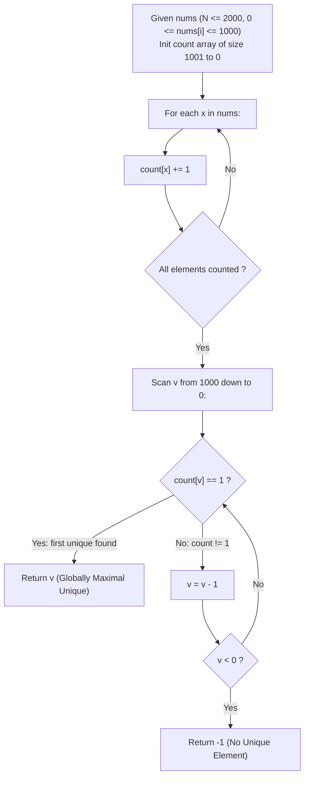

# Guided Example: Largest Unique Number

We trace the linear-time frequency histogram compilation and reverse monotonic search for finding the maximum singleton element in a discrete integer sequence, establishing the Frequency Sieve Extremum Invariant:

- **Representative Instance 1 (Mixed Multiplicities with Disqualified Maxima):**
  $$
  nums = [5, 7, 3, 9, 4, 9, 8, 3, 1], \quad N = 9
  $$
- **Required Output:** `8`
  - Phase 1: Frequency Histogram Construction:
    - Element $9$: occurs $2$ times (Duplicate $\implies$ Disqualified)
    - Element $8$: occurs $1$ time (Unique $\implies$ **Eligible Candidate**)
    - Element $7$: occurs $1$ time (Unique $\implies$ Eligible Candidate)
    - Element $5$: occurs $1$ time (Unique $\implies$ Eligible Candidate)
    - Element $4$: occurs $1$ time (Unique $\implies$ Eligible Candidate)
    - Element $3$: occurs $2$ times (Duplicate $\implies$ Disqualified)
    - Element $1$: occurs $1$ time (Unique $\implies$ Eligible Candidate)
  - Phase 2: Extremal Candidate Selection:
    - Set of unique values: $\mathcal{U} = \{8, 7, 5, 4, 1\}$.
    - Maximal element: $\max(\mathcal{U}) = \mathbf{8}$.
    - Note that although $9$ is the largest value in the array, its multiplicity ($2$) strictly disqualifies it.

- **Representative Instance 2 (Total Duplicate Collapse):**
  $$
  nums = [9, 9, 8, 8], \quad N = 4
  $$
  - Multiplicities: $count[9] = 2, \; count[8] = 2$.
  - Unique set $\mathcal{U} = \emptyset$.
  - Return default sentinel: $\mathbf{-1}$.

- **Representative Instance 3 (Zero as Valid Unique Element):**
  $$
  nums = [0], \quad N = 1 \implies \mathcal{U} = \{0\} \implies \mathbf{0}
  $$
  - Value $0$ is non-negative and valid; must not be confused with sentinel $-1$.

---

## 1. Instance & Teaching Goal

Given an integer array `nums`, identify the largest number that occurs exactly once in the entire array. If no number has a frequency of 1, return -1.

```text
The Sorting with Window Inspection Trap:
  Sorting nums in descending order: [9, 9, 8, 7, 5, 4, 3, 3, 1]
    Requires O(N log N) time.
    Boundary checks between neighbors nums[i-1] != nums[i] != nums[i+1]
    are prone to tricky edge-index bugs at i = 0 and i = N-1.

The Direct Frequency Sieve Invariant (O(N + K) Time, O(K) Space):
  Constraints show values are bounded: 0 <= nums[i] <= 1000 (K = 1001).
  1. Allocate fixed direct-address frequency array count[1001] initialized to 0.
  2. Single pass over nums increments count[x] for each x in nums.
  3. Scan backwards from 1000 down to 0:
       The VERY FIRST index v encountered with count[v] == 1 is guaranteed
       to be the largest unique number!
  4. If the loop completes without finding count[v] == 1, return -1.
  Completely avoids sorting and nested comparisons.
```

The fundamental pedagogical insights are:
1. **Histogram Decoupling:** Separating multiplicity collection from order selection simplifies logic and guarantees $\mathcal{O}(N)$ processing.
2. **Reverse Monotonic Scan:** Scanning a bounded direct-address table from maximum possible value to minimum terminates immediately upon finding the first valid candidate.

---

## 2. Conceptual Foundation & The Frequency Sieve Invariant



### Direct-Address Frequency Histogram & Reverse Monotonic Scan Theorem

Let $A = [x_0, x_1, \dots, x_{N-1}]$ be an array of integers with $x_i \in \{0, 1, \dots, K-1\}$.

1. **Multiplicity Partition:**
   The multiset of values in $A$ is partitioned into two disjoint sets:
   $$
   \mathcal{U} = \big\{ v \in \{0, \dots, K-1\} : \text{freq}(v) = 1 \big\}
   $$
   $$
   \mathcal{R} = \big\{ v \in \{0, \dots, K-1\} : \text{freq}(v) \ne 1 \big\}
   $$
2. **Maximality under Descending Iteration:**
   Let $v^* = \max \mathcal{U}$.
   If $\mathcal{U} \ne \emptyset$, then $v^*$ is unique and satisfies:
   $$
   v^* \in \mathcal{U} \quad \text{and} \quad \forall u > v^*, \; u \notin \mathcal{U}
   $$
   Therefore, an iteration scanning indices $v$ in strictly descending order $K-1, K-2, \dots, 0$ encounters $v^*$ before any other member of $\mathcal{U}$.
   The first index $v$ encountered with $\text{freq}(v) = 1$ is identically $v^*$.
3. **Exhaustion Correctness:**
   If the scan exhausts all $v \ge 0$ without encountering $\text{freq}(v) = 1$, then $\mathcal{U} = \emptyset$, and returning $-1$ is correct. $\blacksquare$

---

## 3. Step-by-Step Worked Execution: Representative Instance 1

$nums = [5, 7, 3, 9, 4, 9, 8, 3, 1], \quad N = 9$.

### Stage 1: Histogram Population
Incrementing counts for each element in $nums$:
- $count[5] \leftarrow 1$
- $count[7] \leftarrow 1$
- $count[3] \leftarrow 1$
- $count[9] \leftarrow 1$
- $count[4] \leftarrow 1$
- $count[9] \leftarrow 2$ (multiplicity exceeds 1)
- $count[8] \leftarrow 1$
- $count[3] \leftarrow 2$ (multiplicity exceeds 1)
- $count[1] \leftarrow 1$

### Stage 2: Descending Scan
Starting from maximum value present (or maximum possible bound $1000$):
- $v = 9$: $count[9] = 2 \ne 1 \implies$ Reject (duplicate).
- $v = 8$: $count[8] = 1 \implies$ **Hit! Exactly one occurrence.**
- Terminate immediately and return $\mathbf{8}$.

Values $7, 5, 4, 1$ are also unique, but $8 > 7 > 5 > 4 > 1$, so $8$ is the unique maximum.

---

## 4. State Transition Trace Tables

### Table 1: Array Frequency Compilation

| Pass Index $i$ | Element $x = nums[i]$ | Prior Frequency $count[x]$ | New Frequency $count[x]$ | Eligibility Status |
|:---:|:---:|:---:|:---:|:---|
| $0$ | $5$ | $0$ | $1$ | Eligible |
| $1$ | $7$ | $0$ | $1$ | Eligible |
| $2$ | $3$ | $0$ | $1$ | Eligible |
| $3$ | $9$ | $0$ | $1$ | Eligible |
| $4$ | $4$ | $0$ | $1$ | Eligible |
| $5$ | $9$ | $1$ | **$2$** | **Disqualified (Duplicate)** |
| $6$ | $8$ | $0$ | $1$ | Eligible |
| $7$ | $3$ | $1$ | **$2$** | **Disqualified (Duplicate)** |
| $8$ | $1$ | $0$ | $1$ | Eligible |

### Table 2: Descending Monotonic Search Trace

| Search Candidate $v$ | Recorded Frequency $count[v]$ | Uniqueness Condition ($count == 1$) | Decision / Action |
|:---:|:---:|:---:|:---|
| $9$ | $2$ | False | Discard; advance to next smaller |
| **$8$** | **$1$** | **True** | **Target Found! Return $8$** |
| $7$ | $1$ | Not evaluated | Unreached due to early exit |
| $6$ | $0$ | Not evaluated | Unreached due to early exit |
| $5$ | $1$ | Not evaluated | Unreached due to early exit |

---

## 5. Algorithmic Correctness

### Soundness & Non-Ambiguity
1. **Multiplicity Isolation:** Counting total occurrences across the entire array ensures that uniqueness is global, not local to any contiguous window or subarray.
2. **First-Hit Maximality:** Scanning in descending numerical order guarantees that the first integer satisfying $count[v] == 1$ is strictly greater than all other integers that also satisfy $count[u] == 1$.
3. **Sentinel Safety:** The problem domain specifies non-negative values ($0 \le nums[i] \le 1000$). The sentinel $-1$ cannot collide with any valid array value, preserving total disambiguation.

---

## 6. Boundary Cases & Traps

| Boundary Scenario | Input Example | Expected Output | Failure Mode / Trapped Risk |
|---|---|---|---|
| Single Element Array | `nums = [42]` | `42` | Falsely returning -1 due to loop bounds |
| Zero as Unique Maximum | `nums = [0]` | `0` | Confusing 0 with sentinel -1 or falsey evaluation |
| All Duplicate Pairs | `nums = [1, 1, 2, 2, 3, 3]` | `-1` | Returning smallest duplicate instead of -1 |
| Max Element Duplicated | `nums = [10, 10, 9]` | `9` | Returning absolute array maximum without checking count |
| All Distinct Elements | `nums = [1, 2, 3, 4, 5]` | `5` | Returning wrong element; should be global max |

---

## 7. Complexity Derivation

- **Time Complexity:** $\mathcal{O}(N + K)$ where $N = |nums| \le 2000$ and $K = \max(nums) + 1 \le 1001$.
  - Building the frequency histogram requires a single linear pass over `nums`: $\mathcal{O}(N)$ operations.
  - The reverse scan inspects at most $K \le 1001$ entries: $\mathcal{O}(K)$ operations.
  - Overall runtime is bounded by $2000 + 1001 = 3001$ iterations, executing in $< 0.1\text{ ms}$.
- **Auxiliary Space Complexity:** $\mathcal{O}(K)$ auxiliary space.
  - A fixed-size direct-address array of $1001$ integers (or a hash map of size at most $\min(N, K)$) requires negligible $\mathcal{O}(1)$ memory.
