[TOC]

## Solution

---

### Approach 1: Sorting

#### Intuition

To find if a number is unique, one approach is to sort the array. Sorting groups of identical numbers together makes it easier to spot unique numbers since they will stand apart from the groups.

We start by sorting the array. Then, we go through it from the end to the beginning. This ensures that if we find a unique number, it will be the largest, and we can return it immediately.

To check for uniqueness, we compare each number to the one next to it. A unique number will differ from its neighbors. Since we're moving in one direction, we only need to compare each number with the next one. Any earlier duplicates will already have been checked.

If we find a duplicate, we skip over the whole group instead of checking each number. We do this by advancing the pointer to the next distinct number.

The algorithm checks for uniqueness at the start of each group. This is why we only need to check the next element to determine if a number stands alone.

If we finish checking the entire array and find no unique number, we return -1.

The algorithm is visualized below:

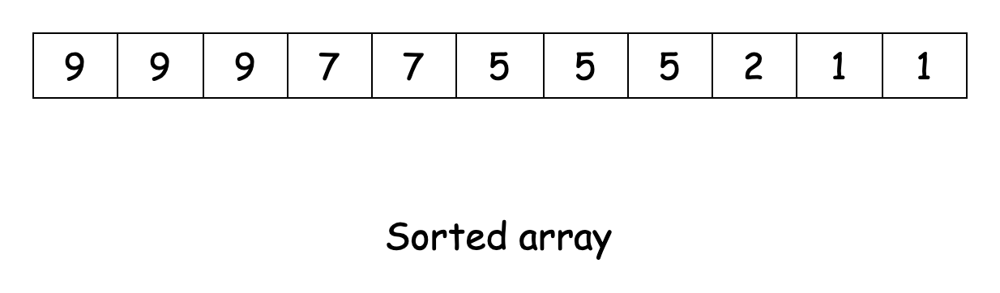

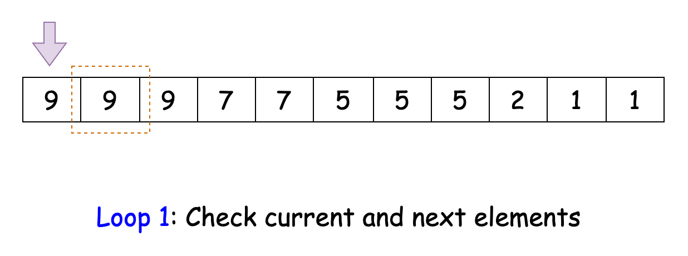

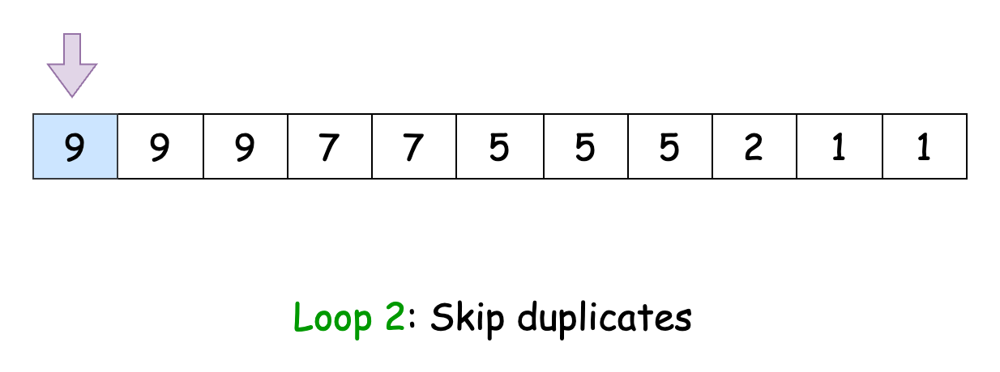

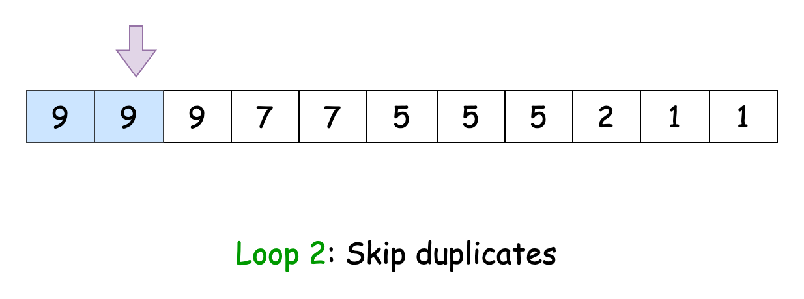

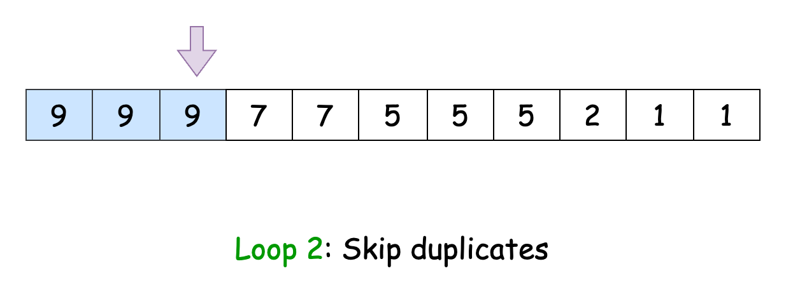

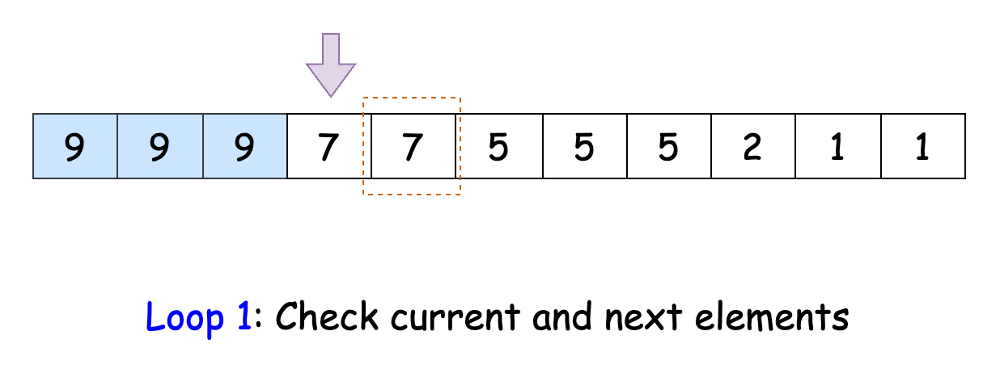

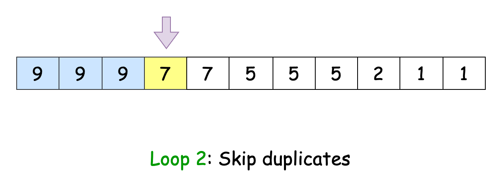

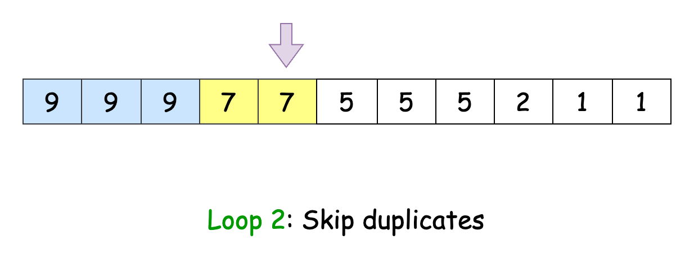

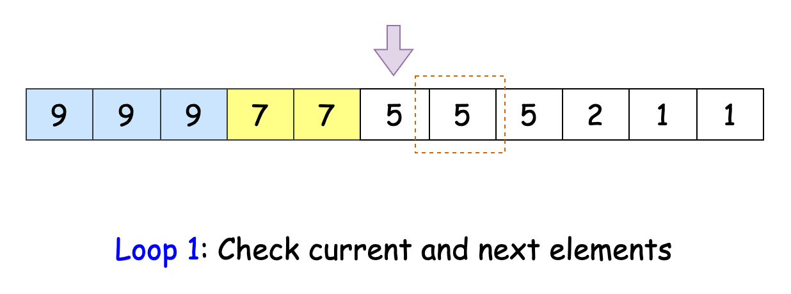

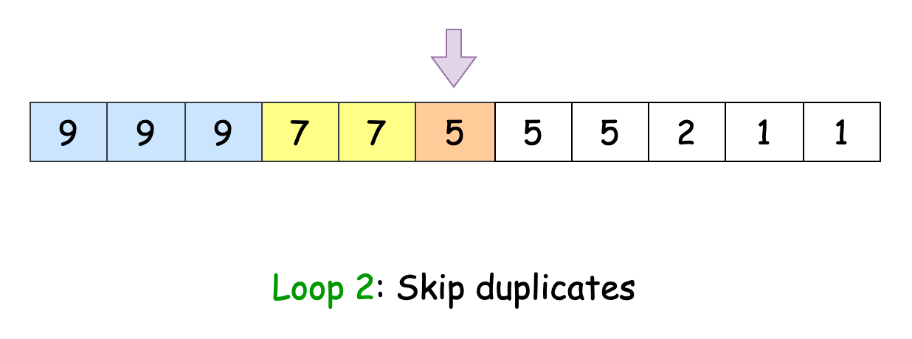

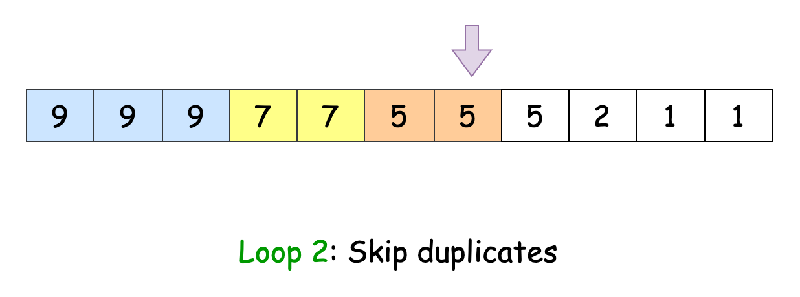

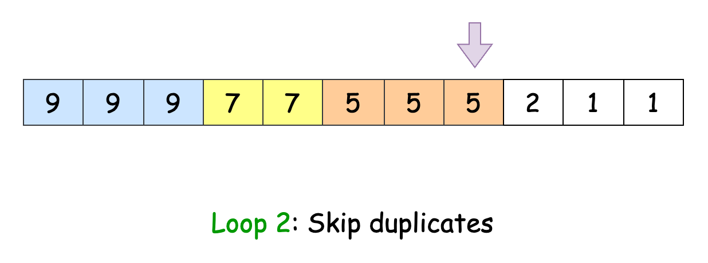

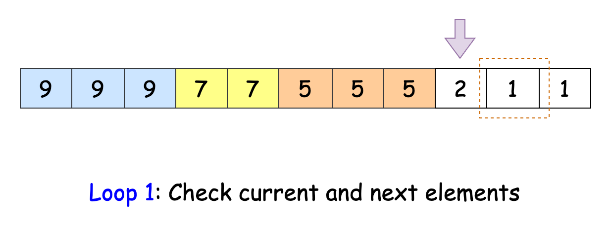

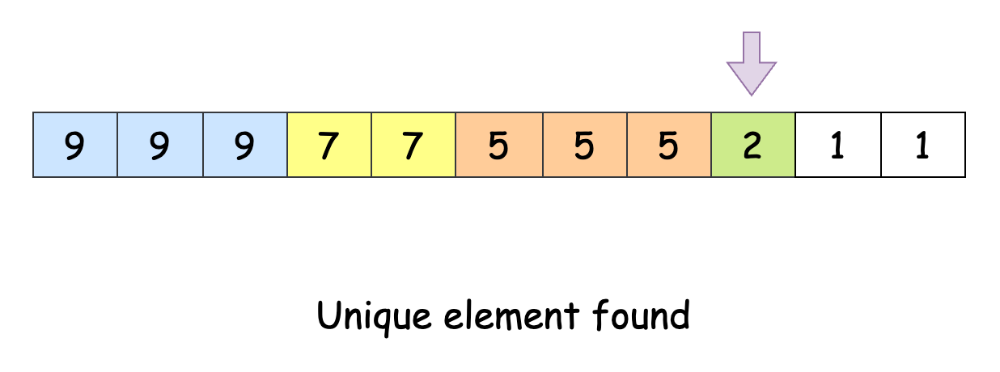

#### Algorithm

- Initialize a variable `n` to the length of the input array `nums`.
- If `n` is equal to 1, return the first (and only) element of `nums`.
- Sort the `nums` array in ascending order.
- Initialize a variable `currentIndex` to $n - 1$, pointing to the last element of the sorted array.
- Enter a while loop that continues as long as `currentIndex` is greater than or equal to 0:
  - Check if `currentIndex` is 0 or if the current element is different from the previous element.
  - If true, return the element at `currentIndex`.
  - Enter a nested while loop that continues as long as `currentIndex` is greater than 0 and the current element is equal to the previous element:
- Adjust `currentIndex` to skip duplicates.
  - Adjust `currentIndex` to move to the next unique number.
- If the outer while loop completes without finding a unique largest number, return -1.

#### Implementation

```python
class Solution:
    def largestUniqueNumber(self, nums: List[int]) -> int:
        n = len(nums)

        # If there's only one element, it's unique by default
        if n == 1:
            return nums[0]

        nums.sort(reverse=True)

        # Start from the beginning (largest numbers)
        currentIndex = 0

        while currentIndex < n:
            # If it's the first element or different from the next one, it's unique
            if (
                currentIndex == n - 1
                or nums[currentIndex] != nums[currentIndex + 1]
            ):
                return nums[currentIndex]
            # Skip duplicates
            while (
                currentIndex < n - 1
                and nums[currentIndex] == nums[currentIndex + 1]
            ):
                currentIndex += 1
            # Move to the next unique number
            currentIndex += 1

        return -1
```

#### Complexity Analysis

Let $n$ be the length of the `nums` array.

- Time complexity: $O(n \cdot \log n)$

    Sorting the input array takes $O(n \cdot \log n)$ time.

    In the worst case, we iterate over all elements once, taking $O(n)$ time. The inner while loop for skipping duplicates doesn't add to the overall time complexity, as it's still part of the single pass through the array.

    Thus, the overall time complexity of the algorithm is $O(n \cdot \log n) +$\mathcal{O}(n)$= O(n \cdot \log n)$.

- Space complexity: $O(S)$

    The space taken by the sorting algorithm ($S$) depends on the language of implementation:
- In Java, `Arrays.sort()` is implemented using a variant of the Quick Sort algorithm which has a space complexity of $O( \log n)$.
- In C++, the `sort()` function is implemented as a hybrid of Quick Sort, Heap Sort, and Insertion Sort, with a worst-case space complexity of $O(\log n)$.
- In Python, the `sort()` method sorts a list using the Timsort algorithm which is a combination of Merge Sort and Insertion Sort and has a space complexity of $O(n)$.

---

### Approach 2: Sorted Map

#### Intuition

Another way to group numbers efficiently is by using a frequency table. A frequency table is a collection of key-value pairs, where the key is the number and the value is how often it appears in the array. We'll build this frequency table using a map.

To find the largest unique number, it's useful if the numbers are in order. This allows us to start with the largest number and work our way down, stopping once we find one that appears only once. Some languages provide a sorted map that works well for this task.

We loop through the `nums` array to fill the map. After that, we check the keys in descending order and return the first one with a value of 1. If none exist, we return -1 since there are no unique numbers in the array.

#### Algorithm

- Initialize a sorted map `frequencyMap` to store numbers as keys and their frequencies as values.
- Iterate through each number `num` in the input array `nums`:
  - Update the frequency of `num` in `frequencyMap`.
- Initialize a variable `largestUnique` to -1, which will store the result.
- Iterate through the keys of `frequencyMap` in descending order.
   - For each number:
       - Check if its frequency in `frequencyMap` is equal to 1.
       - If true, assign this number to `largestUnique` and break the loop.
- Return the value of `largestUnique`.

#### Implementation

> Note: `Python3` lacks a built-in sorted map implementation, so we simulate its functionality using a map and `OrderedDict`. While this approach is more complex than necessary, it is included here for completeness.

```python
class Solution:
    def largestUniqueNumber(self, nums: List[int]) -> int:
        # Create a frequency map
        frequency_map = {}
        for num in nums:
            frequency_map[num] = frequency_map.get(num, 0) + 1

        # Create a sorted OrderedDict
        sorted_map = OrderedDict(sorted(frequency_map.items(), reverse=True))

        # Find the largest unique number
        for num, freq in sorted_map.items():
            if freq == 1:
                return num

        return -1
```

#### Complexity Analysis

Let $n$ be the length of the `nums` array.

* Time complexity: $O(n \cdot \log n)$

    Each insertion operation in the sorted map takes $O(\log k)$ time, where $k$ is the number of unique elements in the map. Since $k = n$ in the worst case, populating the sorted map takes $O(n \cdot \log n)$ time.

    To find the largest unique number, we iterate through the keys of the map, taking $O(n \cdot \log n)$ time.

    Thus, the overall time complexity of the algorithm is $2 \cdot$\mathcal{O}(n \cdot \\log n)$= O(n \cdot \log n)$.

* Space complexity: $O(n)$

    The sorted map takes $O(n)$ space in the worst case (where all elements in `nums` are unique).

---

### Approach 3: Map

#### Intuition

The sorted map approach is effective, but it has a key drawback: each addition and retrieval takes $O(\log n)$ time. In contrast, a standard hash map performs these operations in constant time. Let's consider an alternative using a hash map to enhance efficiency.

We'll follow a similar strategy, but we'll change how we track the largest unique number. First, we create a hash map to hold the numbers from our input array `nums`. Each number will serve as a key, while its frequency will be the corresponding value.

Next, we introduce a variable called `largestUnique` to track the largest unique number we find. We initialize this variable to -1, which will act as our default if we don't find any unique numbers.

After constructing the frequency map, we iterate through its keys. For each key, we check its frequency. If the frequency is 1, it means the number is unique. We then compare this number with the current value of `largestUnique`. If it's larger, we update `largestUnique` to this new value.

Once we've gone through all the keys in the map, `largestUnique` will contain the largest unique number from the original array. If we find no unique numbers, `largestUnique` will remain -1.

#### Algorithm

- Initialize a map called `frequencyMap` to store integers as keys and their frequencies as values.
- Iterate through each number `num` in the input array `nums`:
  - Update the frequency of `num` in `frequencyMap`.
- Initialize a variable `largestUnique` to -1, which will store the result.
- Iterate through each number in the key set of `frequencyMap`.
  - For each `num`:
       - Check if its frequency in `frequencyMap` is equal to 1 and if `num` is greater than `largestUnique`.
       - If both conditions are true, assign `num` to `largestUnique`.
- After the loop is complete, return the value of `largestUnique`.

#### Implementation

```python
class Solution:
    def largestUniqueNumber(self, nums: List[int]) -> int:
        # Use Counter to count frequencies of numbers
        frequency_map = Counter(nums)

        # Find the largest number with frequency 1, or -1 if none found
        return max(
            (num for num, freq in frequency_map.items() if freq == 1),
            default=-1,
        )
```

#### Complexity Analysis

Let $n$ be the length of the `nums` array.

* Time complexity: $O(n)$

    Iterating through `nums` and populating the hash map takes $O(n)$ time. To find the largest number, the algorithm iterates through each key in the map. Since the number of keys can be $n$ in the worst case, this also takes $O(n)$ time.

    Thus, the time complexity of the algorithm is $O(n)$.

* Space complexity: $O(n)$

    The map occupies $O(n)$ space in the worst case (where all elements in `nums` are unique).

---