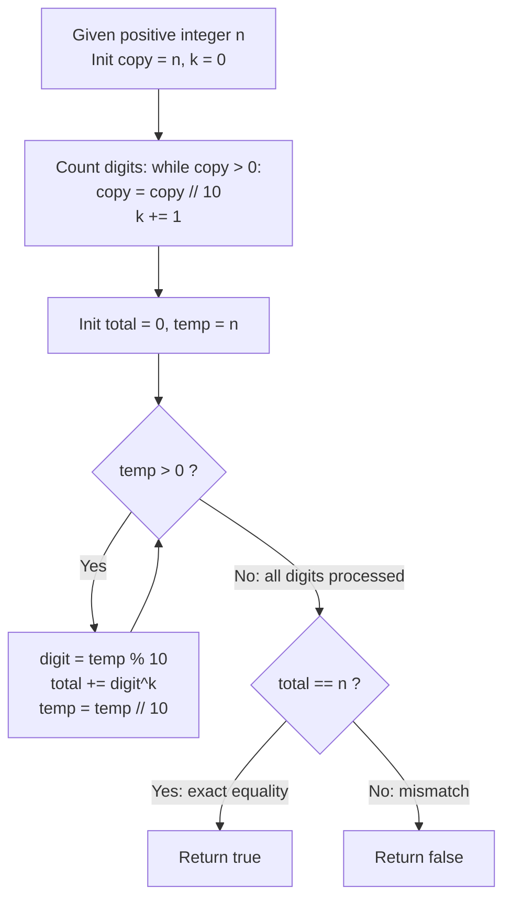

# Guided Example: Armstrong Number

We trace the digit-by-digit extraction, degree determination, and power accumulation algorithm for verifying narcissistic integers in base 10, establishing the Narcissistic Decimal Power Invariant:

- **Representative Instance 1 (Classic Three-Digit Narcissistic Integer):**
  $$
  n = 153
  $$
- **Required Output:** `true`
  - Phase 1: Degree Determination ($k = \text{number of decimal digits}$):
    - $153 \implies \text{digits are } [1, 5, 3] \implies k = 3$.
  - Phase 2: Power Accumulation ($\sum_{i=1}^k d_i^k$):
    - Units digit $3 \implies 3^3 = 27$
    - Tens digit $5 \implies 5^3 = 125$
    - Hundreds digit $1 \implies 1^3 = 1$
    - Total Armstrong Sum:
      $$
      S = 1^3 + 5^3 + 3^3 = 1 + 125 + 27 = \mathbf{153}
      $$
  - Phase 3: Identity Verification:
    $$
    S = 153 = n \implies \mathbf{true}
    $$

- **Representative Instance 2 (Three-Digit Non-Armstrong Integer):**
  $$
  n = 123 \implies k = 3
  $$
  - Armstrong Sum:
    $$
    S = 1^3 + 2^3 + 3^3 = 1 + 8 + 27 = \mathbf{36}
    $$
  - Identity Verification:
    $$
    36 \ne 123 \implies \mathbf{false}
    $$

- **Representative Instance 3 (Four-Digit Narcissistic Integer):**
  $$
  n = 1634 \implies k = 4
  $$
  - $1^4 + 6^4 + 3^4 + 4^4 = 1 + 1296 + 81 + 256 = \mathbf{1634} = n \implies \mathbf{true}$.

- **Representative Instance 4 (Trivial Single-Digit Invariant):**
  - Any single-digit number $d \in \{1, \dots, 9\}$ has $k = 1$.
  - $d^1 = d = n \implies$ All single-digit positive integers are trivially Armstrong numbers.

---

## 1. Instance & Teaching Goal

Given a positive integer $n$, determine whether the sum of each of its digits raised to the power of the total number of digits equals $n$.

```text
The Fixed Exponent Fallacy:
  Assuming the exponent is always 3 (the cubic sum):
    For n = 1634, computing 1^3 + 6^3 + 3^3 + 4^3 = 1 + 216 + 27 + 64 = 308 != 1634.
    Falsely concludes 1634 is not an Armstrong number!
    The definition requires exponent k = number of digits (here k = 4).

The Pure Arithmetic Invariant (O(log10 n) Time, O(1) Space):
  1. Determine digit count:
       k = floor(log10(n)) + 1  or by repeated division by 10.
  2. Maintain running accumulator total = 0 and temporary copy temp = n.
  3. While temp > 0:
       digit = temp mod 10
       total += digit^k
       temp = temp // 10
  4. Return total == n.
  Zero string allocations; strictly bounded integer arithmetic.
```

The fundamental pedagogical insights are:
1. **Dynamic Degree Determination:** The exponent $k$ is not a global constant; it is intrinsically bound to the decimal order of magnitude of $n$.
2. **Positional Independence:** Digit contributions are purely additive, allowing low-to-high modular extraction without reversing or storing digits in an array.

---

## 2. Conceptual Foundation & The Narcissistic Decimal Power Invariant



### Decimal Decomposition & Modular Power Accumulation Theorem

Let $n \in \mathbb{N}$ with $1 \le n \le 10^8$.

1. **Decimal Expansion:**
   The unique base-10 positional representation of $n$ is given by:
   $$
   n = \sum_{j=0}^{k-1} d_j \cdot 10^j, \quad d_j \in \{0, 1, \dots, 9\}, \; d_{k-1} \ne 0
   $$
   where the degree $k$ satisfies $k = \lfloor \log_{10} n \rfloor + 1$.
2. **Narcissistic Form:**
   By definition, $n$ is an Armstrong number if and only if:
   $$
   \mathcal{F}_k(n) = \sum_{j=0}^{k-1} (d_j)^k = n
   $$
3. **Low-Order Extraction Invariant:**
   At iteration $t \in \{0, \dots, k-1\}$, let the residual integer be $R_t = \lfloor n / 10^t \rfloor$.
   The lowest remaining digit is $d_t = R_t \pmod{10}$.
   The partial sum after $t+1$ steps is:
   $$
   S_{t+1} = S_t + (R_t \bmod 10)^k
   $$
   Upon reaching $R_k = 0$, $S_k = \mathcal{F}_k(n)$. Comparing $S_k == n$ decides membership in $\mathcal{O}(k)$ operations. $\blacksquare$

---

## 3. Step-by-Step Worked Execution: Representative Instance 1

$n = 153$.

### Step 1: Compute Degree $k$
- $153 // 10 = 15$ (count 1)
- $15 // 10 = 1$ (count 2)
- $1 // 10 = 0$ (count 3)
- $\implies k = 3$.

### Step 2: Accumulate Powers of Digits
Initial state: $temp = 153$, $total = 0$.

1. **Iteration 1 (Units place):**
   - $digit = 153 \pmod{10} = 3$.
   - Contribution: $3^3 = 27$.
   - $total \leftarrow 0 + 27 = 27$.
   - $temp \leftarrow 153 // 10 = 15$.
2. **Iteration 2 (Tens place):**
   - $digit = 15 \pmod{10} = 5$.
   - Contribution: $5^3 = 125$.
   - $total \leftarrow 27 + 125 = 152$.
   - $temp \leftarrow 15 // 10 = 1$.
3. **Iteration 3 (Hundreds place):**
   - $digit = 1 \pmod{10} = 1$.
   - Contribution: $1^3 = 1$.
   - $total \leftarrow 152 + 1 = 153$.
   - $temp \leftarrow 1 // 10 = 0$.

### Step 3: Equality Check
- $total = 153$.
- Original value $n = 153$.
- $153 == 153 \implies \mathbf{true}$.

---

## 4. State Transition Trace Tables

### Table 1: Digit Extraction & Power Sum Accumulation Trace

| Iteration $t$ | Residual $temp$ | Extracted Digit $d = temp \bmod 10$ | Exponent $k$ | Power Added $d^k$ | Running Sum $total$ | Next Residual $temp // 10$ |
|:---:|:---:|:---:|:---:|:---:|:---:|:---:|
| $1$ | $153$ | $3$ | $3$ | $3^3 = 27$ | $27$ | $15$ |
| $2$ | $15$ | $5$ | $3$ | $5^3 = 125$ | $152$ | $1$ |
| $3$ | $1$ | $1$ | $3$ | $1^3 = 1$ | **$153$** | $0$ (Done) |

### Table 2: Comparative Verification Across Representative Integers

| Integer $n$ | Digit Count $k$ | Sequence of Digits | Power Terms Evaluated | Computed Sum $\sum d^k$ | Decision ($Sum == n$) |
|:---:|:---:|:---:|:---|:---:|:---:|
| $7$ | $1$ | $[7]$ | $7^1 = 7$ | $7$ | **`true`** |
| $153$ | $3$ | $[1, 5, 3]$ | $1^3 + 5^3 + 3^3 = 1 + 125 + 27$ | $153$ | **`true`** |
| $123$ | $3$ | $[1, 2, 3]$ | $1^3 + 2^3 + 3^3 = 1 + 8 + 27$ | $36$ | `false` |
| $370$ | $3$ | $[3, 7, 0]$ | $3^3 + 7^3 + 0^3 = 27 + 343 + 0$ | $370$ | **`true`** |
| $1634$ | $4$ | $[1, 6, 3, 4]$ | $1^4 + 6^4 + 3^4 + 4^4 = 1 + 1296 + 81 + 256$ | $1634$ | **`true`** |

---

## 5. Algorithmic Correctness

### Soundness & Completeness
1. **Mathematical Invariance:** The sum of digits raised to the $k$-th power is commutative and associative. Processing digits from least-significant to most-significant produces the exact same sum as processing from most-significant to least-significant.
2. **Zero Digit Handling:** Zero digits contribute $0^k = 0$ for any $k \ge 1$, which naturally leaves the running sum unchanged without special-case branching.
3. **Determinism:** The procedure uses exact integer arithmetic, preventing precision loss or rounding inaccuracies associated with floating-point logarithms.

---

## 6. Boundary Cases & Traps

| Boundary Scenario | Input Example | Expected Output | Failure Mode / Trapped Risk |
|---|---|---|---|
| Single-Digit Integer | $n = 5$ | `true` ($5^1 = 5$) | Using fixed $k = 3$, yielding $5^3 = 125 \ne 5$ |
| Number with Internal Zero | $n = 370$ | `true` ($3^3 + 7^3 + 0^3 = 370$) | Misinterpreting 0 digit in power calculation |
| Consecutive Identical Digits | $n = 111$ | `false` ($1 + 1 + 1 = 3 \ne 111$) | Deduplicating digits instead of summing multiset |
| Large Input Boundary | $n = 10^8$ | `false` ($1^9 + 0 = 1 \ne 10^8$) | Integer overflow in intermediate calculations |
| Two-Digit Integers | $n = 10 \dots 99$ | No 2-digit Armstrong numbers exist | False positives from incorrect exponents |

---

## 7. Complexity Derivation

- **Time Complexity:** $\mathcal{O}(\log_{10} n)$ arithmetic operations.
  - The number of decimal digits is $k = \lfloor \log_{10} n \rfloor + 1 \le 9$ (since $n \le 10^8$).
  - Counting digits takes $k$ iterations.
  - Extracting digits and computing powers takes $k$ iterations.
  - Total iterations: $2 \times 9 = 18$ operations.
  - Execution time is $< 0.01\text{ ms}$.
- **Auxiliary Space Complexity:** $\mathcal{O}(1)$ auxiliary memory.
  - Only a constant number of 64-bit integer registers are used to track $k$, $total$, and $temp$.
