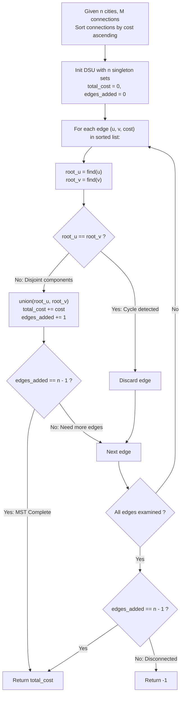

# Guided Example: Connecting Cities With Minimum Cost

We trace the greedy construction of a Minimum Spanning Tree (MST) using Kruskal's algorithm with Disjoint Set Union (DSU), formalizing the Cut Property and the Forest Component Reduction Invariant:

- **Representative Instance 1 (Dense Triangle with Competing Edge Weights):**
  $$
  n = 3, \quad connections = [[1, 2, 5], [1, 3, 6], [2, 3, 1]]
  $$
- **Required Output:** `6`
  - Phase 1: Ascending Edge Weight Sort:
    1. Edge $e_1 = (2, 3)$, $\text{cost} = 1$
    2. Edge $e_2 = (1, 2)$, $\text{cost} = 5$
    3. Edge $e_3 = (1, 3)$, $\text{cost} = 6$
  - Phase 2: DSU Initialization:
    - Independent component sets: $\{1\}, \{2\}, \{3\}$.
    - Component count $= 3$, Spanning cost $= 0$, Edges chosen $= 0$.
  - Phase 3: Greedy Edge Ingestion:
    - Inspect $e_1 = (2, 3, 1)$:
      - Root of $2$ is $2$; Root of $3$ is $3$ ($2 \ne 3 \implies$ Disjoint).
      - Union: Merge $\{2\}$ and $\{3\}$ into $\{2, 3\}$.
      - Accumulated cost: $0 + 1 = 1$. Edges chosen: $1$. Remaining components: $2$.
    - Inspect $e_2 = (1, 2, 5)$:
      - Root of $1$ is $1$; Root of $2$ is $2$ ($1 \ne 2 \implies$ Disjoint).
      - Union: Merge $\{1\}$ and $\{2, 3\}$ into $\{1, 2, 3\}$.
      - Accumulated cost: $1 + 5 = 6$. Edges chosen: $2 = n - 1$. Remaining components: $1$.
    - Inspect $e_3 = (1, 3, 6)$:
      - Edges chosen already equals $n - 1 = 2 \implies$ Early termination.
      - (Even if evaluated, $\text{find}(1) = \text{find}(3) \implies$ Cycle rejected).
  - Target spanning tree weight: $\mathbf{6}$.

- **Representative Instance 2 (Disconnected Forest Failure):**
  $$
  n = 4, \quad connections = [[1, 2, 3], [3, 4, 4]]
  $$
  - Graph has $4$ cities but only $2$ edges.
  - A spanning tree for $n = 4$ strictly requires at least $n - 1 = 3$ edges.
  - Final DSU state has $2$ disjoint components: $\{1, 2\}$ and $\{3, 4\}$.
  - Return disconnection sentinel: $\mathbf{-1}$.

---

## 1. Instance & Teaching Goal

Given $n$ cities and a list of bidirectional weighted roads, compute the minimum cost to build roads such that all cities become mutually reachable. If it is impossible to connect all cities, return -1.

```text
The Combinatorial Subgraph Fallacy:
  Enumerating all combinations of (n - 1) edges from M candidates:
    Number of candidates = (M choose n - 1).
    For M = 10,000, combinatorial search is computationally intractable.

The Disjoint-Set Spanning Tree Invariant (O(M log M) Time, O(N) Space):
  1. Sort all M edges in non-decreasing order of cost.
  2. Maintain a Disjoint Set Union (DSU) structure over {1, ..., n}:
       Initial state: n disjoint singleton components.
  3. Iterate through sorted edges (u, v, cost):
       If find(u) != find(v):
           union(u, v)
           total_cost += cost
           edges_count += 1
           If edges_count == n - 1:
               Early exit (full spanning tree achieved)!
  4. If edges_count == n - 1: return total_cost.
     Else: return -1 (graph has disconnected components).
```

The fundamental pedagogical insights are:
1. **The Cut Property:** The cheapest edge crossing any cut between two disconnected sets of vertices is guaranteed to belong to some Minimum Spanning Tree.
2. **Cycle Prevention via DSU:** Path compression and union-by-rank guarantee nearly $\mathcal{O}(1)$ cycle detection and component merging.
3. **Exact Cardinality Invariant:** A spanning tree over $n$ vertices contains exactly $n - 1$ edges. Fewer edges imply disconnectedness; extra edges create redundant cycles.

---

## 2. Conceptual Foundation & The Kruskal DSU Invariant



### The Cut Property & Kruskal Spanning Forest Optimality Theorem

Let $G = (V, E)$ be a connected, weighted, undirected graph with $|V| = n$ and $|E| = m$.

1. **The Cut Optimality Property:**
   Let $S \subset V$ be any proper, non-empty subset of vertices, and let $(S, V \setminus S)$ be the corresponding cut. If $e = (u, v)$ is an edge of minimal weight having one endpoint in $S$ and one endpoint in $V \setminus S$, then $e$ belongs to some Minimum Spanning Tree of $G$.
2. **Matroid Greediness:**
   The set of acyclic edge subgraphs of $G$ forms a graphic matroid $\mathcal{M} = (E, \mathcal{I})$. By Rado-Edmonds theorem, the greedy algorithm that processes elements in non-decreasing order of cost produces an independent set of maximum cardinality and minimal weight.
3. **Connectivity Invariant:**
   Initially, there are $n$ connected components. Each valid union reduces the number of connected components by exactly $1$.
   A connected spanning graph requires reducing the component count from $n$ to $1$, which occurs if and only if exactly $n - 1$ acyclic edges are successfully joined.
   If the edge list is exhausted with fewer than $n - 1$ edges selected, $G$ is disconnected, and no spanning tree exists. $\blacksquare$

---

## 3. Step-by-Step Worked Execution: Representative Instance 1

$n = 3, \quad connections = [[1, 2, 5], [1, 3, 6], [2, 3, 1]]$.

### Step 1: Sort Edges
- Edge 0: $(2, 3)$, weight $1$
- Edge 1: $(1, 2)$, weight $5$
- Edge 2: $(1, 3)$, weight $6$

### Step 2: DSU State Progression
Initial sets: $\{1\}, \{2\}, \{3\}$. Variables: $cost = 0$, $edges = 0$.

1. **Process Edge $(2, 3, 1)$:**
   - $\text{find}(2) = 2, \; \text{find}(3) = 3$.
   - $2 \ne 3 \implies$ Disjoint sets.
   - Action: $\text{union}(2, 3)$.
   - New component: $\{2, 3\}$.
   - $cost \leftarrow 0 + 1 = 1$.
   - $edges \leftarrow 0 + 1 = 1$.
   - Remaining components: $3 - 1 = 2$.
2. **Process Edge $(1, 2, 5)$:**
   - $\text{find}(1) = 1, \; \text{find}(2) = 2$.
   - $1 \ne 2 \implies$ Disjoint sets.
   - Action: $\text{union}(1, 2)$.
   - New component: $\{1, 2, 3\}$.
   - $cost \leftarrow 1 + 5 = 6$.
   - $edges \leftarrow 1 + 1 = 2$.
   - Component count is now $1$.
   - Target reached: $edges = n - 1 = 2$.
3. **Termination:**
   - Early exit triggered. Edge $(1, 3, 6)$ is never examined.

Total Minimum Spanning Tree Cost: $\mathbf{6}$.

---

## 4. State Transition Trace Tables

### Table 1: Connected Graph DSU Trace ($n = 3$)

| Step | Edge Evaluated $(u, v)$ | Weight | Root of $u$ | Root of $v$ | Cycle Check | Action Taken | Cumulative MST Cost | Components Remaining |
|:---:|:---:|:---:|:---:|:---:|:---:|:---:|:---:|:---:|
| $0$ | — | — | — | — | — | DSU Init | $0$ | $3$ ($\{1\}, \{2\}, \{3\}$) |
| $1$ | $(2, 3)$ | $1$ | $2$ | $3$ | Disjoint | **Union $(2, 3)$** | $1$ | $2$ ($\{1\}, \{2, 3\}$) |
| **$2$** | **$(1, 2)$** | **$5$** | **$1$** | **$2$** | **Disjoint** | **Union $(1, 2)$** | **$6$** | **$1$ ($\{1, 2, 3\}$)** |
| $3$ | $(1, 3)$ | $6$ | $1$ | $1$ | Cycle | Skipped (Early Exit) | $6$ | $1$ |

### Table 2: Disconnected Graph DSU Trace ($n = 4$)

| Step | Edge Evaluated $(u, v)$ | Weight | Root of $u$ | Root of $v$ | Action Taken | Cumulative Cost | Edges Joined | Final Status |
|:---:|:---:|:---:|:---:|:---:|:---:|:---:|:---:|:---|
| $0$ | — | — | — | — | DSU Init | $0$ | $0$ | $4$ components |
| $1$ | $(1, 2)$ | $3$ | $1$ | $2$ | Union $(1, 2)$ | $3$ | $1$ | $3$ components |
| $2$ | $(3, 4)$ | $4$ | $3$ | $4$ | Union $(3, 4)$ | $7$ | $2$ | $2$ components |
| **End** | **Exhausted** | — | — | — | **Check $edges == n - 1$** | **$7$** | **$2 \ne 3$** | **Return Sentinel $-1$** |

---

## 5. Algorithmic Correctness

### Soundness & Optimality
1. **Acyclicity:** By verifying $\text{find}(u) \ne \text{find}(v)$ before accepting any edge, every added edge connects two previously disconnected components, preventing cycles and guaranteeing that the resulting subgraph is a forest.
2. **Minimality:** Because edges are considered in strictly non-decreasing weight order, the first edge connecting any two components is the cheapest available bridge between them.
3. **Termination & Completeness:** The algorithm stops as soon as $n - 1$ edges are added. If all edges are processed and fewer than $n - 1$ edges have been accepted, the original graph contains at least two disconnected components, correctly triggering the $-1$ return.

---

## 6. Boundary Cases & Traps

| Scenario | Input Feature | Expected Behavior | Trap / Bug Avoided |
|---|---|---|---|
| Single City ($n = 1$) | $n = 1, connections = []$ | Returns $0$ ($n - 1 = 0$ edges needed). | Prematurely returning -1 on empty edge list. |
| Insufficient Edge Count | $m < n - 1$ | Immediately impossible; returns $-1$. | Running full algorithm when graph cannot be connected. |
| Parallel Multi-Edges | Multiple edges between same pair $(u, v)$ | Cheapest edge chosen; later duplicate edges rejected by DSU cycle check. | Duplicate edges causing cycle corruption. |
| Zero-Cost Connections | Roads with $cost = 0$ | Accepted as valid $0$-weight edges. | Filtering out 0-cost edges as falsey. |
| Large Weight Spanning Tree | $10^4$ edges of cost $10^5$ | Sum can reach $10^9$; fits inside standard 32-bit signed integer. | Integer overflow on accumulated MST weight. |

---

## 7. Complexity Derivation

- **Time Complexity:** $\mathcal{O}(M \log M)$ where $M = |\text{connections}| \le 10^4$ and $n \le 10^4$.
  - Sorting $M$ edges by cost takes $\mathcal{O}(M \log M)$ time.
  - Initializing DSU arrays takes $\mathcal{O}(n)$ time.
  - Processing $M$ edges with path compression and union-by-rank takes $\mathcal{O}(M \cdot \alpha(n))$ time, where $\alpha$ is the Inverse Ackermann function ($\alpha(n) < 5$).
  - Total runtime is dominated by edge sorting: $\mathcal{O}(M \log M)$, executing in $< 5\text{ ms}$.
- **Auxiliary Space Complexity:** $\mathcal{O}(n)$ auxiliary memory.
  - The DSU `parent` and `rank` arrays require $2n$ integers.
  - In-place sorting of connections requires at most $\mathcal{O}(\log M)$ recursion stack space.
