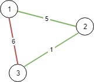
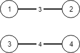

### 1. Description

There are `n` cities labeled from `1` to `n`. You are given the integer `n` and an array `connections` where $\text{connections}[i] = [x_{i}, y_{i}, \text{cost}_{i}]$ indicates that the cost of connecting city $x_{i}$ and city $y_{i}$ (bidirectional connection) is $\text{cost}_{i}$.

Return *the minimum **cost** to connect all the *`n`* cities such that there is at least one path between each pair of cities*. If it is impossible to connect all the `n` cities, return `-1`,

The **cost** is the sum of the connections' costs used.

### 2. Function Contract

**Inputs**

- `n`: the number of cities, labeled with the consecutive integers from `1` through `n`.
- `connections`: the available weighted, bidirectional connections. Each entry is $[x_{i}, y_{i}, \text{cost}_{i}]$, identifying two distinct endpoint cities and the cost of selecting that connection.

Let $m = \lvert\texttt{connections}\rvert$.

The input can include redundant connections, including more than one entry with the same two endpoints; each entry remains an independently available connection.

**Return value**

- The least possible sum of selected costs that leaves a path between every pair of cities, or `-1` when no such selection exists.

### 3. Examples

#### Example 1

- **Input:** $n = 3, connections = [[1,2,5],[1,3,6],[2,3,1]]$
- **Output:** `6`
- **Explanation:** Choosing any 2 edges will connect all cities so we choose the minimum 2.

#### Example 2

- **Input:** $n = 4, connections = [[1,2,3],[3,4,4]]$
- **Output:** `-1`
- **Explanation:** There is no way to connect all cities even if all edges are used.

### 4. Constraints

- $1 \le n \le 10^{4}$

- $1 \le \text{connections.length} \le 10^{4}$

- $\text{connections}[i].length = 3$

- $1 \le x_{i}, y_{i} \le n$

- $x_{i} \neq y_{i}$

- $0 \le \text{cost}_{i} \le 10^{5}$
