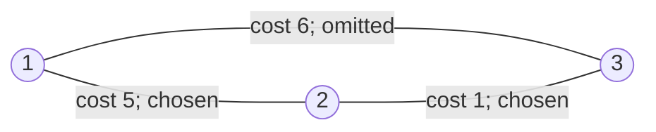
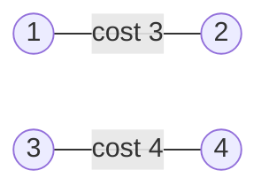

## Examples

**Example 1**

- **Input:** `n = 3, connections = [[1,2,5],[1,3,6],[2,3,1]]`
- **Output:** `6`
- **Explanation:** Any two sides of this three-city cycle connect all cities. Selecting the connections of costs `1` and `5` gives the least possible sum, $1 + 5 = 6$.

The source diagram is reproduced independently below. Edge labels record both the cost and whether the minimum selection uses that connection.

**Example 2**

- **Input:** `n = 4, connections = [[1,2,3],[3,4,4]]`
- **Output:** `-1`
- **Explanation:** Using every available connection still leaves the pair `{1, 2}` disconnected from the pair `{3, 4}`, so all four cities cannot be connected.

The source diagram is reproduced independently as the two disconnected components:

