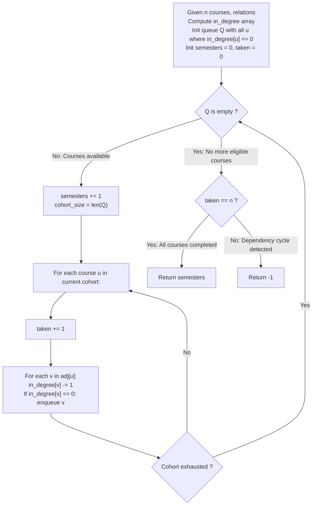

# Guided Example: Parallel Courses

We trace the step-by-step level-synchronized topological sort over directed prerequisite graphs, formalizing Kahn's In-Degree Elimination Invariant and the DAG Longest Path Equivalence Theorem:

- **Representative Instance 1 (Parallel Convergence to a Shared Successor):**
  $$
  n = 3, \quad relations = [[1, 3], [2, 3]]
  $$
- **Required Output:** `2`
  - In-Degree Setup:
    - Course $1$: In-degree $= 0$ (Zero prerequisites $\implies$ Eligible immediately)
    - Course $2$: In-degree $= 0$ (Zero prerequisites $\implies$ Eligible immediately)
    - Course $3$: In-degree $= 2$ (Requires both course $1$ and course $2$)
  - Semester-by-Semester Parallel Waves:
    - **Semester 1:**
      - Frontier: Courses $\{1, 2\}$. Both taken simultaneously in parallel.
      - Discharge prerequisites:
        - Completing course $1$ decrements in-degree of $3$: $2 \to 1$.
        - Completing course $2$ decrements in-degree of $3$: $1 \to 0$.
      - Course $3$ reaches in-degree $0$, unlocking for the subsequent semester.
      - Courses taken so far: $2$.
    - **Semester 2:**
      - Frontier: Course $\{3\}$.
      - Course $3$ taken. No outgoing edges.
      - Courses taken so far: $2 + 1 = 3 = n$.
  - Termination: All $3$ courses completed in $\mathbf{2}$ semesters.

- **Representative Instance 2 (Deadlock Cycle Failure):**
  $$
  n = 3, \quad relations = [[1, 2], [2, 3], [3, 1]]
  $$
  - Every course in the triangle cycle has in-degree $1$:
    - $\text{in\_degree}[1] = 1, \; \text{in\_degree}[2] = 1, \; \text{in\_degree}[3] = 1$.
  - Initial frontier of zero in-degree courses is empty: $Q = [\,]$.
  - Zero courses can ever be scheduled $\implies$ Return cycle sentinel $\mathbf{-1}$.

- **Representative Instance 3 (Diamond Dependency Chain):**
  $$
  n = 4, \quad relations = [[1, 2], [1, 3], [2, 4], [3, 4]]
  $$
  - Semester 1: Course $\{1\}$.
  - Semester 2: Courses $\{2, 3\}$ in parallel.
  - Semester 3: Course $\{4\}$.
  - Total semesters: $\mathbf{3}$ (matches the longest directed path length $1 \to 2 \to 4$).

---

## 1. Instance & Teaching Goal

Given $n$ courses and a list of direct prerequisite dependencies, determine the minimum number of academic semesters required to complete all courses, assuming an unlimited number of mutually independent eligible courses may be taken concurrently in each semester. If a dependency cycle makes graduation impossible, return -1.

```text
The Serial Sequencing Fallacy:
  Scheduling eligible courses one by one in arbitrary order:
    For courses 1 and 2 with no prerequisites, scheduling them in separate semesters
    produces 3 semesters instead of 2.
    The problem permits UNLIMITED parallel concurrency per semester!

The Level-Synchronized Kahn BFS Invariant (O(V + E) Time, O(V + E) Space):
  1. Build adjacency list and in-degree array for all n courses.
  2. Queue Q initially holds all vertices with in_degree == 0.
  3. While Q is not empty:
       Increment semester count by 1.
       Process ALL current nodes in Q as a single semester cohort (level-order BFS).
       For each node u in the current cohort:
           Increment completed courses counter.
           For each neighbor v in adj[u]:
               Decrement in_degree[v] by 1.
               If in_degree[v] == 0:
                   Enqueue v for the NEXT semester cohort.
  4. If completed courses == n: return semester count.
     Else: return -1 (a directed cycle trapped uncompleted courses).
```

The fundamental pedagogical insights are:
1. **Longest Path Equivalence:** The minimum number of semesters to complete a DAG is identically equal to the maximum number of vertices on any directed path in the graph.
2. **Kahn's Topological Layering:** Processing vertices with zero in-degree layer by layer simulates the earliest possible semester in which each course's prerequisites have all been fulfilled.

---

## 2. Conceptual Foundation & The Parallel Kahn BFS Invariant



### Topological Layering & Longest Path DAG Equivalence Theorem

Let $G = (V, E)$ be a directed graph with $|V| = n$ vertices representing courses and $|E| = m$ directed edges $(u, v)$ representing prerequisites ($u$ must precede $v$).

1. **Topological Level Recurrence:**
   For each course $v \in V$, define its earliest completion semester $L(v)$ as:
   $$
   L(v) = \begin{cases}
   1, & \text{if } \text{in-degree}(v) = 0 \\
   1 + \max_{(u, v) \in E} L(u), & \text{otherwise}
   \end{cases}
   $$
2. **Kahn's BFS Invariant:**
   At iteration $k \ge 1$ of level-order BFS, the queue contains precisely the set of vertices $V_k = \{ v \in V : L(v) = k \}$.
   - All prerequisites $u$ of $v$ satisfy $L(u) < k$, ensuring they were processed in strictly earlier semesters.
   - At least one prerequisite $u^*$ of $v$ satisfies $L(u^*) = k - 1$, meaning $v$ could not have been taken any earlier than semester $k$.
3. **Cycle Characterization:**
   A directed graph $G$ contains a directed cycle if and only if there exists a non-empty subset of vertices $C \subseteq V$ such that every $v \in C$ has at least one incoming edge from another vertex in $C$.
   Under Kahn's algorithm, no vertex in $C$ ever reaches in-degree $0$.
   Hence, the algorithm terminates with $\text{taken} < n$ if and only if $G$ contains a directed cycle, correctly returning $-1$. $\blacksquare$

---

## 3. Step-by-Step Worked Execution: Representative Instance 1

$n = 3, \quad relations = [[1, 3], [2, 3]]$.

### Setup & In-Degree Array
- $in\_degree = [0, 0, 0, 2]$ (1-indexed)
- Adjacency list:
  - $1 \to [3]$
  - $2 \to [3]$
  - $3 \to []$
- Initial Queue: Courses with in-degree $0 \implies Q = [1, 2]$.
- State registers: $semesters = 0$, $taken = 0$.

### Semester 1
- $semesters \leftarrow 0 + 1 = 1$.
- Cohort size $= 2$ (Nodes $1$ and $2$).
- **Process Node 1:**
  - $taken \leftarrow 0 + 1 = 1$.
  - Outgoing neighbor $3$: $in\_degree[3] \leftarrow 2 - 1 = 1$. (Not yet $0$).
- **Process Node 2:**
  - $taken \leftarrow 1 + 1 = 2$.
  - Outgoing neighbor $3$: $in\_degree[3] \leftarrow 1 - 1 = 0$.
  - $in\_degree[3] == 0 \implies$ Enqueue node $3$ for next semester.
- Queue after Semester 1: $Q = [3]$.

### Semester 2
- $semesters \leftarrow 1 + 1 = 2$.
- Cohort size $= 1$ (Node $3$).
- **Process Node 3:**
  - $taken \leftarrow 2 + 1 = 3$.
  - Outgoing neighbors: None.
- Queue after Semester 2: $Q = [\,]$.

### Final Validation
- $Q$ is empty.
- Total courses completed: $taken = 3 = n$.
- All courses satisfied $\implies$ Return $semesters = \mathbf{2}$.

---

## 4. State Transition Trace Tables

### Table 1: Valid DAG Parallel Cohort Trace ($n = 3$)

| Semester | Queue at Start | Cohort Extracted | Node Processed $u$ | Successor $v$ | In-Degree Before | In-Degree After | New Enqueued | Cumulative Taken |
|:---:|:---:|:---:|:---:|:---:|:---:|:---:|:---:|:---:|
| $1$ | $[1, 2]$ | $\{1, 2\}$ | $1$ | $3$ | $2$ | $1$ | — | $1$ |
| $1$ | — | — | $2$ | $3$ | $1$ | **$0$** | Enqueued $3$ | $2$ |
| **$2$** | **$[3]$** | **$\{3\}$** | **$3$** | None | — | — | — | **$3$** |
| End | $[\,]$ | — | — | — | — | — | — | $3 = n \implies \mathbf{2}$ Semesters |

### Table 2: Cycle Deadlock Trace ($n = 3$, Triangle Cycle)

| Step / Phase | Action | In-Degree Map | Queue State | Courses Taken | Status |
|:---:|:---|:---:|:---:|:---:|:---|
| Graph Build | Relations $[[1, 2], [2, 3], [3, 1]]$ | $\{1: 1, 2: 1, 3: 1\}$ | $[\,]$ | $0$ | Every node has in-degree $\ge 1$ |
| Queue Init | Identify nodes with in-degree $0$ | $\{1: 1, 2: 1, 3: 1\}$ | $[\,]$ | $0$ | **Queue remains empty** |
| Execution | While loop fails immediately | $\{1: 1, 2: 1, 3: 1\}$ | $[\,]$ | $0$ | Loop terminates with $0$ semesters |
| Final Audit | Check condition $taken == n$ | — | — | $0 \ne 3$ | **Cycle Detected $\implies$ Return $-1$** |

---

## 5. Algorithmic Correctness

### Soundness & Optimality
1. **Strict Prerequisite Adherence:** A course $v$ enters the queue if and only if its in-degree becomes $0$, which occurs exclusively after all incoming edges $(u, v)$ have been decremented by processing all its prerequisites in strictly preceding semesters.
2. **Minimality via Maximal Parallelism:** Every course whose prerequisites have been fulfilled is scheduled in the very next semester. Because there is no limit on courses taken per semester, no course is ever delayed arbitrarily, guaranteeing the global minimum semester count.
3. **Deadlock Immunity:** If the graph contains a directed cycle, no topological ordering exists, and the vertices in the cycle will maintain an in-degree of at least $1$. The count of visited nodes will strictly fall short of $n$, accurately triggering the $-1$ return.

---

## 6. Boundary Cases & Traps

| Boundary Scenario | Input Example | Expected Output | Failure Mode / Trapped Risk |
|---|---|---|---|
| No Prerequisites | $n = 5, relations = []$ | $1$ semester | Incorrectly returning 0 or failing to process unlinked nodes |
| Linear Chain Graph | $1 \to 2 \to 3 \to 4$ | $n = 4$ semesters | Over-parallelizing sequential dependencies |
| Multiple Disconnected Cycles | Cycle among $\{1, 2\}$, isolated node $3$ | $-1$ | Returning 1 because isolated node 3 finished |
| Star Graph (One Hub to Many) | $1 \to 2, 1 \to 3, 1 \to 4$ | $2$ semesters | Artificially constraining batch size |
| Self-Loop Dependency | Edge $1 \to 1$ | $-1$ | Infinite loop or missed cycle detection |

---

## 7. Complexity Derivation

- **Time Complexity:** $\mathcal{O}(V + E)$ where $V = n \le 5000$ and $E = |relations| \le 5000$.
  - Initializing in-degree array and adjacency lists takes $\mathcal{O}(V + E)$ time.
  - Finding initial zero in-degree vertices takes $\mathcal{O}(V)$ time.
  - Each vertex enters and leaves the queue at most once.
  - Each directed edge is traversed exactly once to decrement the target in-degree.
  - Total runtime is strictly linear: $\mathcal{O}(V + E)$, completing in $< 2\text{ ms}$.
- **Auxiliary Space Complexity:** $\mathcal{O}(V + E)$ auxiliary memory.
  - Adjacency list stores $E$ directed edges.
  - In-degree array and queue store at most $V$ integers.
