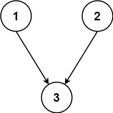
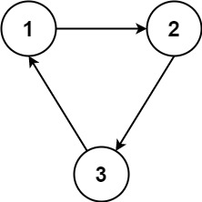

### 1. Description

You are given an integer `n`, which indicates that there are `n` courses labeled from `1` to `n`. You are also given an array `relations` where $\text{relations}[i] = [\text{prevCourse}_{i}, \text{nextCourse}_{i}]$, representing a prerequisite relationship between course $\text{prevCourse}_{i}$ and course $\text{nextCourse}_{i}$: course $\text{prevCourse}_{i}$ has to be taken before course $\text{nextCourse}_{i}$.

In one semester, you can take **any number** of courses as long as you have taken all the prerequisites in the **previous** semester for the courses you are taking.

Return *the **minimum** number of semesters needed to take all courses*. If there is no way to take all the courses, return `-1`.

### 2. Function Contract

**Inputs**

- `n`: the number of courses, labeled with the consecutive integers from `1` through `n`.
- `relations`: the directed prerequisite relationships. Each unique entry $[\text{prevCourse}_{i}, \text{nextCourse}_{i}]$ requires $\text{prevCourse}_{i}$ to be completed before $\text{nextCourse}_{i}$ may be taken.

Let $r = \lvert\texttt{relations}\rvert$.

There is no limit on how many currently eligible courses can be taken together. A course with several prerequisites becomes eligible only after all of them have been completed in earlier semesters.

**Return value**

- The least number of semesters needed to take every course, or `-1` if no valid completion schedule exists.

### 3. Examples

#### Example 1

- **Input:** $n = 3, relations = [[1,3],[2,3]]$
- **Output:** `2`
- **Explanation:** The figure above represents the given graph.
In the first semester, you can take courses 1 and 2.
In the second semester, you can take course 3.

#### Example 2

- **Input:** $n = 3, relations = [[1,2],[2,3],[3,1]]$
- **Output:** `-1`
- **Explanation:** No course can be studied because they are prerequisites of each other.

### 4. Constraints

- $1 \le n \le 5000$

- $1 \le \text{relations.length} \le 5000$

- $\text{relations}[i].length = 2$

- $1 \le \text{prevCourse}_{i}, \text{nextCourse}_{i} \le n$

- $\text{prevCourse}_{i} \neq \text{nextCourse}_{i}$

- All the pairs $[\text{prevCourse}_{i}, \text{nextCourse}_{i}]$ are **unique**.
