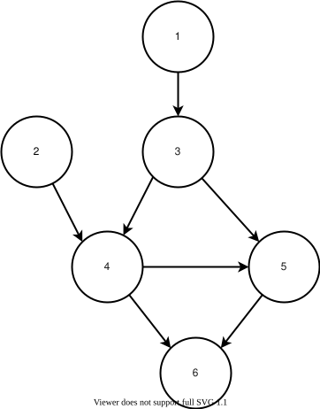
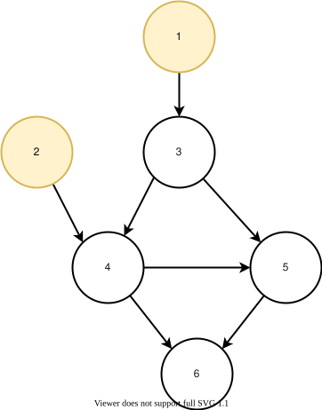
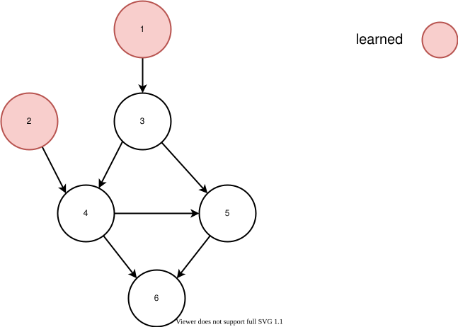
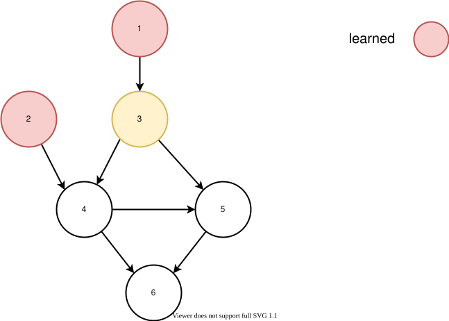
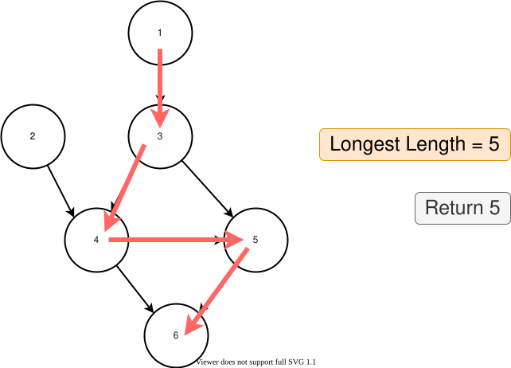
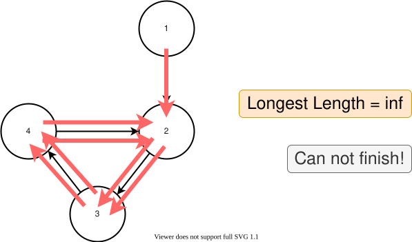

[TOC]

## Solution

---

### Overview

In this problem, we need to learn all the courses as fast as possible. The number of courses we can learn in one semester is unlimited, and the only limitation is the prerequisite relationship: we can only learn those courses whose prerequisite(s) is fulfilled.

This problem is an application of [Topological sorting](https://en.wikipedia.org/wiki/Topological_sorting), and there are mainly two different kinds of solutions: BFS (Breadth-First Search) and DFS (Depth-First Search).

In this article, three approaches are introduced:

1. _Breadth-First Search (Kahn's Algorithm)_
2. _Depth-First Search: Depth-First Search: Check for Cycles + Find Longest Path_
3. _Depth-First Search: Combine_

Generally, we recommend _Approach 1_ and _Approach 3_ since they are efficient and easy to implement. We include _Approach 2_ for a better understanding to _Approach 3_. (Therefore, it is recommended to read _Approach 2_ before _Approach 3_.)

Once you've finished this problem, you can try challenging the follow-up [1494. Parallel Courses II](https://leetcode.com/problems/parallel-courses-ii/).

<br/>

---

### Approach 1: Breadth-First Search (Kahn's Algorithm)

**Intuition**

We can treat the problem as a directed **graph** problem (the courses are nodes and the prerequisites are egdes). What we need to do is somehow iterate over all the nodes in the graph.

For iteration, we can do BFS or DFS. We introduce BFS in this approach and DFS in the following approaches.

To achieve the fastest learning speed, our strategy is:

> Learn **all courses** available in each semester.

This is intuitive. Even if we deliberately choose not to learn one available course, we still need to learn it in the following semesters. There is no harm to learn it now. Also, if we learn it later, then we have to postpone all courses whose prerequisite is that course.

Now, the first question is:

> Where to start? (Which courses are available?)

We can not start from courses with prerequisites.

> We start from nodes with **no prerequisites**.

For example, in this graph, which courses can we learn in the first semester?



Yes, those courses marked with yellow can be learned in the first semester.



Now, we have learned those courses, what should we learn next?



Yes, the new yellow courses can be learned, since their prerequisites are fulfilled:



Keep going until no available courses to learn.

By using this strategy to allocate courses to semesters, we are guaranteed to minimize the number of semesters needed. This is because in each semester, we're learning every course that isn't "locked" by a prerequisite, and so there is no possible way to be faster.

Let's finish this example with Breadth-First Search:

!?!../Documents/1136/1136_1_example1.json!?!

In some other cases, we can not learn all nodes. If the number of nodes we visited is strictly less than the number of total nodes, then there is not way to learn all the courses and we can do nothing but return `-1`.

For example, in this graph with a cycle, we can not learn all the courses:

!?!../Documents/1136/1136_1_example2.json!?!

> This approach is also called [Kahn's algorithm](https://en.wikipedia.org/wiki/Topological_sorting#Kahn's_algorithm) (with some modifications to adapt to the problem).

**Algorithm**

_Step 1:_ Build a directed graph from `relations`.

_Step 2:_ Record the in-degree of each node. (i.e., the number of edges towards the node)

_Step 3:_ Initialize a queue, `queue`. Put nodes with an in-degree of `0` into `queue`. Initialize $step = 0$, $\text{visited}_{count} = 0$.

_Step 4:_ Start BFS: Loop until `queue` is empty:

1. Initialize a queue $\text{next}_{queue}$to record the nodes needed in the next iteration.
2. Increment `step`.
3. For each `node` in `queue`:
   1. Increment `visitedCount`
   2. For each $\text{end}_{node}$ reachable from `node`:
      1. Decrement the in-degree of $\text{end}_{node}$
      2. If the in-degree of $\text{end}_{node}$ reaches 0, push it into $\text{next}_{queue}$
4. Assign `queue` to $\text{next}_{queue}$

_Step 5:_ If $\text{visited}_{count} = N$, return `step`. Otherwise, return `-1`.

**Implementation**

```python
class Solution:
    def minimumSemesters(self, N: int, relations: List[List[int]]) -> int:
        graph = {i: [] for i in range(1, N + 1)}
        in_count = {i: 0 for i in range(1, N + 1)}  # or in-degree
        for start_node, end_node in relations:
            graph[start_node].append(end_node)
            in_count[end_node] += 1

        queue = []
        # we use list here since we are not
        # poping from front the this code
        for node in graph:
            if in_count[node] == 0:
                queue.append(node)

        step = 0
        studied_count = 0
        # start learning with BFS
        while queue:
            # start new semester
            step += 1
            next_queue = []
            for node in queue:
                studied_count += 1
                end_nodes = graph[node]
                for end_node in end_nodes:
                    in_count[end_node] -= 1
                    # if all prerequisite courses learned
                    if in_count[end_node] == 0:
                        next_queue.append(end_node)
            queue = next_queue

        return step if studied_count == N else -1
```

**Complexity Analysis**

Let $E$ be the length of `relations`. $N$ is the number of courses, as explained in the problem description.

- Time Complexity: $\mathcal{O}(N+E)$. For building the graph, we spend $\mathcal{O}(N)$ to initialize the graph, and spend $\mathcal{O}(E)$ to add egdes since we iterate `relations` once. For BFS, we spend $\mathcal{O}(N+E)$ since we need to visit every node and edge once in BFS in the worst case.

- Space Complexity: $\mathcal{O}(N+E)$. For the graph, we spend $\mathcal{O}(N+E)$ since we have $\mathcal{O}(N)$ keys and $\mathcal{O}(E)$ values. For BFS, we spend $\mathcal{O}(N)$ since in the worst case, we need to add all nodes to the queue in the same time.

<br/>

---

### Approach 2: Depth-First Search: Check for Cycles + Find Longest Path

**Intuition**

There is an important insight:

> The number of semesters needed is equal to the **length of the longest path** in the graph.

For example, the longest path in the graph below is `5`, so the number of semesters needed is `5`:



Why? Treat the path as a sequence of prerequisites, and for each prerequisite, we need to spend one semester to advance to the next node.

But there is a problem: if the graph has a cycle, then the longest path would be infinite.



So firstly, we need to check if the graph has a cycle. If it does, we can directly return `-1` since we can never finish all courses.

Now we break the problem into two parts:

1. Check if the graph has a cycle
2. Calculate the length of the longest path

Each of the two parts can be done with DFS. In _Approach 3_, we will show how to achieve those two-part simultaneously in one single DFS. However, in this approach, for a better understanding, we separate them into two separate DFS traverals.

_Check If the Graph Has A Cycle_

Each node has one of the three states: unvisited, visiting, and visited.

Before the DFS, we initialize all nodes in the graph to unvisited.

When performing a DFS, we mark the current node as _visiting_ until we search all paths out of the node from the node. If we meet a node marked with processing, it must come from the upstream path and therefore, we've detected a cycle.

If DFS finishes, and all node are marked as visited, then the graph contains no cycle.

_Calculate the Length of the Longest Path_

The DFS function should return the maximum out of the recursive calls for its child nodes, plus one (the node itself).

In order to prevent redundant calculations, we need to store the calculated results. This is an example of dynamic programming, as we're storing the result of subproblems.

**Algorithm**

_Step 1:_ Build a directed graph from `relations`.

_Step 2:_ Implement a function `dfsCheckCycle` to check whether the graph has a cycle.

_Step 3:_ Implement a function `dfsMaxPath` to calculate the length of the longest path in the graph.

_Step 4:_ Call `dfsCheckCycle`, return `-1` if the graph has a cycle.

_Step 5:_ Otherwise, call `dfsMaxPath`. Return the length of the longest path in the graph.

**Implementation**

```python
class Solution:
    def minimumSemesters(self, N: int, relations: List[List[int]]) -> int:
        graph = {i: [] for i in range(1, N + 1)}
        for start_node, end_node in relations:
            graph[start_node].append(end_node)

        # check if the graph contains a cycle
        visited = {}

        def dfs_check_cycle(node: int) -> bool:
            # return True if graph has a cycle
            if node in visited:
                return visited[node]
            else:
                # mark as visiting
                visited[node] = -1
            for end_node in graph[node]:
                if dfs_check_cycle(end_node):
                    # we meet a cycle!
                    return True
            # mark as visited
            visited[node] = False
            return False

        # if has cycle, return -1
        for node in graph.keys():
            if dfs_check_cycle(node):
                return -1

        # if no cycle, return the longest path
        visited_length = {}

        def dfs_max_path(node: int) -> int:
            # return the longest path (inclusive)
            if node in visited_length:
                return visited_length[node]
            max_length = 1
            for end_node in graph[node]:
                length = dfs_max_path(end_node)
                max_length = max(length+1, max_length)
            # store it
            visited_length[node] = max_length
            return max_length

        return max(dfs_max_path(node)for node in graph.keys())
```

**Complexity Analysis**

Let $E$ be the length of `relations`.

- Time Complexity: $\mathcal{O}(N+E)$. For building the graph, we spend $\mathcal{O}(N)$ to initialize the graph, and spend $\mathcal{O}(E)$ to add egdes since we iterate `relations` once. For DFS, we spend $\mathcal{O}(N+E)$ since we need to visit every node and edge once in DFS in the worst case.

- Space Complexity: $\mathcal{O}(N+E)$. For the graph, we spend $\mathcal{O}(N+E)$ since we have $\mathcal{O}(N)$ keys and $\mathcal{O}(E)$ values. For DFS, we spend $\mathcal{O}(N)$ since in the worst case, we need to add all nodes to the stack to recursively call DFS. Also, we run DFS twice.

<br/>

---

### Approach 3: Depth-First Search: Combine

**Intuition**

> This approach is an improvement of _Approach 2_. It is recommended to ensure that you fully understood _Approach 2_ before continuing onto this final approach.

Here, we combine the two functions in _Approach 2_, `dfsCheckCycle` and `dfsMaxPath`, into one single function, `dfs`.

> The new `dfs` should return `-1` if a cycle is detected, and return the longest length otherwise.

Just simple modifications on `dfsCheckCycle` will do:

Recall in `dfsCheckCycle`, each node has three states: unvisited, visiting, and visited.

We can change the **visited** state to the **longest length** starting from the current node, and let the dfs return the longest length starting from the current node.

The pseudo-code is as below:

```python
set states of all nodes to unvisited

def dfs(node):
    if the state of node is visiting:
        # detects cycles
        return -1
    else if the state of node is visited:
        return the state of node # the longest length

    set the state of node to visiting

    max_length = 1
    for child_node in child_nodes:
        child_answer = dfs(child_node)
        # if detects cycles in child_node
        if child_answer == -1:
            return -1
        else:
            max_length = max(max_length, child_answer + 1)

    set the state of node to max_length
    return max_length
```

**Algorithm**

_Step 1:_ Build a directed graph from `relations`.

_Step 2:_ Implement a function `dfs` to check whether the graph has a cycle and calculate the length of the longest path in the graph.

_Step 3:_ Call `dfs`; return `-1` if the graph has a cycle. Otherwise, return the length of the longest path in the graph.

**Implementation**

```python
class Solution:
    def minimumSemesters(self, N: int, relations: List[List[int]]) -> int:
        graph = {i: [] for i in range(1, N + 1)}
        for start_node, end_node in relations:
            graph[start_node].append(end_node)

        visited = {}

        def dfs(node: int) -> int:
            # return the longest path (inclusive)
            if node in visited:
                return visited[node]
            else:
                # mark as visiting
                visited[node] = -1

            max_length = 1
            for end_node in graph[node]:
                length = dfs(end_node)
                # we meet a cycle!
                if length == -1:
                    return -1
                else:
                    max_length = max(length+1, max_length)
            # mark as visited
            visited[node] = max_length
            return max_length

        max_length = -1
        for node in graph.keys():
            length = dfs(node)
            # we meet a cycle!
            if length == -1:
                return -1
            else:
                max_length = max(length, max_length)
        return max_length
```

**Complexity Analysis**

Let $E$ be the length of `relations`.

- Time Complexity: $\mathcal{O}(N+E)$. For building the graph, we spend $\mathcal{O}(N)$ to initialize the graph, and spend $\mathcal{O}(E)$ to add egdes since we iterate `relations` once. For DFS, we spend $\mathcal{O}(N+E)$ since we need to visit every node and edge once in DFS in the worst case.

- Space Complexity: $\mathcal{O}(N+E)$. For the graph, we spend $\mathcal{O}(N+E)$ since we have $\mathcal{O}(N)$ keys and $\mathcal{O}(E)$ values. For DFS, we spend $\mathcal{O}(N)$ since in the worst case, we need to add all nodes to the stack to recursively call DFS.