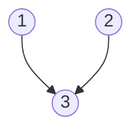
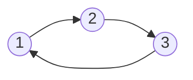

## Examples

**Example 1**

- **Input:** `n = 3, relations = [[1,3],[2,3]]`
- **Output:** `2`
- **Explanation:** Courses `1` and `2` have no prerequisites, so both can be taken in the first semester. Their shared dependent course `3` can then be taken in the second semester.

The source graph is reproduced independently below. Every arrow points from a prerequisite to its dependent course.

**Example 2**

- **Input:** `n = 3, relations = [[1,2],[2,3],[3,1]]`
- **Output:** `-1`
- **Explanation:** The three relationships form a directed cycle. Each course waits for another course in that same cycle, so none can be taken first.

The source graph is reproduced independently as the complete prerequisite cycle:

