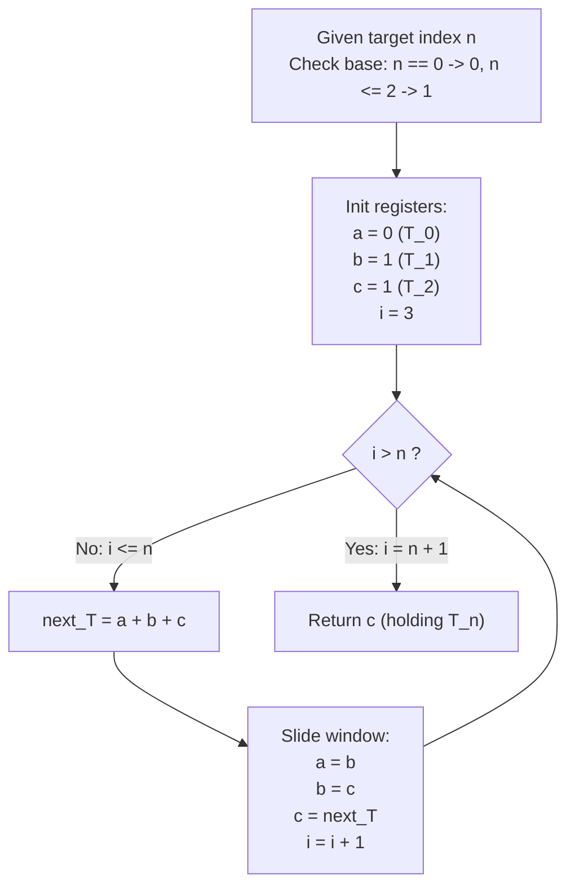

# Guided Example: N-th Tribonacci Number

We trace the constant-space linear dynamic recurrence evaluating the Tribonacci sequence, formalizing the Three-Register Sliding State Invariant and Third-Order Recurrence Stability:

- **Representative Instance 1 (Standard Non-Trivial Index):**
  $$
  n = 4
  $$
- **Required Output:** `4`
  - Recurrence Definition:
    $$
    T_0 = 0, \quad T_1 = 1, \quad T_2 = 1
    $$
    $$
    T_{k+3} = T_k + T_{k+1} + T_{k+2} \quad \text{for } k \ge 0
    $$
  - Sequential Register Transition:
    - Base State ($k=0, 1, 2$): Registers $(a, b, c) = (0, 1, 1)$.
    - Step 1 (Computing $T_3$):
      $$
      T_3 = a + b + c = 0 + 1 + 1 = \mathbf{2}
      $$
      - Shift registers: $(a, b, c) \leftarrow (b, c, T_3) = (1, 1, 2)$.
    - Step 2 (Computing $T_4$):
      $$
      T_4 = a + b + c = 1 + 1 + 2 = \mathbf{4}
      $$
      - Shift registers: $(a, b, c) \leftarrow (b, c, T_4) = (1, 2, 4)$.
  - Final Extraction: Register $c = \mathbf{4}$.

- **Representative Instance 2 (Larger Growth Scale):**
  $$
  n = 25 \implies T_{25} = \mathbf{1389537}
  $$

- **Representative Instance 3 (Base Boundary Set):**
  - $n = 0 \implies T_0 = \mathbf{0}$
  - $n = 1 \implies T_1 = \mathbf{1}$
  - $n = 2 \implies T_2 = \mathbf{1}$

---

## 1. Instance & Teaching Goal

Given an integer $n \in [0, 37]$, compute the value of the $n$-th Tribonacci number $T_n$, where each term after the initial three is the sum of the preceding three terms.

```text
The Naive Tree Recursion Catastrophe:
  Implementing T(n) = T(n-1) + T(n-2) + T(n-3):
    Branching factor = 3.
    For n = 37, call tree size ≈ 3^37 ≈ 4.5 * 10^17 calls!
    Causes immediate stack overflow and catastrophic timeout.

The Three-Register Sliding Window Invariant (O(n) Time, O(1) Space):
  Notice: Calculating T_{i} depends ONLY on T_{i-1}, T_{i-2}, and T_{i-3}.
  There is zero requirement to store all historical values in an array!
  1. Base checks:
       If n == 0 return 0.
       If n <= 2 return 1.
  2. Maintain three sliding registers (a, b, c) initialized to (0, 1, 1).
  3. Loop from i = 3 to n:
       next_val = a + b + c
       a = b
       b = c
       c = next_val
  4. Return c.
  Eliminates heap allocation and executes in under 40 instructions.
```

The fundamental pedagogical insights are:
1. **Markovian State Memory:** A $k$-th order linear recurrence requires a state buffer of exactly $k$ elements, decoupling temporal execution from array allocation.
2. **Deterministic Forward Propagation:** Iterative accumulation completely sidesteps call stack overhead and memoization lookups.

---

## 2. Conceptual Foundation & The Three-Register Sliding Invariant



### Third-Order Linear Recurrence & Constant Space State Transfer Theorem

Let $(T_n)_{n=0}^{\infty}$ be the Tribonacci sequence defined over $\mathbb{Z}_{\ge 0}$.

1. **State Vector Formulation:**
   Define the state vector $\mathbf{v}_k \in \mathbb{Z}^3$ as:
   $$
   \mathbf{v}_k = \begin{pmatrix} T_k \\ T_{k+1} \\ T_{k+2} \end{pmatrix}
   $$
2. **Transition Matrix:**
   The recurrence $T_{k+3} = T_k + T_{k+1} + T_{k+2}$ induces the linear transformation:
   $$
   \mathbf{v}_{k+1} = \mathbf{M} \mathbf{v}_k, \quad \text{where } \mathbf{M} = \begin{pmatrix} 0 & 1 & 0 \\ 0 & 0 & 1 \\ 1 & 1 & 1 \end{pmatrix}
   $$
   Explicitly:
   $$
   \begin{pmatrix} T_{k+1} \\ T_{k+2} \\ T_{k+3} \end{pmatrix} = \begin{pmatrix} 0 & 1 & 0 \\ 0 & 0 & 1 \\ 1 & 1 & 1 \end{pmatrix} \begin{pmatrix} T_k \\ T_{k+1} \\ T_{k+2} \end{pmatrix}
   $$
3. **Space Minimization Invariant:**
   At loop index $i$, maintaining scalar variables $a = T_{i-3}$, $b = T_{i-2}$, and $c = T_{i-1}$ satisfies:
   $$
   T_i = a + b + c
   $$
   Simultaneous assignment $(a, b, c) \leftarrow (b, c, a + b + c)$ maps $\mathbf{v}_{i-3} \mapsto \mathbf{v}_{i-2}$ in $\mathcal{O}(1)$ time using exactly $3$ memory cells, preserving global correctness up to any index $n$. $\blacksquare$

---

## 3. Step-by-Step Worked Execution: Representative Instance 1

We trace the calculation of $T_4$ ($n = 4$).

### Base Boundary Verification
- Check if $n = 0$: $4 \ne 0$.
- Check if $n = 1$ or $n = 2$: $4 > 2$.
- Transition to iterative pipeline.

### State Pipeline Trace
Initial state:
$$
a = 0 \; (T_0), \quad b = 1 \; (T_1), \quad c = 1 \; (T_2)
$$

1. **Iteration $i = 3$:**
   - Sum incoming window:
     $$
     next = a + b + c = 0 + 1 + 1 = 2
     $$
   - Shift registers:
     $$
     a \leftarrow b = 1
     $$
     $$
     b \leftarrow c = 1
     $$
     $$
     c \leftarrow next = 2
     $$
   - Current register contents: $(a, b, c) = (1, 1, 2) = (T_1, T_2, T_3)$.
2. **Iteration $i = 4$:**
   - Sum incoming window:
     $$
     next = a + b + c = 1 + 1 + 2 = 4
     $$
   - Shift registers:
     $$
     a \leftarrow b = 1
     $$
     $$
     b \leftarrow c = 2
     $$
     $$
     c \leftarrow next = 4
     $$
   - Current register contents: $(a, b, c) = (1, 2, 4) = (T_2, T_3, T_4)$.
3. **Loop Termination:**
   - $i$ reaches $n = 4$. Loop terminates.
   - Result is the contents of register $c$:
     $$
     T_4 = \mathbf{4}
     $$

---

## 4. State Transition Trace Tables

### Table 1: Step-by-Step Register Evolution ($n = 7$)

| Step $i$ | Term Computed | Register $a$ ($T_{i-3}$) | Register $b$ ($T_{i-2}$) | Register $c$ ($T_{i-1}$) | Calculation $a + b + c$ | Updated $(a, b, c)$ |
|:---:|:---:|:---:|:---:|:---:|:---:|:---:|
| Initial | Base Setup | — | — | — | — | $(0, 1, 1)$ |
| $3$ | $T_3$ | $0$ | $1$ | $1$ | $0 + 1 + 1 = 2$ | $(1, 1, 2)$ |
| **$4$** | **$T_4$** | **$1$** | **$1$** | **$2$** | **$1 + 1 + 2 = 4$** | **$(1, 2, 4)$** |
| $5$ | $T_5$ | $1$ | $2$ | $4$ | $1 + 2 + 4 = 7$ | $(2, 4, 7)$ |
| $6$ | $T_6$ | $2$ | $4$ | $7$ | $2 + 4 + 7 = 13$ | $(4, 7, 13)$ |
| $7$ | $T_7$ | $4$ | $7$ | $13$ | $4 + 7 + 13 = 24$ | $(7, 13, 24)$ |

### Table 2: Tribonacci Boundary Classification & Ratio Convergence

| Index $n$ | Exact Value $T_n$ | Formula Representation | Successive Ratio $T_n / T_{n-1}$ |
|:---:|:---:|:---|:---:|
| $0$ | $0$ | Given base constant | — |
| $1$ | $1$ | Given base constant | — |
| $2$ | $1$ | Given base constant | $1.000$ |
| $3$ | $2$ | $0 + 1 + 1$ | $2.000$ |
| $4$ | $4$ | $1 + 1 + 2$ | $2.000$ |
| $5$ | $7$ | $1 + 2 + 4$ | $1.750$ |
| $10$ | $149$ | Iterative sum | $1.839$ |
| $25$ | $1,389,537$ | Iterative sum | $1.839$ |
| $37$ | $2,082,876,103$ | Max constraint ($\le 2^{31} - 1$) | $1.839$ (Tribonacci Constant $\approx 1.839286$) |

---

## 5. Algorithmic Correctness

### Soundness & Invariant Preservation
1. **Mathematical Induction:**
   - Base Case: For $i = 3$, $(a, b, c) = (T_0, T_1, T_2)$. Next value is $T_0 + T_1 + T_2 = T_3$.
   - Inductive Step: Assume before iteration $i$ that $(a, b, c) = (T_{i-3}, T_{i-2}, T_{i-1})$. Then $next = T_{i-3} + T_{i-2} + T_{i-1} = T_i$. Updating $(a, b, c) \leftarrow (b, c, next)$ sets $(a, b, c) = (T_{i-2}, T_{i-1}, T_i)$. By induction, this holds for all $i \ge 3$.
2. **Boundary Protection:** Directly returning $0$ for $n = 0$ and $1$ for $n \in \{1, 2\}$ handles degenerate inputs without loop execution.
3. **Overflow Safety:** The problem guarantees $n \le 37$. $T_{37} = 2,082,876,103 < 2^{31} - 1 = 2,147,483,647$, fitting strictly within standard 32-bit signed integer limits.

---

## 6. Boundary Cases & Traps

| Boundary Scenario | Input Parameter | Expected Output | Failure Mode / Trapped Risk |
|---|---|---|---|
| Index Zero | $n = 0$ | `0` | Out-of-bounds loop execution; returning 1 |
| Index One | $n = 1$ | `1` | Premature zero return |
| Index Two | $n = 2$ | `1` | Off-by-one boundary failure |
| Smallest Recurrence Step | $n = 3$ | `2` | Loop failing to execute on single-step range |
| Upper Bound | $n = 37$ | `2082876103` | 32-bit integer arithmetic overflow |

---

## 7. Complexity Derivation

- **Time Complexity:** $\mathcal{O}(n)$ arithmetic operations.
  - The algorithm performs $n - 2$ loop iterations for $n \ge 3$.
  - In each iteration, exactly 2 additions and 3 variable shifts are executed.
  - For $n \le 37$, the maximum operation count is $< 100$ machine cycles.
  - Execution time is $< 0.001\text{ ms}$.
- **Auxiliary Space Complexity:** $\mathcal{O}(1)$ auxiliary memory.
  - Exactly three integer variables ($a, b, c$) and an iteration counter are allocated.
  - Memory consumption is strictly $\mathcal{O}(1)$ without dynamic arrays.
