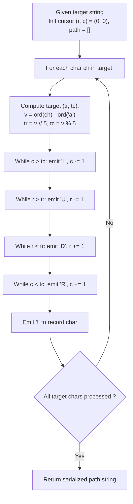

# Guided Example: Alphabet Board Path

We trace the Manhattan coordinate translation and boundary-safe directional path serialization over a non-rectangular alphabet board, establishing the Grid-Boundary Order Invariant:

- **Representative Instance 1 (Standard Interior Navigation):**
  $$
  target = \text{"leet"}
  $$
- **Required Output:** `"DDR!UURRR!!DDD!"`
  - Board Layout ($5 \times 5$ grid plus isolated bottom-left 'z'):
    $$
    \begin{array}{ccccc}
    \text{a (0,0)} & \text{b (0,1)} & \text{c (0,2)} & \text{d (0,3)} & \text{e (0,4)} \\
    \text{f (1,0)} & \text{g (1,1)} & \text{h (1,2)} & \text{i (1,3)} & \text{j (1,4)} \\
    \text{k (2,0)} & \text{l (2,1)} & \text{m (2,2)} & \text{n (2,3)} & \text{o (2,4)} \\
    \text{p (3,0)} & \text{q (3,1)} & \text{r (3,2)} & \text{s (3,3)} & \text{t (3,4)} \\
    \text{u (4,0)} & \text{v (4,1)} & \text{w (4,2)} & \text{x (4,3)} & \text{y (4,4)} \\
    \text{z (5,0)} & & & &
    \end{array}
    $$
  - Target Letter Target Coordinates:
    - Origin start: $(0, 0)$ ('a')
    - Step 1: Move to `'l'` at $(2, 1)$: $\Delta r = +2, \Delta c = +1 \implies \text{'DDR!'}$
    - Step 2: Move to `'e'` at $(0, 4)$: $\Delta r = -2, \Delta c = +3 \implies \text{'UURRR!'}$
    - Step 3: Move to `'e'` at $(0, 4)$: $\Delta r = 0, \Delta c = 0 \implies \text{'!'}$
    - Step 4: Move to `'t'` at $(3, 4)$: $\Delta r = +3, \Delta c = 0 \implies \text{'DDD!'}$
  - Concatenated Move Sequence: `"DDR!UURRR!!DDD!"`.

- **Representative Instance 2 (The Bottom-Left 'z' Boundary Hazard):**
  $$
  target = \text{"ez"}
  $$
  - Start at `'e'` $(0, 4)$. Target is `'z'` $(5, 0)$.
  - Movement Requirements: $4$ steps Left, $5$ steps Down.
  - **Hazard:** If moving Down before Left, the cursor enters $(5, 4)$, $(5, 3)$, etc., which do not exist on the board!
  - **Safe Rule:** Move Left to column $0$ first (`"LLLL"`), then move Down to row $5$ (`"DDDDD"`), then `'!'`.
  - Move string: `"LLLLDDDDD!"`.

---

## 1. Instance & Teaching Goal

Given an alphabet board arranged in six rows where rows 0 to 4 contain 5 characters each and row 5 contains only the single character `'z'` at column 0, output the shortest valid sequence of moves (`'U'`, `'D'`, `'L'`, `'R'`, `'!'`) that spells out `target` starting from `'a'` at $(0, 0)$.

```text
The Non-Convex Board Boundary Trap:
  The board is NOT a full 6x5 rectangle!
  Row 5 contains ONLY (5, 0) ['z']. Cells (5, 1) through (5, 4) DO NOT EXIST.
  1. Moving TO 'z' from column c > 0:
     If we move DOWN first, we step into non-existent cells (5, c) -> INVALID!
     We MUST move LEFT (L) to column 0 before moving DOWN (D).
  2. Moving FROM 'z' to column c > 0:
     If we move RIGHT first from (5, 0), cell (5, 1) DOES NOT EXIST -> INVALID!
     We MUST move UP (U) out of row 5 before moving RIGHT (R).

The Universal Safe Move-Order Invariant:
  For ANY transition from (r1, c1) to (r2, c2):
    1. Emit 'L' (left) while c1 > c2 (safely brings column to 0 before dropping down to 'z').
    2. Emit 'U' (up) while r1 > r2 (safely lifts cursor above row 5 before expanding right).
    3. Emit 'D' (down) while r1 < r2 (enters row 5 only after column 0 is guaranteed).
    4. Emit 'R' (right) while c1 < c2 (expands rightward safely in rows 0..4).
    5. Emit '!' (select character).
  This single canonical ordering is globally valid across all 26 x 26 transitions.
```

The fundamental pedagogical insights are:
1. **Geometric Coordinate Decoupling:** Every character index $v = \text{ord}(c) - \text{ord}(\text{'a'})$ maps uniquely to $(r, c) = (\lfloor v / 5 \rfloor, v \bmod 5)$.
2. **Topological Order Constraints:** Preserving board validity requires scheduling inward orthogonal movements (`L`, `U`) before outward boundary movements (`D`, `R`).

---

## 2. Conceptual Foundation & The Grid-Boundary Order Invariant



### Grid Coordinate Mapping & Valid Path Ordering Theorem

Let $\mathcal{B} \subset \mathbb{Z}^2$ be the alphabet board domain:
$$
\mathcal{B} = \big(\{0, 1, 2, 3, 4\} \times \{0, 1, 2, 3, 4\}\big) \cup \{(5, 0)\}
$$

1. **Bijection to Board Coordinates:**
   For any English lowercase character $c$, let $\text{idx}(c) = \text{ord}(c) - \text{ord}(\text{'a'}) \in \{0, \dots, 25\}$. The coordinate mapping $\phi(c) = (r(c), k(c))$ defined by:
   $$
   r(c) = \lfloor \text{idx}(c) / 5 \rfloor, \quad k(c) = \text{idx}(c) \bmod 5
   $$
   is a bijection from the English alphabet to $\mathcal{B}$.
2. **Manhattan Distance Minimality:**
   In any grid where transitions are unit orthogonal steps ($L_1$ metric), the shortest path length between $(r_1, c_1)$ and $(r_2, c_2)$ is $|r_1 - r_2| + |c_1 - c_2|$.
3. **Boundary Invariance of Canonical Ordering:**
   A trajectory stays strictly within $\mathcal{B}$ if and only if it never visits $(5, c)$ with $c \in \{1, 2, 3, 4\}$.
   - When transitioning into $(5, 0)$ ('z'), $c_2 = 0$. Executing `L` first decreases $c$ to $0$ while still in row $r_1 \le 4$. Subsequent `D` steps move straight down column $0$, remaining in $\mathcal{B}$.
   - When transitioning out of $(5, 0)$ ('z'), $r_1 = 5, c_1 = 0$. Executing `U` first decreases $r$ into rows $\{0, \dots, 4\}$. Subsequent `R` steps move rightward within a full $5$-element row, remaining in $\mathcal{B}$.
   - Therefore, the fixed serialization sequence `L -> U -> D -> R -> !` is unconditionally valid for every transition in $\mathcal{B} \times \mathcal{B}$. $\blacksquare$

---

## 3. Step-by-Step Worked Execution: Representative Instance 1

We trace the execution for $target = \text{"leet"}$.
Initial cursor: $(r, c) = (0, 0)$ (`'a'`).

### Character 1: `'l'`
- Index: $\text{ord}('l') - \text{ord}('a') = 11$.
- Target coordinates: $tr = 11 // 5 = 2, \; tc = 11 \bmod 5 = 1$.
- Current: $(0, 0)$. Deltas: $\Delta r = 2 - 0 = +2, \; \Delta c = 1 - 0 = +1$.
- Canonical sequence:
  - `L`: $c > tc$ is False ($0 > 1$ False).
  - `U`: $r > tr$ is False ($0 > 2$ False).
  - `D`: $r < tr \implies$ emit `'D'`, `'D'` ($r$ becomes $2$).
  - `R`: $c < tc \implies$ emit `'R'` ($c$ becomes $1$).
  - `!`: emit `'!'`.
- Sub-path: `"DDR!"`. Current cursor: $(2, 1)$.

### Character 2: `'e'`
- Index: $4 \implies tr = 0, tc = 4$.
- Current: $(2, 1)$. Deltas: $\Delta r = 0 - 2 = -2, \; \Delta c = 4 - 1 = +3$.
- Canonical sequence:
  - `L`: $1 > 4$ False.
  - `U`: $2 > 0 \implies$ emit `'U'`, `'U'` ($r$ becomes $0$).
  - `D`: $0 < 0$ False.
  - `R`: $1 < 4 \implies$ emit `'R'`, `'R'`, `'R'` ($c$ becomes $4$).
  - `!`: emit `'!'`.
- Sub-path: `"UURRR!"`. Current cursor: $(0, 4)$.

### Character 3: `'e'`
- Target: $(0, 4)$. Current: $(0, 4)$.
- Deltas: $\Delta r = 0, \Delta c = 0$.
- No movement emitted.
- `!`: emit `'!'`.
- Sub-path: `"!"`. Current cursor: $(0, 4)$.

### Character 4: `'t'`
- Index: $19 \implies tr = 19 // 5 = 3, \; tc = 19 \bmod 5 = 4$.
- Current: $(0, 4)$. Deltas: $\Delta r = 3 - 0 = +3, \; \Delta c = 4 - 4 = 0$.
- Canonical sequence:
  - `D`: $0 < 3 \implies$ emit `'D'`, `'D'`, `'D'` ($r$ becomes $3$).
  - `!`: emit `'!'`.
- Sub-path: `"DDD!"`. Current cursor: $(3, 4)$.

Concatenated result: `"DDR!UURRR!!DDD!"`.

---

## 4. State Transition Trace Tables

### Table 1: Step-by-Step Path Generation for "leet"

| Target Char | Target Coordinate $(tr, tc)$ | Start Cursor $(r, c)$ | Row Delta $\Delta r$ | Col Delta $\Delta c$ | Generated Movement Sequence | Selection Token | New Cursor $(r, c)$ |
|:---:|:---:|:---:|:---:|:---:|:---:|:---:|:---:|
| Start | — | — | — | — | — | — | $(0, 0)$ ('a') |
| `'l'` | $(2, 1)$ | $(0, 0)$ | $+2$ | $+1$ | `D`, `D`, `R` | `!` | $(2, 1)$ ('l') |
| `'e'` | $(0, 4)$ | $(2, 1)$ | $-2$ | $+3$ | `U`, `U`, `R`, `R`, `R` | `!` | $(0, 4)$ ('e') |
| `'e'` | $(0, 4)$ | $(0, 4)$ | $0$ | $0$ | (None) | `!` | $(0, 4)$ ('e') |
| `'t'` | $(3, 4)$ | $(0, 4)$ | $+3$ | $0$ | `D`, `D`, `D` | `!` | $(3, 4)$ ('t') |

### Table 2: The 'z' Boundary Transition Comparison

| Transition | Source Position | Target Position | Naive Trajectory (D first / R first) | Safe Trajectory (L first / U first) | Hazard Avoided |
|:---:|:---:|:---:|:---|:---|:---|
| `'e' \to 'z'` | $(0, 4)$ | $(5, 0)$ | `DDDDD` $\to (5, 4)$ ❌ **OUT OF BOUNDS** | `LLLLDDDDD!` ✅ | Avoids non-existent cells in row 5 |
| `'z' \to 'e'` | $(5, 0)$ | $(0, 4)$ | `RRRR` $\to (5, 4)$ ❌ **OUT OF BOUNDS** | `UUUUURRRR!` ✅ | Climbs into full row before horizontal shift |
| `'a' \to 'z'` | $(0, 0)$ | $(5, 0)$ | `DDDDD!` ✅ | `DDDDD!` ✅ | Already at col 0, both orderings coincide |
| `'z' \to 'a'` | $(5, 0)$ | $(0, 0)$ | `UUUUU!` ✅ | `UUUUU!` ✅ | Already at col 0, both orderings coincide |

---

## 5. Algorithmic Correctness

### Soundness & Optimality
1. **L1 Shortest Path Minimality:** The number of directional moves for each letter is exactly $|tr - r| + |tc - c|$, which is the theoretical minimum number of steps between two grid points.
2. **Total In-Bounds Invariant:** By strictly ordering horizontal moves `L` before vertical moves `D`, the column index reaches $0$ before row $5$ can be reached. By ordering vertical moves `U` before horizontal moves `R`, the row index leaves row $5$ before any column greater than $0$ can be reached.
3. **Exact Serialization:** Appending `'!'` precisely when the cursor reaches the target character guarantees that the desired output string is reproduced verbatim.

---

## 6. Boundary Cases & Traps

| Boundary Scenario | Target Input | Expected Behavior | Trap / Bug Avoided |
|---|---|---|---|
| Consecutive Identical Letters | `target = "aa"` | Output is `"!!"` | Emitting redundant motion on 0 distance |
| Direct Hit on 'z' from Top Right | `target = "z"` | Path `"DDDDD!"` | Navigating into invalid row 5 cells |
| Escape from 'z' | `target = "zbz"` | Up before Right on transition `z -> b` | Horizontal movement on row 5 |
| Single Character Starting at 'a' | `target = "a"` | Output is `"!"` | Cursor moving when already positioned |
| All 26 Letters in Sequence | Alphabet in order | Clean step-by-step raster walk | Cumulative coordinate drift |

---

## 7. Complexity Derivation

- **Time Complexity:** $\mathcal{O}(L)$ where $L = |target| \le 100$.
  - For each character in `target`, computing row and column coordinates takes $\mathcal{O}(1)$ time.
  - The maximum Manhattan distance between any two characters on the $6 \times 5$ board is $(5 - 0) + (4 - 0) = 9$ steps.
  - Each character contributes at most $9$ movement characters plus $1$ exclamation mark $\le 10$ characters to the output string.
  - Total moves generated across $L$ characters: $\le 10 \times 100 = 1000$ characters.
  - Execution time is $< 0.1\text{ ms}$.
- **Auxiliary Space Complexity:** $\mathcal{O}(L)$ auxiliary memory to store the resulting movement character list.
