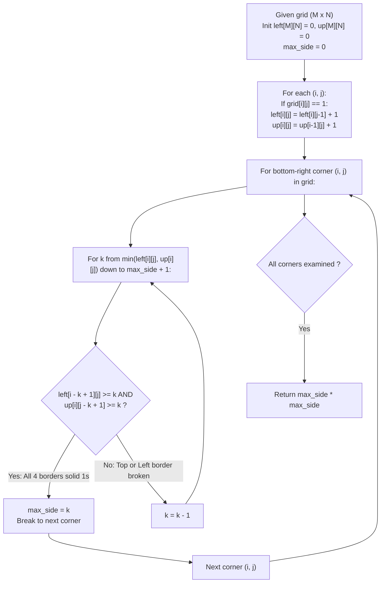

# Guided Example: Largest 1-Bordered Square

We trace the two-dimensional prefix run-length accumulation and constant-time perimeter validation for identifying the largest hollow or filled square with solid unit boundaries, establishing the Dual Run-Length Border Invariant:

- **Representative Instance 1 (Hollow Center Full Perimeter Square):**
  $$
  grid = \begin{pmatrix}
  1 & 1 & 1 \\
  1 & 0 & 1 \\
  1 & 1 & 1
  \end{pmatrix}, \quad M = 3, \; N = 3
  $$
- **Required Output:** `9`
  - Notice: Cell $(1, 1)$ contains $0$. However, the outer $3 \times 3$ boundary consists entirely of $1$s:
    - Top edge: $(0, 0), (0, 1), (0, 2) \implies [1, 1, 1]$
    - Bottom edge: $(2, 0), (2, 1), (2, 2) \implies [1, 1, 1]$
    - Left edge: $(0, 0), (1, 0), (2, 0) \implies [1, 1, 1]$
    - Right edge: $(0, 2), (1, 2), (2, 2) \implies [1, 1, 1]$
  - Side length $k = 3 \implies \text{Area} = 3^2 = \mathbf{9}$.

- **Representative Instance 2 (Thin Degenerate Strip):**
  $$
  grid = \begin{pmatrix} 1 & 1 & 0 & 0 \end{pmatrix}, \quad M = 1, \; N = 4
  $$
  - Maximum height is $1 \implies$ No square of side $k \ge 2$ can fit.
  - A single $1$ forms a $1 \times 1$ square. Area $= 1^2 = \mathbf{1}$.

- **Representative Instance 3 (All Zero Void):**
  $$
  grid = \begin{pmatrix} 0 & 0 \\ 0 & 0 \end{pmatrix} \implies \text{No 1 exists} \implies \mathbf{0}
  $$

---

## 1. Instance & Teaching Goal

Given a 2D binary grid of $0$s and $1$s, find the total number of cells in the largest square subgrid whose perimeter (all four outer boundaries) consists entirely of $1$s.

```text
The Naive Perimeter Traversal Trap:
  For every top-left corner (r, c) and every side k:
    Iterate around the 4 borders: 4 * (k - 1) cells checked individually.
    Complexity = O(M * N * min(M, N)^2).
    For M, N = 100, this requires ~10^8 nested cell reads, risking TLE.

The Dual Run-Length Border Invariant (O(M * N * min(M, N)) Time):
  Precompute consecutive 1-runs ending at each cell (i, j):
    1. left[i][j] = consecutive 1s extending leftwards from (i, j).
    2. up[i][j]   = consecutive 1s extending upwards from (i, j).
  Any cell (i, j) can serve as the bottom-right corner of a square of side k:
    - Bottom border is valid iff left[i][j] >= k.
    - Right border is valid iff up[i][j] >= k.
    - Top border is valid iff left[i - k + 1][j] >= k.
    - Left border is valid iff up[i][j - k + 1] >= k.
  Validates all four borders in O(1) time using 4 array lookups!
```

The fundamental pedagogical insights are:
1. **Geometric Boundary Decomposition:** A 2D square boundary of side $k$ is fully determined by four 1D segments of length $k$.
2. **Consecutive Run-Length Memoization:** Precomputing horizontal and vertical contiguous runs enables $\mathcal{O}(1)$ segment existence verification.

---

## 2. Conceptual Foundation & The Dual Run-Length Invariant



### Four-Boundary Consecutive Prefix Theorem

Let $\mathcal{M} \in \{0, 1\}^{M \times N}$ denote the input matrix.

1. **Run-Length Recurrence:**
   Define the prefix run-length arrays $L, U \in \mathbb{Z}_{\ge 0}^{M \times N}$ by:
   $$
   L[i][j] = \begin{cases}
   L[i][j-1] + 1, & \text{if } \mathcal{M}[i][j] = 1 \\
   0, & \text{if } \mathcal{M}[i][j] = 0
   \end{cases}
   $$
   $$
   U[i][j] = \begin{cases}
   U[i-1][j] + 1, & \text{if } \mathcal{M}[i][j] = 1 \\
   0, & \text{if } \mathcal{M}[i][j] = 0
   \end{cases}
   $$
   with boundary conditions $L[i][-1] = 0$ and $U[-1][j] = 0$.
2. **Perimeter Solid-Unit Characterization:**
   A candidate square of side length $k \ge 1$ with bottom-right corner at $(i, j)$ and top-left corner at $(i - k + 1, j - k + 1)$ has all perimeter elements equal to $1$ if and only if:
   $$
   \begin{cases}
   L[i][j] \ge k & (\text{Bottom edge: } \mathcal{M}[i][j - k + 1 \dots j] = 1) \\
   U[i][j] \ge k & (\text{Right edge: } \mathcal{M}[i - k + 1 \dots i][j] = 1) \\
   L[i - k + 1][j] \ge k & (\text{Top edge: } \mathcal{M}[i - k + 1][j - k + 1 \dots j] = 1) \\
   U[i][j - k + 1] \ge k & (\text{Left edge: } \mathcal{M}[i - k + 1 \dots i][j - k + 1] = 1)
   \end{cases}
   $$
3. **Decidability in $\mathcal{O}(1)$:**
   Testing the conjunction of these four scalar inequalities completely verifies the boundary in $\mathcal{O}(1)$ operations without inspecting intermediate perimeter elements. $\blacksquare$

---

## 3. Step-by-Step Worked Execution: Representative Instance 1

$$
grid = \begin{pmatrix} 1 & 1 & 1 \\ 1 & 0 & 1 \\ 1 & 1 & 1 \end{pmatrix}
$$

### Step 1: Precompute Run-Length Tables
- **Table `left[i][j]` (consecutive 1s to the left):**
  $$
  left = \begin{pmatrix}
  1 & 2 & 3 \\
  1 & 0 & 1 \\
  1 & 2 & 3
  \end{pmatrix}
  $$
- **Table `up[i][j]` (consecutive 1s upwards):**
  $$
  up = \begin{pmatrix}
  1 & 1 & 1 \\
  2 & 0 & 2 \\
  3 & 1 & 3
  \end{pmatrix}
  $$

### Step 2: Test Potential Bottom-Right Corners $(i, j)$
- At corner $(2, 2)$:
  - $left[2][2] = 3, \; up[2][2] = 3$.
  - Upper bound candidate side: $k \le \min(3, 3) = 3$.
  - Test $k = 3$:
    - Top edge: check cell $(2 - 3 + 1, 2) = (0, 2) \implies left[0][2] = 3 \ge 3$ (**Pass**).
    - Left edge: check cell $(2, 2 - 3 + 1) = (2, 0) \implies up[2][0] = 3 \ge 3$ (**Pass**).
    - All 4 conditions satisfied!
    - Side length $3$ is confirmed.
    - Area $= 3 \times 3 = \mathbf{9}$.
- Since $3 = \min(M, N)$, no strictly larger square can possibly exist.
- Early exit; return $\mathbf{9}$.

---

## 4. State Transition Trace Tables

### Table 1: Dual Run-Length Matrix Compilation

| Cell $(i, j)$ | Value $\mathcal{M}[i][j]$ | $left[i][j] = \text{run left}$ | $up[i][j] = \text{run up}$ | Maximum Feasible Local Side $\min(left, up)$ |
|:---:|:---:|:---:|:---:|:---:|
| $(0, 0)$ | $1$ | $1$ | $1$ | $1$ |
| $(0, 1)$ | $1$ | $2$ | $1$ | $1$ |
| $(0, 2)$ | $1$ | $3$ | $1$ | $1$ |
| $(1, 0)$ | $1$ | $1$ | $2$ | $1$ |
| $(1, 1)$ | $0$ | $0$ | $0$ | $0$ (Cannot be corner) |
| $(1, 2)$ | $1$ | $1$ | $2$ | $1$ |
| $(2, 0)$ | $1$ | $1$ | $3$ | $1$ |
| $(2, 1)$ | $1$ | $2$ | $1$ | $1$ |
| **$(2, 2)$** | **$1$** | **$3$** | **$3$** | **$3$ (Optimal Candidate)** |

### Table 2: Corner-by-Corner Candidate Square Verification

| Bottom-Right Corner $(i, j)$ | Candidate Side $k$ | Top Edge Cell Check $left[i - k + 1][j] \ge k$ | Left Edge Cell Check $up[i][j - k + 1] \ge k$ | Outcome / Action | Running `max_side` |
|:---:|:---:|:---:|:---:|:---:|:---:|
| $(0, 0)$ | $1$ | $left[0][0] = 1 \ge 1$ | $up[0][0] = 1 \ge 1$ | Valid $1 \times 1$ square | $1$ |
| $(0, 1)$ | $1$ | $left[0][1] = 2 \ge 1$ | $up[0][1] = 1 \ge 1$ | Valid $1 \times 1$ square | $1$ |
| $(1, 2)$ | $1$ | $left[1][2] = 1 \ge 1$ | $up[1][2] = 2 \ge 1$ | Valid $1 \times 1$ square | $1$ |
| **$(2, 2)$** | **$3$** | **$left[0][2] = 3 \ge 3$** | **$up[2][0] = 3 \ge 3$** | **Valid $3 \times 3$ square!** | **$3$ (Global Max)** |

---

## 5. Algorithmic Correctness

### Soundness & Completeness
1. **Exhaustive Corner Coverage:** Every possible square subgrid has a unique bottom-right corner $(i, j)$ and side length $k$. Testing all $(i, j)$ guarantees that the optimal square is evaluated.
2. **Exact Boundary Equivalence:** Because $left[r][c]$ is the exact count of consecutive $1$s ending at $(r, c)$ in row $r$, $left[r][c] \ge k$ is true if and only if all $k$ cells from $(r, c - k + 1)$ to $(r, c)$ are $1$. The four-point check is mathematically equivalent to inspecting all $4(k - 1)$ perimeter cells.
3. **Monotonic Pruning:** Searching $k$ downwards from $\min(left[i][j], up[i][j])$ down to $max\_side + 1$ allows immediate break upon finding a valid $k$, avoiding redundant checks on smaller side lengths.

---

## 6. Boundary Cases & Traps

| Boundary Scenario | Input Grid | Expected Output | Failure Mode / Trapped Risk |
|---|---|---|---|
| All Zeros | `[[0, 0], [0, 0]]` | `0` | Returning 1 instead of 0 for empty grids |
| Single Cell 1 | `[[1]]` | `1` | Off-by-one index underflow on $1 \times 1$ |
| Single Cell 0 | `[[0]]` | `0` | Returning non-zero area |
| Hollow $4 \times 4$ with 0s inside | Boundary 1s, interior 0s | `16` | Mistaking hollow square for invalid |
| Horizontal Strip ($1 \times N$) | `[[1, 1, 1, 1]]` | `1` | Attempting vertical expansion beyond height |

---

## 7. Complexity Derivation

- **Time Complexity:** $\mathcal{O}(M \cdot N \cdot \min(M, N))$ where $M, N \le 100$.
  - Precomputing `left` and `up` requires visiting each of the $M \times N$ cells once: $\mathcal{O}(M \cdot N)$ operations.
  - For each cell $(i, j)$, $k$ takes at most $\min(M, N)$ values.
  - In each step, the four boundary checks take $\mathcal{O}(1)$ array lookups.
  - Total operations: $\le 100 \times 100 \times 100 = 10^6$ operations.
  - Execution time is $< 10\text{ ms}$.
- **Auxiliary Space Complexity:** $\mathcal{O}(M \cdot N)$ auxiliary memory.
  - Two 2D arrays of size $M \times N$ store the prefix run-lengths `left` and `up`.
