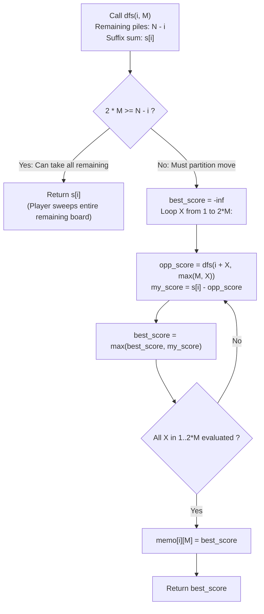

# Guided Example: Stone Game II

We trace the game-theoretic backward induction and minimax dynamic programming over suffix stone sums, establishing the Minimax Suffix Complement Invariant:

- **Representative Instance 1 (Adversarial Trapping with Non-Trivial Fork):**
  $$
  piles = [2, 7, 9, 4, 4], \quad N = 5
  $$
- **Required Output:** `10`
  - Total Stones in Play:
    $$
    S_{\text{total}} = 2 + 7 + 9 + 4 + 4 = 26
    $$
  - Suffix Sum Array $s[i] = \sum_{j=i}^{N-1} piles[j]$:
    - $s[0] = 26, \; s[1] = 24, \; s[2] = 17, \; s[3] = 8, \; s[4] = 4, \; s[5] = 0$
  - Alice's Strategic Choice at $(i = 0, M = 1)$:
    - Option A: Alice takes $X = 1$ pile ($piles[0] = 2$):
      - Bob faces state $(i = 1, M' = \max(1, 1) = 1)$ on remaining sum $s[1] = 24$.
      - Bob can choose $X \in \{1, 2\}$:
        - If Bob takes $X = 1$: Alice faces $(2, 1)$ on $s[2] = 17$.
        - If Bob takes $X = 2$ (takes $7 + 9 = 16$ stones):
          - Alice faces $(i = 3, M' = \max(1, 2) = 2)$ on remaining piles $[4, 4]$ ($s[3] = 8$).
          - In state $(3, 2)$, $2M = 4 \ge 2$ remaining piles! Alice sweeps all remaining $8$ stones.
          - Bob gets $16$ stones; Alice gets $2 + 8 = 10$ stones.
      - Bob's optimal yield from state $(1, 1)$ is $16$ stones.
      - Alice's yield from Option A: $s[0] - dp(1, 1) = 26 - 16 = \mathbf{10}$.
    - Option B: Alice takes $X = 2$ piles ($piles[0..1] = 2 + 7 = 9$):
      - Bob faces state $(i = 2, M' = \max(1, 2) = 2)$ on remaining sum $s[2] = 17$ (piles $[9, 4, 4]$).
      - Since $2M = 4 \ge 3$ remaining piles, Bob sweeps ALL remaining piles immediately!
      - Bob obtains all $17$ remaining stones.
      - Alice's yield from Option B: $s[0] - s[2] = 26 - 17 = \mathbf{9}$.
  - Alice's Optimal Decision: $\max(10, 9) = \mathbf{10}$ (Choosing $X = 1$).

- **Representative Instance 2 (Exponential Asymmetry with High Value Anchor):**
  $$
  piles = [1, 2, 3, 4, 5, 100], \quad N = 6 \implies \mathbf{104}
  $$
  - Alice's strategy controls the rate of $M$ growth so Bob cannot sweep pile $100$.
  - Alice secures $1 + 3 + 100 = 104$ stones.

---

## 1. Instance & Teaching Goal

Given a sequence of stone piles, Alice and Bob take turns taking the first $X$ remaining piles where $1 \le X \le 2M$, updating $M \leftarrow \max(M, X)$ after each move. Assuming both players play with perfect foresight to maximize their own stone total, return the maximum number of stones Alice can collect.

```text
The Greedy Myopic Move Trap:
  At (i = 0, M = 1), Alice compares immediate takes:
    Taking X = 2 gives 2 + 7 = 9 stones immediately.
    Taking X = 1 gives only 2 stones immediately.
    A greedy player takes X = 2 to maximize immediate gain.
  Catastrophic Blunder: Taking X = 2 sets M = 2, giving Bob 2M = 4 choices.
  Bob immediately takes all 3 remaining piles [9, 4, 4] = 17 stones!
  Alice ends with 9 stones instead of the optimal 10 stones.

The Minimax Suffix Complement Invariant (O(N^3) Time, O(N^2) Space):
  In a finite zero-sum game of perfect information:
    Total stones remaining from index i is suffix_sum[i].
    If the current player takes X piles, the opponent faces state (i + X, max(M, X)).
    Under optimal play, the opponent will secure dp(i + X, max(M, X)) stones.
    Therefore, the current player MUST receive exactly:
      suffix_sum[i] - dp(i + X, max(M, X))
  The current player simply maximizes this difference over all 1 <= X <= 2M:
    dp(i, M) = max_{1 <= X <= 2M} { suffix_sum[i] - dp(i + X, max(M, X)) }
  Base Case: If 2M >= N - i, the player sweeps all remaining piles: dp(i, M) = suffix_sum[i].
```

The fundamental pedagogical insights are:
1. **Zero-Sum Duality:** Maximizing one's own score in a fixed-sum game is mathematically identical to minimizing the opponent's score.
2. **Suffix Complement Principle:** Framing recursive returns as the remaining suffix sum minus the opponent's optimal future score decouples player identities into a single symmetric evaluation function.

---

## 2. Conceptual Foundation & The Minimax Suffix Complement Invariant



### Zero-Sum Suffix Complement & Minimax DP Theorem

Let $A = [p_0, p_1, \dots, p_{N-1}]$ denote the pile values, and let $s[i] = \sum_{j=i}^{N-1} p_j$ be the suffix sum from index $i$.

1. **State Space Definition:**
   A game state is uniquely characterized by the tuple $(i, M) \in \{0, \dots, N\} \times \{1, \dots, N\}$, representing the first untaken pile index $i$ and the current move limit factor $M$.
2. **Terminal Sweep Condition:**
   If $2M \ge N - i$, the current player can legally choose $X = N - i$. Because all pile values are strictly positive ($p_j \ge 1$), taking all remaining piles strictly dominates leaving any positive stones to the opponent:
   $$
   dp(i, M) = s[i] \quad \text{when } 2M \ge N - i
   $$
3. **Minimax Complement Recurrence:**
   When $2M < N - i$, the player chooses $X \in \{1, \dots, 2M\}$. By the principle of backward induction (subgame perfection), the remaining stones $s[i]$ are partitioned between the current player and the opponent:
   $$
   \text{Player Yield}(X) = s[i] - dp(i + X, \; \max(M, X))
   $$
   The player selects $X$ to maximize this yield:
   $$
   dp(i, M) = \max_{1 \le X \le 2M} \Big( s[i] - dp(i + X, \; \max(M, X)) \Big)
   $$
4. **Finite Acyclic Convergence:**
   Because $X \ge 1$, the index $i$ increases strictly monotonically with each step ($i + X > i$). The state graph is a Directed Acyclic Graph (DAG), guaranteeing termination in at most $N$ recursive steps. $\blacksquare$

---

## 3. Step-by-Step Worked Execution: Representative Instance 1

$piles = [2, 7, 9, 4, 4], \quad N = 5$.
Suffix sums: $s = [26, 24, 17, 8, 4, 0]$.

### Top-Level Call: $dp(0, 1)$
$2M = 2 < 5 - 0 = 5 \implies$ Sweep condition fails.
Test choices for $X \in \{1, 2\}$:

#### Choice 1: $X = 1$
Opponent faces $dp(0 + 1, \max(1, 1)) = dp(1, 1)$.
- Inside $dp(1, 1)$ ($i = 1, M = 1$, remaining $= 4$, $s[1] = 24$):
  - $2M = 2 < 4 \implies$ Sweep condition fails.
  - Test $X' \in \{1, 2\}$:
    - If $X' = 1$: Next state $dp(2, \max(1, 1)) = dp(2, 1)$.
      - Inside $dp(2, 1)$ ($i = 2, M = 1$, remaining $= 3$, $s[2] = 17$):
        - $2M = 2 < 3$. Choices $X'' \in \{1, 2\}$:
          - $X'' = 1 \implies s[2] - dp(3, 1) = 17 - 8 = 9$ (since $dp(3, 1)$ has $2M=2 \ge 2$, sweeps $8$).
          - $X'' = 2 \implies s[2] - dp(4, 2) = 17 - 4 = 13$ (since $dp(4, 2)$ sweeps $4$).
          - $\max(9, 13) = 13 \implies dp(2, 1) = 13$.
      - Yield for $X' = 1$: $s[1] - dp(2, 1) = 24 - 13 = 11$.
    - If $X' = 2$: Next state $dp(1 + 2, \max(1, 2)) = dp(3, 2)$.
      - Inside $dp(3, 2)$ ($i = 3, M = 2$, remaining $= 2$):
      - $2M = 4 \ge 2 \implies$ Base sweep! Returns $s[3] = 8$.
      - Yield for $X' = 2$: $s[1] - dp(3, 2) = 24 - 8 = 16$.
  - Best score for $dp(1, 1)$: $\max(11, 16) = \mathbf{16}$ (achieved at $X' = 2$).
- Yield for Alice at $X = 1$: $s[0] - dp(1, 1) = 26 - 16 = \mathbf{10}$.

#### Choice 2: $X = 2$
Opponent faces $dp(0 + 2, \max(1, 2)) = dp(2, 2)$.
- Inside $dp(2, 2)$ ($i = 2, M = 2$, remaining piles $= 3$):
  - $2M = 4 \ge 3 \implies$ Base sweep condition met!
  - Opponent takes all remaining stones: $dp(2, 2) = s[2] = 17$.
- Yield for Alice at $X = 2$: $s[0] - dp(2, 2) = 26 - 17 = \mathbf{9}$.

### Decision Comparison
$$
dp(0, 1) = \max(\text{Choice 1}, \text{Choice 2}) = \max(10, 9) = \mathbf{10}
$$
Alice chooses $X = 1$ and secures $10$ stones.

---

## 4. State Transition Trace Tables

### Table 1: Complete Subproblem Evaluation Table ($N = 5$)

| Subproblem State $(i, M)$ | Remaining Piles $N - i$ | Sweep Condition $2M \ge N - i$ | Suffix Sum $s[i]$ | Valid $X$ Range | Subproblem Choices Evaluated | Optimal Value $dp(i, M)$ | Best Move $X^*$ |
|:---:|:---:|:---:|:---:|:---:|:---|:---:|:---:|
| $(4, M \ge 1)$ | $1$ | True ($2M \ge 1$) | $4$ | $X = 1$ | Immediate sweep | **$4$** | $1$ |
| $(3, M \ge 1)$ | $2$ | True ($2M \ge 2$) | $8$ | $X \in \{1, 2\}$ | Immediate sweep | **$8$** | $2$ |
| $(2, 2)$ | $3$ | True ($4 \ge 3$) | $17$ | $X \in \{1, 2, 3\}$ | Immediate sweep | **$17$** | $3$ |
| $(2, 1)$ | $3$ | False ($2 < 3$) | $17$ | $X \in \{1, 2\}$ | $X=1: 17 - 8 = 9$<br>$X=2: 17 - 4 = 13$ | **$13$** | $2$ |
| $(1, 1)$ | $4$ | False ($2 < 4$) | $24$ | $X \in \{1, 2\}$ | $X=1: 24 - 13 = 11$<br>$X=2: 24 - 8 = 16$ | **$16$** | $2$ |
| **$(0, 1)$** | **$5$** | **False ($2 < 5$)** | **$26$** | **$X \in \{1, 2\}$** | **$X=1: 26 - 16 = 10$**<br>$X=2: 26 - 17 = 9$ | **$10$** | **$1$** |

### Table 2: Payoff Matrix Comparison for Root Node $(0, 1)$

| Alice Move $X$ | Piles Taken by Alice | Immediate Stones | Bob State $(i', M')$ | Bob Optimal Take | Bob Stones | Alice Final Stones ($26 - \text{Bob}$) | Alice Payoff |
|:---:|:---:|:---:|:---:|:---:|:---:|:---:|:---|
| **$X = 1$** | `[2]` | $2$ | $(1, 1)$ | Bob takes $X'=2$ ($7 + 9$) | $16$ | $26 - 16 = \mathbf{10}$ | **Optimal (+10)** |
| $X = 2$ | `[2, 7]` | $9$ | $(2, 2)$ | Bob sweeps `[9, 4, 4]` | $17$ | $26 - 17 = 9$ | Sub-optimal (+9) |

---

## 5. Algorithmic Correctness

### Soundness & Optimality
1. **Subgame Perfection:** By exploring all legal moves $X \in [1, 2M]$ and assuming the opponent responds with their globally optimal strategy, the computed values satisfy the minimax equilibrium.
2. **Dominance of Suffix Sweeps:** Whenever $2M \ge N - i$, taking all remaining piles guarantees $100\%$ of the remaining stones, leaving $0$ stones to the opponent. Because all piles are positive, no alternative move can match or exceed this yield.
3. **Memoization Safety:** The state is completely determined by $(i, M)$. Because previous move histories do not affect future payoffs, caching values indexed by $(i, M)$ avoids exponential branch recomputation while preserving exact results.

---

## 6. Boundary Cases & Traps

| Scenario | Input Example | Expected Output | Failure Mode / Trapped Risk |
|---|---|---|---|
| Single Pile ($N = 1$) | `piles = [5]` | `5` | Failing initial $2M \ge N$ sweep check |
| Two Piles ($N = 2$) | `piles = [2, 10]` | `12` | Choosing $X=1$ instead of sweeping both |
| Monotonically Increasing Piles | `[1, 2, 3, 4, 100]` | Alice strategizes around late surge | Giving opponent access to large tail piles |
| Huge Number of Piles | $N = 100$ | Handled in $\mathcal{O}(N^3)$ | Recursion depth or stack exhaustion without memoization |
| Equal Piles | `[3, 3, 3, 3]` | Exact tie-break evaluation | Off-by-one errors on $2M$ limits |

---

## 7. Complexity Derivation

- **Time Complexity:** $\mathcal{O}(N^3)$ where $N = |piles| \le 100$.
  - State variables: $0 \le i \le N$ and $1 \le M \le N$. The number of distinct reachable states $(i, M)$ is at most $N \times N \approx 10^4$ states.
  - From state $(i, M)$, the branch loop tests $X \in [1, 2M]$, iterating at most $2M \le 2N$ times.
  - Total state transitions across all states: $\sum_{i=1}^N \sum_{M=1}^N 2M \approx N \times N^2 = \mathcal{O}(N^3)$.
  - For $N = 100$, operations are bounded by $\approx \frac{100^3}{3} \approx 3.3 \times 10^5$ operations.
  - Execution time is $< 10\text{ ms}$.
- **Auxiliary Space Complexity:** $\mathcal{O}(N^2)$ auxiliary memory.
  - The 2D memoization table stores at most $N \times N$ integers.
  - Recursion call stack depth is bounded by $\mathcal{O}(N)$.