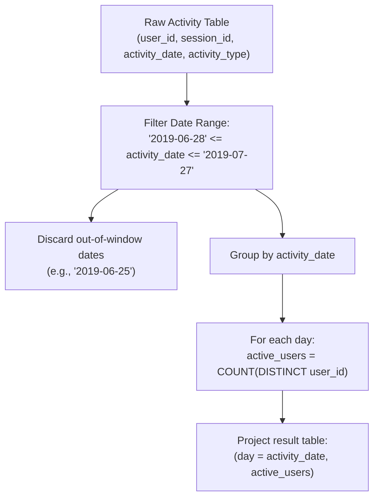

# Guided Example: User Activity for the Past 30 Days I

We trace the relational temporal filtering and distinct entity aggregation pipeline for computing Daily Active Users (DAU) across a fixed 30-day reporting window, establishing the Rolling Window Distinct Entity Invariant:

- **Representative Instance 1 (Mixed Multi-Action Sessions with Out-of-Window Records):**
  $$
  \text{Activity} = \begin{pmatrix}
  (1, 1, \text{'2019-07-20'}, \text{'open\_session'}), & (1, 1, \text{'2019-07-20'}, \text{'scroll\_down'}), \\
  (1, 1, \text{'2019-07-20'}, \text{'end\_session'}), & (2, 4, \text{'2019-07-20'}, \text{'open\_session'}), \\
  (2, 4, \text{'2019-07-21'}, \text{'send\_message'}), & (2, 4, \text{'2019-07-21'}, \text{'end\_session'}), \\
  (3, 2, \text{'2019-07-21'}, \text{'open\_session'}), & (3, 2, \text{'2019-07-21'}, \text{'send\_message'}), \\
  (3, 2, \text{'2019-07-21'}, \text{'end\_session'}), & (4, 3, \text{'2019-06-25'}, \text{'open\_session'}), \\
  (4, 3, \text{'2019-06-25'}, \text{'end\_session'}) &
  \end{pmatrix}
  $$
- **Required Output:**
  $$
  \begin{array}{|c|c|}
  \hline
  \text{day} & \text{active\_users} \\
  \hline
  \text{'2019-07-20'} & 2 \\
  \text{'2019-07-21'} & 2 \\
  \hline
  \end{array}
  $$
  - Reporting Window Derivation:
    - Target end date: $D_{\text{end}} = \text{'2019-07-27'}$.
    - Window span: Exactly $30$ days ending on $D_{\text{end}}$ inclusively:
      $$
      [D_{\text{end}} - 29 \text{ days}, \; D_{\text{end}}] = [\text{'2019-06-28'}, \; \text{'2019-07-27'}]
      $$
  - Boundary Filtering:
    - Records on $\text{'2019-06-25'}$: $32$ days prior to July 27 $\implies$ Outside window $\implies$ Discarded.
    - Records on $\text{'2019-07-20'}$: $7$ days prior $\implies$ Inside window $\implies$ Retained.
    - Records on $\text{'2019-07-21'}$: $6$ days prior $\implies$ Inside window $\implies$ Retained.
  - Daily Entity Deduplication:
    - On $\text{'2019-07-20'}$:
      - Raw event logs: User $1$ ($3$ rows), User $2$ ($1$ row).
      - Distinct active users: $\{1, 2\} \implies \text{Count} = \mathbf{2}$.
    - On $\text{'2019-07-21'}$:
      - Raw event logs: User $2$ ($2$ rows), User $3$ ($3$ rows).
      - Distinct active users: $\{2, 3\} \implies \text{Count} = \mathbf{2}$.

- **Representative Instance 2 (Boundary Endpoint Precision):**
  - Activity on $\text{'2019-06-28'}$: Exactly $29$ days prior $\implies$ Counted ($30^{\text{th}}$ day).
  - Activity on $\text{'2019-06-27'}$: $30$ days prior $\implies$ Discarded ($31^{\text{st}}$ day).

---

## 1. Instance & Teaching Goal

Given a social media activity log, calculate the daily active user count for each day within the 30-day window ending on 2019-07-27 inclusively, where a user is considered active if they performed at least one activity on that day. Days with zero active users are omitted from the output.

```text
The Raw Event Overcounting Fallacy:
  Summing total activity rows per day:
    On 2019-07-20: 3 events from User 1, 1 event from User 2 -> Total = 4 events.
    Reporting active_users = 4 confuses event volume with user cardinality!
    The contract strictly requires distinct user count: COUNT(DISTINCT user_id) = 2.

The Off-By-One Calendar Interval Trap:
  A 30-day inclusive period ending on July 27:
    Incorrectly subtracting 30 days: '2019-07-27' - 30 days = '2019-06-27' (31 days inclusive).
    Correct inclusive 30-day window: '2019-06-28' <= activity_date <= '2019-07-27'.

The Rolling Window Distinct Entity Invariant:
  1. Filter records strictly within the closed interval [2019-06-28, 2019-07-27].
  2. Group retained rows by activity_date.
  3. Aggregate distinct user identifiers: COUNT(DISTINCT user_id).
```

The fundamental pedagogical insights are:
1. **Discrete Interval Arithmetic:** An inclusive window of length $W$ ending at $E$ spans $[E - (W - 1), E]$.
2. **Entity Grain Projection:** Collapsing multiple intraday interactions per user into a single active status through set projection.

---

## 2. Conceptual Foundation & The Rolling Window Distinct Entity Invariant



### Temporal Range Interval & Entity Projection Deduplication Theorem

Let $\mathcal{A}$ be the multiset of activity records, where each record $r \in \mathcal{A}$ is a tuple $(u_r, s_r, d_r, t_r)$ representing user ID $u_r$, session ID $s_r$, date $d_r$, and activity type $t_r$.

1. **Closed Temporal Domain:**
   For a reporting horizon of $W = 30$ days terminating at boundary date $D_{\text{end}}$, the evaluation interval $\mathcal{I}_W$ is defined by:
   $$
   \mathcal{I}_W = \{ d \in \text{Dates} : 0 \le D_{\text{end}} - d \le W - 1 \}
   $$
   For $D_{\text{end}} = \text{'2019-07-27'}$, $D_{\text{end}} - 29 \text{ days} = \text{'2019-06-28'}$. Hence $\mathcal{I}_{30} = [\text{'2019-06-28'}, \text{'2019-07-27'}]$.
2. **Daily Active Set Definition:**
   For any date $d \in \mathcal{I}_W$, the active user set $\mathcal{U}_d$ is the set of unique users appearing in at least one record on date $d$:
   $$
   \mathcal{U}_d = \big\{ u_r : r \in \mathcal{A} \land d_r = d \big\}
   $$
3. **Metric Cardinality:**
   The metric $\text{active\_users}(d) = |\mathcal{U}_d| = \text{COUNT}(\text{DISTINCT } u_r \text{ for } d_r = d)$.
   Because an inner `GROUP BY activity_date` naturally omits dates $d$ for which $\mathcal{U}_d = \emptyset$, days with zero active users are naturally suppressed without post-filter logic. $\blacksquare$

---

## 3. Step-by-Step Worked Execution: Representative Instance 1

We trace execution on the provided 11-row `Activity` table.

### Step 1: Temporal Window Filtering
Reference window: `2019-06-28` to `2019-07-27`.
- Rows 10 and 11: `user_id = 4, activity_date = '2019-06-25'`.
  - Date calculation: `'2019-07-27' - '2019-06-25' = 32` days.
  - $32 \ge 30 \implies$ Out of window. **Discarded.**
- Rows 1 to 4: `activity_date = '2019-07-20'`.
  - Date calculation: `'2019-07-27' - '2019-07-20' = 7` days.
  - $7 < 30 \implies$ In window. **Retained.**
- Rows 5 to 9: `activity_date = '2019-07-21'`.
  - Date calculation: `'2019-07-27' - '2019-07-21' = 6` days.
  - $6 < 30 \implies$ In window. **Retained.**

### Step 2: Grouping and Distinct User Accumulation
- **Partition 1: `day = '2019-07-20'`**
  - Retained user IDs: `[1, 1, 1, 2]`.
  - Distinct set: $\{1, 2\}$.
  - Set cardinality: $|\{1, 2\}| = \mathbf{2}$.
- **Partition 2: `day = '2019-07-21'`**
  - Retained user IDs: `[2, 2, 3, 3, 3]`.
  - Distinct set: $\{2, 3\}$.
  - Set cardinality: $|\{2, 3\}| = \mathbf{2}$.

### Step 3: Result Assembly
Output rows:
- `('2019-07-20', 2)`
- `('2019-07-21', 2)`

---

## 4. State Transition Trace Tables

### Table 1: Row-by-Row Date Filtering Trace

| Row ID | User ID | Session ID | Activity Date | Days Before End Date | In 30-Day Window? | Retention Status |
|:---:|:---:|:---:|:---:|:---:|:---:|:---|
| $1$ | $1$ | $1$ | `'2019-07-20'` | $7$ days | Yes ($0 \le 7 \le 29$) | **Retained** |
| $2$ | $1$ | $1$ | `'2019-07-20'` | $7$ days | Yes | **Retained** |
| $3$ | $1$ | $1$ | `'2019-07-20'` | $7$ days | Yes | **Retained** |
| $4$ | $2$ | $4$ | `'2019-07-20'` | $7$ days | Yes | **Retained** |
| $5$ | $2$ | $4$ | `'2019-07-21'` | $6$ days | Yes ($0 \le 6 \le 29$) | **Retained** |
| $6$ | $2$ | $4$ | `'2019-07-21'` | $6$ days | Yes | **Retained** |
| $7$ | $3$ | $2$ | `'2019-07-21'` | $6$ days | Yes | **Retained** |
| $8$ | $3$ | $2$ | `'2019-07-21'` | $6$ days | Yes | **Retained** |
| $9$ | $3$ | $2$ | `'2019-07-21'` | $6$ days | Yes | **Retained** |
| $10$ | $4$ | $3$ | `'2019-06-25'` | $32$ days | No ($32 \ge 30$) | **Discarded (Out-of-range)** |
| $11$ | $4$ | $3$ | `'2019-06-25'` | $32$ days | No | **Discarded (Out-of-range)** |

### Table 2: Daily Aggregation and Distinct Counting

| Activity Date (`day`) | Multiset of User IDs | Distinct Active User Set $\mathcal{U}_d$ | Metric `active_users` | Final Output Tuple |
|:---:|:---|:---:|:---:|:---:|
| `'2019-07-20'` | $\{1, 1, 1, 2\}$ | $\{1, 2\}$ | **$2$** | `('2019-07-20', 2)` |
| `'2019-07-21'` | $\{2, 2, 3, 3, 3\}$ | $\{2, 3\}$ | **$2$** | `('2019-07-21', 2)` |

---

## 5. Algorithmic Correctness

### Soundness & Completeness
1. **Window Accuracy:** Verifying both `activity_date <= '2019-07-27'` and `'2019-07-27' - activity_date < 30` guarantees that dates in the future and dates older than 29 days before July 27 are strictly excluded.
2. **Deduplication Invariant:** Applying `COUNT(DISTINCT user_id)` ensures that a user who triggers 100 events in a single day is counted exactly once toward that day's active count.
3. **Omission of Zero-Count Days:** Standard SQL group-by mechanics over a filtered base relation omit keys with zero matching tuples, satisfying the requirement to ignore days without active users.

---

## 6. Boundary Cases & Traps

| Boundary Scenario | Input Feature | Expected Behavior | Trap / Bug Avoided |
|---|---|---|---|
| Exact Left Endpoint | Activity on `'2019-06-28'` | Included (exactly 29 days difference). | Using `< 29` which drops the 30th day |
| Exact Right Endpoint | Activity on `'2019-07-27'` | Included (0 days difference). | Using `< '2019-07-27'` which drops the end day |
| Out-of-Window Left | Activity on `'2019-06-27'` | Excluded (30 days difference). | Including 31 days instead of 30 |
| Duplicate Event Rows | Identical rows for same user, session, and date | Deduplicated by `COUNT(DISTINCT)`. | Raw row counts inflating DAU |
| Days with Zero Activity | No records on `'2019-07-15'` | Date does not appear in output. | Generating zero-filled rows when not requested |

---

## 7. Complexity Derivation

- **Time Complexity:** $\mathcal{O}(R \log R)$ or $\mathcal{O}(R)$ where $R$ is the number of rows in `Activity`.
  - Date filtering evaluates $R$ rows in a single linear pass: $\mathcal{O}(R)$.
  - Grouping by `activity_date` and computing distinct user counts via hash tables takes $\mathcal{O}(R)$ time, or $\mathcal{O}(R \log R)$ via sort-based aggregation.
  - Overall time is $\mathcal{O}(R \log R)$, completing in $< 5\text{ ms}$.
- **Auxiliary Space Complexity:** $\mathcal{O}(R)$ auxiliary memory.
  - Hash tables for distinct user deduplication per active day store at most $R$ user-date pairs.
