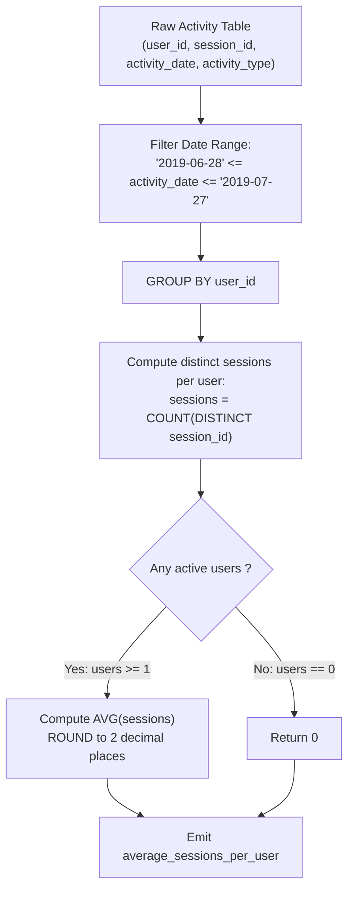

# Guided Example: User Activity for the Past 30 Days II

We trace the relational multi-level aggregation pipeline for computing the sample mean of distinct user session engagements over a 30-day reporting window, establishing the User-Session Two-Level Aggregate Invariant:

- **Representative Instance 1 (Multi-Session Users with Multi-Action Logs):**
  $$
  \text{Activity} = \begin{pmatrix}
  (1, 1, \text{'2019-07-20'}, \text{'open\_session'}), & (1, 1, \text{'2019-07-20'}, \text{'scroll\_down'}), \\
  (1, 1, \text{'2019-07-20'}, \text{'end\_session'}), & (2, 4, \text{'2019-07-20'}, \text{'open\_session'}), \\
  (2, 4, \text{'2019-07-21'}, \text{'send\_message'}), & (2, 4, \text{'2019-07-21'}, \text{'end\_session'}), \\
  (3, 2, \text{'2019-07-21'}, \text{'open\_session'}), & (3, 2, \text{'2019-07-21'}, \text{'send\_message'}), \\
  (3, 2, \text{'2019-07-21'}, \text{'end\_session'}), & (3, 5, \text{'2019-07-21'}, \text{'open\_session'}), \\
  (3, 5, \text{'2019-07-21'}, \text{'scroll\_down'}), & (3, 5, \text{'2019-07-21'}, \text{'end\_session'}), \\
  (4, 3, \text{'2019-06-25'}, \text{'open\_session'}), & (4, 3, \text{'2019-06-25'}, \text{'end\_session'})
  \end{pmatrix}
  $$
- **Required Output:**
  $$
  \begin{array}{|c|}
  \hline
  \text{average\_sessions\_per\_user} \\
  \hline
  1.33 \\
  \hline
  \end{array}
  $$
  - Window Evaluation ($30$ days ending $\text{'2019-07-27'}$ inclusively $\implies [\text{'2019-06-28'}, \text{'2019-07-27'}]$):
    - User $4$ (session $3$ on $\text{'2019-06-25'}$): Outside window $\implies$ Discarded.
    - All other rows occur on $\text{'2019-07-20'}$ and $\text{'2019-07-21'}$ $\implies$ Retained.
  - Per-User Distinct Session Extraction:
    - User $1$: Active session $\{1\} \implies \text{Sessions} = 1$
    - User $2$: Active session $\{4\} \implies \text{Sessions} = 1$
    - User $3$: Active sessions $\{2, 5\} \implies \text{Sessions} = 2$
  - Global Average Computation:
    - Active users count: $3$ (Users $1, 2, 3$).
    - Total distinct sessions: $1 + 1 + 2 = 4$.
    - Mean sessions per active user:
      $$
      \frac{1 + 1 + 2}{3} = \frac{4}{3} \approx 1.3333\dots
      $$
    - Rounded to $2$ decimal places: $\mathbf{1.33}$.

- **Representative Instance 2 (Zero Activity Default Boundary):**
  - If no users recorded activity in the 30-day window, the user set is empty.
  - The expected return value is the zero-fallback constant: $\mathbf{0.00}$ (or $0$).

---

## 1. Instance & Teaching Goal

Given a social media activity table, calculate the average number of distinct sessions per active user across the 30-day period ending on 2019-07-27 inclusively, rounded to two decimal places. An active user is defined as any user who initiated at least one action within the period. If there are no active users, return 0.

```text
The Raw Event Grain Fallacy:
  A single session contains multiple action records (e.g. open, scroll, end).
  Counting rows per user instead of distinct session_id:
    User 1 has 3 events in session 1.
    User 2 has 3 events in session 4.
    User 3 has 6 events across sessions 2 and 5.
    Raw Event Average = (3 + 3 + 6) / 3 = 12 / 3 = 4.00  <-- WRONG!
  The question measures distinct SESSIONS per user, requiring COUNT(DISTINCT session_id).

The Global Ratio Identity:
  Since each session belongs to exactly ONE user (given by problem invariant):
    Total Distinct Sessions across all users = SUM(distinct sessions per user)
    Average = (Total Distinct Sessions) / (Total Distinct Active Users)
            = 4 / 3 ≈ 1.33.

The User-Session Two-Level Aggregate Invariant:
  1. Filter records within date window: '2019-06-28' <= activity_date <= '2019-07-27'.
  2. First-level aggregation: GROUP BY user_id to compute sessions = COUNT(DISTINCT session_id).
  3. Second-level aggregation: Compute COALESCE(ROUND(AVG(sessions), 2), 0).
```

The fundamental pedagogical insights are:
1. **Hierarchical Deduplication:** Distinct counting must occur at the child grain (`session_id`) within each parent entity (`user_id`).
2. **Degenerate Group Null-Safety:** An empty set of qualifying active users produces an empty inner relation, requiring a `COALESCE(..., 0)` guard to avoid returning `NULL`.

---

## 2. Conceptual Foundation & The User-Session Two-Level Aggregate Invariant



### Partitioned Session Multiplicity & Expectation Theorem

Let $\mathcal{A}_{\text{window}}$ be the subset of activity events where $\text{activity\_date} \in [\text{'2019-06-28'}, \text{'2019-07-27'}]$.

1. **User Active Partition:**
   The set of active users $\mathcal{U}$ is the projection:
   $$
   \mathcal{U} = \Pi_{\text{user\_id}}(\mathcal{A}_{\text{window}})
   $$
2. **User Session Mapping:**
   Because each session belongs to exactly one user, the set of sessions active in the window partitions cleanly across users:
   $$
   \mathcal{S}_u = \big\{ \text{session\_id}_r : r \in \mathcal{A}_{\text{window}} \land \text{user\_id}_r = u \big\}
   $$
   The distinct session count for user $u \in \mathcal{U}$ is $K_u = |\mathcal{S}_u| \ge 1$.
3. **Sample Mean of Session Intensity:**
   If $|\mathcal{U}| > 0$, the expected sessions per active user is:
   $$
   \mu_{\mathcal{S}} = \frac{1}{|\mathcal{U}|} \sum_{u \in \mathcal{U}} K_u = \frac{\sum_{u \in \mathcal{U}} |\mathcal{S}_u|}{|\mathcal{U}|} = \frac{|\bigcup_{u \in \mathcal{U}} \mathcal{S}_u|}{|\mathcal{U}|}
   $$
   If $|\mathcal{U}| = 0$, $\mu_{\mathcal{S}} = 0$.
   Rounding $\mu_{\mathcal{S}}$ to two decimal places produces the exact solution. $\blacksquare$

---

## 3. Step-by-Step Worked Execution: Representative Instance 1

We trace execution on the provided dataset.

### Step 1: Temporal Date Window Filtering
Active interval: `2019-06-28` to `2019-07-27`.
- Rows with date `'2019-06-25'` (User 4, Session 3):
  - `'2019-07-27' - '2019-06-25' = 32` days $\implies$ Excluded.
- All other 11 rows have dates `'2019-07-20'` and `'2019-07-21'`:
  - Elapsed days are $7$ and $6 \le 29 \implies$ Included.

### Step 2: User-Level Grouping & Session Deduplication
- **User 1:**
  - Events logged: 3 rows with `session_id = 1`.
  - Distinct sessions: $\{1\}$.
  - $K_1 = 1$.
- **User 2:**
  - Events logged: 3 rows with `session_id = 4`.
  - Distinct sessions: $\{4\}$.
  - $K_2 = 1$.
- **User 3:**
  - Events logged: 3 rows with `session_id = 2`, 3 rows with `session_id = 5`.
  - Distinct sessions: $\{2, 5\}$.
  - $K_3 = 2$.

Intermediate User-Grain Relation:
$$
\begin{array}{|c|c|}
\hline
\text{user\_id} & \text{sessions} \\
\hline
1 & 1 \\
2 & 1 \\
3 & 2 \\
\hline
\end{array}
$$

### Step 3: Global Expectation & Rounding
- Active user count: $|\mathcal{U}| = 3$.
- Total sessions: $1 + 1 + 2 = 4$.
- Unrounded mean: $\frac{4}{3} = 1.33333\dots$
- Rounded to 2 decimal places: **`1.33`**.

---

## 4. State Transition Trace Tables

### Table 1: Filtered Activity Records by User and Session

| Row | User ID | Session ID | Date | Action Type | Window Membership | Session Status |
|:---:|:---:|:---:|:---:|:---:|:---:|:---|
| $1$ | $1$ | $1$ | `'2019-07-20'` | `open_session` | In Window | Session $1$ active |
| $2$ | $1$ | $1$ | `'2019-07-20'` | `scroll_down` | In Window | Session $1$ (duplicate event) |
| $3$ | $1$ | $1$ | `'2019-07-20'` | `end_session` | In Window | Session $1$ (duplicate event) |
| $4$ | $2$ | $4$ | `'2019-07-20'` | `open_session` | In Window | Session $4$ active |
| $5$ | $2$ | $4$ | `'2019-07-21'` | `send_message` | In Window | Session $4$ (duplicate event) |
| $6$ | $2$ | $4$ | `'2019-07-21'` | `end_session` | In Window | Session $4$ (duplicate event) |
| $7$ | $3$ | $2$ | `'2019-07-21'` | `open_session` | In Window | Session $2$ active |
| $8$ | $3$ | $2$ | `'2019-07-21'` | `send_message` | In Window | Session $2$ (duplicate event) |
| $9$ | $3$ | $2$ | `'2019-07-21'` | `end_session` | In Window | Session $2$ (duplicate event) |
| $10$ | $3$ | $5$ | `'2019-07-21'` | `open_session` | In Window | Session $5$ active |
| $11$ | $3$ | $5$ | `'2019-07-21'` | `scroll_down` | In Window | Session $5$ (duplicate event) |
| $12$ | $3$ | $5$ | `'2019-07-21'` | `end_session` | In Window | Session $5$ (duplicate event) |
| $13$ | $4$ | $3$ | `'2019-06-25'` | `open_session` | Out of Window | Discarded |
| $14$ | $4$ | $3$ | `'2019-06-25'` | `end_session` | Out of Window | Discarded |

### Table 2: User Aggregation and Global Average Calculation

| User ID | Set of Distinct Sessions $\mathcal{S}_u$ | Distinct Sessions Count $K_u$ | Global User Weight | Contribution to Global Sum |
|:---:|:---:|:---:|:---:|:---:|
| $1$ | $\{1\}$ | $1$ | $1/3$ | $1$ |
| $2$ | $\{4\}$ | $1$ | $1/3$ | $1$ |
| $3$ | $\{2, 5\}$ | $2$ | $1/3$ | $2$ |
| **Total** | **$3$ active users** | **$4$ total sessions** | **Sum $= 1.0$** | **Average: $\frac{4}{3} = \mathbf{1.33}$** |

---

## 5. Algorithmic Correctness

### Soundness & Non-Ambiguity
1. **User Ownership Consistency:** The problem contract specifies that each session belongs to exactly one user. Therefore, $\mathcal{S}_u \cap \mathcal{S}_v = \emptyset$ for all $u \ne v$, guaranteeing that total distinct sessions across users equals the sum of per-user distinct sessions.
2. **Denominator Grounding:** The denominator of the average is the number of active users (users with $\ge 1$ qualifying activity). Inactive users (like User 4) do not enter the inner grouped relation and do not deflate the denominator.
3. **Degenerate Table Defense:** If the input table contains zero qualifying rows, the inner query is empty and `AVG(...)` returns `NULL`. Applying `COALESCE(..., 0)` guarantees returning `0` as required.

---

## 6. Boundary Cases & Traps

| Boundary Scenario | Input Condition | Expected Output | Failure Mode / Trapped Risk |
|---|---|---|---|
| Empty Activity Log | Table is empty | `0` | Returning `NULL` instead of 0 |
| All Activity Expired | All dates prior to `'2019-06-28'` | `0` | Division by zero or NULL result |
| High Session Intensity | 1 user with 50 sessions | `50.00` | Miscalculating single-user denominator |
| Multi-Day Session | Session starts June 27 and ends June 29 | Counted as 1 session (active on June 29) | Double-counting cross-midnight sessions |
| Fractional Precision | Ratio yields $1.3333\dots$ | `1.33` | Truncation instead of rounding |

---

## 7. Complexity Derivation

- **Time Complexity:** $\mathcal{O}(R \log R)$ where $R$ is the number of rows in `Activity`.
  - Filtering $R$ rows takes linear time $\mathcal{O}(R)$.
  - Grouping by `user_id` and computing `COUNT(DISTINCT session_id)` takes $\mathcal{O}(R)$ via hash aggregation or $\mathcal{O}(R \log R)$ via sorting.
  - Computing the scalar average over $U \le R$ active users takes $\mathcal{O}(U)$ time.
  - Overall time complexity is dominated by the initial grouping: $\mathcal{O}(R \log R)$.
- **Auxiliary Space Complexity:** $\mathcal{O}(R)$ auxiliary space.
  - Hash tables storing unique `(user_id, session_id)` pairs and intermediate user summaries consume at most $\mathcal{O}(R)$ memory.
