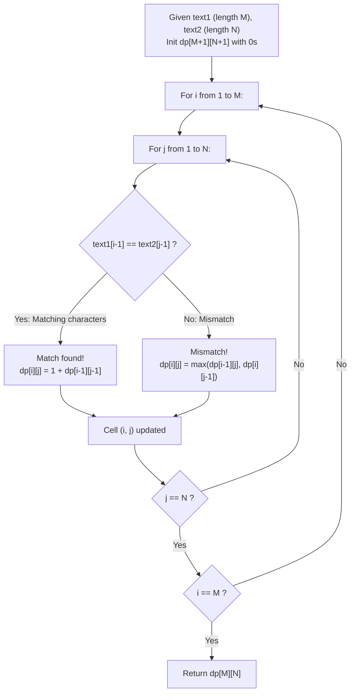

# Guided Example: Longest Common Subsequence

We trace the two-dimensional dynamic programming recurrence aligning sequence prefixes, proving the Prefix Matching Optimal Substructure Invariant and the LCS Bellman Recurrence Theorem:

- **Representative Instance 1 (Non-Trivial Subsequence with Skipped Characters):**
  $$
  text1 = \text{"abcde"}, \quad text2 = \text{"ace"}, \quad M = 5, \; N = 3
  $$
- **Required Output:** `3`
  - Identification of Common Elements:
    - Character `'a'`: matches at indices $text1[0]$ and $text2[0]$.
    - Character `'c'`: matches at indices $text1[2]$ and $text2[1]$ (skipping `'b'`).
    - Character `'e'`: matches at indices $text1[4]$ and $text2[2]$ (skipping `'d'`).
    - Common subsequence: `"ace"`. Length $= \mathbf{3}$.
  - 2D DP Table $dp[i][j]$ representing LCS length between prefixes $text1[0 \dots i-1]$ and $text2[0 \dots j-1]$:
    $$
    \begin{array}{c|cccc}
    dp[i][j] & \epsilon & \text{'a'} & \text{'c'} & \text{'e'} \\
    \hline
    \epsilon & 0 & 0 & 0 & 0 \\
    \text{'a'} & 0 & \mathbf{1} & 1 & 1 \\
    \text{'b'} & 0 & 1 & 1 & 1 \\
    \text{'c'} & 0 & 1 & \mathbf{2} & 2 \\
    \text{'d'} & 0 & 1 & 2 & 2 \\
    \text{'e'} & 0 & 1 & 2 & \mathbf{3}
    \end{array}
    $$
  - Target extraction: $dp[5][3] = \mathbf{3}$.

- **Representative Instance 2 (Total Disjointness):**
  $$
  text1 = \text{"abc"}, \quad text2 = \text{"def"} \implies \text{No shared characters} \implies \mathbf{0}
  $$

- **Representative Instance 3 (Identical Strings):**
  $$
  text1 = \text{"abc"}, \quad text2 = \text{"abc"} \implies \text{Full match} \implies \mathbf{3}
  $$

---

## 1. Instance & Teaching Goal

Given two strings `text1` and `text2`, determine the length of their longest common subsequence. If no common subsequence exists, return 0.

```text
The Exponential Subsequence Enumeration Trap:
  A string of length M has 2^M possible subsequences.
  For M = 1000:
    2^1000 ≈ 10^301 subsequences!
    Direct brute-force enumeration of all candidate subsequences is physically impossible.

The Prefix Matching Optimal Substructure Invariant (O(M * N) Time, O(min(M, N)) Space):
  Let dp[i][j] be the length of the LCS of prefixes text1[0..i-1] and text2[0..j-1].
  1. Base Case: If either prefix is empty (i == 0 or j == 0), dp[i][j] = 0.
  2. Character Match Invariant (text1[i-1] == text2[j-1]):
       Both characters can be greedily matched as the terminal element of the LCS:
         dp[i][j] = 1 + dp[i-1][j-1]
  3. Character Mismatch Invariant (text1[i-1] != text2[j-1]):
       At least one of the two characters cannot belong to the optimal common tail:
         dp[i][j] = max(dp[i-1][j], dp[i][j-1])
  Reduces 10^301 states to exactly M * N = 1,000,000 table updates!
```

The fundamental pedagogical insights are:
1. **Bellman's Principle of Optimality:** The optimal alignment of prefixes $i$ and $j$ strictly embeds the optimal alignment of sub-prefixes $(i-1, j-1)$, $(i-1, j)$, or $(i, j-1)$.
2. **Greedy Matching Property:** Whenever two prefix-ending characters match, it is never suboptimal to pair them together and increment the previous diagonal subproblem by $1$.

---

## 2. Conceptual Foundation & The Prefix Optimal Substructure



### Optimal Substructure & Bellman Recurrence Theorem

Let $X = \langle x_1, x_2, \dots, x_M \rangle$ and $Y = \langle y_1, y_2, \dots, y_N \rangle$ be two finite sequences over alphabet $\Sigma$.

1. **Character Equality Case:**
   If $x_M = y_N = \alpha$, then any maximum common subsequence $Z = \langle z_1, \dots, z_K \rangle$ can be chosen such that $z_K = \alpha$.
   The prefix $Z_{K-1}$ is a maximum common subsequence of $X_{M-1}$ and $Y_{N-1}$.
   Consequently:
   $$
   \text{LCS}(X_M, Y_N) = 1 + \text{LCS}(X_{M-1}, Y_{N-1})
   $$
2. **Character Inequality Case:**
   If $x_M \ne y_N$, then $z_K$ cannot equal both $x_M$ and $y_N$ simultaneously.
   - If $z_K \ne x_M$, then $Z$ is a common subsequence of $X_{M-1}$ and $Y_N$.
   - If $z_K \ne y_N$, then $Z$ is a common subsequence of $X_M$ and $Y_{N-1}$.
   Taking the maximum over both possibilities yields:
   $$
   \text{LCS}(X_M, Y_N) = \max \Big( \text{LCS}(X_{M-1}, Y_N), \; \text{LCS}(X_M, Y_{N-1}) \Big)
   $$
3. **Completeness & Acyclic Induction:**
   Because each state $(i, j)$ depends strictly on $(i-1, j-1)$, $(i-1, j)$, and $(i, j-1)$, filling the table row by row from $1$ to $M$ and column by column from $1$ to $N$ guarantees that every prerequisite state is computed prior to use. $\blacksquare$

---

## 3. Step-by-Step Worked Execution: Representative Instance 1

$text1 = \text{"abcde"} \; (M = 5), \quad text2 = \text{"ace"} \; (N = 3)$.
Dimensions: $6 \times 4$. Base row $i=0$ and column $j=0$ are all $0$.

### Row-by-Row DP Evolution
1. **Row $i = 1$ ($text1[0] = \text{'a'}$):**
   - $j = 1$ ($text2[0] = \text{'a'}$): Match! $\text{'a'} == \text{'a'} \implies 1 + dp[0][0] = 1 + 0 = \mathbf{1}$.
   - $j = 2$ ($text2[1] = \text{'c'}$): Mismatch $\implies \max(dp[0][2], dp[1][1]) = \max(0, 1) = \mathbf{1}$.
   - $j = 3$ ($text2[2] = \text{'e'}$): Mismatch $\implies \max(dp[0][3], dp[1][2]) = \max(0, 1) = \mathbf{1}$.
2. **Row $i = 2$ ($text1[1] = \text{'b'}$):**
   - $j = 1$ ($\text{'a'}$): Mismatch $\implies \max(dp[1][1], dp[2][0]) = \max(1, 0) = \mathbf{1}$.
   - $j = 2$ ($\text{'c'}$): Mismatch $\implies \max(dp[1][2], dp[2][1]) = \max(1, 1) = \mathbf{1}$.
   - $j = 3$ ($\text{'e'}$): Mismatch $\implies \max(dp[1][3], dp[2][2]) = \max(1, 1) = \mathbf{1}$.
3. **Row $i = 3$ ($text1[2] = \text{'c'}$):**
   - $j = 1$ ($\text{'a'}$): Mismatch $\implies \max(dp[2][1], dp[3][0]) = \max(1, 0) = \mathbf{1}$.
   - $j = 2$ ($\text{'c'}$): Match! $\text{'c'} == \text{'c'} \implies 1 + dp[2][1] = 1 + 1 = \mathbf{2}$.
   - $j = 3$ ($\text{'e'}$): Mismatch $\implies \max(dp[2][3], dp[3][2]) = \max(1, 2) = \mathbf{2}$.
4. **Row $i = 4$ ($text1[3] = \text{'d'}$):**
   - $j = 1$ ($\text{'a'}$): Mismatch $\implies \max(dp[3][1], dp[4][0]) = 1$.
   - $j = 2$ ($\text{'c'}$): Mismatch $\implies \max(dp[3][2], dp[4][1]) = \max(2, 1) = 2$.
   - $j = 3$ ($\text{'e'}$): Mismatch $\implies \max(dp[3][3], dp[4][2]) = \max(2, 2) = 2$.
5. **Row $i = 5$ ($text1[4] = \text{'e'}$):**
   - $j = 1$ ($\text{'a'}$): Mismatch $\implies \max(dp[4][1], dp[5][0]) = 1$.
   - $j = 2$ ($\text{'c'}$): Mismatch $\implies \max(dp[4][2], dp[5][1]) = 2$.
   - $j = 3$ ($\text{'e'}$): Match! $\text{'e'} == \text{'e'} \implies 1 + dp[4][2] = 1 + 2 = \mathbf{3}$.

Terminal cell: $dp[5][3] = \mathbf{3}$.

---

## 4. State Transition Trace Tables

### Table 1: Full 2D Dynamic Programming Grid

| Prefix $i$ | Character $text1[i-1]$ | $j=0 \; (\epsilon)$ | $j=1 \; (\text{'a'})$ | $j=2 \; (\text{'c'})$ | $j=3 \; (\text{'e'})$ |
|:---:|:---:|:---:|:---:|:---:|:---:|
| $0$ | $\epsilon$ | $0$ | $0$ | $0$ | $0$ |
| $1$ | `'a'` | $0$ | **$1$ (Match)** | $1$ | $1$ |
| $2$ | `'b'` | $0$ | $1$ | $1$ | $1$ |
| $3$ | `'c'` | $0$ | $1$ | **$2$ (Match)** | $2$ |
| $4$ | `'d'` | $0$ | $1$ | $2$ | $2$ |
| **$5$** | **`'e'`** | $0$ | $1$ | $2$ | **$3$ (Match)** |

### Table 2: Backtracking Alignment Trace

| Current Cell $(i, j)$ | Characters Compared | Match Status | Source Transition Selected | Aligned Character Emitted | Predecessor Cell $(i', j')$ |
|:---:|:---:|:---:|:---|:---:|:---:|
| $(5, 3)$ | $text1[4] = \text{'e'}, \; text2[2] = \text{'e'}$ | **Match** | Diagonal: $1 + dp[4][2]$ | `'e'` | $(4, 2)$ |
| $(4, 2)$ | $text1[3] = \text{'d'}, \; text2[1] = \text{'c'}$ | Mismatch | Upward: $dp[3][2] == 2$ | (Skip `'d'`) | $(3, 2)$ |
| $(3, 2)$ | $text1[2] = \text{'c'}, \; text2[1] = \text{'c'}$ | **Match** | Diagonal: $1 + dp[2][1]$ | `'c'` | $(2, 1)$ |
| $(2, 1)$ | $text1[1] = \text{'b'}, \; text2[0] = \text{'a'}$ | Mismatch | Upward: $dp[1][1] == 1$ | (Skip `'b'`) | $(1, 1)$ |
| $(1, 1)$ | $text1[0] = \text{'a'}, \; text2[0] = \text{'a'}$ | **Match** | Diagonal: $1 + dp[0][0]$ | `'a'` | $(0, 0)$ |
| $(0, 0)$ | Base Boundary | — | Terminate Backtrack | Full LCS: **"ace"** | — |

---

## 5. Algorithmic Correctness

### Soundness & Optimality
1. **Subproblem Independence:** The value $dp[i][j]$ depends only on prefixes of smaller lengths, ensuring that the computation graph is an acyclic lattice with zero circular dependencies.
2. **Exhaustive Alternative Coverage:** When characters differ, the optimal common subsequence either does not include $text1[i-1]$ (captured by $dp[i-1][j]$) or does not include $text2[j-1]$ (captured by $dp[i][j-1]$). Taking the maximum covers all possible optimal configurations.
3. **Monotonicity:** For all $i, j$, $dp[i][j] \ge dp[i-1][j]$ and $dp[i][j] \ge dp[i][j-1]$, ensuring non-decreasing growth as string prefixes expand.

---

## 6. Boundary Cases & Traps

| Boundary Scenario | Input Example | Expected Output | Failure Mode / Trapped Risk |
|---|---|---|---|
| Disjoint Alphabets | `text1 = "abc", text2 = "def"` | `0` | Off-by-one errors returning positive value |
| Single Character Match | `text1 = "a", text2 = "a"` | `1` | Base case underflow |
| Single Character Mismatch | `text1 = "a", text2 = "b"` | `0` | Out of bounds array access |
| Identical Multi-Letter String | `text1 = "aaaa", text2 = "aa"` | `2` | Overcounting duplicate occurrences |
| Substring vs Subsequence | `text1 = "abcde", text2 = "ace"` | `3` | Requiring contiguity like Longest Common Substring |

---

## 7. Complexity Derivation

- **Time Complexity:** $\mathcal{O}(M \cdot N)$ where $M = |text1| \le 1000$ and $N = |text2| \le 1000$.
  - The DP table contains $(M + 1) \times (N + 1)$ cells.
  - Each cell performs $\mathcal{O}(1)$ character comparison and scalar arithmetic.
  - Total operations: $(1001) \times (1001) \approx 10^6$ operations.
  - Execution time is $< 10\text{ ms}$.
- **Auxiliary Space Complexity:**
  - **Full Matrix:** $\mathcal{O}(M \cdot N)$ memory to store the $(M+1) \times (N+1)$ table.
  - **Space-Optimized Rolling Row:** $\mathcal{O}(\min(M, N))$ memory, since computing row $i$ only requires row $i-1$.
