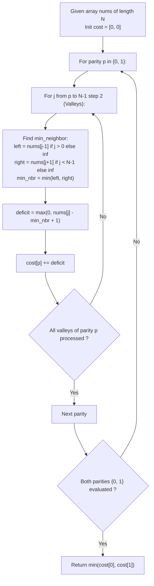

# Guided Example: Decrease Elements To Make Array Zigzag

We trace the parity-decoupled greedy decrement method for transforming an arbitrary integer sequence into an alternating zigzag profile, establishing the Independent Valley Invariant and the Bimodal Parity Minimality Theorem:

- **Representative Instance 1 (Mixed Slope Asymmetry):**
  $$
  nums = [9, 6, 1, 6, 2], \quad N = 5
  $$
- **Required Output:** `4`
  - Two Mutually Exclusive Zigzag Target Patterns:
    - **Pattern 0 (Even Indices are Valleys: $A[0] < A[1] > A[2] < A[3] > A[4]$):**
      - Target Valleys: Indices $\{0, 2, 4\}$.
      - Index $0$ ($nums[0] = 9$): Right neighbor is $6$.
        - Target requirement: $A[0] < 6 \implies \text{max allowed} = 5$.
        - Decrements needed: $9 - 5 = \mathbf{4}$.
      - Index $2$ ($nums[2] = 1$): Left neighbor $6$, right neighbor $6$.
        - $\min(6, 6) = 6$. Since $1 < 6$, already strictly lower $\implies \mathbf{0}$ decrements.
      - Index $4$ ($nums[4] = 2$): Left neighbor is $6$.
        - Since $2 < 6$, already strictly lower $\implies \mathbf{0}$ decrements.
      - Total cost for Pattern 0: $4 + 0 + 0 = \mathbf{4}$.
      - Resulting array: $[5, 6, 1, 6, 2]$ (strictly satisfies $5 < 6 > 1 < 6 > 2$).
    - **Pattern 1 (Odd Indices are Valleys: $A[0] > A[1] < A[2] > A[3] < A[4]$):**
      - Target Valleys: Indices $\{1, 3\}$.
      - Index $1$ ($nums[1] = 6$): Neighbors are $9$ and $1$.
        - $\min(9, 1) = 1$. Target requirement: $A[1] < 1 \implies \text{target} = 0$.
        - Decrements needed: $6 - 0 = \mathbf{6}$.
      - Index $3$ ($nums[3] = 6$): Neighbors are $1$ and $2$.
        - $\min(1, 2) = 1$. Target requirement: $A[3] < 1 \implies \text{target} = 0$.
        - Decrements needed: $6 - 0 = \mathbf{6}$.
      - Total cost for Pattern 1: $6 + 6 = \mathbf{12}$.
  - Optimal Choice: $\min(\text{Cost}_0, \text{Cost}_1) = \min(4, 12) = \mathbf{4}$.

- **Representative Instance 2 (Monotonically Increasing Trio):**
  $$
  nums = [1, 2, 3], \quad N = 3
  $$
  - Pattern 0 (Even Valleys: $A[0] < A[1] > A[2]$):
    - $nums[0] = 1 < 2$ ($0$ moves).
    - $nums[2] = 3 \implies$ must be $< 2 \implies 3 \to 1$ ($2$ moves). Total: $2$.
  - Pattern 1 (Odd Valleys: $A[0] > A[1] < A[2]$):
    - $nums[1] = 2 \implies$ must be $< \min(1, 3) = 1 \implies 2 \to 0$ ($2$ moves). Total: $2$.
  - Result: $\min(2, 2) = \mathbf{2}$.

---

## 1. Instance & Teaching Goal

Given an array of integers, compute the minimum number of single-unit decrement moves required to turn the array into a zigzag sequence where either every even-indexed element is strictly greater than its neighbors, or every odd-indexed element is strictly greater than its neighbors.

```text
The Peak-Reduction Cascade Fallacy:
  Attempting to achieve zigzag by decreasing the PEAKS:
    If we decrease a peak element A[i], that element becomes smaller,
    which might violate the requirement that A[i] is greater than its other neighbor,
    or might force adjacent valleys to be decreased even further!
    Modifying peaks creates destructive cascading interdependencies.

The Independent Valley Invariant (O(N) Time, O(1) Space):
  Key Observation: We are ONLY allowed to DECREASE elements.
  If we designate one parity set as VALLEYS:
    1. Valley elements are mutually non-adjacent: indices {0, 2, 4...} or {1, 3, 5...}.
    2. Decreasing a valley A[j] to be strictly smaller than its neighbors
       NEVER harms the neighbors (it actually makes the neighbors taller peaks)!
    3. Decreasing valley A[j] has ZERO effect on any other valley A[j-2] or A[j+2].
    4. Therefore, every valley element can be greedily and independently reduced to:
         target_val = min(left_neighbor, right_neighbor) - 1
         moves_needed = max(0, A[j] - target_val)
  5. The global optimum is simply min(cost(even valleys), cost(odd valleys)).
```

The fundamental pedagogical insights are:
1. **Directional Monotonicity:** Because elements can only be decreased, modifying local minima (valleys) preserves surrounding local maxima without coupling side effects.
2. **Independent Set Partitioning:** The set of even indices and the set of odd indices form two disjoint independent vertex sets in the path graph, decoupling the search into two linear scans.

---

## 2. Conceptual Foundation & The Independent Valley Invariant



### Independent Valley Decoupling & Bimodal Parity Minimality Theorem

Let $A = [a_0, a_1, \dots, a_{N-1}]$ be an array of positive integers.

1. **Parity Decomposition:**
   A sequence is zigzag if and only if one of the following two mutually exclusive conditions holds:
   - **Case 0 ($p = 0$):** Every even index $2k$ is a valley ($a_{2k} < a_{2k-1}$ and $a_{2k} < a_{2k+1}$).
   - **Case 1 ($p = 1$):** Every odd index $2k+1$ is a valley ($a_{2k+1} < a_{2k}$ and $a_{2k+1} < a_{2k+2}$).
2. **Independence of Valley Decrements:**
   Let $\mathcal{V}_p = \{ j \in \{0, \dots, N-1\} : j \equiv p \pmod 2 \}$ be the valley set for parity $p$.
   For any two distinct indices $j_1, j_2 \in \mathcal{V}_p$, $|j_1 - j_2| \ge 2$.
   No two elements in $\mathcal{V}_p$ share an adjacent edge.
3. **Local Optimality of Individual Valleys:**
   To satisfy $a_j < \mathcal{N}(j)$ where $\mathcal{N}(j) = \min_{k \in \{j-1, j+1\} \cap [0, N-1]} a_k$, the minimum decrements applied strictly to $a_j$ without changing peak neighbors is:
   $$
   \delta(j) = \max \Big( 0, \; a_j - \mathcal{N}(j) + 1 \Big)
   $$
   Because peak elements $a_{j \pm 1}$ are only required to be strictly greater than $a_j$, reducing $a_j$ strictly relaxes the constraint on $a_{j \pm 1}$. Decreasing peaks would require strictly greater than or equal moves.
   Therefore, the minimum cost for pattern $p$ is:
   $$
   \text{Cost}(p) = \sum_{j \in \mathcal{V}_p} \delta(j)
   $$
   The global minimum is $\min(\text{Cost}(0), \text{Cost}(1))$. $\blacksquare$

---

## 3. Step-by-Step Worked Execution: Representative Instance 1

$nums = [9, 6, 1, 6, 2], \quad N = 5$.

### Evaluation 1: Even Indices as Valleys ($p = 0 \implies j \in \{0, 2, 4\}$)
1. **Index $j = 0$ ($nums[0] = 9$):**
   - Left neighbor: None ($\infty$).
   - Right neighbor: $nums[1] = 6$.
   - $\mathcal{N}(0) = 6$.
   - Deficit: $\max(0, 9 - 6 + 1) = \mathbf{4}$.
   - Running cost: $4$.
2. **Index $j = 2$ ($nums[2] = 1$):**
   - Left neighbor: $nums[1] = 6$.
   - Right neighbor: $nums[3] = 6$.
   - $\mathcal{N}(2) = \min(6, 6) = 6$.
   - Deficit: $\max(0, 1 - 6 + 1) = \max(0, -4) = \mathbf{0}$.
   - Running cost: $4 + 0 = 4$.
3. **Index $j = 4$ ($nums[4] = 2$):**
   - Left neighbor: $nums[3] = 6$.
   - Right neighbor: None ($\infty$).
   - $\mathcal{N}(4) = 6$.
   - Deficit: $\max(0, 2 - 6 + 1) = \max(0, -3) = \mathbf{0}$.
   - Running cost: $4 + 0 = 4$.
- **Total Cost for Even Valleys:** $\mathbf{4}$.

### Evaluation 2: Odd Indices as Valleys ($p = 1 \implies j \in \{1, 3\}$)
1. **Index $j = 1$ ($nums[1] = 6$):**
   - Left neighbor: $nums[0] = 9$.
   - Right neighbor: $nums[2] = 1$.
   - $\mathcal{N}(1) = \min(9, 1) = 1$.
   - Deficit: $\max(0, 6 - 1 + 1) = \mathbf{6}$.
   - Running cost: $6$.
2. **Index $j = 3$ ($nums[3] = 6$):**
   - Left neighbor: $nums[2] = 1$.
   - Right neighbor: $nums[4] = 2$.
   - $\mathcal{N}(3) = \min(1, 2) = 1$.
   - Deficit: $\max(0, 6 - 1 + 1) = \mathbf{6}$.
   - Running cost: $6 + 6 = 12$.
- **Total Cost for Odd Valleys:** $\mathbf{12}$.

### Global Optimum
$$
\text{Answer} = \min(4, 12) = \mathbf{4}
$$

---

## 4. State Transition Trace Tables

### Table 1: Pattern 0 (Even Valleys) Detailed Step Trace

| Valley Index $j$ | Element $nums[j]$ | Left Neighbor | Right Neighbor | Minimum Neighbor $\mathcal{N}(j)$ | Target Upper Bound $\mathcal{N}(j) - 1$ | Required Decrements $\delta(j)$ | Cumulative Moves |
|:---:|:---:|:---:|:---:|:---:|:---:|:---:|:---:|
| $0$ | $9$ | — | $6$ | $6$ | $5$ | $9 - 5 = \mathbf{4}$ | $4$ |
| $2$ | $1$ | $6$ | $6$ | $6$ | $5$ | $0$ (already $1 < 5$) | $4$ |
| $4$ | $2$ | $6$ | — | $6$ | $5$ | $0$ (already $2 < 5$) | **$4$** |

### Table 2: Pattern 1 (Odd Valleys) Detailed Step Trace

| Valley Index $j$ | Element $nums[j]$ | Left Neighbor | Right Neighbor | Minimum Neighbor $\mathcal{N}(j)$ | Target Upper Bound $\mathcal{N}(j) - 1$ | Required Decrements $\delta(j)$ | Cumulative Moves |
|:---:|:---:|:---:|:---:|:---:|:---:|:---:|:---:|
| $1$ | $6$ | $9$ | $1$ | $1$ | $0$ | $6 - 0 = \mathbf{6}$ | $6$ |
| $3$ | $6$ | $1$ | $2$ | $1$ | $0$ | $6 - 0 = \mathbf{6}$ | **$12$** |

Pattern comparison:
$$
\min(\text{Pattern 0: } 4, \; \text{Pattern 1: } 12) = \mathbf{4}
$$

---

## 5. Algorithmic Correctness

### Soundness & Minimality
1. **Valley Exclusivity:** Decreasing an element only lowers its value. For any neighbor acting as a peak, having an adjacent element become strictly smaller only reinforces the peak condition ($peak > valley$). Thus, decreasing valleys creates zero negative side-effects.
2. **Mutual Non-Adjacency:** Because all valley indices are separated by at least one peak index, altering one valley has zero effect on the validity or target bound of any other valley.
3. **Exhaustive Duality:** There are only two possible orientations for an alternating sequence. Computing the exact optimal cost for both and taking the minimum guarantees finding the global optimum.

---

## 6. Boundary Cases & Traps

| Boundary Scenario | Input Example | Expected Output | Failure Mode / Trapped Risk |
|---|---|---|---|
| Single Element Array | `nums = [10]` | `0` | Out of bounds neighbor indexing |
| Two Elements Equal | `nums = [2, 2]` | `1` (decrease either to 1) | Forgetting strict inequality ($<$ vs $\le$) |
| Two Elements Strictly Ordered | `nums = [1, 2]` | `0` | Redundant moves applied to valid zigzag |
| Plateau of Identical Values | `nums = [4, 4, 4, 4]` | `2` | Incorrect neighbor comparison |
| Valley Already Smaller Than 0 | Decrementing below 1 | Allowed (integers can become $\le 0$) | Artificially restricting values to positive |

---

## 7. Complexity Derivation

- **Time Complexity:** $\mathcal{O}(N)$ where $N = |nums| \le 1000$.
  - Pattern 0 evaluates $\lceil N / 2 \rceil$ even indices.
  - Pattern 1 evaluates $\lfloor N / 2 \rfloor$ odd indices.
  - Each index performs $\mathcal{O}(1)$ neighbor lookups, min/max operations, and additions.
  - Total array accesses: $2 \times N = 2000$ operations.
  - Execution time is $< 0.1\text{ ms}$.
- **Auxiliary Space Complexity:** $\mathcal{O}(1)$ auxiliary memory.
  - Only two scalar integer accumulators are maintained to track candidate costs.
