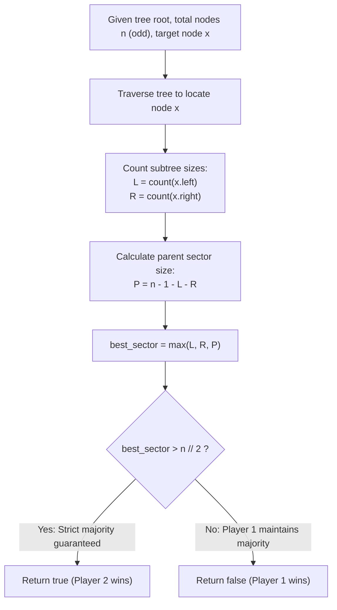

# Guided Example: Binary Tree Coloring Game

We trace the tree-partition graph cut analysis for the second player's optimal opening move in a competitive territory-coloring game, establishing the 3-Component Tree Cut Invariant:

- **Representative Instance 1 (Non-Trivial Interior Pivot with Dominant Parent Sector):**
  $$
  root = [1, 2, 3, 4, 5, 6, 7, 8, 9, 10, 11], \quad n = 11, \quad x = 3
  $$
- **Required Output:** `true`
  - Locating Node $x = 3$:
    - Left child of $3$: Node $6$ (leaf, size $L = 1$).
    - Right child of $3$: Node $7$ (leaf, size $R = 1$).
  - Partitioning Tree Components by Removing $x = 3$:
    - Left Subtree Sector: Size $L = 1$.
    - Right Subtree Sector: Size $R = 1$.
    - Parent / Complementary Sector:
      $$
      P = n - 1 - L - R = 11 - 1 - 1 - 1 = \mathbf{8}
      $$
  - Strategic Move Analysis for Player 2 (Blue):
    - Option 1 (Block Left Child: choose $y = 6$): Blue captures $1$ node. Red captures $11 - 1 = 10$ nodes. (Blue loses).
    - Option 2 (Block Right Child: choose $y = 7$): Blue captures $1$ node. Red captures $10$ nodes. (Blue loses).
    - Option 3 (Block Parent: choose $y = 1$):
      - Blue occupies node $1$, the parent of $3$.
      - Because $3$ is Red and all tree paths between node $3$ and the rest of the tree pass through node $1$, Red cannot expand into the parent sector.
      - Blue captures all $P = 8$ nodes in the rest of the tree.
      - Red is quarantined to the subtree rooted at $3$, capturing at most $1 + L + R = 3$ nodes.
  - Majority Threshold:
    $$
    \text{Majority Need} > \left\lfloor \frac{n}{2} \right\rfloor = \left\lfloor \frac{11}{2} \right\rfloor = 5
    $$
    Blue secures $8 > 5$ nodes $\implies \mathbf{true}$ (Blue guarantees victory).

- **Representative Instance 2 (Symmetric Root Blockade Failure):**
  $$
  root = [1, 2, 3], \quad n = 3, \quad x = 1
  $$
  - Node $x = 1$ is the root.
  - Left child $2 \implies L = 1$. Right child $3 \implies R = 1$. Parent $P = 0$.
  - Maximum sector size Blue can claim: $\max(1, 1, 0) = 1$.
  - Threshold: $n // 2 = 3 // 2 = 1$.
  - Since $1 \ngtr 1$, Blue captures $1$ node while Red captures $2$.
  - Output: $\mathbf{false}$.

---

## 1. Instance & Teaching Goal

Given a binary tree with an odd number of nodes $n$ and the initial node $x$ chosen by the first player, determine whether the second player can choose an initial node $y$ such that they can guarantee coloring strictly more nodes than the first player under optimal turn-based play.

```text
The Step-by-Step Game Simulation Fallacy:
  Simulating alternating turns, frontier branching, and BFS expansion:
    Branching combinations across turns are exponentially large.
    Simulating the turn-by-turn playback is completely unnecessary!

The 3-Component Tree Cut Invariant (O(n) Time, O(h) Space):
  Crucial Topology Fact: In any tree, removing a single node x partitions the tree
  into AT MOST THREE connected components:
    1. The left subtree of x (size L).
    2. The right subtree of x (size R).
    3. The parent / rest of the tree (size P = n - 1 - L - R).
  The Barrier Principle:
    Since moves only expand to UNCOLORED ADJACENT nodes, Blue can choose an
    immediate neighbor of x (left child, right child, or parent).
    By claiming that neighbor, Blue acts as an impenetrable barrier,
    sealing off that ENTIRE component from Red!
  Because n is odd, a player wins iff their final count > n // 2.
  Blue can win iff:
    max(L, R, n - 1 - L - R) > n // 2
```

The fundamental pedagogical insights are:
1. **Tree Cut Disconnection:** Any node deletion in a tree uniquely isolates its neighboring subtrees into disjoint components.
2. **Immediate Neighbor Dominance:** Player 2 never benefits from choosing a node further away; picking the immediate neighbor of $x$ maximizes the quarantined component.

---

## 2. Conceptual Foundation & The 3-Component Tree Cut Invariant



### Tree Cut Disconnection & Majority Dominance Theorem

Let $T = (V, E)$ be a binary tree with $|V| = n$ odd, and let $x \in V$ be the node chosen by Player 1.

1. **Connected Component Decomposition:**
   The vertex-induced subgraph $G' = T[V \setminus \{x\}]$ has at most three connected components:
   $$
   V \setminus \{x\} = C_{\text{left}} \sqcup C_{\text{right}} \sqcup C_{\text{parent}}
   $$
   where $C_{\text{left}}$ is the subtree rooted at $x.\text{left}$, $C_{\text{right}}$ is the subtree rooted at $x.\text{right}$, and $C_{\text{parent}}$ contains the remainder of $T$.
2. **Cut Property & Barrier Quarantine:**
   Every path from $x$ to any node in $C_{\text{left}}$ must pass through $x.\text{left}$.
   If Player 2 selects $y = x.\text{left}$ on turn 1:
   - Player 1 cannot color $y$ because it is already colored by Player 2.
   - Player 1 cannot reach any node in $C_{\text{left}}$ without passing through $y$.
   - Because $C_{\text{left}}$ is connected and internally adjacent to $y$, Player 2 can expand monotonically throughout $C_{\text{left}}$ until all $|C_{\text{left}}| = L$ nodes are colored blue.
3. **Neighbor Dominance:**
   Choosing any node $z \in C_{\text{left}}$ other than $x.\text{left}$ allows Player 1 to choose $x.\text{left}$ on turn 2, trapping Player 2 in a proper sub-component of $C_{\text{left}}$.
   Hence, the maximum territory Player 2 can guarantee is $\max(|C_{\text{left}}|, |C_{\text{right}}|, |C_{\text{parent}}|)$.
4. **Odd Majority Criterion:**
   Since $n$ is odd, no tie is possible. The winner requires strictly more than $n/2$ nodes, which in integer arithmetic is equivalent to:
   $$
   \text{Score} \ge \frac{n + 1}{2} \iff \text{Score} > \lfloor n / 2 \rfloor
   $$
   Player 2 wins if and only if $\max(L, R, n - 1 - L - R) > \lfloor n / 2 \rfloor$. $\blacksquare$

---

## 3. Step-by-Step Worked Execution: Representative Instance 1

$root = [1, 2, 3, 4, 5, 6, 7, 8, 9, 10, 11], \quad n = 11, \quad x = 3$.

### Step 1: Locate Target Node $x$
- Traverse down from root $1 \implies$ right child is $3$.
- Found target node $x = 3$.

### Step 2: Compute Subtree Sizes of Children
- Left child of $3$ is node $6$:
  - Node $6$ has no children $\implies L = \text{count}(6) = 1$.
- Right child of $3$ is node $7$:
  - Node $7$ has no children $\implies R = \text{count}(7) = 1$.

### Step 3: Compute Parent Sector Size
$$
P = n - 1 - L - R = 11 - 1 - 1 - 1 = \mathbf{8}
$$
The parent sector contains nodes $\{1, 2, 4, 5, 8, 9, 10, 11\}$ (total 8 nodes).

### Step 4: Evaluate Player 2 Opening Choices
- Choice 1 ($y = 6$): Secures $L = 1$ node.
- Choice 2 ($y = 7$): Secures $R = 1$ node.
- Choice 3 ($y = 1$, parent of $3$): Secures $P = 8$ nodes.

Max territory Blue can secure:
$$
\max(1, 1, 8) = \mathbf{8}
$$

### Step 5: Majority Threshold Comparison
- $n // 2 = 11 // 2 = 5$.
- Check condition: $8 > 5 \implies \mathbf{True}$.
- Output: `true`.

---

## 4. State Transition Trace Tables

### Table 1: Component Partition Sizes for Representative Instance 1

| Component Name | Defining Root / Gateway Node | Subtree Size Formula | Exact Node Count | Percentage of Total Tree | Win Feasibility ($> 5$) |
|:---:|:---:|:---:|:---:|:---:|:---:|
| Left Subtree | Node $6$ ($x.\text{left}$) | $L = \text{count}(6)$ | $1$ | $9.1\%$ | False |
| Right Subtree | Node $7$ ($x.\text{right}$) | $R = \text{count}(7)$ | $1$ | $9.1\%$ | False |
| **Parent Sector** | **Node $1$ ($x.\text{parent}$)** | **$P = n - 1 - L - R$** | **$8$** | **$72.7\%$** | **True (Guaranteed Win)** |
| Node $x$ | Node $3$ (Player 1 Start) | $1$ | $1$ | $9.1\%$ | (Claimed by Red) |

### Table 2: Comparative Strategic Outcomes Across Tree Positions

| Problem Instance | Total Nodes $n$ | Target $x$ Position | Left Size $L$ | Right Size $R$ | Parent Size $P$ | $\max(L, R, P)$ | Majority Threshold $\lfloor n / 2 \rfloor$ | Second Player Result |
|:---:|:---:|:---:|:---:|:---:|:---:|:---:|:---:|:---:|
| Instance 1 | $11$ | Interior node $3$ | $1$ | $1$ | $8$ | **$8$** | $5$ | **`true`** |
| Instance 2 | $3$ | Root node $1$ | $1$ | $1$ | $0$ | **$1$** | $1$ | `false` |
| Leaf Pick | $7$ | Leaf node | $0$ | $0$ | $6$ | **$6$** | $3$ | **`true`** |
| Balanced Root | $7$ | Root node ($L=3, R=3$) | $3$ | $3$ | $0$ | **$3$** | $3$ | `false` |
| Skewed Root | $7$ | Root node ($L=5, R=1$) | $5$ | $1$ | $0$ | **$5$** | $3$ | **`true`** |

---

## 5. Algorithmic Correctness

### Soundness & Optimality
1. **Barrier Inviolability:** Because trees have no cycles, every simple path from $x$ to any node in a component must pass through that component's neighbor adjacent to $x$. When Player 2 occupies that neighbor, Player 1 cannot cross into that component.
2. **Completeness of Three Choices:** Any node chosen by Player 2 lies in one of the three components. Choosing the boundary gateway node closest to $x$ strictly dominates choosing any deeper node in the same component.
3. **Strict Odd Parity Determination:** Since $n$ is odd, $n = 2k + 1$. A player with $\ge k + 1$ nodes strictly exceeds the opponent's maximum possible $\le k$ nodes.

---

## 6. Boundary Cases & Traps

| Boundary Scenario | Configuration | Expected Behavior | Failure Mode / Trapped Risk |
|---|---|---|---|
| Target is Root | $x$ is root ($P = 0$) | $P = 0$; tests only $L$ and $R$. | Null pointer exception attempting to access parent |
| Target is Leaf | $x$ has no children ($L=0, R=0$) | $P = n - 1 > n // 2 \implies$ always true. | Missing $L=0, R=0$ edge cases |
| Minimal Valid Tree ($n = 3$) | Three-node tree | Accurate evaluate on small domain. | Division by zero or integer division bugs |
| Target has One Child | $L > 0, R = 0$ | $R$ evaluated as 0 correctly. | Assuming binary tree nodes always have two children |
| Highly Skewed Tree | Degenerate linked-list tree | Correctly identifies parent vs child sector. | Recursion depth exceeding tree height |

---

## 7. Complexity Derivation

- **Time Complexity:** $\mathcal{O}(n)$ where $n \le 100$ is the number of tree nodes.
  - Traversing the tree to find node $x$ visits at most $n$ nodes: $\mathcal{O}(n)$.
  - Counting nodes in $x.\text{left}$ and $x.\text{right}$ visits $L + R < n$ nodes: $\mathcal{O}(n)$.
  - Arithmetic evaluation of $P = n - 1 - L - R$ and maximum comparison takes $\mathcal{O}(1)$ time.
  - Total runtime is strictly linear: $\mathcal{O}(n)$, executing in $< 0.1\text{ ms}$.
- **Auxiliary Space Complexity:** $\mathcal{O}(h)$ auxiliary memory where $h \le n$ is the maximum height of the binary tree.
  - Recursive call stack depth is bounded by tree height $h \le 100$.
