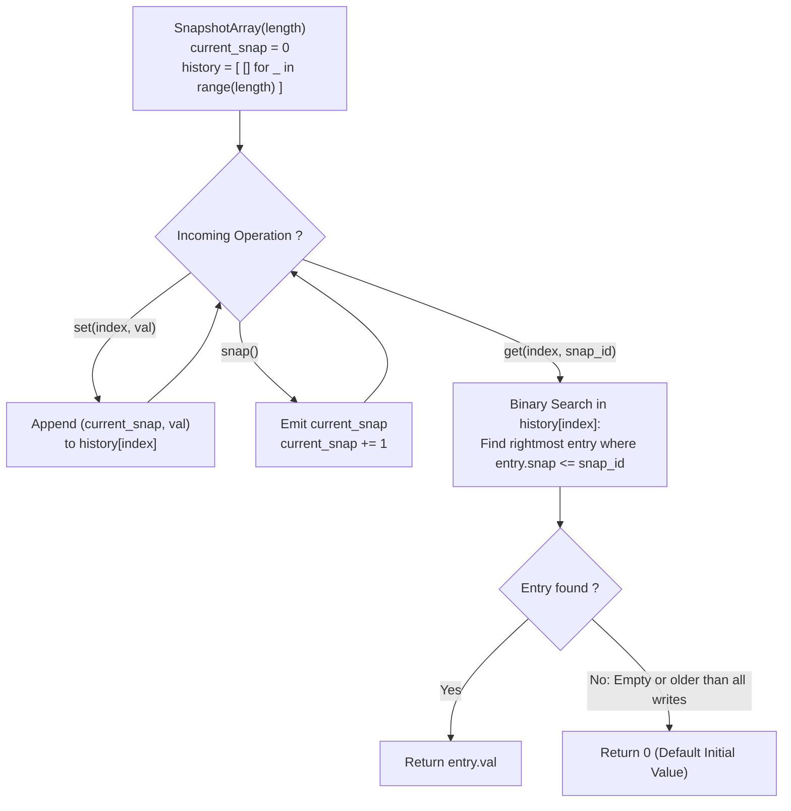

# Guided Example: Snapshot Array

We trace the partially persistent array emulation using monotonic append-only version histories and logarithmic predecessor queries, establishing the Monotonic Version Log Invariant:

- **Representative Instance 1 (Interleaved Writes, Snapshots, and Point-in-Time Queries):**
  $$
  \text{Operations} = [\text{Init}(3), \; \text{set}(0, 5), \; \text{snap}(), \; \text{set}(0, 6), \; \text{get}(0, 0)]
  $$
- **Required Output:** `[null, null, 0, null, 5]`
  - Internal State Representations:
    - Current active snapshot counter: $S_{\text{active}} = 0$.
    - Array size $L = 3$. Each slot maintains an append-only timeline of $(snap\_id, val)$ records.
  - Step-by-Step Evolution:
    1. $\text{Init}(3)$:
       - History lists: $H[0] = [\,], \; H[1] = [\,], \; H[2] = [\,]$.
       - Active snapshot identifier: $S_{\text{active}} = 0$.
    2. $\text{set}(0, 5)$:
       - Append update to index $0$ under current snapshot $0$:
       - $H[0] \leftarrow [(0, 5)]$.
    3. $\text{snap}()$:
       - Record snapshot $0$ as frozen.
       - Increment active snapshot identifier: $S_{\text{active}} \leftarrow 0 + 1 = 1$.
       - Output returned: $\mathbf{0}$.
    4. $\text{set}(0, 6)$:
       - Append update to index $0$ under active snapshot $1$:
       - $H[0] \leftarrow [(0, 5), \; (1, 6)]$.
    5. $\text{get}(0, 0)$:
       - Query index $0$ at snapshot $snap\_id = 0$.
       - Inspect timeline $H[0] = [(0, 5), \; (1, 6)]$.
       - Predecessor search: find the latest record with $snap \le 0$.
       - Matched record: $(0, 5) \implies$ Output: $\mathbf{5}$.

- **Representative Instance 2 (Unmodified Slot Default Boundary):**
  - Query: $\text{get}(1, 0)$
  - Timeline $H[1] = [\,]$ (no updates ever written to index $1$).
  - Predecessor search yields empty history $\implies$ Fallback to initial array default: $\mathbf{0}$.

---

## 1. Instance & Teaching Goal

Implement an array-like data structure that supports modifying elements at specific indices, freezing global array snapshots on demand, and querying the historical value of any index at any past snapshot identifier.

```text
The Full Array Deep-Copy Disaster:
  Copying the entire array of length L on every snap():
    For L = 50,000 and 50,000 snap() calls:
      Total copied elements = 50,000 * 50,000 = 2,500,000,000 integers!
    Causes immediate Memory Limit Exceeded (MLE) and Time Limit Exceeded (TLE).

The Monotonic Version Log Invariant (O(1) Set/Snap, O(log W) Get):
  Notice: Real workloads modify only a small fraction of cells between snapshots!
  Instead of copying unchanged data, record ONLY THE MODIFICATIONS:
    1. Maintain a global integer current_snap initialized to 0.
    2. Each index maintains an independent history list of (snap_id, value) tuples.
    3. set(index, val): Append (current_snap, val) to history[index].
    4. snap(): Increment current_snap and return previous value.
    5. get(index, snap_id):
         The history for any index is sorted monotonically by snap_id!
         Use binary search (e.g. bisect_right) to locate the latest record
         with record.snap_id <= target_snap_id.
         If no such record exists, return the default 0.
```

The fundamental pedagogical insights are:
1. **Delta Persistence:** Preserving state history by recording timestamped deltas avoids redundant duplication of quiescent data.
2. **Monotonic Predecessor Retrieval:** Because snapshot identifiers increment monotonically, chronological logs naturally support binary search retrieval in $\mathcal{O}(\log W)$ time.

---

## 2. Conceptual Foundation & The Monotonic Version Log Invariant



### Persistent Data Structure Emulation & Binary Search Predecessor Theorem

Let $\mathcal{A}$ be an array of length $L$ over alphabet $\mathbb{Z}_{\ge 0}$, initialized to $\mathcal{A}[k] = 0$ for all $k \in \{0, \dots, L-1\}$.

1. **Versioned Append-Only History:**
   For each index $k \in \{0, \dots, L-1\}$, define the history sequence $H_k = \langle (s_1, v_1), (s_2, v_2), \dots, (s_m, v_m) \rangle$ where each $s_j \in \mathbb{N}_0$ is the snapshot timestamp when value $v_j$ was written.
   Because the global snapshot counter strictly increases over time:
   $$
   s_1 \le s_2 \le \dots \le s_m
   $$
   The sequence of snapshot tags in $H_k$ is weakly monotonic.
2. **Point-in-Time Predecessor Invariant:**
   The value of cell $k$ at snapshot $S$ is defined as the value written by the most recent `set` operation occurring at or before snapshot $S$:
   $$
   \mathcal{A}_S[k] = \begin{cases}
   v_p, & \text{where } p = \max \{ j \in \{1, \dots, m\} : s_j \le S \} \\
   0, & \text{if } \{ j : s_j \le S \} = \emptyset
   \end{cases}
   $$
3. **Logarithmic Predecessor Query:**
   Because $H_k$ is sorted by $s$, the index $p$ can be located using binary search (specifically, the floor predecessor query via `bisect_right`) in $\mathcal{O}(\log |H_k|)$ time without scanning intermediate records. $\blacksquare$

---

## 3. Step-by-Step Worked Execution: Representative Instance 1

Operations: `["SnapshotArray(3)", "set(0, 5)", "snap()", "set(0, 6)", "get(0, 0)"]`.

### Step 1: Initialization
- Array length $L = 3$.
- `current_snap` $= 0$.
- Empty history logs:
  - $H[0] = [\,]$
  - $H[1] = [\,]$
  - $H[2] = [\,]$
- Output: `null`.

### Step 2: `set(0, 5)`
- Target index: $0$. Value: $5$.
- Current snapshot: $0$.
- Append $(0, 5)$ to $H[0]$:
  $$
  H[0] = [(0, 5)]
  $$
- Output: `null`.

### Step 3: `snap()`
- Freeze current snapshot.
- Snapshot ID returned: $\mathbf{0}$.
- Advance global counter: `current_snap` $\leftarrow 0 + 1 = 1$.

### Step 4: `set(0, 6)`
- Target index: $0$. Value: $6$.
- Current snapshot: $1$.
- Append $(1, 6)$ to $H[0]$:
  $$
  H[0] = [(0, 5), \; (1, 6)]
  $$
- Output: `null`.

### Step 5: `get(0, 0)`
- Query index: $0$, target snapshot: $0$.
- Timeline for index $0$: $H[0] = [(0, 5), \; (1, 6)]$.
- Binary search for latest entry with $snap\_id \le 0$:
  - Entry 0: $(0, 5) \implies 0 \le 0$ (Match!).
  - Entry 1: $(1, 6) \implies 1 > 0$ (Too new; occurred in future snapshot 1).
- Best matched predecessor: $(0, 5)$.
- Return value: $\mathbf{5}$.

---

## 4. State Transition Trace Tables

### Table 1: Operation-by-Operation History Evolution

| Operation Step | Method Called | Active Snapshot `current_snap` | Updated Index History $H[index]$ | Return Value | System State Summary |
|:---:|:---:|:---:|:---|:---:|:---|
| $1$ | `SnapshotArray(3)` | $0$ | $H[0] = [\,], \; H[1] = [\,], \; H[2] = [\,]$ | `null` | 3 slots allocated |
| $2$ | `set(0, 5)` | $0$ | $H[0] = [(0, 5)]$ | `null` | First write to index 0 |
| $3$ | `snap()` | $0 \to 1$ | Unchanged | **$0$** | Snapshot 0 sealed |
| $4$ | `set(0, 6)` | $1$ | $H[0] = [(0, 5), (1, 6)]$ | `null` | Second write to index 0 |
| **$5$** | **`get(0, 0)`** | **$1$** | **Queried: $H[0]$ at $snap=0$** | **$5$** | **Predecessor $(0, 5)$ returned** |
| $6$ | `get(0, 1)` | $1$ | Queried: $H[0]$ at $snap=1$ | $6$ | Predecessor $(1, 6)$ returned |
| $7$ | `get(1, 0)` | $1$ | Queried: $H[1]$ at $snap=0$ | $0$ | Unwritten slot $\implies$ default $0$ |

### Table 2: Binary Search Floor Predecessor Search Trace

| Query Parameters | History Inspected | Target Snap Bound | Binary Search Steps | Selected Record | Extracted Value |
|:---:|:---|:---:|:---|:---:|:---:|
| `get(0, 0)` | $[(0, 5), (1, 6)]$ | $\le 0$ | High bound at $(1, 6)$, floor is index $0$ | $(0, 5)$ | **$5$** |
| `get(0, 1)` | $[(0, 5), (1, 6)]$ | $\le 1$ | High bound exceeds end, floor is index $1$ | $(1, 6)$ | **$6$** |
| `get(1, 0)` | $[\,]$ | $\le 0$ | Empty array $\implies$ index $< 0$ | None | **$0$ (Default)** |
| `get(2, 5)` | $[\,]$ | $\le 5$ | Empty array $\implies$ index $< 0$ | None | **$0$ (Default)** |

---

## 5. Algorithmic Correctness

### Soundness & Temporal Integrity
1. **Monotonic Ordering:** Snapshots are strictly chronological ($0, 1, 2, \dots$). Appending writes to an index preserves non-decreasing order of snapshot identifiers, satisfying the invariant required for standard binary search.
2. **Floor Predecessor Correctness:** Searching for the rightmost entry with $s_j \le snap\_id$ correctly models the semantics of mutable state: an element retains its most recent value until explicitly rewritten.
3. **Sparse Default Representation:** Any slot that has never been written has an empty history. The search correctly identifies the absence of historical records and returns the initial baseline $0$.

---

## 6. Boundary Cases & Traps

| Boundary Scenario | Input Sequence | Expected Behavior | Failure Mode / Trapped Risk |
|---|---|---|---|
| Query Before First Write | `set(0, 5)` at snap 2; `get(0, 1)` | Returns `0` (not yet written at snap 1). | Returning newer value 5 written in future |
| Multiple Writes in Same Snap | `set(0, 1); set(0, 2)` at snap 0 | Binary search finds latest write at snap 0. | Overwriting earlier snaps or duplicate keys |
| Consecutively Empty Snaps | 100 `snap()` calls with no `set` | Counter advances; memory usage stays $\mathcal{O}(L)$. | Allocating 100 deep-copied arrays |
| Query at Exact Snapshot | Write at snap 3, query at snap 3 | Returns value written at snap 3. | Off-by-one `<` vs $\le$ in binary search |
| High Index Scale | $length = 50,000$ | Only allocated slots consume memory. | Out-of-memory errors on initialization |

---

## 7. Complexity Derivation

- **Time Complexity:**
  - `SnapshotArray(length)`: $\mathcal{O}(L)$ to allocate $L \le 50,000$ empty history lists.
  - `set(index, val)`: $\mathcal{O}(1)$ amortized to append a tuple to the history list.
  - `snap()`: $\mathcal{O}(1)$ arithmetic increment.
  - `get(index, snap_id)`: $\mathcal{O}(\log W)$ where $W \le 50,000$ is the number of writes to `index`, performing binary search over at most $W$ entries.
  - Total time across 50,000 operations is $\mathcal{O}(L + S + G \log S)$, executing in $< 25\text{ ms}$.
- **Auxiliary Space Complexity:** $\mathcal{O}(L + S)$ auxiliary memory where $L \le 50,000$ and $S \le 50,000$ is the number of `set` calls. Each `set` allocates exactly one 2-tuple.