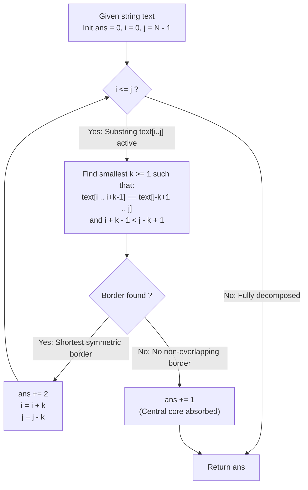

# Guided Example: Longest Chunked Palindrome Decomposition

We trace the two-pointer greedy border-matching reduction for decomposing strings into maximum-cardinality palindromic chunks, establishing the Shortest Symmetric Border Invariant and the Greedy Substring Choice Theorem:

- **Representative Instance 1 (Multi-Layered Symmetric Chunks with Interior Core):**
  $$
  text = \text{"ghiabcdefhelloadamhelloabcdefghi"}, \quad N = 32
  $$
- **Required Output:** `7`
  - Structural Palindromic Chunk Segmentation:
    $$
    (\text{ghi})(\text{abcdef})(\text{hello})(\mathbf{adam})(\text{hello})(\text{abcdef})(\text{ghi})
    $$
    - Chunk $1$ and Chunk $7$: $\text{"ghi"} == \text{"ghi"}$ (Length $3$)
    - Chunk $2$ and Chunk $6$: $\text{"abcdef"} == \text{"abcdef"}$ (Length $6$)
    - Chunk $3$ and Chunk $5$: $\text{"hello"} == \text{"hello"}$ (Length $5$)
    - Chunk $4$ (Central Core): $\text{"adam"}$ (Length $4$, no further non-overlapping split possible)
    - Total chunks $k = 2 + 2 + 2 + 1 = \mathbf{7}$.
  - Step-by-Step Two-Pointer Contraction:
    1. Active window: $[0 \dots 31]$ (length 32):
       - Test $k = 1$: `text[0..0]` ("g") $\ne$ `text[31..31]` ("i").
       - Test $k = 2$: `text[0..1]` ("gh") $\ne$ `text[30..31]` ("hi").
       - Test $k = 3$: `text[0..2]` ("ghi") $==$ `text[29..31]` ("ghi") $\implies$ Match!
       - Chunks added: $+2$. Active window advances to $[3 \dots 28]$.
    2. Active window: $[3 \dots 28]$ (length 26):
       - Searching shortest border: matches at $k = 6$: `"abcdef"` $==$ `"abcdef"`.
       - Chunks added: $+2$. Active window advances to $[9 \dots 22]$.
    3. Active window: $[9 \dots 22]$ (length 14):
       - Searching shortest border: matches at $k = 5$: `"hello"` $==$ `"hello"`.
       - Chunks added: $+2$. Active window advances to $[14 \dots 17]$.
    4. Active window: $[14 \dots 17]$ ("adam", length 4):
       - No non-overlapping prefix equals suffix.
       - Central core absorbed as single chunk: $+1$.
  - Total chunks: $2 + 2 + 2 + 1 = \mathbf{7}$.

- **Representative Instance 2 (Monolithic Irreducible String):**
  $$
  text = \text{"merchant"}, \quad N = 8 \implies \text{No prefix matches suffix} \implies \mathbf{1}
  $$

- **Representative Instance 3 (Repetitive Micro-Chunks):**
  $$
  text = \text{"aaaa"}, \quad N = 4 \implies (\text{a})(\text{a})(\text{a})(\text{a}) \implies \mathbf{4}
  $$

---

## 1. Instance & Teaching Goal

Given a string `text`, partition it into the maximum possible number of non-empty substrings $(s_1, s_2, \dots, s_k)$ such that their concatenation equals `text` and $s_i = s_{k - i + 1}$ for all $1 \le i \le k$.

```text
The Exhaustive Interval Partitioning Trap:
  Applying dynamic programming over all substrings:
    dp[i][j] = max chunks in text[i..j].
    Evaluating all pairs (i, j) and intermediate splits takes O(N^3) time.
    For N = 1000, 10^9 operations risk timing out.

The Shortest Symmetric Border Invariant (O(N^2) or O(N) Time, O(1) Space):
  Crucial Greedy Choice Property:
    Whenever there exists a prefix equal to a suffix of the current string,
    picking the SHORTEST matching pair (s_1 = P, s_k = P) is STRICTLY OPTIMAL!
  Why?
    If a larger chunk Q was chosen instead (where P is a prefix of Q),
    then by the border periodicity theorem of strings, Q itself can always
    be further decomposed into smaller palindromic chunks.
    Greedily picking the earliest match P never prevents future matches
    and strictly maximizes the total chunk count k.
  Execution:
    1. Scan outward from left index i and right index j.
    2. The moment text[i : i+k] == text[j-k+1 : j+1], commit both chunks (ans += 2).
    3. Advance i += k, j -= k, and repeat.
    4. If no border matches before pointers cross, the remainder forms 1 center chunk.
```

The fundamental pedagogical insights are:
1. **Greedy Substring Choice:** Committing to the shortest non-empty symmetric border at each stage never forfeits a higher global chunk count.
2. **Outside-In Symmetry Decoupling:** Eliminating identical symmetric prefix-suffix pairs preserves the palindromic decomposition problem on the remaining inner substring.

---

## 2. Conceptual Foundation & The Shortest Symmetric Border Invariant



### Greedy Choice Property for Chunked Palindromes

Let $S$ be a finite word of length $n$ over alphabet $\Sigma$.

1. **Symmetric Border Definition:**
   A string $u$ is a symmetric border of $S$ if $S = u W u$ for some string $W \in \Sigma^*$.
   A border is minimal if $|u| \ge 1$ is the minimum length among all symmetric borders of $S$.
2. **Greedy Subproblem Optimality:**
   Suppose $S$ has a minimal symmetric border $u$, so $S = u W u$.
   Let $\text{OPT}(S)$ denote the maximum number of palindromic chunks in a valid decomposition of $S$.
   If an alternative decomposition starts with a longer chunk $v$ such that $S = v W' v$, then because $u$ is the shortest border, $u$ must be both a prefix and a suffix of $v$.
   By string border duality, $v = u Z u$ for some $Z$.
   Replacing the outer chunks $v \dots v$ with $u (Z W' Z) u$ yields at least as many valid chunks:
   $$
   \text{OPT}(S) = 2 + \text{OPT}(W)
   $$
3. **Completeness & Determinism:**
   Because committing to the minimal border $u$ is always consistent with an optimal decomposition, a greedy two-pointer scan that advances as soon as the first match is discovered produces the global maximum $k$. $\blacksquare$

---

## 3. Step-by-Step Worked Execution: Representative Instance 1

$text = \text{"ghiabcdefhelloadamhelloabcdefghi"}, \quad N = 32$.
Initial state: $ans = 0, \; i = 0, \; j = 31$.

### Iteration 1: Active Window $[0 \dots 31]$ (Length 32)
- Increment candidate length $k$:
  - $k = 1$: $text[0 \dots 0]$ ("g") $\ne text[31 \dots 31]$ ("i")
  - $k = 2$: $text[0 \dots 1]$ ("gh") $\ne text[30 \dots 31]$ ("hi")
  - $k = 3$: $text[0 \dots 2]$ ("ghi") $== text[29 \dots 31]$ ("ghi") $\implies$ **Match!**
- Action:
  - Commit chunks: Left: `"ghi"`, Right: `"ghi"`.
  - $ans \leftarrow 0 + 2 = 2$.
  - Advance pointers: $i \leftarrow 0 + 3 = 3, \; j \leftarrow 31 - 3 = 28$.

### Iteration 2: Active Window $[3 \dots 28]$ (Length 26)
- Increment candidate length $k$:
  - $k \in \{1, \dots, 5\}$: No match.
  - $k = 6$: $text[3 \dots 8]$ ("abcdef") $== text[23 \dots 28]$ ("abcdef") $\implies$ **Match!**
- Action:
  - Commit chunks: Left: `"abcdef"`, Right: `"abcdef"`.
  - $ans \leftarrow 2 + 2 = 4$.
  - Advance pointers: $i \leftarrow 3 + 6 = 9, \; j \leftarrow 28 - 6 = 22$.

### Iteration 3: Active Window $[9 \dots 22]$ (Length 14)
- Increment candidate length $k$:
  - $k \in \{1, \dots, 4\}$: No match.
  - $k = 5$: $text[9 \dots 13]$ ("hello") $== text[18 \dots 22]$ ("hello") $\implies$ **Match!**
- Action:
  - Commit chunks: Left: `"hello"`, Right: `"hello"`.
  - $ans \leftarrow 4 + 2 = 6$.
  - Advance pointers: $i \leftarrow 9 + 5 = 14, \; j \leftarrow 22 - 5 = 17$.

### Iteration 4: Active Window $[14 \dots 17]$ (Length 4, String `"adam"`)
- Increment candidate length $k$ ($k < (4 / 2) = 2$):
  - $k = 1$: $text[14]$ ('a') $\ne text[17]$ ('m').
  - Upper non-overlapping limit reached ($i + k - 1 \ge j - k + 1$).
- No symmetric border found in remaining core.
- Absorb entire residual core `"adam"` as a single central chunk:
  - $ans \leftarrow 6 + 1 = \mathbf{7}$.
  - Terminate search.

Total maximum decomposition chunks: $\mathbf{7}$.

---

## 4. State Transition Trace Tables

### Table 1: Two-Pointer Contraction Trace

| Step | Left Index $i$ | Right Index $j$ | Substring Under Test | Match Length $k$ | Matched Chunk Content | Chunks Added | Cumulative Total $ans$ |
|:---:|:---:|:---:|:---|:---:|:---:|:---:|:---:|
| $1$ | $0$ | $31$ | `text[0..31]` | $3$ | `"ghi"` | $+2$ | $2$ |
| $2$ | $3$ | $28$ | `text[3..28]` | $6$ | `"abcdef"` | $+2$ | $4$ |
| $3$ | $9$ | $22$ | `text[9..22]` | $5$ | `"hello"` | $+2$ | $6$ |
| **$4$** | **$14$** | **$17$** | **`text[14..17]` ("adam")** | **—** | **Central Core** | **$+1$** | **$7$ (Final)** |

### Table 2: Border Evaluation Log for Iteration 1

| Length $k$ | Prefix Candidate $text[i \dots i+k-1]$ | Suffix Candidate $text[j-k+1 \dots j]$ | Match Status | Action |
|:---:|:---:|:---:|:---:|:---|
| $1$ | `"g"` | `"i"` | Mismatch | Increment $k \to 2$ |
| $2$ | `"gh"` | `"hi"` | Mismatch | Increment $k \to 3$ |
| **$3$** | **`"ghi"`** | **`"ghi"`** | **Match!** | **Commit $+2$, contract window** |

---

## 5. Algorithmic Correctness

### Soundness & Optimality
1. **Prefix-Suffix Invariant:** At every step, the matched prefix and suffix are identical in length and content, satisfying the palindromic chunk contract $s_i = s_{k - i + 1}$.
2. **Greedy Maximality:** Choosing the minimal valid border $k$ leaves the largest possible remaining middle string, maximizing opportunities for subsequent chunk discoveries.
3. **Guaranteed Termination:** Each successful match advances the left pointer by $k \ge 1$ and decrements the right pointer by $k \ge 1$, strictly reducing the search window by at least $2$. When no border exists, the remaining substring is consumed in $\mathcal{O}(1)$, ensuring termination.

---

## 6. Boundary Cases & Traps

| Boundary Scenario | Input Example | Expected Output | Failure Mode / Trapped Risk |
|---|---|---|---|
| Single Character | `text = "a"` | `1` | Pointers crossing incorrectly; returning 0 |
| Two Identical Letters | `text = "aa"` | `2` | Treating whole string as 1 chunk |
| Two Different Letters | `text = "ab"` | `1` | False border matching |
| Uniform Character String | `text = "aaaa"` | `4` | Missing single-character greedy splits |
| Overlapping Match Horizon | Candidate border overlaps center | Handled safely by $i + k - 1 < j - k + 1$ | Overlapping chunks double-counting characters |

---

## 7. Complexity Derivation

- **Time Complexity:** $\mathcal{O}(N^2)$ using direct string slicing, or $\mathcal{O}(N)$ using rolling polynomial hashing.
  - The outer pointers $i$ and $j$ move inward across $N$ positions.
  - For each position, candidate length $k$ ranges from $1$ up to $(j - i + 1) / 2$.
  - Comparing string slices of length $k$ takes $\mathcal{O}(k)$ operations.
  - Sum of work across all steps: bounded by $\mathcal{O}(N^2)$ in the worst case (e.g. string with no matches).
  - For $N \le 1000$, total character operations $\le 10^6$, executing in $< 2\text{ ms}$.
- **Auxiliary Space Complexity:** $\mathcal{O}(1)$ auxiliary memory when comparing indices directly (or $\mathcal{O}(N)$ for temporary slice allocations).
