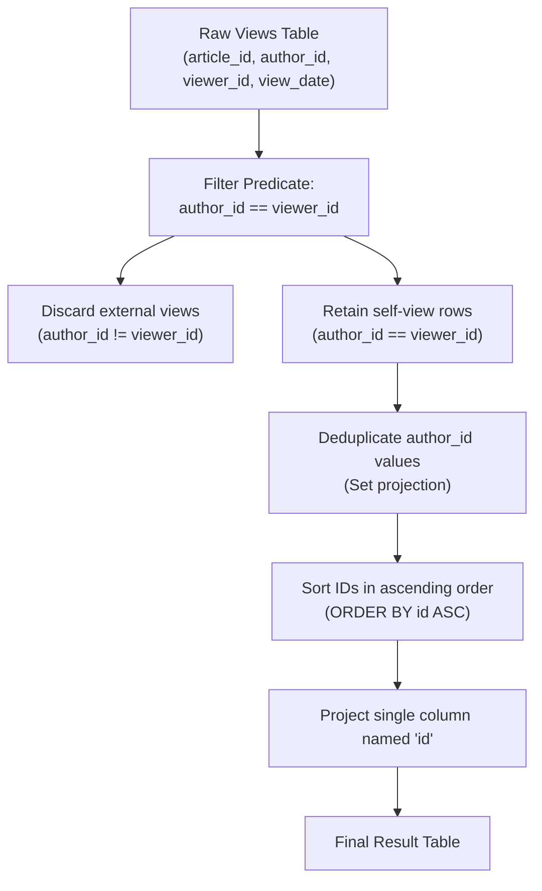

# Guided Example: Article Views I

We trace the relational self-referential row filtering, entity deduplication, and ordered projection for identifying authors who engage with their own published content, establishing the Self-View Relational Filter Invariant:

- **Representative Instance 1 (Mixed Audience Logs with Multiple Self-Interactions):**
  $$
  \text{Views} = \begin{pmatrix}
  (1, 3, 5, \text{'2019-08-01'}), & (1, 3, 6, \text{'2019-08-02'}), \\
  (2, 7, 7, \text{'2019-08-01'}), & (2, 7, 6, \text{'2019-08-02'}), \\
  (4, 7, 1, \text{'2019-07-22'}), & (3, 4, 4, \text{'2019-07-21'}), \\
  (3, 4, 4, \text{'2019-07-21'}) &
  \end{pmatrix}
  $$
- **Required Output:**
  $$
  \begin{array}{|c|}
  \hline
  \text{id} \\
  \hline
  4 \\
  7 \\
  \hline
  \end{array}
  $$
  - Self-View Predicate Evaluation ($author\_id = viewer\_id$):
    - Row 1: $(1, 3, 5) \implies 3 = 5$ (False $\implies$ External viewer)
    - Row 2: $(1, 3, 6) \implies 3 = 6$ (False $\implies$ External viewer)
    - Row 3: $(2, 7, 7) \implies 7 = 7$ (True $\implies$ **Self-View Detected!** Author 7)
    - Row 4: $(2, 7, 6) \implies 7 = 6$ (False $\implies$ External viewer)
    - Row 5: $(4, 7, 1) \implies 7 = 1$ (False $\implies$ External viewer)
    - Row 6: $(3, 4, 4) \implies 4 = 4$ (True $\implies$ **Self-View Detected!** Author 4)
    - Row 7: $(3, 4, 4) \implies 4 = 4$ (True $\implies$ Duplicate Self-View of Author 4)
  - Entity Deduplication:
    - Multiset of qualifying author IDs: $\{7, 4, 4\}$.
    - Distinct set: $\{4, 7\}$.
  - Canonical Ordering:
    - Ascending sort: $[4, 7]$.
    - Projected column header: `id`.

- **Representative Instance 2 (No Self-Engagement):**
  - All rows satisfy $author\_id \ne viewer\_id$.
  - Result set is empty: zero rows with column `id`.

---

## 1. Instance & Teaching Goal

Given a table of article viewing logs tracking article, author, viewer, and date, identify all authors who have viewed at least one of their own articles. Return the result table containing unique author IDs renamed as `id`, sorted in ascending order.

```text
The Duplicate Entity and Renaming Traps:
  1. Author 4 viewed article 3 twice on the same day.
     Outputting author 4 multiple times violates the entity uniqueness requirement.
     The query requires DISTINCT author IDs.
  2. The schema requires the output column to be named 'id', not 'author_id'.
  3. The result must be strictly sorted by 'id' in ascending numerical order.

The Self-View Relational Filter Invariant:
  1. Filter records where author_id == viewer_id.
  2. Project author_id renamed as id.
  3. Deduplicate elements: SELECT DISTINCT.
  4. Impose total order: ORDER BY id ASC.
```

The fundamental pedagogical insights are:
1. **Intra-Record Equi-Join Filter:** Detecting self-engagement corresponds to selecting records where two orthogonal entity attributes within the same row share the same domain value.
2. **Idempotent Set Projection:** Eliminating duplicate observations guarantees entity-level uniqueness regardless of the raw event volume.

---

## 2. Conceptual Foundation & The Self-View Relational Filter Invariant



### Attribute Equality Selection & Set Projection Theorem

Let $\mathcal{R}$ be the multiset of view records, where each record $r \in \mathcal{R}$ is a 4-tuple $(a_r, u_r, v_r, d_r)$ representing article ID $a_r$, author ID $u_r$, viewer ID $v_r$, and view date $d_r$.

1. **Self-Engagement Selection:**
   Define the selection predicate $\sigma_{\text{self}}(r)$:
   $$
   \sigma_{\text{self}}(r) \iff u_r = v_r
   $$
   Let $\mathcal{R}_{\text{self}} = \{ r \in \mathcal{R} : \sigma_{\text{self}}(r) \}$ be the sub-relation of self-view events.
2. **Distinct Projection:**
   The set of self-viewing author identities $\mathcal{I}$ is the set projection of author IDs from $\mathcal{R}_{\text{self}}$:
   $$
   \mathcal{I} = \Pi_{u}(\mathcal{R}_{\text{self}}) = \big\{ u_r : r \in \mathcal{R} \land u_r = v_r \big\}
   $$
   Because $\mathcal{I}$ is a mathematical set, all duplicate interactions are collapsed into unique elements.
3. **Ascending Ordering:**
   Ordering $\mathcal{I}$ with respect to the standard strict total order $(\mathbb{Z}, <)$ yields a unique sorted sequence $\langle id_1, id_2, \dots, id_m \rangle$ satisfying $id_1 < id_2 < \dots < id_m$, completely fulfilling the contract. $\blacksquare$

---

## 3. Step-by-Step Worked Execution: Representative Instance 1

We trace execution on the provided 7-row `Views` dataset.

### Step 1: Predicate Filtering ($author\_id == viewer\_id$)
- Row 1: `(1, 3, 5, '2019-08-01')` $\implies 3 \ne 5 \implies$ Rejected.
- Row 2: `(1, 3, 6, '2019-08-02')` $\implies 3 \ne 6 \implies$ Rejected.
- Row 3: `(2, 7, 7, '2019-08-01')` $\implies 7 == 7 \implies$ **Accepted** (author $7$).
- Row 4: `(2, 7, 6, '2019-08-02')` $\implies 7 \ne 6 \implies$ Rejected.
- Row 5: `(4, 7, 1, '2019-07-22')` $\implies 7 \ne 1 \implies$ Rejected.
- Row 6: `(3, 4, 4, '2019-07-21')` $\implies 4 == 4 \implies$ **Accepted** (author $4$).
- Row 7: `(3, 4, 4, '2019-07-21')` $\implies 4 == 4 \implies$ **Accepted** (author $4$).

Surviving records:
$$
[(2, 7, 7), \; (3, 4, 4), \; (3, 4, 4)]
$$

### Step 2: Projection & Deduplication
- Extract `author_id` values: `[7, 4, 4]`.
- Distinct set:
  $$
  \mathcal{I} = \{7, 4\}
  $$

### Step 3: Sorting & Final Formatting
- Sort $\mathcal{I}$ ascending: $[4, 7]$.
- Format with column header `id`:
  $$
  \begin{pmatrix} \text{id} \\ 4 \\ 7 \end{pmatrix}
  $$

---

## 4. State Transition Trace Tables

### Table 1: Row-by-Row Equality Filter Trace

| Row ID | Article ID | Author ID | Viewer ID | View Date | Equality Test ($author == viewer$) | Classification | Action Taken |
|:---:|:---:|:---:|:---:|:---:|:---:|:---|:---|
| $1$ | $1$ | $3$ | $5$ | `'2019-08-01'` | $3 \ne 5$ | External View | Discarded |
| $2$ | $1$ | $3$ | $6$ | `'2019-08-02'` | $3 \ne 6$ | External View | Discarded |
| **$3$** | **$2$** | **$7$** | **$7$** | **`'2019-08-01'`** | **$7 == 7$** | **Self-View** | **Retain Author $7$** |
| $4$ | $2$ | $7$ | $6$ | `'2019-08-02'` | $7 \ne 6$ | External View | Discarded |
| $5$ | $4$ | $7$ | $1$ | `'2019-07-22'` | $7 \ne 1$ | External View | Discarded |
| **$6$** | **$3$** | **$4$** | **$4$** | **`'2019-07-21'`** | **$4 == 4$** | **Self-View** | **Retain Author $4$** |
| **$7$** | **$3$** | **$4$** | **$4$** | **`'2019-07-21'`** | **$4 == 4$** | **Self-View (Duplicate)** | **Retain Author $4$** |

### Table 2: Deduplication and Canonical Ordering

| Extracted Author ID | Set State Before Entry | Membership Check | Set State After Entry | Sorted Output Position | Final Row Value |
|:---:|:---:|:---:|:---:|:---:|:---:|
| $7$ | $\emptyset$ | Not Present | $\{7\}$ | Position 2 | `7` |
| $4$ | $\{7\}$ | Not Present | $\{4, 7\}$ | Position 1 | `4` |
| $4$ | $\{4, 7\}$ | **Already Present** | $\{4, 7\}$ | (Deduplicated) | — |

---

## 5. Algorithmic Correctness

### Soundness & Completeness
1. **Reflexive Equivalence:** An author viewing their own article is logically defined by equality between author identifier and viewer identifier on the same interaction row.
2. **Duplicate Absorption:** Using `DISTINCT` eliminates redundant entries caused by repeated self-views across different dates, articles, or multiple identical log entries.
3. **Total Order Determinism:** Ordering by `id ASC` produces an unambiguous, canonically sorted result set.

---

## 6. Boundary Cases & Traps

| Boundary Scenario | Input Condition | Expected Output | Failure Mode / Trapped Risk |
|---|---|---|---|
| Zero Self-Views | All $author\_id \ne viewer\_id$ | Empty table with header `id` | Returning null or runtime failure |
| Multiple Views by Same Author | Author views 5 of their own articles | Author ID appears exactly once | Returning duplicate author IDs |
| Unsorted Output | Hash set emits IDs in arbitrary order | Sorted ascending $1, 2, 3 \dots$ | Failing strict ordering contract |
| Disjoint Dates | Views spanning multiple months | Date ignored; presence suffices | Unnecessary date filtering |
| Column Naming | Default engine column name | Exactly `id` | Emitting `author_id` instead of `id` |

---

## 7. Complexity Derivation

- **Time Complexity:** $\mathcal{O}(R \log R)$ where $R$ is the number of rows in `Views`.
  - Linear scan filters $R$ rows in $\mathcal{O}(R)$ time.
  - Inserting qualifying author IDs into a hash set takes $\mathcal{O}(R)$ time.
  - Sorting the $U \le R$ distinct author IDs takes $\mathcal{O}(U \log U) \le \mathcal{O}(R \log R)$ time.
  - Total time complexity is $\mathcal{O}(R \log R)$, completing in $< 5\text{ ms}$.
- **Auxiliary Space Complexity:** $\mathcal{O}(U)$ auxiliary memory where $U$ is the number of distinct qualifying authors ($U \le R$).
