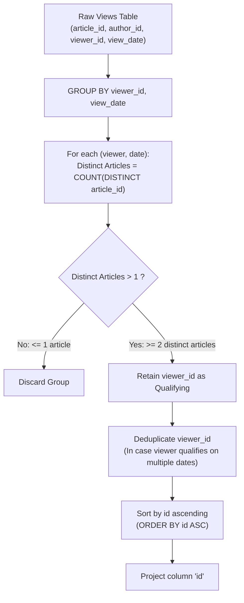

# Guided Example: Article Views II

We trace the composite relational grouping, intraday article deduplication, and conditional entity projection for finding users who consume multiple distinct articles on a single date, establishing the Intraday Multi-Article Grain Invariant:

- **Representative Instance 1 (Mixed Readers with Multi-Article and Duplicate-View Days):**
  $$
  \text{Views} = \begin{pmatrix}
  (1, 3, 5, \text{'2019-08-01'}), & (3, 4, 5, \text{'2019-08-01'}), \\
  (1, 3, 6, \text{'2019-08-02'}), & (2, 7, 7, \text{'2019-08-01'}), \\
  (2, 7, 6, \text{'2019-08-02'}), & (4, 7, 1, \text{'2019-07-22'}), \\
  (3, 4, 4, \text{'2019-07-21'}), & (3, 4, 4, \text{'2019-07-21'})
  \end{pmatrix}
  $$
- **Required Output:**
  $$
  \begin{array}{|c|}
  \hline
  \text{id} \\
  \hline
  5 \\
  6 \\
  \hline
  \end{array}
  $$
  - Composite Partitioning by $(viewer\_id, view\_date)$:
    - **Viewer $5$ on $\text{'2019-08-01'}$:**
      - Articles viewed: $\{1, 3\}$
      - Distinct article count $= 2$ ($2 > 1 \implies \mathbf{Qualifies}$)
    - **Viewer $6$ on $\text{'2019-08-02'}$:**
      - Articles viewed: $\{1, 2\}$
      - Distinct article count $= 2$ ($2 > 1 \implies \mathbf{Qualifies}$)
    - **Viewer $7$ on $\text{'2019-08-01'}$:**
      - Articles viewed: $\{2\} \implies \text{Count} = 1$ ($1 \ngtr 1 \implies \text{Disqualified}$)
    - **Viewer $1$ on $\text{'2019-07-22'}$:**
      - Articles viewed: $\{4\} \implies \text{Count} = 1$ ($1 \ngtr 1 \implies \text{Disqualified}$)
    - **Viewer $4$ on $\text{'2019-07-21'}$:**
      - Viewed article $3$ twice in two separate log records.
      - Distinct articles: $\{3\} \implies \text{Count} = 1$ ($1 \ngtr 1 \implies \text{Disqualified}$)
  - Entity Set Projection & Canonical Ordering:
    - Qualifying IDs: $\{5, 6\}$.
    - Ascending sort: $[5, 6]$.
    - Projected column header: `id`.

- **Representative Instance 2 (Cross-Day Reader Fallacy Boundary):**
  - A user views article $10$ on Monday and article $20$ on Tuesday.
  - On Monday: count $= 1$. On Tuesday: count $= 1$.
  - The user NEVER viewed $> 1$ article on the same date $\implies$ Disqualified.

---

## 1. Instance & Teaching Goal

Given a reading event log, find all viewers who viewed more than one distinct article on the same date. Return the result table containing unique viewer IDs named `id`, sorted in ascending order.

```text
The Repeated Article Grain Fallacy:
  Viewer 4 viewed article 3 twice on 2019-07-21 (two rows in Views).
  Counting raw rows: COUNT(*) = 2.
  Falsely concluding Viewer 4 viewed "more than one article"!
  The contract requires more than one DISTINCT article:
    COUNT(DISTINCT article_id) = 1 (disqualified).

The Cross-Date Aggregation Fallacy:
  Grouping by viewer_id alone without partitioning by view_date:
    A user reading 1 article per day for 5 days would have 5 articles total.
    However, the requirement strictly demands "on the SAME date"!
    Grouping MUST occur at the composite grain (viewer_id, view_date).

The Intraday Multi-Article Grain Invariant:
  1. Group records by the composite key (viewer_id, view_date).
  2. Filter partitions satisfying HAVING COUNT(DISTINCT article_id) > 1.
  3. Extract viewer_id, deduplicate across multiple qualifying dates (SELECT DISTINCT),
     and order canonically (ORDER BY id ASC).
```

The fundamental pedagogical insights are:
1. **Composite Temporal Grouping:** Enforcing "on the same date" requires lifting the aggregation grain to the tuple $(\text{viewer}, \text{date})$.
2. **Double Deduplication:** Deduplicating articles within the daily window prevents repeated clicks from inflating counts, while deduplicating viewer IDs in the outer projection prevents multi-day qualifiers from appearing multiple times.

---

## 2. Conceptual Foundation & The Intraday Multi-Article Invariant



### Composite Grain Cardinality & Projection Deduplication Theorem

Let $\mathcal{V}$ be the multiset of view records, where each record $r \in \mathcal{V}$ is a tuple $(a_r, u_r, v_r, d_r)$ denoting article $a_r$, author $u_r$, viewer $v_r$, and date $d_r$.

1. **Intraday Article Multiset Partition:**
   For each viewer $v$ and date $d$, let $\mathcal{A}(v, d)$ be the set of distinct articles viewed by $v$ on date $d$:
   $$
   \mathcal{A}(v, d) = \big\{ a_r : r \in \mathcal{V} \land v_r = v \land d_r = d \big\}
   $$
2. **Qualification Predicate:**
   A pair $(v, d)$ satisfies the multi-article consumption condition $\mathcal{C}(v, d)$ if and only if:
   $$
   \mathcal{C}(v, d) \iff |\mathcal{A}(v, d)| \ge 2
   $$
3. **Outer Projection & Deduplication:**
   A person $v$ belongs to the result set $\mathcal{Q}$ if there exists at least one date $d$ on which $\mathcal{C}(v, d)$ holds:
   $$
   \mathcal{Q} = \big\{ v \in \Pi_{\text{viewer\_id}}(\mathcal{V}) : \exists d \text{ s.t. } |\mathcal{A}(v, d)| \ge 2 \big\}
   $$
   Because a user might qualify on multiple distinct dates $d_1, d_2$, project $\mathcal{Q}$ as a set to guarantee that each qualifying identifier appears exactly once.
   Sorting $\mathcal{Q}$ produces the strictly ascending result sequence. $\blacksquare$

---

## 3. Step-by-Step Worked Execution: Representative Instance 1

We trace execution on the provided dataset.

### Step 1: Composite Grouping `(viewer_id, view_date)`
Partition the 8 rows into composite buckets:
1. `(viewer_id = 5, view_date = '2019-08-01')`:
   - Rows: $(1, 3, 5), \; (3, 4, 5)$
   - Distinct articles: $\{1, 3\}$
   - Distinct count: $2$.
2. `(viewer_id = 6, view_date = '2019-08-02')`:
   - Rows: $(1, 3, 6), \; (2, 7, 6)$
   - Distinct articles: $\{1, 2\}$
   - Distinct count: $2$.
3. `(viewer_id = 7, view_date = '2019-08-01')`:
   - Rows: $(2, 7, 7)$
   - Distinct articles: $\{2\}$
   - Distinct count: $1$.
4. `(viewer_id = 1, view_date = '2019-07-22')`:
   - Rows: $(4, 7, 1)$
   - Distinct articles: $\{4\}$
   - Distinct count: $1$.
5. `(viewer_id = 4, view_date = '2019-07-21')`:
   - Rows: $(3, 4, 4), \; (3, 4, 4)$
   - Distinct articles: $\{3\}$
   - Distinct count: $1$.

### Step 2: Having Filter (`COUNT(DISTINCT article_id) > 1`)
- Bucket 1 (Viewer 5, `2019-08-01`): $2 > 1 \implies$ **Retain** (Viewer 5)
- Bucket 2 (Viewer 6, `2019-08-02`): $2 > 1 \implies$ **Retain** (Viewer 6)
- Bucket 3 (Viewer 7, `2019-08-01`): $1 > 1 \implies$ Discard
- Bucket 4 (Viewer 1, `2019-07-22`): $1 > 1 \implies$ Discard
- Bucket 5 (Viewer 4, `2019-07-21`): $1 > 1 \implies$ Discard

### Step 3: Projection, Deduplication, and Sorting
- Retained viewer IDs: `[5, 6]`.
- Distinct set: $\{5, 6\}$.
- Sorted ascending: $[5, 6]$.
- Projected as column `id`.

---

## 4. State Transition Trace Tables

### Table 1: Composite Group Evaluation Trace

| Composite Group $(viewer\_id, view\_date)$ | Raw Rows Associated | Set of Distinct Articles $\mathcal{A}(v, d)$ | Cardinality $\lvert \mathcal{A} \rvert$ | Predicate $\lvert \mathcal{A} \rvert > 1$ | Group Status |
|:---:|:---|:---:|:---:|:---:|:---|
| **$(5, \text{'2019-08-01'})$** | Articles $1, 3$ | $\{1, 3\}$ | **$2$** | **True** | **Qualifies (Viewer 5)** |
| **$(6, \text{'2019-08-02'})$** | Articles $1, 2$ | $\{1, 2\}$ | **$2$** | **True** | **Qualifies (Viewer 6)** |
| $(7, \text{'2019-08-01'})$ | Article $2$ | $\{2\}$ | $1$ | False | Discarded |
| $(1, \text{'2019-07-22'})$ | Article $4$ | $\{4\}$ | $1$ | False | Discarded |
| $(4, \text{'2019-07-21'})$ | Article $3$ (2 clicks) | $\{3\}$ | $1$ | False | Discarded (Duplicate Clicks) |

### Table 2: Projection and Sorted Output

| Qualifying Viewer ID | Source Date Qualifying | Set Deduplication | Sorted Order | Output Tuple `(id)` |
|:---:|:---:|:---:|:---:|:---:|
| $5$ | `'2019-08-01'` | Retained | 1 | `5` |
| $6$ | `'2019-08-02'` | Retained | 2 | `6` |

---

## 5. Algorithmic Correctness

### Soundness & Non-Ambiguity
1. **Intraday Temporal Isolation:** Grouping by both `viewer_id` and `view_date` prevents activities across different calendar dates from aggregating together.
2. **Article Deduplication:** `COUNT(DISTINCT article_id)` guarantees that multiple interactions with the same article on the same day contribute exactly $1$ to the cardinality.
3. **Global ID Deduplication:** Using `DISTINCT viewer_id` in the outer query guarantees that a user who views multiple articles on 10 different days appears exactly once in the result set.

---

## 6. Boundary Cases & Traps

| Boundary Scenario | Input Condition | Expected Output | Failure Mode / Trapped Risk |
|---|---|---|---|
| Same Article Clicked Repeatedly | User views article 1 five times today | Disqualified (count $= 1$) | Using `COUNT(*)` instead of `COUNT(DISTINCT)` |
| Cross-Date Cumulative Views | User views 1 article on day 1, 1 on day 2 | Disqualified (never $> 1$ on same day) | Omitting `view_date` from `GROUP BY` |
| Multi-Date Qualifier | User reads 2 articles on Monday and 2 on Tuesday | User ID appears once | Returning duplicate user IDs |
| No Qualifiers Exist | All users read at most 1 article per day | Empty table with header `id` | Returning null or runtime error |
| Sorting Order | Output IDs | Ascending numerical order | Emitting unsorted hash set order |

---

## 7. Complexity Derivation

- **Time Complexity:** $\mathcal{O}(R \log R)$ where $R$ is the number of rows in `Views`.
  - Grouping by `(viewer_id, view_date)` with distinct article counting takes $\mathcal{O}(R)$ via hash aggregation or $\mathcal{O}(R \log R)$ via sort-based grouping.
  - Filtering qualifying groups takes $\mathcal{O}(G)$ where $G \le R$ is the number of composite groups.
  - Deduplicating and sorting the resulting $U \le G$ distinct user IDs takes $\mathcal{O}(U \log U) \le \mathcal{O}(R \log R)$ time.
  - Overall time complexity is $\mathcal{O}(R \log R)$, running in $< 5\text{ ms}$.
- **Auxiliary Space Complexity:** $\mathcal{O}(R)$ auxiliary memory for hash tables and grouping structures.
