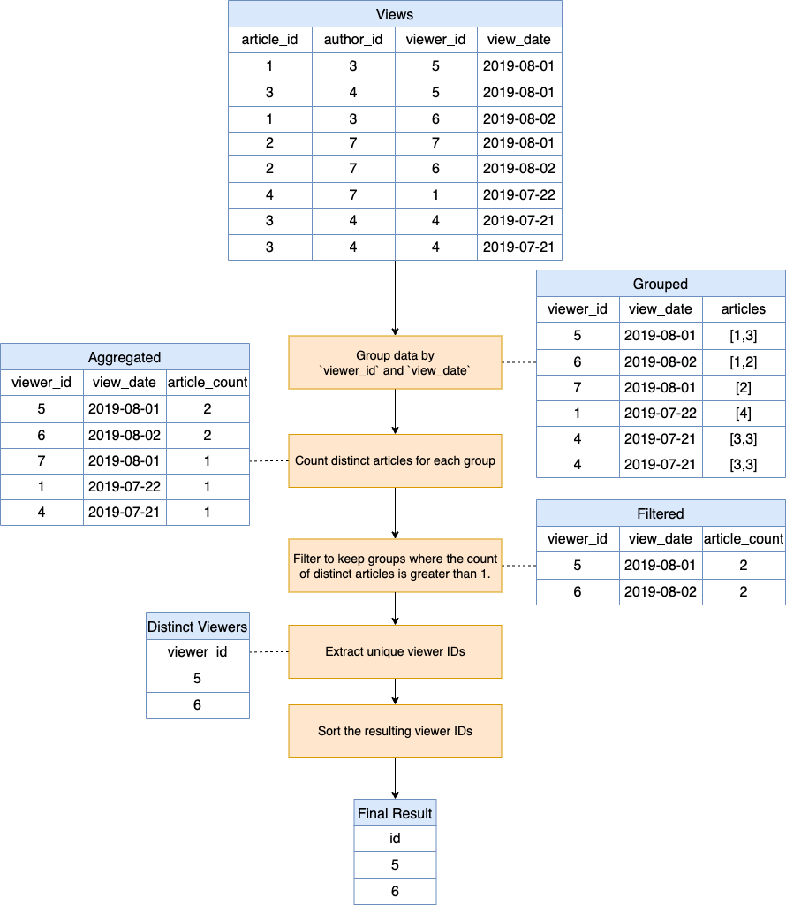
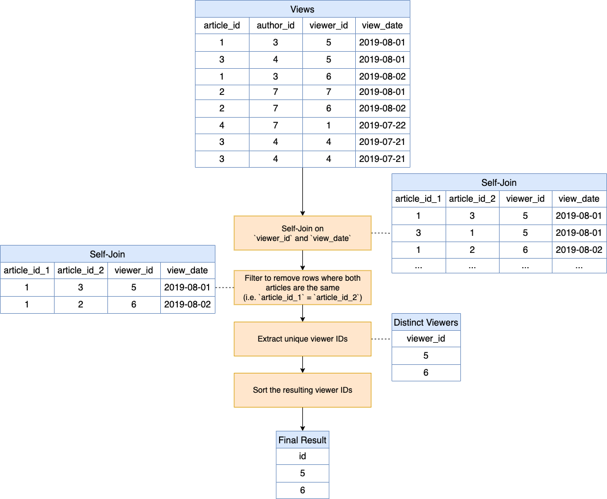

[TOC]

# Solution

---

### Overview

You're given the `Views` table, which logs every occasion when a viewer reads an article. Your goal is to identify viewers who've read more than one article on a specific day.

---

## pandas

### Approach 1: Groupby with Filter

**Flowchart:**


#### Intuition

The central idea here is aggregation. We aim to group the data based on the $\text{viewer}_{id}$ and $\text{view}_{date}$. In simpler words, we want to collate information on which user viewed what on which date. Once this grouping is done, we can aggregate the number of articles they viewed.

If someone has viewed more than one article on a particular date, this aggregated count would exceed 1. By leveraging the filtering capabilities of the `filter` function in pandas, we can easily filter out groups with a count of 1 and retain only those viewers who've viewed multiple articles on a single date.

#### Algorithm

**Step 1** - Original 'views' Table:
   <table>
     <tr>
       <th>article_id</th>
       <th>author_id</th>
       <th>viewer_id</th>
       <th>view_date</th>
     </tr>
     <tr>
       <td>1</td>
       <td>3</td>
       <td>5</td>
       <td>2019-08-01</td>
     </tr>
     <tr>
       <td>3</td>
       <td>4</td>
       <td>5</td>
       <td>2019-08-01</td>
     </tr>
     <tr>
       <td>1</td>
       <td>3</td>
       <td>6</td>
       <td>2019-08-02</td>
     </tr>
     <tr>
       <td>2</td>
       <td>7</td>
       <td>7</td>
       <td>2019-08-01</td>
     </tr>
     <tr>
       <td>2</td>
       <td>7</td>
       <td>6</td>
       <td>2019-08-02</td>
     </tr>
     <tr>
       <td>4</td>
       <td>7</td>
       <td>1</td>
       <td>2019-07-22</td>
     </tr>
     <tr>
       <td>3</td>
       <td>4</td>
       <td>4</td>
       <td>2019-07-21</td>
     </tr>
     <tr>
       <td>3</td>
       <td>4</td>
       <td>4</td>
       <td>2019-07-21</td>
     </tr>
   </table>
<br>

**Step 2** - **Grouping**: This step organizes the data in such a way that every unique combination of $\text{viewer}_{id}$ and $\text{view}_{date}$ forms a group.

```python
grouped = views.groupby(["viewer_id", "view_date"])
```
   <table>
     <tr>
       <th>viewer_id</th>
       <th>view_date</th>
       <th>articles</th>
     </tr>
     <tr><td>5</td><td>2019-08-01</td><td>[1,3]</td></tr>
     <tr><td>6</td><td>2019-08-02</td><td>[1,2]</td></tr>
     <tr><td>7</td><td>2019-08-01</td><td>[2]</td></tr>
     <tr><td>1</td><td>2019-07-22</td><td>[4]</td></tr>
     <tr><td>4</td><td>2019-07-21</td><td>[3]</td></tr>
   </table>
<br>

**Step 3** - **Aggregation**: Within each of these groups, we count the number of unique articles. This gives us a sense of how many articles a user viewed on a given date.
```python
aggregated = grouped.agg({"article_id": "nunique"})
```
   <table>
     <tr>
       <th>viewer_id</th>
       <th>view_date</th>
       <th>article_count</th>
     </tr>
     <tr><td>5</td><td>2019-08-01</td><td>2</td></tr>
     <tr><td>6</td><td>2019-08-02</td><td>2</td></tr>
     <tr><td>7</td><td>2019-08-01</td><td>1</td></tr>
     <tr><td>1</td><td>2019-07-22</td><td>1</td></tr>
     <tr><td>4</td><td>2019-07-21</td><td>1</td></tr>
   </table>
<br>

**Step 4** - **Filtering**: Finally, we're only interested in those counts that exceed 1, i.e., where a viewer has viewed more than one article on a particular date.
```python
filtered = aggregated[aggregated["article_id"] > 1].reset_index()
```
   <table>
     <tr>
       <th>viewer_id</th>
       <th>view_date</th>
       <th>article_count</th>
     </tr>
     <tr><td>5</td><td>2019-08-01</td><td>2</td></tr>
     <tr><td>6</td><td>2019-08-02</td><td>2</td></tr>
   </table>
<br>

**Step 5** -  **Distinct Viewer IDs**: Select distinct viewer IDs from the filtered results.
```python
distinct_viewers = filtered["viewer_id"].drop_duplicates()
```
   <table>
     <tr>
       <th>id</th>
     </tr>
     <tr>
       <td>5</td>
     </tr>
     <tr>
       <td>6</td>
     </tr>
   </table>
<br>

**Step 6** -  **Sort Results**: Sort the resulting viewer IDs and rename $\text{viewer}_{id}$ to `id`.
```python
final_result = (
    distinct_viewers
    .sort_values()
    .to_frame(name="id")
    .reset_index(drop=True)
)
```
   <table>
     <tr>
       <th>id</th>
     </tr>
     <tr>
       <td>5</td>
     </tr>
     <tr>
       <td>6</td>
     </tr>
   </table>
<br>

#### Implementation

Based on the understanding above, the solution can be implemented as:

```python
import pandas as pd

def article_views(views: pd.DataFrame) -> pd.DataFrame:
    # Group by viewer_id and view_date, then count unique articles
    grouped = views.groupby(["viewer_id", "view_date"]).agg({"article_id": "nunique"})

    # Filter out entries with unique article counts less than or equal to 1
    result = grouped[grouped["article_id"] > 1].reset_index()

    # Extract and sort the viewer IDs, drop duplicates and return as a DataFrame
    final_result = (
        result["viewer_id"]
        .sort_values()
        .drop_duplicates()
        .to_frame(name="id")
        .reset_index(drop=True)
    )

    return final_result

```

---

### Approach 2: Self-Join

**Flowchart:**


#### Intuition

The Self-Join approach constructs combinations of articles viewed by users on specific dates. By self-joining the table on both $\text{viewer}_{id}$ and $\text{view}_{date}$, we capture every possible combination of articles a viewer has interacted with on a given day.

Here's the essence:

1. **Article Combinations**: Each viewer's article views for a specific date are paired with one another. For example, if a viewer reads Articles A and B on the same day, we'll have two combinations: A with B, and B with A. Both of these highlight that the viewer has read multiple articles on that day.

2. **Eliminating Self-Pairs**: We want to identify instances where a viewer read more than one distinct article on a particular day. So, combinations where an article is paired with itself (like A with A) aren't helpful and are filtered out.

The primary goal is to identify viewers who have seen more than one article on a single date. This approach efficiently captures these viewers by looking at the article combinations generated by the self-join.

#### Algorithm

**Step 1** - Original 'views' Table:
   <table>
     <tr>
       <th>article_id</th>
       <th>author_id</th>
       <th>viewer_id</th>
       <th>view_date</th>
     </tr>
     <tr>
       <td>1</td>
       <td>3</td>
       <td>5</td>
       <td>2019-08-01</td>
     </tr>
     <tr>
       <td>3</td>
       <td>4</td>
       <td>5</td>
       <td>2019-08-01</td>
     </tr>
     <tr>
       <td>1</td>
       <td>3</td>
       <td>6</td>
       <td>2019-08-02</td>
     </tr>
     <tr>
       <td>2</td>
       <td>7</td>
       <td>7</td>
       <td>2019-08-01</td>
     </tr>
     <tr>
       <td>2</td>
       <td>7</td>
       <td>6</td>
       <td>2019-08-02</td>
     </tr>
     <tr>
       <td>4</td>
       <td>7</td>
       <td>1</td>
       <td>2019-07-22</td>
     </tr>
     <tr>
       <td>3</td>
       <td>4</td>
       <td>4</td>
       <td>2019-07-21</td>
     </tr>
     <tr>
       <td>3</td>
       <td>4</td>
       <td>4</td>
       <td>2019-07-21</td>
     </tr>
   </table>
<br>

**Step 2** - **Self-Join**: This is like forming pairs or combinations. For every viewer and date, it determines what combinations of articles are possible.

```python
merged_views = views.merge(views, on=["viewer_id", "view_date"])
```
   <table>
     <tr>
       <th>article_id_1</th>
       <th>article_id_2</th>
       <th>viewer_id</th>
       <th>view_date</th>
     </tr>
     <tr>
       <td>1</td>
       <td>3</td>
       <td>5</td>
       <td>2019-08-01</td>
     </tr>
     <tr>
       <td>3</td>
       <td>1</td>
       <td>5</td>
       <td>2019-08-01</td>
     </tr>
     <tr>
       <td>1</td>
       <td>2</td>
       <td>6</td>
       <td>2019-08-02</td>
     </tr>
   <tr>
       <td>...</td>
       <td>...</td>
       <td>...</td>
       <td>...</td>
     </tr>
   </table>
<br>

**Step 3** -  **Filter Out Redundancies**: After the self-join, we will have rows where viewers have the same article matched with itself, or the same pair of articles repeated but in a different order (A-B and B-A). Note that if a $\text{reviewer}_{id}$ has only 1 article view, it will not have any pair of articles in the merged table. Therefore, filtering pair of articles using operators like `<` ensures that we consider only genuine cases of multiple article views.
```python
distinct_articles = merged_views[
    (merged_views["article_id_x"] < merged_views["article_id_y"])
]
```
   <table>
     <tr>
       <th>article_id_1</th>
       <th>article_id_2</th>
       <th>viewer_id</th>
       <th>view_date</th>
     </tr>
     <tr>
       <td>1</td>
       <td>3</td>
       <td>5</td>
       <td>2019-08-01</td>
     </tr>
     <tr>
       <td>1</td>
       <td>2</td>
       <td>6</td>
       <td>2019-08-02</td>
     </tr>
   </table>
<br>

**Step 4** -  **Distinct Viewer IDs**: The final step is about consolidating the results. Even if a viewer has seen three articles on a date, they will appear in multiple rows after the self-join. Extracting distinct viewer IDs ensures each viewer is represented only once in the final result.
```python
distinct_viewer_ids = distinct_articles[["viewer_id"]].drop_duplicates()
```
   <table>
     <tr>
       <th>viewer_id</th>
     </tr>
     <tr>
       <td>5</td>
     </tr>
     <tr>
       <td>6</td>
     </tr>
   </table>
<br>

**Step 5** -  **Sort Viewer IDs**: Sort the resulting viewer IDs in ascending order and rename $\text{viewer}_{id}$ to `id`.
```python
final_result = distinct_viewer_ids.sort_values("viewer_id").rename(columns={"viewer_id": "id"}).reset_index(drop=True)
```
   <table>
     <tr>
       <th>id</th>
     </tr>
     <tr>
       <td>5</td>
     </tr>
     <tr>
       <td>6</td>
     </tr>
   </table>
<br>

#### Implementation

Based on the understanding above, the solution can be implemented as:

```python
import pandas as pd

def article_views(views: pd.DataFrame) -> pd.DataFrame:
    # Self join on viewer_id and view_date, but ensure different articles
    merged_views = views.merge(views, on=["viewer_id", "view_date"])
    distinct_articles = merged_views[
        merged_views["article_id_x"] < merged_views["article_id_y"]
    ]

    # Extract unique viewer IDs who viewed more than one article on the same date
    result = (
        distinct_articles[["viewer_id"]]
        .drop_duplicates()
        .rename(columns={"viewer_id": "id"})
    )

    return result.sort_values("id").reset_index(drop=True)

```

---

## Database
### Approach 1: Groupby with Having

**Flowchart:**


#### Intuition

The central idea here is aggregation. We aim to group the data based on the $\text{viewer}_{id}$ and $\text{view}_{date}$. In simpler words, we want to collate information on which user viewed what on which date. Once this grouping is done, we can aggregate the number of articles they viewed.

If someone has viewed more than one article on a particular date, this aggregated count would exceed 1. By leveraging the filtering capabilities of the `HAVING` clause in SQL, we can easily filter out groups with a count of 1, retaining only those viewers who have viewed multiple articles on a single date.

#### Algorithm

**Step 1** - Original 'Views' Table:
   <table>
     <tr>
       <th>article_id</th>
       <th>author_id</th>
       <th>viewer_id</th>
       <th>view_date</th>
     </tr>
     <tr>
       <td>1</td>
       <td>3</td>
       <td>5</td>
       <td>2019-08-01</td>
     </tr>
     <tr>
       <td>3</td>
       <td>4</td>
       <td>5</td>
       <td>2019-08-01</td>
     </tr>
     <tr>
       <td>1</td>
       <td>3</td>
       <td>6</td>
       <td>2019-08-02</td>
     </tr>
     <tr>
       <td>2</td>
       <td>7</td>
       <td>7</td>
       <td>2019-08-01</td>
     </tr>
     <tr>
       <td>2</td>
       <td>7</td>
       <td>6</td>
       <td>2019-08-02</td>
     </tr>
     <tr>
       <td>4</td>
       <td>7</td>
       <td>1</td>
       <td>2019-07-22</td>
     </tr>
     <tr>
       <td>3</td>
       <td>4</td>
       <td>4</td>
       <td>2019-07-21</td>
     </tr>
     <tr>
       <td>3</td>
       <td>4</td>
       <td>4</td>
       <td>2019-07-21</td>
     </tr>
   </table>
<br>

**Step 2** - **Grouping**: This step organizes the data in such a way that every unique combination of $\text{viewer}_{id}$ and $\text{view}_{date}$ forms a group.

```sql
SELECT
  viewer_id,
  view_date,
  ARRAY_AGG(article_id) as articles
FROM
  Views
GROUP BY
  viewer_id,
  view_date;
```
   <table>
     <tr>
       <th>viewer_id</th>
       <th>view_date</th>
       <th>articles</th>
     </tr>
     <tr><td>5</td><td>2019-08-01</td><td>[1,3]</td></tr>
     <tr><td>6</td><td>2019-08-02</td><td>[1,2]</td></tr>
     <tr><td>7</td><td>2019-08-01</td><td>[2]</td></tr>
     <tr><td>1</td><td>2019-07-22</td><td>[4]</td></tr>
     <tr><td>4</td><td>2019-07-21</td><td>[3]</td></tr>
   </table>
<br>

**Step 3** - **Aggregation**: Within each of these groups, we count the number of unique articles. This gives us a sense of how many articles a user viewed on a given date.
```sql
SELECT
  viewer_id,
  view_date,
  COUNT(DISTINCT article_id) as article_count
FROM
  Views
GROUP BY
  viewer_id,
  view_date;
```
   <table>
     <tr>
       <th>viewer_id</th>
       <th>view_date</th>
       <th>article_count</th>
     </tr>
     <tr><td>5</td><td>2019-08-01</td><td>2</td></tr>
     <tr><td>6</td><td>2019-08-02</td><td>2</td></tr>
     <tr><td>7</td><td>2019-08-01</td><td>1</td></tr>
     <tr><td>1</td><td>2019-07-22</td><td>1</td></tr>
     <tr><td>4</td><td>2019-07-21</td><td>1</td></tr>
   </table>
<br>

**Step 4** - **Filtering**: Finally, we're only interested in those counts that exceed 1, i.e., where a viewer has viewed more than one article on a particular date.
```sql
SELECT
  viewer_id,
  view_date,
  COUNT(DISTINCT article_id) as article_count
FROM
  Views
GROUP BY
  viewer_id,
  view_date
HAVING
  COUNT(DISTINCT article_id) > 1;
```
   <table>
     <tr>
       <th>viewer_id</th>
       <th>view_date</th>
       <th>article_count</th>
     </tr>
     <tr><td>5</td><td>2019-08-01</td><td>2</td></tr>
     <tr><td>6</td><td>2019-08-02</td><td>2</td></tr>
   </table>
<br>

**Step 5** -  **Distinct Viewer IDs**: Select distinct viewer IDs from the filtered results.
```sql
SELECT
  DISTINCT viewer_id as id
FROM
  Views
GROUP BY
  viewer_id,
  view_date
HAVING
  COUNT(DISTINCT article_id) > 1;
```
   <table>
     <tr>
       <th>id</th>
     </tr>
     <tr>
       <td>5</td>
     </tr>
     <tr>
       <td>6</td>
     </tr>
   </table>
<br>

**Step 6** -  **Sort Results**: Sort the resulting viewer IDs and rename $\text{viewer}_{id}$ to `id`.
```sql
SELECT
  DISTINCT viewer_id as id
FROM
  Views
GROUP BY
  viewer_id,
  view_date
HAVING
  COUNT(DISTINCT article_id) > 1
ORDER BY
  viewer_id;
```
   <table>
     <tr>
       <th>id</th>
     </tr>
     <tr>
       <td>5</td>
     </tr>
     <tr>
       <td>6</td>
     </tr>
   </table>
<br>

#### Implementation

Based on the understanding above, the solution can be implemented as:

```sql
SELECT
  DISTINCT viewer_id as id
FROM
  Views
GROUP BY
  viewer_id,
  view_date
HAVING
  COUNT(DISTINCT article_id) > 1
ORDER BY
  viewer_id;
```

---

### Approach 2: Self-Join

**Flowchart:**


#### Intuition

The Self-Join approach constructs combinations of articles viewed by users on specific dates. By self-joining the table on both $\text{viewer}_{id}$ and $\text{view}_{date}$, we capture every possible combination of articles a viewer has interacted with on a given day.

Here's the essence:

1. **Article Combinations**: Each viewer's article views for a specific date are paired with one another. For example, if a viewer reads Articles A and B on the same day, we'll have two combinations: A with B, and B with A. Both of these highlight that the viewer has read multiple articles on that day.

2. **Eliminating Self-Pairs**: We want to identify instances where a viewer read more than one distinct article on a particular day. So, combinations where an article is paired with itself (like A with A) aren't helpful and are filtered out.

The primary goal is to identify viewers who have seen more than one article on a single date. This approach efficiently captures these viewers by looking at the article combinations generated by the self-join.

#### Algorithm

**Step 1** - Original 'Views' Table:
   <table>
     <tr>
       <th>article_id</th>
       <th>author_id</th>
       <th>viewer_id</th>
       <th>view_date</th>
     </tr>
     <tr>
       <td>1</td>
       <td>3</td>
       <td>5</td>
       <td>2019-08-01</td>
     </tr>
     <tr>
       <td>3</td>
       <td>4</td>
       <td>5</td>
       <td>2019-08-01</td>
     </tr>
     <tr>
       <td>1</td>
       <td>3</td>
       <td>6</td>
       <td>2019-08-02</td>
     </tr>
     <tr>
       <td>2</td>
       <td>7</td>
       <td>7</td>
       <td>2019-08-01</td>
     </tr>
     <tr>
       <td>2</td>
       <td>7</td>
       <td>6</td>
       <td>2019-08-02</td>
     </tr>
     <tr>
       <td>4</td>
       <td>7</td>
       <td>1</td>
       <td>2019-07-22</td>
     </tr>
     <tr>
       <td>3</td>
       <td>4</td>
       <td>4</td>
       <td>2019-07-21</td>
     </tr>
     <tr>
       <td>3</td>
       <td>4</td>
       <td>4</td>
       <td>2019-07-21</td>
     </tr>
   </table>
<br>

**Step 2** - **Self-Join**: This is like forming pairs or combinations. For every viewer and date, it determines what combinations of articles are possible.

```sql
SELECT
  v1.article_id AS article_id_1,
  v2.article_id AS article_id_2,
  v1.viewer_id,
  v1.view_date
FROM
  Views v1
  JOIN Views v2 ON v1.viewer_id = v2.viewer_id
  AND v1.view_date = v2.view_date
```
   <table>
     <tr>
       <th>article_id_1</th>
       <th>article_id_2</th>
       <th>viewer_id</th>
       <th>view_date</th>
     </tr>
     <tr>
       <td>1</td>
       <td>3</td>
       <td>5</td>
       <td>2019-08-01</td>
     </tr>
     <tr>
       <td>3</td>
       <td>1</td>
       <td>5</td>
       <td>2019-08-01</td>
     </tr>
     <tr>
       <td>1</td>
       <td>2</td>
       <td>6</td>
       <td>2019-08-02</td>
     </tr>
   <tr>
       <td>...</td>
       <td>...</td>
       <td>...</td>
       <td>...</td>
     </tr>
   </table>
<br>

**Step 3** -  **Filter Out Redundancies**: After the self-join, we will have rows where viewers have the same article matched with itself, or the same pair of articles repeated but in a different order (A-B and B-A). Note that if a $\text{reviewer}_{id}$ has only 1 article view, it will not have any pair of articles in the merged table. Therefore, filtering pair of articles using operators like `<` ensures that we consider only genuine cases of multiple article views.
```sql
SELECT
  v1.article_id AS article_id_1,
  v2.article_id AS article_id_2,
  v1.viewer_id,
  v1.view_date
FROM
  Views v1
  JOIN Views v2 ON v1.viewer_id = v2.viewer_id
  AND v1.view_date = v2.view_date
  AND v1.article_id < v2.article_id
```
   <table>
     <tr>
       <th>article_id_1</th>
       <th>article_id_2</th>
       <th>viewer_id</th>
       <th>view_date</th>
     </tr>
     <tr>
       <td>1</td>
       <td>3</td>
       <td>5</td>
       <td>2019-08-01</td>
     </tr>
     <tr>
       <td>1</td>
       <td>2</td>
       <td>6</td>
       <td>2019-08-02</td>
     </tr>
   </table>
<br>

**Step 4** -  **Distinct Viewer IDs**: The final step is about consolidating the results. Even if a viewer has seen three articles on a date, they will appear in multiple rows after the self-join. Extracting distinct viewer IDs ensures each viewer is represented only once in the final result.
```sql
SELECT
  DISTINCT v1.viewer_id
FROM
  Views v1
  JOIN Views v2 ON v1.viewer_id = v2.viewer_id
  AND v1.view_date = v2.view_date
  AND v1.article_id < v2.article_id
```
   <table>
     <tr>
       <th>viewer_id</th>
     </tr>
     <tr>
       <td>5</td>
     </tr>
     <tr>
       <td>6</td>
     </tr>
   </table>
<br>

**Step 5** -  **Sort Viewer IDs**: Sort the resulting viewer IDs in ascending order and rename $\text{viewer}_{id}$ to `id`.
```sql
SELECT
  DISTINCT v1.viewer_id AS id
FROM
  Views v1
  JOIN Views v2 ON v1.viewer_id = v2.viewer_id
  AND v1.view_date = v2.view_date
  AND v1.article_id < v2.article_id
ORDER BY
  v1.viewer_id
```
   <table>
     <tr>
       <th>id</th>
     </tr>
     <tr>
       <td>5</td>
     </tr>
     <tr>
       <td>6</td>
     </tr>
   </table>
<br>

#### Implementation

Based on the understanding above, the solution can be implemented as:

```sql
SELECT
  DISTINCT v1.viewer_id AS id
FROM
  Views v1
  JOIN Views v2 ON v1.viewer_id = v2.viewer_id
  AND v1.view_date = v2.view_date
  AND v1.article_id < v2.article_id
ORDER BY
  v1.viewer_id;
```