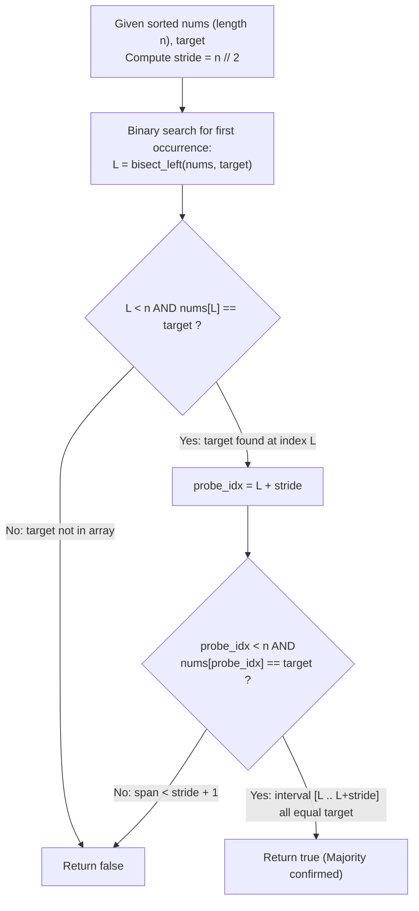

# Guided Example: Check If a Number Is Majority Element in a Sorted Array

We trace the logarithmic-time binary search and contiguous stride inspection over non-decreasing arrays, establishing the Contiguous Stride Invariant and the Fixed-Span Majority Theorem:

- **Representative Instance 1 (Interior Cluster Exceeding Half Length):**
  $$
  nums = [2, 4, 5, 5, 5, 5, 5, 6, 6], \quad target = 5, \quad n = 9
  $$
- **Required Output:** `true`
  - Majority Threshold:
    $$
    \text{Required Count} > \left\lfloor \frac{n}{2} \right\rfloor = \left\lfloor \frac{9}{2} \right\rfloor = 4 \implies \text{Count} \ge 5
    $$
  - Binary Search Boundary Detection:
    - Leftmost occurrence of $5$ via `bisect_left`:
      $$
      L = 2 \quad (nums[2] = 5, \; nums[1] = 4 \ne 5)
      $$
  - Constant-Time Stride Verification:
    - If $5$ appears at least $5$ times, the block of $5$s must span from index $L$ through at least index $L + 4$:
      $$
      \text{Probe Index} = L + \lfloor n / 2 \rfloor = 2 + 4 = 6
      $$
    - Value at probe index:
      $$
      nums[6] = 5 = target
      $$
    - Because $nums$ is sorted in non-decreasing order:
      $$
      nums[2] = 5 \land nums[6] = 5 \implies \forall k \in [2, 6], \; nums[k] = 5
      $$
    - The contiguous interval $[2, 6]$ contains $6 - 2 + 1 = 5$ identical elements.
    - $5 > 9 / 2 \implies \mathbf{true}$.

- **Representative Instance 2 (Exact Half-Length Tie Trap):**
  $$
  nums = [10, 100, 101, 101], \quad target = 101, \quad n = 4
  $$
  - Majority requirement: $> 4 / 2 = 2 \implies \text{Count} \ge 3$.
  - Leftmost occurrence of $101$: $L = 2$.
  - Stride probe index: $L + \lfloor 4 / 2 \rfloor = 2 + 2 = 4$.
  - Index $4$ is out of bounds ($4 \ge n$).
  - Target appears only $2$ times ($2 \ngtr 2$) $\implies \mathbf{false}$.

---

## 1. Instance & Teaching Goal

Given an integer array `nums` sorted in non-decreasing order and an integer `target`, determine whether `target` is a majority element (i.e., appears strictly more than $n / 2$ times in `nums`).

```text
The Linear Frequency Scan Fallacy:
  Scanning the entire array with a linear counter:
    Takes O(N) time.
    Completely ignores the pre-sorted structure of the array!

The Contiguous Stride Invariant (O(log N) Time, O(1) Space):
  Key Property: In a sorted array, identical values form a single CONTIGUOUS interval!
  If target is the majority element, it must appear at least floor(n / 2) + 1 times.
  1. Find the FIRST occurrence of target using binary search:
       L = bisect_left(nums, target)
  2. If L is out of bounds or nums[L] != target:
       target does not exist -> return false.
  3. Inspect the element exactly floor(n / 2) positions ahead:
       probe_idx = L + floor(n / 2)
       If probe_idx < n and nums[probe_idx] == target:
           return true.
       Else:
           return false.
  Validates majority status in a single binary search plus ONE array probe!
```

The fundamental pedagogical insights are:
1. **Contiguous Range Compression:** Sorting clusters identical elements into contiguous intervals $[L, R]$, transforming count queries into span tests.
2. **Fixed-Stride Pigeonhole Check:** If a value occupies $> n/2$ cells, probing the offset $L + \lfloor n/2 \rfloor$ tests the necessary and sufficient condition in $\mathcal{O}(1)$ after finding $L$.

---

## 2. Conceptual Foundation & The Contiguous Stride Invariant



### Sorted Monotonicity & Fixed-Span Majority Theorem

Let $A = [a_0, a_1, \dots, a_{n-1}]$ be a sequence sorted in non-decreasing order ($a_i \le a_{i+1}$).

1. **Contiguity of Preimages:**
   For any value $v$, the set of indices containing $v$ forms a contiguous interval:
   $$
   \mathcal{I}(v) = \{ k \in \{0, \dots, n-1\} : a_k = v \} = [L, R]
   $$
   where $L = \min \mathcal{I}(v)$ and $R = \max \mathcal{I}(v)$.
2. **Strict Majority Condition:**
   By definition, $v$ is a majority element if and only if:
   $$
   |\mathcal{I}(v)| > \frac{n}{2} \iff R - L + 1 \ge \left\lfloor \frac{n}{2} \right\rfloor + 1
   $$
   which simplifies to:
   $$
   R \ge L + \left\lfloor \frac{n}{2} \right\rfloor
   $$
3. **Monotonic Span Implication:**
   Because $A$ is non-decreasing:
   $$
   a_L = v \quad \text{and} \quad a_{L + \lfloor n/2 \rfloor} = v \implies \forall k \in \left[ L, \; L + \lfloor n/2 \rfloor \right], \; a_k = v
   $$
   Therefore, checking whether $L + \lfloor n/2 \rfloor < n$ and $a_{L + \lfloor n/2 \rfloor} = v$ is necessary and sufficient to establish that $|\mathcal{I}(v)| \ge \lfloor n/2 \rfloor + 1 > n/2$. $\blacksquare$

---

## 3. Step-by-Step Worked Execution: Representative Instance 1

$nums = [2, 4, 5, 5, 5, 5, 5, 6, 6], \quad target = 5, \quad n = 9$.

### Step 1: Compute Stride Metric
- Array length: $n = 9$.
- Required stride: $stride = \lfloor 9 / 2 \rfloor = 4$.

### Step 2: Binary Search for First Occurrence ($L$)
- Search range: $[0, 8]$.
  - Midpoint 4: $nums[4] = 5 \ge 5 \implies$ Search left $[0, 4]$.
  - Midpoint 2: $nums[2] = 5 \ge 5 \implies$ Search left $[0, 2]$.
  - Midpoint 1: $nums[1] = 4 < 5 \implies$ Search right $[2, 2]$.
  - Insertion index found: $L = 2$.
- Boundary check: $L = 2 < 9$ and $nums[2] = 5 == target$. (Target exists).

### Step 3: Fixed Stride Verification
- Calculate probe index:
  $$
  probe = L + stride = 2 + 4 = 6
  $$
- Bounds check: $6 < 9$.
- Value comparison:
  $$
  nums[6] = 5 == target
  $$
- Conclusion:
  - Both endpoints of the 5-element subarray $nums[2 \dots 6]$ equal $5$.
  - By sorted monotonicity, all 5 elements are $5$.
  - Frequency $\ge 5 > 9 / 2 \implies \mathbf{true}$.

---

## 4. State Transition Trace Tables

### Table 1: Binary Search Boundary Contraction Trace

| Search Iteration | Left Bound | Right Bound | Midpoint Index | Midpoint Value $nums[mid]$ | Comparison with Target ($5$) | Narrowed Interval |
|:---:|:---:|:---:|:---:|:---:|:---:|:---:|
| $1$ | $0$ | $9$ | $4$ | $5$ | $5 \ge 5 \implies$ Move Right to Mid | $[0, 4]$ |
| $2$ | $0$ | $4$ | $2$ | $5$ | $5 \ge 5 \implies$ Move Right to Mid | $[0, 2]$ |
| $3$ | $0$ | $2$ | $1$ | $4$ | $4 < 5 \implies$ Move Left to Mid+1 | $[2, 2]$ |
| **Terminated** | **$2$** | **$2$** | — | — | **First Occurrence Found: $L = 2$** | — |

### Table 2: Stride Span and Majority Decision Matrix

| Array Under Test | Length $n$ | Target | $L = \text{bisect\_left}$ | Probe Index $L + \lfloor n/2 \rfloor$ | Probe Value | Stride Condition | Majority Decision |
|:---:|:---:|:---:|:---:|:---:|:---:|:---:|:---:|
| `[2,4,5,5,5,5,5,6,6]` | $9$ | $5$ | $2$ | $2 + 4 = 6$ | $5$ | $5 == 5$ | **`true`** |
| `[10,100,101,101]` | $4$ | $101$ | $2$ | $2 + 2 = 4$ | Out of bounds | $4 \ge 4$ | `false` |
| `[1,2,3,4,5]` | $5$ | $6$ | $5$ | Out of bounds | — | Target absent | `false` |
| `[7,7,7]` | $3$ | $7$ | $0$ | $0 + 1 = 1$ | $7$ | $7 == 7$ | **`true`** |
| `[1,1,2,2]` | $4$ | $1$ | $0$ | $0 + 2 = 2$ | $2$ | $2 \ne 1$ | `false` |

---

## 5. Algorithmic Correctness

### Soundness & Optimality
1. **Contiguity Property:** In any non-decreasing array, if $nums[L] = target$ and $nums[L + k] = target$, then every intermediate element $nums[L \dots L+k]$ is identically equal to $target$.
2. **Sufficiency of Offset Probe:** Checking index $L + \lfloor n / 2 \rfloor$ tests a span of length $\lfloor n / 2 \rfloor + 1$. By integer division, $\lfloor n / 2 \rfloor + 1 > n / 2$ for all positive integers $n$, satisfying the strict majority definition.
3. **Necessity of Offset Probe:** If $target$ were a majority element, its frequency would be at least $\lfloor n / 2 \rfloor + 1$. Starting from the first occurrence $L$, the run must reach at least index $L + \lfloor n / 2 \rfloor$. If that cell contains a different value or is out of bounds, the frequency is strictly less than the required majority threshold.

---

## 6. Boundary Cases & Traps

| Boundary Scenario | Input Example | Expected Output | Failure Mode / Trapped Risk |
|---|---|---|---|
| Single Element Array ($n = 1$) | `nums = [3], target = 3` | `true` ($1 > 0$) | Off-by-one error on stride $= 0$ |
| Exact 50% Tie | `nums = [1, 1, 2, 2], target = 1` | `false` ($2 \ngtr 2$) | Treating $\ge n/2$ as majority instead of $> n/2$ |
| Target Not in Array | `nums = [1, 2, 3], target = 5` | `false` | Index out of bounds after bisect |
| Target at Array Tail | `nums = [1, 2, 3, 3], target = 3` | `false` | Out-of-bounds access at $L + n // 2$ |
| All Elements Equal Target | `nums = [4, 4, 4, 4], target = 4` | `true` | Validating full array coverage |

---

## 7. Complexity Derivation

- **Time Complexity:** $\mathcal{O}(\log n)$ where $n = |nums| \le 1000$.
  - Finding the first occurrence $L$ via binary search requires at most $\lceil \log_2 n \rceil \le 10$ comparisons.
  - Probing the element at $L + \lfloor n / 2 \rfloor$ takes $\mathcal{O}(1)$ time.
  - Total runtime is strictly logarithmic: $\mathcal{O}(\log n)$, executing in $< 0.01\text{ ms}$.
- **Auxiliary Space Complexity:** $\mathcal{O}(1)$ auxiliary memory.
  - Only scalar indices for binary search boundaries and stride probing are allocated.