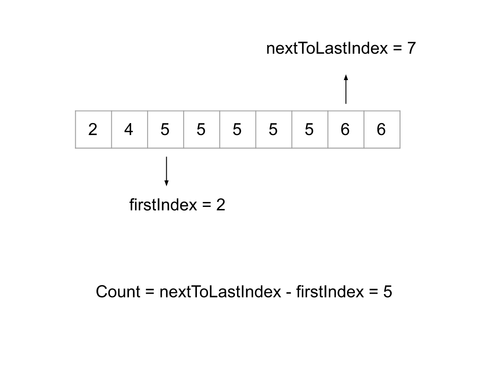

## Solution

---

### Approach 1: Frequency Count

**Intuition**

We have $N$ integers in the list `nums` arranged in non-decreasing order and an element `target`; we need to return `true` if the element `target` appears more than $N / 2$ times or `false` otherwise. In this approach we will iterate over the complete list `nums` and if the element is equal to `target` we will increment the counter `count`. In the end, we will return if `count` is greater than $N / 2$.

**Algorithm**

1. Initialize the variable `count` to `0`.
2. Iterate over the list `nums`, and for each element `num`, If $num = target$, then increment the variable `count`
3. If `count` is greater than $\text{nums.length} / 2$, return `true` or `false` otherwise.

**Implementation**

```cpp
class Solution {
public:
    bool isMajorityElement(vector<int>& nums, int target) {
        int count = 0;
        for (int num : nums) {
            count = num == target ? count + 1 : count;
        }

        return count > nums.size() / 2;
    }
};
```

**Complexity Analysis**

Here, $N$ is the size of list `nums`.

* Time complexity: $O(N)$.

  We iterate over each element in the list `nums`, hence the total time complexity will be $O(N)$.

* Space complexity: $O(1)$.

  We only need one variable, `count`, to keep the frequency of `target`, and hence the space complexity is constant.
  <br/>

---
### Approach 2: Binary Search (Two Pass)

**Intuition**

In the previous approach, we didn't use the fact that the elements are arranged in a non-decreasing order. Since the elements are given in order, all elements that are equal to the `target` will be together. If we somehow find the starting and ending point of this subarray where each element is `target`, we can find the number of times the element `target` appears.

One way to do this is to iterate the list and find the first and last instance of `target` and then subtract the indices to find the number of instances. A more efficient way is to use binary search to find the first and last instance of `target`. To find the first instance, we will find the $\text{lower}_{bound}$ which is the first element that is equal to or greater than the element, and to find the last instance we can use the $\text{upper}_{bound}$ which is the first element that is greater than the given element. If the difference between these two indices is greater than the $\text{nums.length} / 2$, we return `true` or `false` otherwise.



**Algorithm**

1. Find the index of the first instance of the element `target` using binary search and store it in the variable `firstIndex`.
2. Find the index of the element next to the last instance of `target` using binary search and store it in the variable `nextToLastIndex`.
3. Note if the element `target` isn't present in the list, both the above variables would have the same value so that the difference equates to `0`.
4. If $(nextToLastIndex - firstIndex) > \text{nums.length} / 2$, we return `true` or `false` otherwise.

**Implementation**

```cpp
class Solution {
public:
    // Returns the index of the first element equal to or greater than the target.
    // If there is no instance of the target in the list, it returns the length of the list.
    int lower_bound(vector<int>& nums, int target) {
        int start = 0;
        int end = nums.size() - 1;
        int index = nums.size();

        while (start <= end) {
            int mid = (start + end) / 2;

            if (nums[mid] >= target) {
                end = mid - 1;
                index = mid;
            } else {
                start = mid + 1;
            }
        }

        return index;
    }

    // Returns the index of the first element greater than the target.
    // If there is no instance of the target in the list, it returns the length of the list.
    int upper_bound(vector<int>& nums, int target) {
        int start = 0;
        int end = nums.size() - 1;
        int index = nums.size();

        while (start <= end) {
            int mid = (start + end) / 2;

            if (nums[mid] > target) {
                end = mid - 1;
                index = mid;
            } else {
                start = mid + 1;
            }
        }

        return index;
    }

    bool isMajorityElement(vector<int>& nums, int target) {
        int firstIndex = lower_bound(nums, target);
        int nextToLastIndex = upper_bound(nums, target);

        return nextToLastIndex - firstIndex > nums.size() / 2;
    }
};
```

> **Note:** C++ has built-in binary search implementations to find the lower and upper bound. The corresponding C++ code is below:

```cpp
class Solution {
public:
    bool isMajorityElement(vector<int>& nums, int target) {
        int firstIndex = lower_bound(nums.begin(), nums.end(), target) - nums.begin();
        int nextToLastIndex = upper_bound(nums.begin(), nums.end(), target) - nums.begin();

        return nextToLastIndex - firstIndex > nums.size() / 2;
    }
};
```

**Complexity Analysis**

Here, $N$ is the size of the list `nums`.

* Time complexity: $O(\log N)$.

  We applied binary search twice to find the two indices. Each binary search costs $O(\log N)$ because the search space is halved at every iteration. Hence the total time complexity equals $O(\log N)$.

* Space complexity: $O(1)$.

  The binary search doesn't require any space apart from a few variables, and hence the space complexity is constant.
  <br/>

---
### Approach 3: Binary Search (One Pass)

**Intuition**

Instead of applying the binary search twice to find both indices, we can solve the problem with just one binary search to find the index of the first instance of `target`. Then instead of finding the last index of `target` too, what we can do is check if the element at index $firstIndex + \text{num.length} / 2$ is equal to `target` or not. This is because we only need to find if there are more than $\text{num.length} / 2$ instances of `target`, not the exact count of `target`. If at $\text{num.length} / 2$ places ahead of the first index, the element is equal to `target`, then we know `target` is a majority element in the given list.

**Algorithm**

1. Find the index of the first instance of the element `target` using binary search and store it in the variable `firstIndex`.
2. If the size of list `nums` is more than $firstIndex + \text{nums.length} / 2$ and the element at this index is equal to `target`, return `true` or `false` otherwise.

**Implementation**

```cpp
class Solution {
public:
    // Returns the index of the first element equal to or greater than the target.
    // If there is no instance of the target in the list, it returns the length of the list.
    int lower_bound(vector<int>& nums, int target) {
        int start = 0;
        int end = nums.size() - 1;
        int index = nums.size();

        while (start <= end) {
            int mid = (start + end) / 2;

            if (nums[mid] >= target) {
                end = mid - 1;
                index = mid;
            } else {
                start = mid + 1;
            }
        }

        return index;
    }

    bool isMajorityElement(vector<int>& nums, int target) {
        int firstIndex = lower_bound(nums, target);

        return firstIndex + nums.size() / 2 < nums.size() && nums[firstIndex + nums.size() / 2] == target;
    }
};
```

> **Note:** C++ has built-in binary search implementations to find the lower and upper bound. The corresponding C++ code is below:

```cpp
class Solution {
public:
    bool isMajorityElement(vector<int>& nums, int target) {
        int firstIndex = lower_bound(nums.begin(), nums.end(), target) - nums.begin();

        return firstIndex + nums.size() / 2 < nums.size() && nums[firstIndex + nums.size() / 2] == target;
    }
};
```

**Complexity Analysis**

Here, $N$ is the size of the list `nums`.

* Time complexity: $O(\log N)$.

  We applied binary search just once to find the `firstIndex` and then checked the element at particular index. Hence the total time complexity is equal to $O(\log N)$.

* Space complexity: $O(1)$.

  The binary search doesn't require any space apart from a few variables,  and hence the space complexity is constant.
  <br/>

---