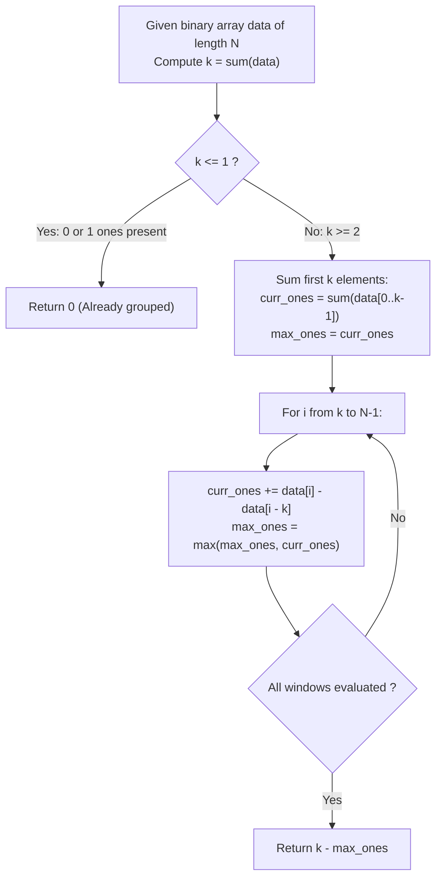

# Guided Example: Minimum Swaps to Group All 1s Together

We trace the fixed-width sliding window transformation for grouping scattered binary units into a contiguous segment, establishing the Fixed-Width Density Invariant and the Swap-Zero Duality Theorem:

- **Representative Instance 1 (Three Interleaved Ones):**
  $$
  data = [1, 0, 1, 0, 1], \quad N = 5
  $$
- **Required Output:** `1`
  - Total Target Unit Population ($k$):
    $$
    k = \sum_{j=0}^{N-1} data[j] = 1 + 0 + 1 + 0 + 1 = \mathbf{3}
    $$
  - Invariant Window Size: Any contiguous grouping of all $1$s must occupy a window of length exactly $k = 3$.
  - Fixed-Window Sliding Evaluations ($W = 3$):
    - **Window 0 (Indices $[0 \dots 2]$: $[1, 0, 1]$):**
      - Ones inside window $= 1 + 0 + 1 = 2$.
      - Zeros inside window $= 3 - 2 = \mathbf{1}$.
      - Swaps required: Swap the single internal zero with the external one at index $4 \implies \mathbf{1}$ swap.
    - **Window 1 (Indices $[1 \dots 3]$: $[0, 1, 0]$):**
      - Ones inside window $= 0 + 1 + 0 = 1$.
      - Zeros inside window $= 3 - 1 = \mathbf{2}$.
      - Swaps required: $\mathbf{2}$ swaps.
    - **Window 2 (Indices $[2 \dots 4]$: $[1, 0, 1]$):**
      - Ones inside window $= 1 + 0 + 1 = 2$.
      - Zeros inside window $= 3 - 2 = \mathbf{1}$.
      - Swaps required: $\mathbf{1}$ swap.
  - Minimum Swaps Across All Windows:
    $$
    \min(1, 2, 1) = \mathbf{1}
    $$

- **Representative Instance 2 (Singleton Unit Boundary):**
  $$
  data = [0, 0, 0, 1, 0], \quad N = 5, \; k = 1 \implies \mathbf{0} \text{ swaps}
  $$

- **Representative Instance 3 (Eleven-Element Dispersed Sequence):**
  $$
  data = [1, 0, 1, 0, 1, 0, 0, 1, 1, 0, 1], \quad N = 11, \; k = 6
  $$
  - Maximum $1$s in any window of size $6$ is $3$ (e.g. indices $[5 \dots 10]$ has $[0, 0, 1, 1, 0, 1] \implies 3$ ones).
  - Minimum swaps $= k - \max(ones) = 6 - 3 = \mathbf{3}$.

---

## 1. Instance & Teaching Goal

Given a binary array `data`, determine the minimum number of swaps required to group all `1`s together into a single contiguous block anywhere in the array.

```text
The Combinatorial Swap Simulation Trap:
  Attempting to simulate actual pair exchanges (i, j):
    Testing which 0 to swap with which 1 creates an exponential search tree.
    Direct simulation of permutations is completely unnecessary!

The Fixed-Width Sliding Window Invariant (O(N) Time, O(1) Space):
  Key Insight:
    Let k be the total count of 1s in data.
    If all 1s are successfully grouped together, they MUST occupy some contiguous
    subarray of length exactly k!
  The Swap-Zero Duality Principle:
    In any target window of length k containing C ones:
      Number of zeros in this window = k - C.
      Each zero in this window MUST be swapped with a 1 located outside this window.
      Therefore, the exact number of swaps needed for this window is k - C!
  To MINIMIZE swaps, we simply MAXIMIZE C (the number of 1s already in the window):
    Min Swaps = k - max_{window of size k} (ones in window).
  Reduces the entire problem to a standard linear sliding window of fixed length k!
```

The fundamental pedagogical insights are:
1. **Duality of Swaps and Holes:** The cost to consolidate $k$ items into a designated span equals the count of vacancies (zeros) within that span.
2. **Fixed-Span Density Maximization:** Finding the optimal placement reduces to tracking the maximum subarray sum of fixed width $k$ in $\mathcal{O}(N)$ time.

---

## 2. Conceptual Foundation & The Sliding Window Invariant



### Window Invariance & Swap Equivalence Theorem

Let $A = [a_0, a_1, \dots, a_{N-1}]$ with $a_i \in \{0, 1\}$, and let $k = \sum_{i=0}^{N-1} a_i$.

1. **Contiguous Block Geometry:**
   Any contiguous block containing all $k$ ones must begin at some index $i \in \{0, \dots, N - k\}$ and occupy the interval $I(i) = [i, \; i + k - 1]$.
2. **Conservation of Unit Cardinality:**
   For any window $I(i)$, let $c(i) = \sum_{j \in I(i)} a_j$ be the number of ones inside $I(i)$, and let $z(i) = k - c(i)$ be the number of zeros inside $I(i)$.
   The number of ones located outside $I(i)$ is:
   $$
   \text{ones}_{\text{outside}} = k - c(i) = z(i)
   $$
3. **Bijective Swap Sufficiency:**
   Every swap exchanges one $0$ from inside $I(i)$ with one $1$ from outside $I(i)$.
   Because $\text{zeros}_{\text{inside}} = \text{ones}_{\text{outside}} = z(i)$, exactly $z(i)$ pairwise swaps are necessary and sufficient to replace all zeros in $I(i)$ with external ones.
4. **Global Minimization:**
   The global minimum swaps over all valid placements is:
   $$
   \min_{0 \le i \le N - k} z(i) = \min_{0 \le i \le N - k} \big( k - c(i) \big) = k - \max_{0 \le i \le N - k} c(i)
   $$
   Evaluating $c(i)$ via a sliding window of fixed width $k$ requires $\mathcal{O}(1)$ operations per shift. $\blacksquare$

---

## 3. Step-by-Step Worked Execution: Representative Instance 1

$data = [1, 0, 1, 0, 1], \quad N = 5$.

### Step 1: Population Count
$$
k = 1 + 0 + 1 + 0 + 1 = 3
$$
Window width is $3$. Valid window count is $N - k + 1 = 5 - 3 + 1 = 3$ windows.

### Step 2: Initialize First Window $[0 \dots 2]$
- Elements: $[1, 0, 1]$.
- Initial ones count:
  $$
  curr\_ones = 1 + 0 + 1 = 2
  $$
- $max\_ones \leftarrow 2$.

### Step 3: Slide Window Across Array
1. **Slide to Index $i = 3$ (Window $[1 \dots 3]$: $[0, 1, 0]$):**
   - Entering element: $data[3] = 0$.
   - Leaving element: $data[3 - 3] = data[0] = 1$.
   - Update:
     $$
     curr\_ones \leftarrow 2 + 0 - 1 = 1
     $$
   - $max\_ones = \max(2, 1) = 2$.
2. **Slide to Index $i = 4$ (Window $[2 \dots 4]$: $[1, 0, 1]$):**
   - Entering element: $data[4] = 1$.
   - Leaving element: $data[4 - 3] = data[1] = 0$.
   - Update:
     $$
     curr\_ones \leftarrow 1 + 1 - 0 = 2
     $$
   - $max\_ones = \max(2, 2) = 2$.

### Step 4: Compute Result
$$
\text{Min Swaps} = k - max\_ones = 3 - 2 = \mathbf{1}
$$

---

## 4. State Transition Trace Tables

### Table 1: Sliding Window Step Trace ($N = 5, k = 3$)

| Window Index $i$ | Subarray Range | Window Elements | Ones Inside $c(i)$ | Zeros Inside $z(i) = 3 - c(i)$ | Update Formula | Running $max\_ones$ |
|:---:|:---:|:---:|:---:|:---:|:---:|:---:|
| $0$ | $[0 \dots 2]$ | `[1, 0, 1]` | $2$ | **$1$** | Initial sum | $2$ |
| $1$ | $[1 \dots 3]$ | `[0, 1, 0]` | $1$ | $2$ | $2 + 0 - 1 = 1$ | $2$ |
| $2$ | $[2 \dots 4]$ | `[1, 0, 1]` | $2$ | **$1$** | $1 + 1 - 0 = 2$ | **$2$** |

Result:
$$
\text{Minimum Swaps} = 3 - 2 = \mathbf{1}
$$

### Table 2: Instance 3 Fixed-Window Density Trace ($N = 11, k = 6$)

| Start Index $i$ | Window Slice | Ones Count $c(i)$ | Holes to Fill $z(i)$ | Status / Decision |
|:---:|:---|:---:|:---:|:---|
| $0$ | `[1, 0, 1, 0, 1, 0]` | $3$ | $3$ | Viable |
| $1$ | `[0, 1, 0, 1, 0, 0]` | $2$ | $4$ | Sub-optimal |
| $2$ | `[1, 0, 1, 0, 0, 1]` | $3$ | $3$ | Viable |
| $3$ | `[0, 1, 0, 0, 1, 1]` | $3$ | $3$ | Viable |
| $4$ | `[1, 0, 0, 1, 1, 0]` | $3$ | $3$ | Viable |
| **$5$** | **`[0, 0, 1, 1, 0, 1]`** | **$3$** | **$3$** | **Tied Best ($\mathbf{3}$ swaps)** |

---

## 5. Algorithmic Correctness

### Soundness & Optimality
1. **Target Density Equivalence:** A sequence of $1$s is contiguous if and only if there exists some window of length $k$ containing all $k$ ones. Every zero inside that window must be displaced by a swap with an external one.
2. **Constant Window Sliding Invariance:** Moving the window from $[i-1 \dots i+k-2]$ to $[i \dots i+k-1]$ preserves the intermediate $k-1$ elements. Adding the newly entered element $data[i+k-1]$ and subtracting the leaving element $data[i-1]$ maintains an exact running count without drift.
3. **Completeness:** Scanning all $N - k + 1$ possible start offsets evaluates every conceivable contiguous target window, ensuring the global minimum is discovered.

---

## 6. Boundary Cases & Traps

| Boundary Scenario | Input Example | Expected Output | Failure Mode / Trapped Risk |
|---|---|---|---|
| Zero Ones Present | `data = [0, 0, 0]` | `0` | Division by zero or window size 0 errors |
| Single One Present | `data = [0, 1, 0]` | `0` | Running window logic when $k=1$ is trivial |
| All Ones Present | `data = [1, 1, 1]` | `0` ($k = N \implies k - k = 0$) | Off-by-one window bounds on full array |
| Already Grouped | `data = [0, 1, 1, 0]` | `0` | Applying unnecessary swaps |
| Ones at Extreme Ends | `data = [1, 0, 0, 1]` | `1` ($k = 2$, best window has 1 one) | Boundary omission on endpoints |

---

## 7. Complexity Derivation

- **Time Complexity:** $\mathcal{O}(N)$ where $N = |data| \le 10^5$.
  - Summing the entire array to compute $k$ takes $\mathcal{O}(N)$ operations.
  - Summing the initial window of size $k$ takes $\mathcal{O}(k) \le \mathcal{O}(N)$ operations.
  - Sliding the window across the remaining $N - k$ positions takes $\mathcal{O}(N - k)$ updates of $\mathcal{O}(1)$ each.
  - Total time is strictly linear: $\mathcal{O}(N)$, completing in $< 5\text{ ms}$.
- **Auxiliary Space Complexity:** $\mathcal{O}(1)$ auxiliary memory.
  - Only scalar counters for $k$, $curr\_ones$, and $max\_ones$ are maintained.
