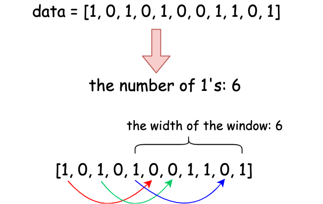

[TOC]

## Video Solution
---

<div>
    <div class="video-container">
        <iframe src="https://player.vimeo.com/video/537007535" width="640" height="360" frameborder="0" allow="autoplay; fullscreen" allowfullscreen></iframe>
    </div>
</div>

<div>
</div>

## Solution Article

---

### Overview

We need to rearrange the `1`s in the given array so that they are grouped within a single contiguous subarray of length equal to the total count of `1`s in the array. The fewer `0`s present in this subarray, the fewer swaps we will need to achieve the desired arrangement.

To determine the minimum number of swaps required, we should look for a subarray of length `ones` that already contains the maximum possible number of `1`s. If we can find such a subarray, then the number of swaps needed will simply be the count of `0`s within it.



*Figure 1. Find a subarray of length `ones` and swapping 0's with 1's.*

---

### Approach 1: Sliding Window with Two Pointers

#### Intuition

We need an efficient way to track subarrays of length `ones` while keeping count of how many `1`s each subarray contains. A brute-force approach that checks all possible subarrays would be too slow, so we use a sliding window technique with two pointers, `left` and `right`.

To start, we initialize a window of size `ones` and count how many `1`s it contains, storing this in $\text{cnt}_{one}$. As we slide the window one step at a time by moving `right` forward, we also update $\text{cnt}_{one}$ by adding the new element at $\text{data}[right]$ and removing the element at $\text{data}[left]$. This way, we efficiently track the number of `1`s in the current window without recalculating from scratch.

As we slide the window across the array, we keep track of the maximum count of `1`s found in any window and store it in $\text{max}_{one}$. Since our goal is to have all `1`s grouped in a window, the minimum swaps required to achieve this will be the number of `0`s in the best window, which is $ones - \text{max}_{one}$.


#### Algorithm

- Count the total number of ones in `data` which determines the required window size for grouping ones together.
- Initialize $\text{cnt}_{one}$ to track the count of ones in the current window and $\text{max}_{one}$ to store the maximum number of ones found in any valid window.
- Use two pointers, `left` and `right`, to define a sliding window.
- Iterate over `data` with `right`, adding each element to $\text{cnt}_{one}$ to keep track of the number of ones in the current window.
- If the window size exceeds `ones`, shrink the window by removing the leftmost element and updating $\text{cnt}_{one}$ accordingly.
- Update $\text{max}_{one}$ with the maximum number of ones found in any valid window.
- Compute the minimum swaps needed as $ones - \text{max}_{one}$, representing the number of zeros that need to be swapped to group all ones together.
- Return the computed minimum swaps.

#### Implementation

```python
class Solution:
    def minSwaps(self, data: List[int]) -> int:
        ones = sum(data)
        cnt_one = max_one = 0
        left = right = 0
        while right < len(data):
            # updating the number of 1's by adding the new element
            cnt_one += data[right]
            right += 1
            # maintain the length of the window to ones
            if right - left > ones:
                # updating the number of 1's by removing the oldest element
                cnt_one -= data[left]
                left += 1
            # record the maximum number of 1's in the window
            max_one = max(max_one, cnt_one)
        return ones - max_one
```

#### Complexity Analysis

Let $n$ be the size of the input array `data`.

- Time complexity: $O(n)$

    The algorithm iterates through the array once using a sliding window approach. The `while` loop runs until the `right` pointer reaches the end of the array, which takes $O(n)$ time. Inside the loop, the operations (updating $\text{cnt}_{one}$, checking the window size, and updating $\text{max}_{one}$) are all constant time operations, $O(1)$. The initial sum calculation also takes $O(n)$ time. Therefore, the overall time complexity is $O(n)$.

- Space complexity: $O(1)$

    The algorithm uses a constant amount of extra space. The variables `ones`, $\text{cnt}_{one}$, $\text{max}_{one}$, `left`, and `right` are all integers and do not depend on the input size. No additional data structures are used that scale with the input size. Therefore, the space complexity is $O(1)$.

---

### Approach 2: Sliding Window with Deque (Double-ended Queue)

#### Intuition

Instead of using two pointers to manage the sliding window, we can use a deque (double-ended queue) to efficiently maintain a window of size `ones`. The main idea remains the same: we want to keep track of the number of `1`s within a fixed-length window while iterating through the array.

We begin by initializing a deque, `deque`, and populating it with the first `ones` elements. This gives us our starting window. From there, as we slide the window forward, we push new elements to the right end while simultaneously removing the oldest element from the left end. This ensures that `deque` always holds exactly `ones` elements at any given time.

Throughout this process, we keep track of how many `1`s are present in the deque, just as we did in the previous approach. By maintaining the maximum count of `1`s encountered, we can determine the minimum number of swaps needed, which is calculated as $ones - \text{max}_{one}$. This method provides a structured way to handle the sliding window while leveraging the efficiency of a deque for easy insertions and removals from both ends.

#### Algorithm

- Count the total number of ones in `data` to determine the target window size for grouping ones together.
- Initialize $\text{cnt}_{one}$ to track the count of ones in the current sliding window and $\text{max}_{one}$ to store the maximum number of ones found in any valid window.
- Use a deque to maintain a sliding window of size equal to `ones`, allowing efficient addition and removal of elements.
- Iterate over `data`, adding each element to the deque and updating $\text{cnt}_{one}$ accordingly.
- If the deque size exceeds `ones`, remove the leftmost element to maintain the correct window size and update $\text{cnt}_{one}$.
- Update $\text{max}_{one}$ with the maximum number of ones seen in any valid window.
- Compute the minimum swaps needed as $ones - \text{max}_{one}$ since this gives the number of zeros that must be swapped to group all ones together.
- Return the computed minimum swaps.

#### Implementation

```python
class Solution:
    def minSwaps(self, data: List[int]) -> int:
        ones = sum(data)
        cnt_one = max_one = 0

        # maintain a deque with the size = ones
        deque = collections.deque()
        for i in range(len(data)):

            # we would always add the new element into the deque
            deque.append(data[i])
            cnt_one += data[i]

            # when there are more than ones elements in the deque,
            # remove the leftmost one
            if len(deque) > ones:
                cnt_one -= deque.popleft()
            max_one = max(max_one, cnt_one)
        return ones - max_one
```

#### Complexity Analysis

Let $n$ be the size of the input array `data`.

- Time complexity: $O(n)$

    The algorithm iterates through the array once using a `for` loop, which takes $O(n)$ time. Inside the loop, the operations (adding to the deque, updating $\text{cnt}_{one}$, checking the deque size, removing from the deque, and updating $\text{max}_{one}$) are all constant time operations, $O(1)$. The initial sum calculation also takes $O(n)$ time. Therefore, the overall time complexity is $O(n)$.

- Space complexity: $O(n)$

    The algorithm uses a `Deque` to maintain a sliding window of size `ones`. In the worst case, the deque can store up to `ones` elements, which is proportional to the input size $n$ (if all elements are 1s). Therefore, the space complexity is $O(n)$. The other variables (`ones`, $\text{cnt}_{one}$, $\text{max}_{one}$) use constant space, $O(1)$. Thus, the overall space complexity is $O(n)$.

---