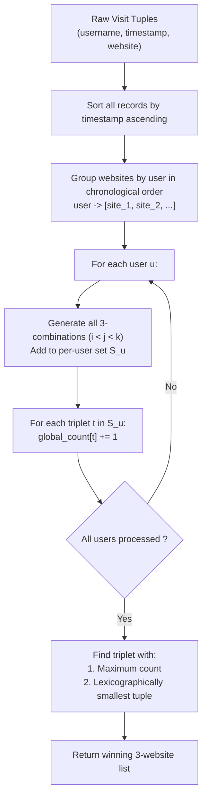

# Guided Example: Analyze User Website Visit Pattern

We trace the multi-user chronological session grouping, combinatorial 3-subsequence extraction, and distinct-user score maximization, establishing the Chronological Triplet Set Invariant:

- **Representative Instance 1 (Three Users with Distinct and Overlapping Web Trajectories):**
  $$
  \begin{aligned}
  username &= [\text{"joe"},\text{"joe"},\text{"joe"},\text{"james"},\text{"james"},\text{"james"},\text{"james"},\text{"mary"},\text{"mary"},\text{"mary"}] \\
  timestamp &= [1, 2, 3, 4, 5, 6, 7, 8, 9, 10] \\
  website &= [\text{"home"},\text{"about"},\text{"career"},\text{"home"},\text{"cart"},\text{"maps"},\text{"home"},\text{"home"},\text{"about"},\text{"career"}]
  \end{aligned}
  $$
- **Required Output:** `["home", "about", "career"]`
  - Phase 1: Chronological User Trajectory Reconstruction:
    - User `"joe"` (timestamps $1, 2, 3$):
      $$
      \text{joe} \to [\text{"home"}, \; \text{"about"}, \; \text{"career"}]
      $$
    - User `"james"` (timestamps $4, 5, 6, 7$):
      $$
      \text{james} \to [\text{"home"}, \; \text{"cart"}, \; \text{"maps"}, \; \text{"home"}]
      $$
    - User `"mary"` (timestamps $8, 9, 10$):
      $$
      \text{mary} \to [\text{"home"}, \; \text{"about"}, \; \text{"career"}]
      $$
  - Phase 2: Per-User Unique 3-Sequence Generation:
    - User `"joe"`: $\binom{3}{3} = 1$ unique triplet:
      $$
      S_{\text{joe}} = \big\{ (\text{"home"}, \text{"about"}, \text{"career"}) \big\}
      $$
    - User `"james"`: $\binom{4}{3} = 4$ unique triplets:
      $$
      S_{\text{james}} = \left\{ \begin{array}{l}
      (\text{"home"}, \text{"cart"}, \text{"maps"}), \\
      (\text{"home"}, \text{"cart"}, \text{"home"}), \\
      (\text{"home"}, \text{"maps"}, \text{"home"}), \\
      (\text{"cart"}, \text{"maps"}, \text{"home"})
      \end{array} \right\}
      $$
    - User `"mary"`: $\binom{3}{3} = 1$ unique triplet:
      $$
      S_{\text{mary}} = \big\{ (\text{"home"}, \text{"about"}, \text{"career"}) \big\}
      $$
  - Phase 3: Global Aggregation & Scoring:
    - Pattern $(\text{"home"}, \text{"about"}, \text{"career"})$: present in $S_{\text{joe}}$ and $S_{\text{mary}} \implies \mathbf{Score = 2}$.
    - Patterns from $S_{\text{james}}$: present only in $S_{\text{james}} \implies \text{Score = 1}$.
  - Maximal Pattern: `["home", "about", "career"]` with score $2$.

- **Representative Instance 2 (Score Tie Resolved Lexicographically):**
  $$
  username = [\text{"ua"},\text{"ua"},\text{"ua"},\text{"ub"},\text{"ub"},\text{"ub"}], \quad timestamp = [1..6], \quad website = [\text{"a"},\text{"b"},\text{"a"},\text{"a"},\text{"b"},\text{"c"}]
  $$
  - Patterns with score 1 include: `("a", "b", "a")` from ua, and `("a", "b", "c")` from ub.
  - Tie-break: `("a", "b", "a")` is lexicographically smaller than `("a", "b", "c")`.
  - Output: `["a", "b", "a"]`.

---

## 1. Instance & Teaching Goal

Given web visit logs with usernames, timestamps, and website names, find the 3-website sequence (order-preserving pattern) visited by the greatest number of distinct users. If there is a tie for the highest score, select the lexicographically smallest 3-sequence.

```text
The Intra-User Score Inflation Trap:
  Suppose a single user visits: ["a", "b", "a", "b"].
  The 3-sequence ("a", "b", "a") appears as indices (0, 1, 2).
  The 3-sequence ("a", "b", "b") appears as indices (0, 1, 3).
  Crucial Rule: Each user votes AT MOST ONCE for any given 3-sequence!
  A user generating the same pattern multiple times contributes exactly 1 to its score.
  Failure to deduplicate triplets per user inflates scores artificially.

The Chronological Triplet Set Invariant (O(M * N^3) Time):
  1. Group visits by user.
  2. Sort each user's visits in strictly increasing chronological order of timestamp.
  3. For each user u:
       Extract all 3-tuples (w_i, w_j, w_k) with i < j < k.
       Store in a hash set S_u to eliminate duplicates for user u.
  4. For each distinct pattern t in S_u:
       Increment global score counter: score[t] += 1.
  5. Select pattern with maximum score; break ties lexicographically.
```

The fundamental pedagogical insights are:
1. **Chronological Sorting Precondition:** Patterns are valid only if websites are visited in temporal sequence; timestamps must be sorted before generating combinations.
2. **Per-User Set Projection:** Deduplicating 3-sequences per user enforces the distinct-user scoring contract before global tallying.

---

## 2. Conceptual Foundation & The Chronological Triplet Invariant



### User-Partition Triplet Projection & Lexicographic Extremum Theorem

Let $\mathcal{L}$ be the list of $M$ visit records $(u_r, t_r, w_r)$ where $u_r \in \mathcal{U}$, $t_r \in \mathbb{R}$, and $w_r \in \mathcal{W}$.

1. **Chronological User Trajectories:**
   For each user $u \in \mathcal{U}$, let $W_u = \langle w_{u, 1}, w_{u, 2}, \dots, w_{u, \ell_u} \rangle$ be the sequence of websites visited by $u$ ordered such that $t_{u, 1} < t_{u, 2} < \dots < t_{u, \ell_u}$.
2. **User Triplet Set Generation:**
   The set of 3-sequences supported by user $u$ is given by:
   $$
   \mathcal{T}(u) = \big\{ (w_{u, i}, w_{u, j}, w_{u, k}) : 1 \le i < j < k \le \ell_u \big\}
   $$
   Note that $|\mathcal{T}(u)| \le \binom{\ell_u}{3}$, and storing $\mathcal{T}(u)$ as a set collapses identical subsequences into a single vote.
3. **Pattern Score Metric:**
   For any triplet $P = (a, b, c) \in \mathcal{W}^3$, its score is defined as the user support cardinality:
   $$
   \text{score}(P) = \big| \{ u \in \mathcal{U} : P \in \mathcal{T}(u) \} \big| = \sum_{u \in \mathcal{U}} \mathbf{1}_{\{P \in \mathcal{T}(u)\}}
   $$
4. **Lexicographical Selection Order:**
   Define the total ordering $\preceq$ on $\mathcal{W}^3$ such that $P_1 \prec P_2$ if $\text{score}(P_1) > \text{score}(P_2)$, or if $\text{score}(P_1) = \text{score}(P_2)$ and $P_1$ precedes $P_2$ lexicographically.
   The optimal pattern is the unique minimum element under $\preceq$. $\blacksquare$

---

## 3. Step-by-Step Worked Execution: Representative Instance 1

Logs: 10 records across users `"joe"`, `"james"`, `"mary"`.

### Step 1: Sort by Timestamp & Group
All records are already sorted by timestamp $1 \dots 10$.
- `"joe"`: `["home", "about", "career"]` ($\ell_{\text{joe}} = 3$)
- `"james"`: `["home", "cart", "maps", "home"]` ($\ell_{\text{james}} = 4$)
- `"mary"`: `["home", "about", "career"]` ($\ell_{\text{mary}} = 3$)

### Step 2: Extract Per-User Triplet Sets
- **User `"joe"`:**
  - Triplet: `("home", "about", "career")`.
  - $S_{\text{joe}} = \{ (\text{"home"}, \text{"about"}, \text{"career"}) \}$.
- **User `"james"`:**
  - Combination $(0, 1, 2) \implies$ `("home", "cart", "maps")`
  - Combination $(0, 1, 3) \implies$ `("home", "cart", "home")`
  - Combination $(0, 2, 3) \implies$ `("home", "maps", "home")`
  - Combination $(1, 2, 3) \implies$ `("cart", "maps", "home")`
  - $S_{\text{james}} = \text{Set of 4 distinct triplets}$.
- **User `"mary"`:**
  - Triplet: `("home", "about", "career")`.
  - $S_{\text{mary}} = \{ (\text{"home"}, \text{"about"}, \text{"career"}) \}$.

### Step 3: Tally Global Scores
- `("home", "about", "career")`: Present in $S_{\text{joe}}$ and $S_{\text{mary}} \implies \mathbf{Score = 2}$.
- `("home", "cart", "maps")`: Present in $S_{\text{james}} \implies \text{Score = 1}$.
- `("home", "cart", "home")`: Present in $S_{\text{james}} \implies \text{Score = 1}$.
- `("home", "maps", "home")`: Present in $S_{\text{james}} \implies \text{Score = 1}$.
- `("cart", "maps", "home")`: Present in $S_{\text{james}} \implies \text{Score = 1}$.

### Step 4: Decision
The highest score is $2$, achieved uniquely by `("home", "about", "career")`.
Return `["home", "about", "career"]`.

---

## 4. State Transition Trace Tables

### Table 1: Per-User Trajectory and Triplet Set Generation

| Username | Timestamps | Chronological Website Trajectory | Total 3-Combos $\binom{\ell}{3}$ | Distinct Triplet Set $S_u$ |
|:---:|:---:|:---|:---:|:---|
| `"joe"` | $1, 2, 3$ | `["home", "about", "career"]` | $1$ | `{("home", "about", "career")}` |
| `"james"` | $4, 5, 6, 7$ | `["home", "cart", "maps", "home"]` | $4$ | `{("home","cart","maps"), ("home","cart","home"), ("home","maps","home"), ("cart","maps","home")}` |
| `"mary"` | $8, 9, 10$ | `["home", "about", "career"]` | $1$ | `{("home", "about", "career")}` |

### Table 2: Global Pattern Scoring and Ranking

| Rank | Candidate 3-Website Pattern | Users Supporting Pattern | Score | Tie-Break Status |
|:---:|:---|:---|:---:|:---|
| **$1$** | **`("home", "about", "career")`** | **`"joe"`, `"mary"`** | **$2$** | **Global Winner** |
| $2$ | `("cart", "maps", "home")` | `"james"` | $1$ | Sub-optimal |
| $3$ | `("home", "cart", "home")` | `"james"` | $1$ | Sub-optimal |
| $4$ | `("home", "cart", "maps")` | `"james"` | $1$ | Sub-optimal |
| $5$ | `("home", "maps", "home")` | `"james"` | $1$ | Sub-optimal |

---

## 5. Algorithmic Correctness

### Soundness & Determinism
1. **Temporal Strictness:** Sorting records by timestamp prior to combination generation guarantees that every evaluated triplet represents a valid chronological forward sequence.
2. **Per-User Set Guarantee:** Adding generated triplets to a per-user set ensures that duplicate occurrences of the same sequence within a single user's history are idempotently deduplicated, adhering to the distinct-user voting rule.
3. **Lexicographical Tie-Breaking:** Sorting candidates by $(-score, pattern)$ resolves ties unambiguously, prioritizing higher scores first and alphabetical order second.

---

## 6. Boundary Cases & Traps

| Boundary Scenario | Input Feature | Expected Behavior | Failure Mode / Trapped Risk |
|---|---|---|---|
| Same Site Visited Repeatedly | User visits `["luffy", "luffy", "luffy"]` | Valid triplet `("luffy", "luffy", "luffy")` | Forbidding identical sites within triplet |
| User with $< 3$ Visits | User has only 2 visits | Skipped ($\binom{2}{3} = 0$) | Array index out of bounds on small histories |
| Multiple Paths for Same Pattern | User visits `[a, b, a, b]` | Pattern `(a, b, b)` counted once for this user | Counting 2 points from 1 user |
| Lexicographical Tie | Patterns $A$ and $B$ both have score 2 | Smaller alphabetical string wins | Returning the first inserted pattern |
| Out-of-Order Input Rows | Timestamps not in ascending order | Pre-sorted by timestamp before grouping | Temporal inversion bugs |

---

## 7. Complexity Derivation

- **Time Complexity:** $\mathcal{O}(M \log M + U \cdot L_{\max}^3 + P \log P)$ where $M \le 50$ is total records, $U \le 50$ is distinct users, and $L_{\max} \le 50$ is the max visits per user.
  - Sorting $M$ records by timestamp takes $\mathcal{O}(M \log M)$ operations.
  - For each user $u$, generating all triplets takes $\binom{\ell_u}{3}$ operations.
  - Since $\sum \ell_u = M \le 50$, the maximum number of combinations across all users occurs when one user has all 50 visits: $\binom{50}{3} = 19,600$ iterations.
  - Inserting into hash sets and updating global counters takes $\mathcal{O}(1)$ per combination.
  - Sorting at most $19,600$ unique patterns takes $< 5\text{ ms}$.
  - Total runtime is $< 10\text{ ms}$.
- **Auxiliary Space Complexity:** $\mathcal{O}(M + P)$ auxiliary memory to store user trajectories and up to $19,600$ pattern records in the global score map.
