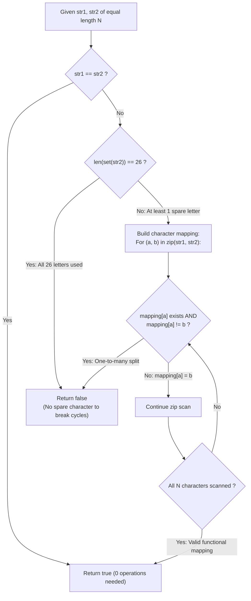

# Guided Example: String Transforms Into Another String

We trace the algebraic transformation graph, functional mapping consistency, and alphabet saturation analysis for character-wide string conversions, establishing the Functional Mapping and Spare-Node Invariant:

- **Representative Instance 1 (Chain Dependency with Available Sink):**
  $$
  str1 = \text{"aabcc"}, \quad str2 = \text{"ccdee"}, \quad N = 5
  $$
- **Required Output:** `true`
  - Character Pairwise Bindings:
    - Index $0$: $str1[0] = \text{'a'} \to str2[0] = \text{'c'}$
    - Index $1$: $str1[1] = \text{'a'} \to str2[1] = \text{'c'}$ (Consistent with 'a' $\to$ 'c')
    - Index $2$: $str1[2] = \text{'b'} \to str2[2] = \text{'d'}$
    - Index $3$: $str1[3] = \text{'c'} \to str2[3] = \text{'e'}$
    - Index $4$: $str1[4] = \text{'c'} \to str2[4] = \text{'e'}$ (Consistent with 'c' $\to$ 'e')
  - Function Well-Definedness:
    - Mapping: $\{ \text{'a'} \mapsto \text{'c'}, \; \text{'b'} \mapsto \text{'d'}, \; \text{'c'} \mapsto \text{'e'} \}$.
    - Every source character maps to a unique, deterministic target character.
  - Target Alphabet Saturation:
    - Distinct characters in $str2$: $\{\text{'c'}, \text{'d'}, \text{'e'}\} \implies |\Sigma_{str2}| = 3 < 26$.
    - At least $23$ spare lowercase characters are available as temporary scratchpads.
  - Conversion Sequence (Reverse Topological Order):
    1. Convert all occurrences of $\text{'c'} \to \text{'e'}: \text{"aabcc"} \implies \text{"aabee"}$
    2. Convert all occurrences of $\text{'b'} \to \text{'d'}: \text{"aabee"} \implies \text{"aadee"}$
    3. Convert all occurrences of $\text{'a'} \to \text{'c'}: \text{"aadee"} \implies \text{"ccdee"}$
  - Target $str2$ successfully synthesized $\implies \mathbf{true}$.

- **Representative Instance 2 (Divergence / Non-Functional Split Trap):**
  $$
  str1 = \text{"leetcode"}, \quad str2 = \text{"codeleet"}
  $$
  - At index $1$: $str1[1] = \text{'e'} \to str2[1] = \text{'o'}$.
  - At index $7$: $str1[7] = \text{'e'} \to str2[7] = \text{'t'}$.
  - A global conversion operates on ALL occurrences of a character simultaneously.
  - Letter $\text{'e'}$ cannot morph into $\text{'o'}$ at position 1 while simultaneously morphing into $\text{'t'}$ at position 7!
  - Functional consistency violated $\implies \mathbf{false}$.

- **Representative Instance 3 (The 26-Letter Saturated Permutation Deadlock):**
  - $str1$ is a permutation of the 26-letter alphabet, and $str2$ is a shifted cyclic permutation ($str1 \ne str2$).
  - Mapping is a consistent bijection, but $|\Sigma_{str2}| = 26$.
  - To break the cycle without merging characters, a spare auxiliary character is mandatory.
  - Because all 26 letters exist in the target, any initial conversion $u \to v$ immediately merges $u$ into the existing population of $v$, irreversibly destroying the distinct character count from 26 down to 25.
  - Result: $\mathbf{false}$.

---

## 1. Instance & Teaching Goal

Given two strings `str1` and `str2` of equal length, determine whether `str1` can be transformed into `str2` via a sequence of conversions, where each conversion globally changes all occurrences of a chosen character to any other character.

```text
The Irreversible Character Merging Hazard:
  When you convert all 'a's to 'b's:
    Existing 'a's become 'b's, merging permanently with original 'b's.
    Once two letters merge into one, NO FUTURE CONVERSION can ever separate them again!
    A conversion is a many-to-one function: it can collapse characters, never split them.

The Functional Mapping & Spare-Node Invariant (O(N) Time, O(1) Space):
  Condition 1: Trivial Identity:
    If str1 == str2, 0 conversions needed -> TRUE.
  Condition 2: Target Alphabet Saturation Check:
    If len(set(str2)) == 26 and str1 != str2:
      str2 contains all 26 letters.
      To execute any non-trivial permutation cycle without permanent character collapse,
      a temporary scratchpad letter is strictly necessary.
      Since 0 spare letters exist, transformation is IMPOSSIBLE -> FALSE.
  Condition 3: Functional Consistency (One-to-One / Many-to-One):
    For every pair (a, b) in zip(str1, str2):
      If 'a' was already mapped to a different target b' != b:
        One character cannot diverge into two -> FALSE.
  If Conditions 1, 2, and 3 are satisfied, transformation is GUARANTEED -> TRUE.
```

The fundamental pedagogical insights are:
1. **Endomorphism Semantics:** A global character substitution is an endomorphism on the free monoid, which can merge equivalence classes but can never split them.
2. **Cycle Breaking via Temporary Registers:** Directed cycles in the dependency graph can only be resolved by temporarily mapping one vertex to an unused alphabet symbol (the pigeonhole spare register).

---

## 2. Conceptual Foundation & The Functional Invariant



### Functional Dependency & Cycle-Breaking Spare Symbol Theorem

Let $\Sigma$ be the finite alphabet of size $|\Sigma| = 26$, and let $s_1, s_2 \in \Sigma^N$.

1. **Well-Defined Mapping (Functional Invariant):**
   A global conversion sequence transforms $s_1$ into $s_2$ only if there exists a well-defined mapping function $f: \Sigma \to \Sigma$ such that $s_2[i] = f(s_1[i])$ for all $i \in \{0, \dots, N-1\}$.
   If there exist indices $i, j$ such that $s_1[i] = s_1[j]$ but $s_2[i] \ne s_2[j]$, no such function $f$ exists, making transformation impossible.
2. **Dependency Digraph Representation:**
   The function $f$ induces a directed graph $G = (\Sigma, E)$ where $(u, v) \in E \iff f(u) = v$. Because each vertex has out-degree at most $1$, every weakly connected component of $G$ is either a directed tree rooted at a sink, or a functional component containing exactly one directed cycle.
3. **Cycle Elimination via Temporary Vertex:**
   - For a cycle $c_1 \to c_2 \to \dots \to c_k \to c_1$, converting $c_1 \to c_2$ immediately merges $c_1$ into $c_2$.
   - If there exists a spare symbol $t \in \Sigma \setminus \text{Image}(f)$, we can break the cycle by routing:
     $c_1 \to t$, then resolving the chain $c_k \to c_1, \dots, c_2 \to c_3$, and finally $t \to c_2$.
   - If $|\text{Image}(f)| = |\Sigma| = 26$ and $s_1 \ne s_2$, the graph contains at least one non-trivial cycle and $0$ spare symbols exist. Any first conversion collapses $|\Sigma|$ to $25$, irreversibly destroying the permutation.
   - Therefore, a transformation exists if and only if $f$ is well-defined and either $s_1 = s_2$ or $|\text{Image}(f)| < 26$. $\blacksquare$

---

## 3. Step-by-Step Worked Execution: Representative Instance 1

$str1 = \text{"aabcc"}, \quad str2 = \text{"ccdee"}, \quad N = 5$.

### Step 1: Identity & Saturation Checks
- $str1 == str2$: $\text{"aabcc"} \ne \text{"ccdee"}$ (Proceed).
- Target distinct characters:
  $$
  \text{set}(str2) = \{\text{'c'}, \text{'d'}, \text{'e'}\} \implies |\text{set}(str2)| = 3 < 26
  $$
  Spare characters available: $26 - 3 = 23$ spare symbols. Cycle-breaking is unconditionally guaranteed.

### Step 2: Functional Mapping Verification
Iterate through aligned pairs $(a, b) \in zip(str1, str2)$:
1. Pair $(str1[0], str2[0]) = (\text{'a'}, \text{'c'})$:
   - Record mapping: $\text{map}[\text{'a'}] = \text{'c'}$.
2. Pair $(str1[1], str2[1]) = (\text{'a'}, \text{'c'})$:
   - $\text{map}[\text{'a'}]$ is already $\text{'c'} == \text{'c'}$ (Consistent).
3. Pair $(str1[2], str2[2]) = (\text{'b'}, \text{'d'})$:
   - Record mapping: $\text{map}[\text{'b'}] = \text{'d'}$.
4. Pair $(str1[3], str2[3]) = (\text{'c'}, \text{'e'})$:
   - Record mapping: $\text{map}[\text{'c'}] = \text{'e'}$.
5. Pair $(str1[4], str2[4]) = (\text{'c'}, \text{'e'})$:
   - $\text{map}[\text{'c'}]$ is already $\text{'e'} == \text{'e'}$ (Consistent).

### Step 3: Synthesis of Transition Sequence
- Graph: $\text{'a'} \to \text{'c'} \to \text{'e'}$, and $\text{'b'} \to \text{'d'}$.
- Topologically order conversions from sinks backwards:
  - $\text{'c'} \to \text{'e'}$: string becomes `"aabee"`.
  - $\text{'b'} \to \text{'d'}$: string becomes `"aadee"`.
  - $\text{'a'} \to \text{'c'}$: string becomes `"ccdee"`.
- Valid transformation confirmed: $\mathbf{true}$.

---

## 4. State Transition Trace Tables

### Table 1: Pairwise Binding Consistency Trace (Instance 1)

| Index $i$ | Source Char $str1[i]$ | Target Char $str2[i]$ | Current Map State | Map Check | Updated Mapping Map |
|:---:|:---:|:---:|:---|:---:|:---|
| $0$ | `'a'` | `'c'` | $\{\}$ | Unmapped $\implies$ Bind `'a' \to 'c'` | `{'a': 'c'}` |
| $1$ | `'a'` | `'c'` | `{'a': 'c'}` | Already mapped to `'c'` | `{'a': 'c'}` |
| $2$ | `'b'` | `'d'` | `{'a': 'c'}` | Unmapped $\implies$ Bind `'b' \to 'd'` | `{'a': 'c', 'b': 'd'}` |
| $3$ | `'c'` | `'e'` | `{'a': 'c', 'b': 'd'}` | Unmapped $\implies$ Bind `'c' \to 'e'` | `{'a': 'c', 'b': 'd', 'c': 'e'}` |
| $4$ | `'c'` | `'e'` | `{'a': 'c', 'b': 'd', 'c': 'e'}` | Already mapped to `'e'` | `{'a': 'c', 'b': 'd', 'c': 'e'}` |

### Table 2: Comparative Decision Matrix Across Problem Profiles

| Profile Scenario | Example ($str1 \to str2$) | Target Alphabet Size $\lvert \text{set}(str2) \rvert$ | Functional Mapping Status | Decisive Reason | Expected Result |
|:---:|:---|:---:|:---:|:---|:---:|
| Instance 1 | `"aabcc" \to "ccdee"` | $3 < 26$ | Consistent | Well-defined map with spare characters | **`true`** |
| Instance 2 | `"leetcode" \to "codeleet"` | $6 < 26$ | **Conflict** ('e' $\to$ 'o' and 't') | One-to-many character divergence | **`false`** |
| Full Permutation | $26$ letters permuted | $26$ (Saturated) | Consistent bijection | Deadlock: no spare letter to break cycles | **`false`** |
| Trivial Identity | `"abc" \to "abc"` | $3 < 26$ | Consistent | $0$ operations needed | **`true`** |
| All to Single | `"abc" \to "aaa"` | $1 < 26$ | Consistent | Many-to-one merge is always valid | **`true`** |

---

## 5. Algorithmic Correctness

### Soundness & Completeness
1. **Non-Divergence Invariant:** A character substitution operation replaces all occurrences of a letter at once. Thus, identical characters in $str1$ must map to identical characters in $str2$. Verifying that $str1[i] = str1[j] \implies str2[i] = str2[j]$ is necessary.
2. **Sufficiency of One Spare Letter:** As proven in permutation group theory, any directed graph with in-degree and out-degree at most 1 containing cycles can be linearized using a single auxiliary scratchpad node. If $|\text{set}(str2)| < 26$, at least one such spare letter exists.
3. **Pigeonhole Saturation:** If $|\text{set}(str2)| = 26$, then $str2$ is a permutation of all 26 letters. If $str1 \ne str2$, the transformation must perform at least one non-trivial swap. Without an unused 27th letter, any first move permanently merges two letters, making reconstruction of 26 letters impossible.

---

## 6. Boundary Cases & Traps

| Boundary Scenario | Input Example | Expected Output | Failure Mode / Trapped Risk |
|---|---|---|---|
| Identical Strings with 26 Letters | Full alphabet to itself | `true` | Falsely rejecting due to 26-letter check |
| 2-Cycle Swap with Spare | `"ab"` to `"ba"` | `true` (uses spare letter 'c': $a \to c, b \to a, c \to b$) | Thinking all swaps are impossible |
| 2-Cycle Swap without Spare | 26 letters with single pair swapped | `false` | Missing the 26-letter saturation constraint |
| Single Character Strings | `"a"` to `"b"` | `true` | Out of bounds edge case on length 1 |
| Repeated Divergence | `"aa"` to `"ab"` | `false` | Allowing divergent split |

---

## 7. Complexity Derivation

- **Time Complexity:** $\mathcal{O}(N)$ where $N = |str1| = |str2| \le 10^4$.
  - Checking string identity takes $\mathcal{O}(N)$ time.
  - Computing the set of distinct characters in $str2$ takes $\mathcal{O}(N)$ time.
  - Scanning the aligned character pairs and verifying dictionary consistency takes $\mathcal{O}(N)$ time.
  - Hash map operations operate over an alphabet of at most $26$ keys ($\mathcal{O}(1)$).
  - Total runtime is strictly linear: $\mathcal{O}(N)$, executing in $< 1\text{ ms}$.
- **Auxiliary Space Complexity:** $\mathcal{O}(|\Sigma|) = \mathcal{O}(1)$ auxiliary memory.
  - The dictionary stores at most $26$ key-value character pairs.
