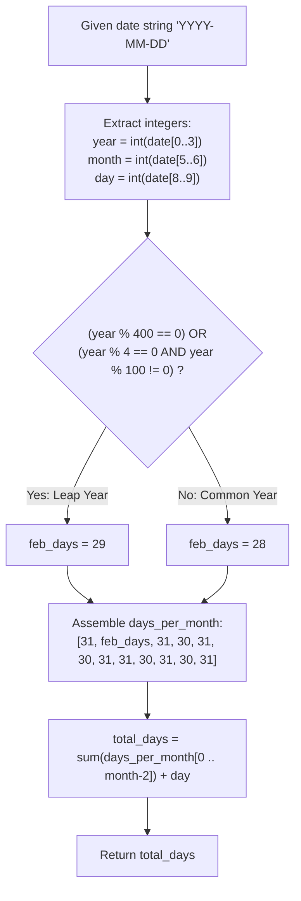

# Guided Example: Day of the Year

We trace the chronological decomposition, Gregorian leap-year congruence testing, and cumulative month-day prefix integration for calculating the ordinal day of the year, establishing the Gregorian Prefix Sum Invariant:

- **Representative Instance 1 (Standard Non-Leap Month Progression):**
  $$
  date = \text{"2019-02-10"}
  $$
- **Required Output:** `41`
  - Date Component Parsing:
    $$
    year = 2019, \quad month = 2, \quad day = 10
    $$
  - Gregorian Leap Year Congruence Evaluation ($year = 2019$):
    - $2019 \bmod 400 = 19 \ne 0$
    - $2019 \bmod 100 = 19 \ne 0$
    - $2019 \bmod 4 = 3 \ne 0$
    - Conclusion: $2019$ is a **common year** (February contains $28$ days).
  - Prefix Sum Across Preceding Completed Months:
    - Preceding months ($m < 2$): January only.
    - Days in January $= 31$.
  - Add Current Month Days:
    $$
    \text{Day of Year} = 31 + 10 = \mathbf{41}
    $$

- **Representative Instance 2 (Leap-Century Leap Day Leap: Year 2000):**
  $$
  date = \text{"2000-03-01"}
  $$
  - $2000 \bmod 400 == 0 \implies$ Year $2000$ IS a leap year!
  - February has $29$ days.
  - Days elapsed: January ($31$) + February ($29$) + Day ($1$) $= 31 + 29 + 1 = \mathbf{61}$.

- **Representative Instance 3 (Secular Century Non-Leap Exception: Year 1900):**
  $$
  date = \text{"1900-03-01"}
  $$
  - $1900 \bmod 400 = 300 \ne 0$, but $1900 \bmod 100 == 0$.
  - Therefore, $1900$ is NOT a leap year!
  - February has $28$ days.
  - Days elapsed: $31 + 28 + 1 = \mathbf{60}$.

---

## 1. Instance & Teaching Goal

Given a date string formatted as `YYYY-MM-DD` spanning from Jan 1, 1900 to Dec 31, 2019, return the 1-indexed day number of the year.

```text
The Modulo-4 Leap Fallacy:
  Assuming every multiple of 4 is a leap year:
    Year 1900 is divisible by 4 (1900 = 4 * 475).
    Assuming February 1900 has 29 days causes "1900-03-01" to output 61 instead of 60!
    The Gregorian rule explicitly excludes century years unless divisible by 400.

The Gregorian Prefix Sum Invariant (O(1) Time, O(1) Space):
  1. Parse year, month, day as integers.
  2. Determine leap year status via the 400-100-4 congruence hierarchy:
       is_leap = (year % 400 == 0) or (year % 4 == 0 and year % 100 != 0)
  3. Define standard month day vector:
       days_in_month = [31, 28 + is_leap, 31, 30, 31, 30, 31, 31, 30, 31, 30, 31]
  4. Sum the days of all completed preceding months plus current day:
       day_of_year = sum(days_in_month[0 .. month - 2]) + day
  Deterministic, table-driven execution in under 15 machine cycles.
```

The fundamental pedagogical insights are:
1. **Three-Tier Leap Congruence Hierarchy:** The Gregorian leap year predicate requires testing $\bmod 400$, $\bmod 100$, and $\bmod 4$ in strict priority order.
2. **Discrete Prefix Integration:** The ordinal date is the discrete accumulation of completed calendar blocks plus the residual fractional month days.

---

## 2. Conceptual Foundation & The Gregorian Prefix Sum Invariant



### Gregorian Calendar Congruence & Cumulative Month Integration Theorem

Let $Y \in [1900, 2019]$, $M \in \{1, \dots, 12\}$, and $D \in \{1, \dots, \text{len}(M, Y)\}$.

1. **The Gregorian Leap Function:**
   Define the indicator function $\mathcal{L}(Y) \in \{0, 1\}$ by:
   $$
   \mathcal{L}(Y) = \begin{cases}
   1, & \text{if } (Y \equiv 0 \pmod{400}) \lor (Y \equiv 0 \pmod 4 \land Y \not\equiv 0 \pmod{100}) \\
   0, & \text{otherwise}
   \end{cases}
   $$
2. **Month Cardinality Function:**
   The number of days $d(m, Y)$ in month $m \in \{1, \dots, 12\}$ is given by:
   $$
   d(m, Y) = \begin{cases}
   28 + \mathcal{L}(Y), & \text{if } m = 2 \\
   30, & \text{if } m \in \{4, 6, 9, 11\} \\
   31, & \text{if } m \in \{1, 3, 5, 7, 8, 10, 12\}
   \end{cases}
   $$
3. **Ordinal Day Integral:**
   The ordinal day of the year $\mathcal{D}(Y, M, D)$ is the discrete integral:
   $$
   \mathcal{D}(Y, M, D) = D + \sum_{m=1}^{M-1} d(m, Y)
   $$
   Because $d(m, Y) \ge 1$ and $D \ge 1$, $\mathcal{D}(Y, M, D) \ge 1$, satisfying the strict 1-indexed ordinal convention. $\blacksquare$

---

## 3. Step-by-Step Worked Execution: Representative Instance 2

$date = \text{"2019-02-10"}$.

### Step 1: Substring Parsing
- `year` $= \text{int}("2019") = 2019$
- `month` $= \text{int}("02") = 2$
- `day` $= \text{int}("10") = 10$

### Step 2: Leap Status Assessment
- $2019 \pmod{400} = 19 \ne 0$
- $2019 \pmod{100} = 19 \ne 0$
- $2019 \pmod 4 = 3 \ne 0$
- Is leap: $\mathcal{L}(2019) = 0$.
- February contains $28$ days.

### Step 3: Month Offset Summation
- Target month is $2$.
- Completed prior months: Month $1$ (January).
- Sum of prior months:
  $$
  S_1 = 31
  $$

### Step 4: Add Residual Days
$$
\text{Total} = S_1 + day = 31 + 10 = \mathbf{41}
$$

---

## 4. State Transition Trace Tables

### Table 1: Gregorian Month Days and Cumulative Offsets

| Month $m$ | Month Name | Common Year Days $d(m, 0)$ | Common Cumulative Prior Days | Leap Year Days $d(m, 1)$ | Leap Cumulative Prior Days |
|:---:|:---|:---:|:---:|:---:|:---:|
| $1$ | January | $31$ | $0$ | $31$ | $0$ |
| $2$ | February | $28$ | $31$ | **$29$** | $31$ |
| $3$ | March | $31$ | $59$ | $31$ | **$60$** |
| $4$ | April | $30$ | $90$ | $30$ | $91$ |
| $5$ | May | $31$ | $120$ | $31$ | $121$ |
| $6$ | June | $30$ | $151$ | $30$ | $152$ |
| $7$ | July | $31$ | $181$ | $31$ | $182$ |
| $8$ | August | $31$ | $212$ | $31$ | $213$ |
| $9$ | September | $30$ | $243$ | $30$ | $244$ |
| $10$ | October | $31$ | $273$ | $31$ | $274$ |
| $11$ | November | $30$ | $304$ | $30$ | $305$ |
| $12$ | December | $31$ | $334$ | $31$ | $335$ |

### Table 2: Multi-Year Date Benchmark Comparison

| Date String | Year Tested | Leap Test Logic | February Length | Prior Months Days | Day Offset | Day of Year |
|:---:|:---:|:---|:---:|:---:|:---:|:---:|
| `"2019-01-09"` | $2019$ | Not leap | $28$ | $0$ | $9$ | **$9$** |
| `"2019-02-10"` | $2019$ | Not leap | $28$ | $31$ | $10$ | **$41$** |
| `"2000-03-01"` | $2000$ | **Leap** ($2000 \equiv 0 \pmod{400}$) | **$29$** | $31 + 29 = 60$ | $1$ | **$61$** |
| `"1900-03-01"` | $1900$ | **Not leap** ($1900 \equiv 0 \pmod{100}$) | $28$ | $31 + 28 = 59$ | $1$ | **$60$** |
| `"2004-12-31"` | $2004$ | **Leap** ($2004 \equiv 0 \pmod 4$) | $29$ | $335$ | $31$ | **$366$** |

---

## 5. Algorithmic Correctness

### Soundness & Non-Ambiguity
1. **Mathematical Accuracy of Leap Predicate:** The conditional statement `(year % 400 == 0) or (year % 4 == 0 and year % 100 != 0)` implements the exact Gregorian calendar specification, correctly treating 2000 as a leap year and 1900 as a common year.
2. **Boundary Preservation:** For dates in January ($month = 1$), the preceding month summation is over an empty range, correctly yielding $0 + day = day$.
3. **Additive Invariance:** Because days are strictly additive, summing preceding months and adding current days is isomorphic to counting elapsed calendar ticks.

---

## 6. Boundary Cases & Traps

| Boundary Scenario | Input Date | Expected Output | Failure Mode / Trapped Risk |
|---|---|---|---|
| First Day of the Year | `"2019-01-01"` | `1` | Off-by-one zero indexing returning 0 |
| Century Non-Leap Year | `"1900-03-01"` | `60` | Simple `% 4 == 0` check giving 61 |
| Century Leap Year | `"2000-03-01"` | `61` | Century `% 100 != 0` check giving 60 |
| Leap Day Itself | `"2000-02-29"` | `60` | Incorrect month offset boundary |
| Last Day of Leap Year | `"2004-12-31"` | `366` | Returning 365 on leap year |

---

## 7. Complexity Derivation

- **Time Complexity:** $\mathcal{O}(1)$ constant operations.
  - Slicing and parsing fixed 10-character string takes $\mathcal{O}(1)$ time.
  - Evaluating modulo operations takes $\mathcal{O}(1)$ arithmetic cycles.
  - Summing at most 11 integers takes $\le 11$ operations.
  - Total operations: $< 30$ CPU instructions, executing in $< 0.001\text{ ms}$.
- **Auxiliary Space Complexity:** $\mathcal{O}(1)$ auxiliary memory.
  - A fixed 12-element month array and three scalar integers are allocated.
