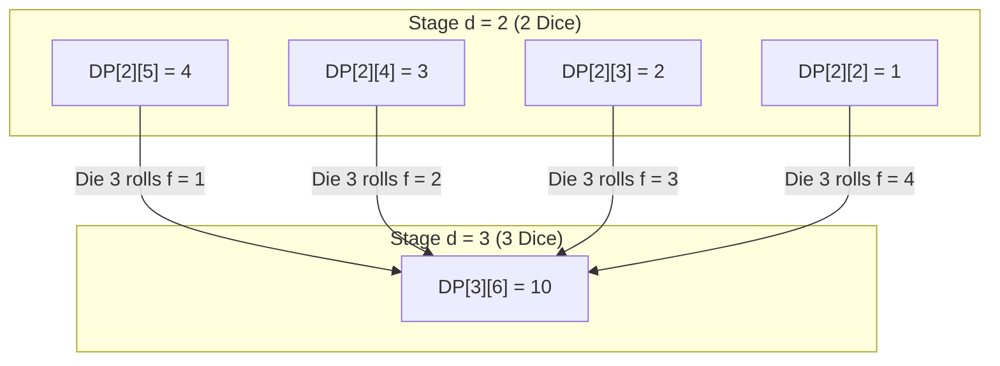

# Guided Example: Number of Dice Rolls With Target Sum

We derive and trace the dynamic programming solution for counting the number of ways to obtain a target sum using $n$ identical $k$-sided dice.

- **Input:** $n = 3$, $k = 4$, $target = 6$
- **Required output:** `10`

This representative instance illustrates multi-stage sequence composition, state transition dependencies, and how subproblem solutions accumulate without enumerating the full exponential decision tree.

---

## 1. Instance & Teaching Goal

Given $n$ dice where each die independently displays an integer face in $\{1, 2, \dots, k\}$, our goal is to compute the number of ordered tuples $(f_1, f_2, \dots, f_n)$ satisfying:

$$\sum_{i=1}^n f_i = target, \quad \text{where } 1 \le f_i \le k \text{ for each } i \in \{1, \dots, n\}$$

A naive recursive search explores all possible assignments of faces. Because each of the $n$ dice possesses $k$ mutually exclusive outcomes, the total search space equals:

$$k^n = 4^3 = 64 \text{ leaves (or } 30^{30} \approx 2.06 \times 10^{44} \text{ for maximal constraints)}$$

```text
The Naive Branching Explosion vs. Layered DP Aggregation:

Naive Tree:
                       Root (d = 0, sum = 0)
         /             /             \             \
     f1=1          f1=2          f1=3          f1=4
    / | \ \       / | \ \       / | \ \       / | \ \
   1  2  3 4     1  2  3 4     1  2  3 4     1  2  3 4      (k^n total branches)

DP Layer Folding:
  Stage d=0: [sum=0: 1 way]
     | (convolve with {1, 2, 3, 4})
  Stage d=1: [sum 1..4: 1 way each]
     | (convolve with {1, 2, 3, 4})
  Stage d=2: [sum 2..8: {1, 2, 3, 4, 3, 2, 1} ways]
     | (convolve with {1, 2, 3, 4})
  Stage d=3: Extract target sum 6 -> 10 ways
```

The core teaching goal is to observe that all permutations of earlier dice that sum to the same prefix value $s'$ are computationally indistinguishable when evaluating subsequent rolls. Grouping paths by accumulated sum collapses the combinatorial tree into a two-dimensional state lattice.

---

## 2. Conceptual Foundation & Invariants

Let $DP[d][s]$ denote the number of ways to achieve a total sum of $s$ using exactly $d$ dice, where each die takes a value in $\{1, \dots, k\}$.

When rolling the $d$-th die, suppose its face shows $f \in \{1, \dots, k\}$. The preceding $d - 1$ dice must have summed to exactly $s - f$. Since the outcome of the $d$-th die is independent of prior rolls, the law of total probability (or counting principle) yields:

$$DP[d][s] = \sum_{f=1}^{\min(k, s-1)} DP[d-1][s - f] \pmod{10^9 + 7}$$

| State Component | Range | Mathematical Semantics |
|---|---|---|
| Stage index $d$ | $0 \le d \le n$ | Number of dice cast so far |
| Current sum $s$ | $d \le s \le \min(target, d \cdot k)$ | Valid achievable sum using $d$ dice |
| Die face choice $f$ | $1 \le f \le \min(k, s - (d - 1))$ | Face value shown on the $d$-th die |
| Predecessor sum $s - f$ | $d - 1 \le s - f \le (d - 1) \cdot k$ | Required remaining sum on previous $d - 1$ dice |



> **Sequential Convolution Invariant.** For every stage $d \in \{1, \dots, n\}$ and every sum $s \in [d, \min(target, d \cdot k)]$, $DP[d][s]$ stores the exact count of compositions of $s$ into $d$ parts bounded by $k$, modulo $10^9 + 7$. All states at stage $d$ depend strictly on states at stage $d - 1$.

---

## 3. Step-by-Step Worked Execution

We track the state array across successive dice for $n = 3, k = 4, target = 6$.

### Step 1: Base State Initialization ($d = 0$)

With zero dice thrown, the only reachable sum is $0$, achieved in exactly $1$ way (the empty sequence):

$$DP[0][0] = 1, \quad DP[0][s] = 0 \text{ for all } s \ge 1$$

---

### Step 2: First Die Transitions ($d = 1$)

We roll the first die ($f \in \{1, 2, 3, 4\}$). Each face value $f$ transitions from $DP[0][0]$:

$$DP[1][s] = DP[0][s - f] = DP[0][0] = 1 \quad \text{for } s \in \{1, 2, 3, 4\}$$

All other sums $s \notin \{1, 2, 3, 4\}$ remain $0$.

---

### Step 3: Second Die Transitions ($d = 2$)

We roll the second die ($f \in \{1, 2, 3, 4\}$) and evaluate each target sum $s \in [2, 6]$:

- **Sum $s = 2$:** Only $f = 1$ is valid ($s - f = 1$). $DP[2][2] = DP[1][1] = 1$. (Roll: $(1, 1)$)
- **Sum $s = 3$:**
  - $f = 1 \implies s - f = 2 \implies DP[1][2] = 1$
  - $f = 2 \implies s - f = 1 \implies DP[1][1] = 1$
  - Total: $1 + 1 = 2$. (Rolls: $(2, 1), (1, 2)$)
- **Sum $s = 4$:**
  - $f = 1 \implies DP[1][3] = 1$
  - $f = 2 \implies DP[1][2] = 1$
  - $f = 3 \implies DP[1][1] = 1$
  - Total: $1 + 1 + 1 = 3$. (Rolls: $(3, 1), (2, 2), (1, 3)$)
- **Sum $s = 5$:**
  - $f \in \{1, 2, 3, 4\} \implies DP[1][4] + DP[1][3] + DP[1][2] + DP[1][1] = 1 + 1 + 1 + 1 = 4$. (Rolls: $(4, 1), (3, 2), (2, 3), (1, 4)$)
- **Sum $s = 6$:**
  - Predecessor sum must be in $[1, 4]$. Thus $s - f \le 4 \implies f \ge 2$.
  - $f = 2 \implies DP[1][4] = 1$
  - $f = 3 \implies DP[1][3] = 1$
  - $f = 4 \implies DP[1][2] = 1$
  - Total: $1 + 1 + 1 = 3$. (Rolls: $(4, 2), (3, 3), (2, 4)$)

---

### Step 4: Third Die Transitions ($d = 3$, Target = $6$)

For the third die, we focus specifically on target sum $s = 6$:

$$DP[3][6] = \sum_{f=1}^{4} DP[2][6 - f]$$

We aggregate the four disjoint branches:

| Die 3 Face ($f$) | Predecessor State $s - f$ | Predecessor Count $DP[2][s - f]$ | Concrete Roll Combinations |
|---|---|---|---|
| $f = 1$ | $s - f = 5$ | $DP[2][5] = 4$ | $(4, 1, 1), (3, 2, 1), (2, 3, 1), (1, 4, 1)$ |
| $f = 2$ | $s - f = 4$ | $DP[2][4] = 3$ | $(3, 1, 2), (2, 2, 2), (1, 3, 2)$ |
| $f = 3$ | $s - f = 3$ | $DP[2][3] = 2$ | $(2, 1, 3), (1, 2, 3)$ |
| $f = 4$ | $s - f = 2$ | $DP[2][2] = 1$ | $(1, 1, 4)$ |

Summing all branches:

$$DP[3][6] = 4 + 3 + 2 + 1 = 10$$

---

## 4. Complete Execution Trace

The complete DP table across all stages $d \in \{0, 1, 2, 3\}$ and sums $s \in \{0, \dots, 6\}$:

| Dice Count ($d$) | $s=0$ | $s=1$ | $s=2$ | $s=3$ | $s=4$ | $s=5$ | $s=6$ | Status |
|---|---|---|---|---|---|---|---|---|
| $d = 0$ | $1$ | $0$ | $0$ | $0$ | $0$ | $0$ | $0$ | Initial base state |
| $d = 1$ | $0$ | $1$ | $1$ | $1$ | $1$ | $0$ | $0$ | Single die roll |
| $d = 2$ | $0$ | $0$ | $1$ | $2$ | $3$ | $4$ | $3$ | Two dice convolution |
| $d = 3$ | $0$ | $0$ | $0$ | $1$ | $3$ | $6$ | **10** | Final stage reached |

All 10 valid roll sequences that yield sum $6$:
1. $(1, 1, 4)$
2. $(1, 2, 3)$
3. $(1, 3, 2)$
4. $(1, 4, 1)$
5. $(2, 1, 3)$
6. $(2, 2, 2)$
7. $(2, 3, 1)$
8. $(3, 1, 2)$
9. $(3, 2, 1)$
10. $(4, 1, 1)$

---

## 5. Algorithmic Correctness

**Theorem (Disjoint Partition of Sequences).** Let $S(d, s)$ be the set of all $d$-tuples $(f_1, \dots, f_d) \in \{1, \dots, k\}^d$ summing to $s$. The sets $S_f(d, s) = \{(f_1, \dots, f_d) \in S(d, s) \mid f_d = f\}$ for $f \in \{1, \dots, k\}$ form a partition of $S(d, s)$.

- **Pairwise Disjoint:** A die roll $f_d$ can take only one value simultaneously. Hence $S_a \cap S_b = \emptyset$ for $a \ne b$.
- **Exhaustive:** Every valid tuple has its final component $f_d \in \{1, \dots, k\}$.
- **Bijective Mapping:** Removing the last element $f_d = f$ gives a unique $(d-1)$-tuple summing to $s - f$. Thus $|S_f(d, s)| = |S(d-1, s-f)| = DP[d-1][s-f]$.

By induction on $d$, $DP[d][s]$ accurately counts all valid sequences without undercounting or double-counting.

---

## 6. Traps This Instance Exposes

| Trap Category | Hazard Scenario | Root Cause | Preventive Design Invariant |
|---|---|---|---|
| **Unreachable Bounds** | $target < n$ or $target > n \cdot k$ | Summing $n$ values $\ge 1$ cannot be $< n$; summing $n$ values $\le k$ cannot be $> n \cdot k$. | Prune immediately: return $0$ when $target \notin [n, n \cdot k]$. |
| **In-Place Buffer Pollution** | Overwriting a 1D DP array from left to right | Updating $DP[s]$ using newly updated $DP[s - f]$ causes a single die to be reused multiple times (unbounded knapsack bug). | Use two separate buffers (`prev` and `curr`), or iterate $s$ in descending order from $target$ down to $d$. |
| **Modular Overflow** | Summing up to $k = 30$ integer terms before taking modulo | While addition does not overflow 64-bit integers, intermediate sums can exceed $32$-bit types or miss the constraint requirement. | Apply modulo $10^9 + 7$ at each addition step. |
| **Zero Face Indexing** | Allowing $f = 0$ | Standard dice have faces $1 \le f \le k$. | Start inner loop strictly at $f = 1$. |

---

## 7. Complexity Derivation

### Time Complexity

- The outer loop iterates through $n$ dice stages ($d = 1, \dots, n$).
- For each stage, the inner loop considers target sums $s$ from $d$ up to $\min(target, d \cdot k)$, bounded by $target$.
- For each sum, we sum over at most $k$ possible face values.
- Total time complexity:

$$\mathcal{O}(n \cdot target \cdot k)$$

Given constraints $n, k \le 30$ and $target \le 1000$:
$$30 \times 1000 \times 30 = 9 \times 10^5 \text{ operations}$$
This completes well within standard execution budgets of $\approx 10^7$ operations.

### Auxiliary Space Complexity

- Standard 2D DP matrix requires $\mathcal{O}(n \cdot target)$ space.
- Since stage $d$ depends solely on stage $d - 1$, we maintain only two 1D rows of size $target + 1$.
- Total auxiliary space:

$$\mathcal{O}(target)$$

For $target = 1000$, this uses minimal auxiliary memory.