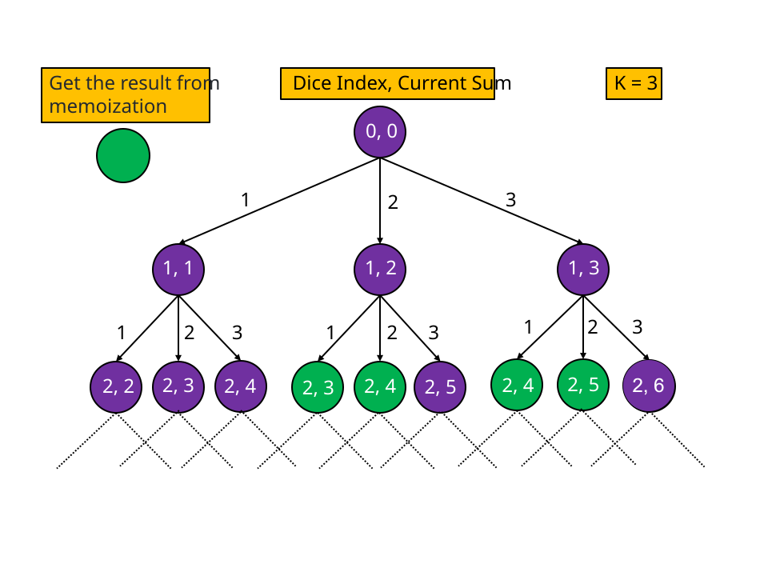

## Solution

---

### Overview

We have `n` dice, each having `k` faces with a number from `1` to `k`. We need to find the number of ways to roll these $n$ dice such that the sum of numbers on them is equal to `target`.

There are two characteristics of this problem that we should take note of at this time. First, as we iterate over the dice, we need to decide the number for each dice. The feasible options for number at the current dice depend upon the current sum, which is in turn dependent on the number we chose for the previous dice. It implies each decision we make is affected by the previous decisions we have made. Second, the problem is asking to count all the ways to roll `n` dice. These two characteristics suggest that we may be able to solve this problem using dynamic programming. We will be covering two dynamic programming approaches namely, Top-Down and Bottom-Up.
</br>

---

### Approach 1: Top-Down Dynamic Programming

**Intuition**

A common way to come up with a DP solution is to start with brute force. Let's start with a brute-force solution and then optimize it. In a brute-force solution, we can go through each possible outcome and count those with the result equal to `target`. To do this, we can iterate over the numbers `1` to `k` for each dice and add it to a variable to keep the current sum value and recursively move to the next dice. In the end, after iterating over all the dice, we can check if the current sum is equal to the `target`. If they are equal, we will increment the variable representing the number of possible ways.

For this recursive approach, what are the parameters that we need to track? The first parameter is the index of the die that we are currently considering as we traverse the dice. Secondly, we need to keep track of the sum of values that we chose for the previous dice.

In this approach, we will have to iterate over all the $k^n$ possibilities, and hence is not efficient. If we observe the below figure, there are repeated subproblems. Notice the green nodes are repeated subproblems signifying that we have already solved these subproblems before. To avoid recalculating results for previously seen subproblems, we will memoize the result for each subproblem. So the next time we need to calculate the result for the same set of parameters `{index, sum}`, we can simply look up the result in constant time instead of recalculating the result.



**Algorithm**

1. Start with:
   - The dice index `diceIndex` is `0`; this is the index of the die we are currently considering.
   - The sum of numbers on the previous dice `currSum` as `0`.
2. Initialize the variable `ways` to `0`. Iterate over the values from `1` to `k`, for each value `i`:
- If the current die can have value `i`, i.e., `currSum` after adding `i` will not exceed the `target` value. Then update the value of `currSum` and recursively move to the next die. Add the value returned by this recursive call to `ways`
- Else, if this value is not possible, then break from the loop as the greater values will not satisfy the above condition as well.
3. Base cases:
- If we have iterated over all the dice, i.e., $diceIndex = n$, then check if the `currSum` is equal to target or not.
4. Return the value `ways` and also store it in the memoization table `memo` corresponding to the current state, which is defined by `diceIndex` and `currSum`.

**Implementation**

```cpp
class Solution {
public:
    const int MOD = 1e9 + 7;

    int waysToTarget(vector<vector<int>>& memo, int diceIndex, int n, int currSum, int target, int k) {
        // All the n dice are traversed, the sum must be equal to target for valid combination
        if (diceIndex == n) {
            return currSum == target;
        }

        // We have already calculated the answer so no need to go into recursion
        if (memo[diceIndex][currSum] != -1) {
            return memo[diceIndex][currSum];
        }

        int ways = 0;
        // Iterate over the possible face value for current dice
        for (int i = 1; i <= min(k, target - currSum); i++) {
            ways = (ways + waysToTarget(memo, diceIndex + 1, n, currSum + i, target, k)) % MOD;
        }
        return memo[diceIndex][currSum] = ways;
    }

    int numRollsToTarget(int n, int k, int target) {
        vector<vector<int>> memo(n + 1, vector<int>(target + 1, -1));
        return waysToTarget(memo, 0, n, 0, target, k);
    }
};
```

**Complexity Analysis**

Here, $N$ is the number of dice, $K$ is the number of faces each dice have, and $T$ is the `target` value.

* Time complexity: $O(N * T * K)$

   Each state is defined by the `diceIndex` and the `currSum`. Hence, there will be $N * T$ states, and in the worst, we must visit most of the states to solve the original problem. Each recursive call will require $O(K)$ time as we iterate over the possible values from $1$ to $K$. Therefore, the total time required will be equal to $O(N * T * K)$.

* Space complexity: $O(N * T)$

  The memoization results are stored in the table memo with size $N * T$. Also, stack space in the recursion is equal to the maximum number of active functions. The maximum number of active functions will be at most $N$, i.e., one function call for every die. Hence, the space complexity is $O(N * T)$.
<br/>

---

### Approach 2: Bottom-Up Dynamic Programming

**Intuition**

In the previous approach, the recursive calls incurred stack space. We can avoid this by applying the same approach iteratively, which is often faster than the top-down approach. We will follow a similar approach to the previous one. However, this time we will iterate over the states by starting from the base case and ending at the initial query.

As per the previous approach, the recursive equation will be: $\text{memo}[diceIndex][currSum] = memo[diceIndex + 1][currSum + i]$ for each `i` in the range `[1, K]`. This is because for the current dice we add the value `i` to `currentSum` and move on to the next dice. Starting from the base case we will initialize $\text{memo}[n][target]$ to `1`, this is because there is only one way if no dice left and the sum is equal to target. Then we can find values for $diceIndex = n - 1$ and `currSum` values in the range `[0, target]` by iterating over the values `[0, K]` for `i` using the above recursive equation.

**Algorithm**

1. Initialize $\text{memo}[n][target]$ to `1` and all other values to `0`.
2. Iterate over the `diceIndex` from $n - 1$ to `0`; for each dice value, iterate over the `currSum` from `0` to `target`. For each such state corresponding to `diceIndex` and `currSum`:

- Initialize `ways` to `0`.
- Iterate over values from `1` to `K` as `i` and for each valid value of `i` (adding `i` to `currSum` doesn't exceed `target`) add the value $memo[diceIndex + 1][currSum + i]$ to `ways`.
- Assign the `ways` to $\text{memo}[diceIndex][currSum]$.
3. Return the value $\text{memo}[0][0]$.

**Implementation**

```cpp
class Solution {
public:
    const int MOD = 1e9 + 7;

    int numRollsToTarget(int n, int k, int target) {
        vector<vector<int>> memo(n + 1, vector<int>(target + 1, 0));
        // Intialize the base case
        memo[n][target] = 1;

        for (int diceIndex = n - 1; diceIndex >= 0; diceIndex--) {
            for (int currSum = 0; currSum <= target; currSum++) {
               int ways = 0;

                // Iterate over the possible face value for current dice
                for (int i = 1; i <= min(k, target - currSum); i++) {
                    ways = (ways + memo[diceIndex + 1][currSum + i]) % MOD;
                }

                memo[diceIndex][currSum] = ways;
            }
        }

        return memo[0][0];
    }
};
```

**Complexity Analysis**

Here, $N$ is the number of dice, $K$ is the number of faces each dice have, and $T$ is the `target` value.

* Time complexity: $O(N * T * K)$

  We have three nested loops, the first one iterate over dices from $N - 1$ to $0$, the second one iterate over sum value from $0$ to $T$, and the third value iterate over the possible values of dice face from $1$ to $K$. Hence, the total time complexity would be equal to $O(N * T * K)$.

* Space complexity: $O(N * T)$

  The results are stored in the array `memo`, with the size of $N * T$. Hence, the space complexity is equal to $O(N * T)$.
<br/>

---