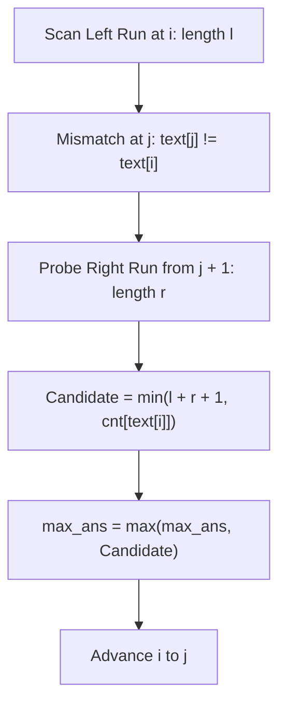

# Guided Example: Swap For Longest Repeated Character Substring

We derive and trace the two-pointer run-length bridging algorithm to determine the maximum length of a repeated-character substring achievable by at most one character swap.

- **Input:** $text = \text{"aaabaaa"}$
- **Required output:** `6`

This instance illustrates how run-length decomposition, single-character barrier bridging, and global multiset bounds combine to evaluate all swap possibilities in linear time without brute-force string permutations.

---

## 1. Instance & Teaching Goal

Given a string $text$ of lowercase English letters, we are permitted to swap any two characters at indices $p$ and $q$ ($p \ne q$). We seek the maximum length of a contiguous substring containing identical characters.

A naive approach considers all $\binom{N}{2} = \mathcal{O}(N^2)$ possible swaps, and for each swapped string, scans $\mathcal{O}(N)$ characters to locate the longest monochromatic run. For $N = 2 \times 10^4$:

$$\binom{20000}{2} \approx 2 \times 10^8 \text{ swaps} \times 20000 \text{ checks} = 4 \times 10^{12} \text{ operations (Time Limit Exceeded)}$$

```text
Brute Force Swaps vs. Run-Length Bridge Analysis:

String:  a  a  a  b  a  a  a
Index:   0  1  2  3  4  5  6

Configuration 1: Run Extension (no bridge)
  Left run 'aaa' has length l = 3.
  Can we append another 'a'? Yes, if there is an 'a' elsewhere.
  Total 'a' count = 6 > 3 -> achieves 3 + 1 = 4.

Configuration 2: Single-Gap Bridge
  Left run 'aaa' (l = 3), separator 'b' (gap = 1), Right run 'aaa' (r = 3).
  Can we swap 'b' with an external 'a'?
    Total 'a' in text = 6.
    'a' in left + right = 3 + 3 = 6.
    No spare external 'a' exists!
    We can only take an 'a' from one of the ends and place it into gap:
    Resulting string: 'a a a a a a b' -> length = 6.
```

The fundamental pedagogical insight is that an optimal monochromatic block after at most one swap can only arise in two distinct geometric forms:
1. **Single-Run Extension:** A contiguous run of character $c$ of length $l$ absorbs one external $c$ swapped in from another part of the string, reaching length $l + 1$ (provided total count $cnt[c] > l$).
2. **Single-Gap Bridge:** Two contiguous runs of character $c$ of lengths $l$ and $r$, separated by exactly one mismatched character at index $j$, are joined into a single block. If an external $c$ exists ($cnt[c] > l + r$), the gap is filled to yield $l + r + 1$. If no external $c$ exists ($cnt[c] = l + r$), a character from one end of the runs is shifted into the gap, yielding $l + r$.

Both cases are unified by the expression:

$$\text{Candidate Length} = \min(l + r + 1, cnt[c])$$

---

## 2. Conceptual Foundation & Invariants

Let $cnt[c]$ denote the global frequency of character $c \in \{\text{'a'}, \dots, \text{'z'}\}$ in the entire string $text$.

When scanning $text$ from left to right:
- Let the primary run of character $c = text[i]$ start at index $i$ and extend to $j - 1$ (length $l = j - i$).
- Position $j$ is the first mismatch: $text[j] \ne c$.
- Check the segment immediately following the gap: from index $j + 1$, let the secondary run of identical character $c$ extend to $k - 1$ (length $r = k - (j + 1)$). If $text[j+1] \ne c$ or $j + 1 \ge N$, then $r = 0$.

| Variable | Definition | Role in Algorithm |
|---|---|---|
| $cnt[c]$ | Total occurrences of character $c$ in $text$ | Hard ceiling for maximum possible run of $c$ |
| $i$ | Starting index of current homogeneous run | Left anchor |
| $j$ | Index of the first character differing from $text[i]$ | Marks right end of left run and single-gap position |
| $l = j - i$ | Length of left run of character $c$ | Primary block size |
| $k$ | Index of first mismatch after the single gap | Marks right end of right run |
| $r = k - j - 1$ | Length of right run of character $c$ ($r \ge 0$) | Secondary block size |
| $\min(l + r + 1, cnt[c])$ | Unified candidate length | Evaluates both extension and bridge simultaneously |



> **Run-Length Decomposition Invariant.** For every distinct maximal contiguous block $[i, j-1]$ of character $c$, evaluating $\min((j - i) + r + 1, cnt[c])$ guarantees consideration of both isolated extension ($r = 0$) and gap bridging ($r > 0$) without missing any candidate window.

---

## 3. Step-by-Step Worked Execution

We trace $text = \text{"aaabaaa"}$ with $N = 7$.

### Step 0: Global Frequency Counting

We compute the global character counts:
- $cnt[\text{'a'}] = 6$ (indices $0, 1, 2, 4, 5, 6$)
- $cnt[\text{'b'}] = 1$ (index $3$)

Initialize `max_len = 0`, `i = 0`.

---

### Step 1: Evaluating Block 1 at $i = 0$ ($c = \text{'a'}$)

1. **Find Left Run:**
   - Indices $0, 1, 2$ have $text = \text{'a'}$.
   - First mismatch at $j = 3$ ($text[3] = \text{'b'}$).
   - Left run length $l = 3 - 0 = 3$.
2. **Find Right Run across Gap at $j = 3$:**
   - Examine index $j + 1 = 4$.
   - Characters at indices $4, 5, 6$ have $text = \text{'a'}$.
   - End of string reached at $k = 7$.
   - Right run length $r = 7 - 3 - 1 = 3$.
3. **Compute Candidate Length:**
   $$l + r + 1 = 3 + 3 + 1 = 7$$
   Since $cnt[\text{'a'}] = 6$, we cap the value:
   $$\text{candidate} = \min(7, 6) = 6$$
4. **Update Global Answer:**
   $$\text{max\_len} = \max(0, 6) = 6$$
5. **Advance Cursor:** Set $i = j = 3$.

---

### Step 2: Evaluating Block 2 at $i = 3$ ($c = \text{'b'}$)

1. **Find Left Run:**
   - Index $3$ has $text = \text{'b'}$.
   - First mismatch at $j = 4$ ($text[4] = \text{'a'}$).
   - Left run length $l = 4 - 3 = 1$.
2. **Find Right Run across Gap at $j = 4$:**
   - Examine index $j + 1 = 5$.
   - $text[5] = \text{'a'} \ne \text{'b'}$.
   - Right run length $r = 0$ ($k = 5$).
3. **Compute Candidate Length:**
   $$l + r + 1 = 1 + 0 + 1 = 2$$
   Since $cnt[\text{'b'}] = 1$:
   $$\text{candidate} = \min(2, 1) = 1$$
4. **Update Global Answer:**
   $$\text{max\_len} = \max(6, 1) = 6$$
5. **Advance Cursor:** Set $i = j = 4$.

---

### Step 3: Evaluating Block 3 at $i = 4$ ($c = \text{'a'}$)

1. **Find Left Run:**
   - Indices $4, 5, 6$ have $text = \text{'a'}$.
   - End of string at $j = 7$.
   - Left run length $l = 7 - 4 = 3$.
2. **Find Right Run across Gap at $j = 7$:**
   - $j + 1 = 8 > N$, so $r = 0$.
3. **Compute Candidate Length:**
   $$\min(3 + 0 + 1, cnt[\text{'a'}]) = \min(4, 6) = 4$$
4. **Update Global Answer:**
   $$\text{max\_len} = \max(6, 4) = 6$$
5. **Advance Cursor:** $i = 7 = N$. Loop terminates.

---

## 4. Complete Execution Trace

| Iteration | Anchor $i$ | Char $c$ | Left End $j$ | Left Len $l$ | Right End $k$ | Right Len $r$ | $l + r + 1$ | $cnt[c]$ | Candidate | Global Max |
|---|---|---|---|---|---|---|---|---|---|---|
| 1 | $0$ | `'a'` | $3$ | $3$ | $7$ | $3$ | $7$ | $6$ | $6$ | $6$ |
| 2 | $3$ | `'b'` | $4$ | $1$ | $5$ | $0$ | $2$ | $1$ | $1$ | $6$ |
| 3 | $4$ | `'a'` | $7$ | $3$ | $7$ | $0$ | $4$ | $6$ | $4$ | $6$ |

```text
Visual Layout of Candidate Formations:

Original:  [a a a]  b  [a a a]
            l = 3      r = 3
Swap index 3 with index 6:
Swapped:   [a a a   a   a a]  b
Length:    6 contiguous 'a's!
```

---

## 5. Algorithmic Correctness

**Theorem.** The two-pointer run-length bridging algorithm explores all achievable repeated character substring lengths.

1. **Monochromatic Window Invariant:** Any contiguous substring composed entirely of character $c$ after at most one swap must consist of:
   - At least one pre-existing contiguous segment of $c$ in the original string.
   - At most one single-character gap filled by a swapped $c$.
   - At most one additional $c$ appended to either boundary.
2. **Exhaustiveness of Left Anchors:** By taking each maximal contiguous run $[i, j-1]$ as the left anchor:
   - If no bridge exists ($text[j+1] \ne c$), $r = 0$, evaluating $\min(l + 1, cnt[c])$ checks if an external $c$ can extend this run.
   - If a bridge exists ($text[j+1] == c$), $r > 0$, evaluating $\min(l + r + 1, cnt[c])$ checks if the two segments can be merged.
3. **Upper Bound Tightness:** Since no operation can produce more $c$'s than exist in the entire string, the term $\min(\cdot, cnt[c])$ is exact and cannot overestimate.

---

## 6. Traps This Instance Exposes

| Trap Category | Hazard Scenario | Root Cause | Preventive Design Invariant |
|---|---|---|---|
| **Multi-Character Gap Trap** | $text = \text{"aaabbaaa"}$ | Two or more mismatched characters between runs (`gap > 1`). A single swap can only fix one position. | Ensure the right run is probed strictly at index $j + 1$. If $text[j+1] \ne c$, $r = 0$. |
| **Phantom Character Borrowing** | $text = \text{"aaabaaa"}$ where $l = 3, r = 3$ | Assuming $l + r + 1 = 7$ is always valid without checking if a 7th 'a' actually exists in the string. | Always cap the bridged length by the total global count: $\min(l + r + 1, cnt[c])$. |
| **Index Out of Bounds on Gap** | String ends with mismatch at $j = N - 1$ | Looking for $j + 1$ accesses index $N$. | Guard probe with boundary check $j + 1 < N$. |
| **Skipping Single Runs** | String has only isolated runs (e.g. `"abacaba"`) | Forgetting that a run of length 1 can still borrow an identical character to reach length 2. | Single run evaluation ($r = 0$) handles extension naturally via $\min(l + 1, cnt[c])$. |

---

## 7. Complexity Derivation

### Time Complexity

1. **Character Frequency Counter:** One linear pass over $text$ of length $N$ takes $\mathcal{O}(N)$ time.
2. **Two-Pointer Traversal:**
   - The outer pointer $i$ advances to $j$ after each block. Each character is visited as a left-run member at most once.
   - The probe pointer $k$ scans ahead over the right run. Each character is scanned by $k$ at most once as a right-run candidate.
   - Total characters scanned across all iterations is at most $2N$.
3. **Overall Time Complexity:**

$$\mathcal{O}(N)$$

For $N = 20{,}000$, this performs $\le 40{,}000$ operations, executing in under $5 \text{ ms}$.

### Auxiliary Space Complexity

- The frequency map $cnt$ stores counts for lowercase English letters: at most $26$ entries.
- Pointers $i, j, k, l, r$ and maximum tracker require $\mathcal{O}(1)$ scalar registers.
- Overall Auxiliary Space Complexity:

$$\mathcal{O}(|\Sigma|) = \mathcal{O}(1)$$