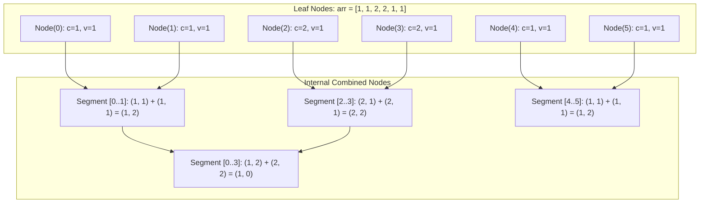

# Guided Example: Online Majority Element In Subarray

We trace the Boyer-Moore Voting Segment Tree paired with binary search frequency verification to answer online range majority queries in logarithmic time.

- **Input:** $arr = [1, 1, 2, 2, 1, 1]$
- **Queries:**
  - $\text{query}(0, 5, 4) \to 1$
  - $\text{query}(0, 3, 3) \to -1$
  - $\text{query}(2, 3, 2) \to 2$
- **Required output:** `[1, -1, 2]`

This instance demonstrates how the associative property of the Boyer-Moore voting algorithm enables range queries over a segment tree, while inverted index bisection provides exact candidate verification.

---

## 1. Instance & Teaching Goal

Given a static array $arr$ of length $N$, we must answer $Q$ dynamic queries of the form $(left, right, threshold)$. An element $x$ is a valid answer if its occurrence count in $arr[left \dots right]$ is at least $threshold$.

A crucial constraint in this problem is:

$$2 \times threshold > right - left + 1$$

This guarantee ensures that any qualifying element occurs in **strictly more than 50%** of the subarray. Consequently:
- At most **one** such element can exist in any query range.
- The classical Boyer-Moore Voting Algorithm applies.

A naive approach scans the subarray $arr[left \dots right]$ and tallies frequencies using a hash table on every query. For $Q = 10^4$ and $N = 2 \times 10^4$:

$$\mathcal{O}(Q \cdot N) = 10^4 \times 20000 = 2 \times 10^8 \text{ operations (Time Limit Exceeded)}$$

```text
Naive Range Scan vs. Segment Tree Boyer-Moore & Binary Search:

Naive Query [left ... right]:
  Hash Table scan: tally every element in arr[left...right] -> O(right - left + 1) per query

Segment Tree + Inverted Index Query:
  Phase 1: Segment Tree Query on [left, right]
           Combines O(log N) canonical nodes using associative Boyer-Moore operator.
           Yields candidate element x in O(log N) time.
  Phase 2: Inverted Index Verification
           pos[x] = sorted list of all indices where x appears in arr.
           Count = bisect_right(pos[x], right) - bisect_left(pos[x], left) in O(log N) time.
           If Count >= threshold, return x; else return -1.
```

The core teaching goal is to recognize that Boyer-Moore majority voting can be expressed as an **associative binary operator**, allowing it to be mapped directly into a segment tree for logarithmic range aggregation.

---

## 2. Conceptual Foundation & Invariants

### The Associative Boyer-Moore Merge Operator

Each segment tree node maintains a pair $(c, v)$:
- $c$: the surviving candidate element value.
- $v$: the net cancellation weight ($v \ge 0$).

When merging two adjacent intervals represented by $(c_1, v_1)$ and $(c_2, v_2)$, we define the merge operator $\oplus$:

$$(c_1, v_1) \oplus (c_2, v_2) = \begin{cases} (c_1, v_1 + v_2) & \text{if } c_1 = c_2 \\ (c_1, v_1 - v_2) & \text{if } c_1 \ne c_2 \text{ and } v_1 \ge v_2 \\ (c_2, v_2 - v_1) & \text{if } c_1 \ne c_2 \text{ and } v_2 > v_1 \end{cases}$$

| Data Structure / Variable | Definition | Role in Algorithm |
|---|---|---|
| Segment Tree Node $(c, v)$ | Candidate value $c$ and surplus weight $v$ | Preserves surviving majority candidate across canonical segment |
| Merge Operator $\oplus$ | Associative Boyer-Moore combination | Aggregates disjoint segments into unified range candidate |
| Inverted Index $pos[x]$ | Ascending list of original indices where $arr[i] = x$ | Enables exact frequency calculation via binary search |
| Binary Search Range | $[L, R) = [\text{lower\_bound}, \text{upper\_bound})$ in $pos[x]$ | Determines exact count in $[left, right]$ in $\mathcal{O}(\log N)$ time |



> **Strict Majority Invariant.** If any element $x$ occurs strictly more than $(right - left + 1) / 2$ times in subarray $arr[left \dots right]$, its count strictly exceeds the sum of counts of all other elements combined. Hence, after all pairwise cancellations across the query's canonical segment tree nodes, the surviving candidate $c$ must be $x$ with $v > 0$.

---

## 3. Step-by-Step Worked Execution

We trace the data structures for $arr = [1, 1, 2, 2, 1, 1]$ of length $N = 6$.

### Step 0: Inverted Index Precomputation

We group all occurrence indices by value:
- $pos[1] = [0, 1, 4, 5]$
- $pos[2] = [2, 3]$

---

### Step 1: Segment Tree Range Query 1: `query(0, 5, 4)`

The query covers the full array range $[0, 5]$ with $threshold = 4$. Subarray length is $6$, so $2 \times 4 = 8 > 6$.

1. **Segment Tree Retrieval:**
   - Canonical decomposition combines segment $[0, 3]$ and segment $[4, 5]$.
   - Segment $[0, 3]$ has pair $(1, 0)$ (or $(2, 0)$ since weights canceled evenly).
   - Segment $[4, 5]$ has pair $(1, 2)$.
   - Merge: $(1, 0) \oplus (1, 2) \implies \text{Candidate } x = 1, \text{ surplus } v = 2$.
2. **Inverted Index Frequency Verification for $x = 1$:**
   - Probe $pos[1] = [0, 1, 4, 5]$ for indices in $[0, 5]$.
   - Lower bound: First index $\ge 0 \implies \text{index } 0 \implies \text{offset } 0$.
   - Upper bound: First index $> 5 \implies \text{offset } 4$.
   - Total frequency: $4 - 0 = 4$.
3. **Threshold Check:**
   - Frequency $4 \ge threshold \ (4)$.
   - Emitted output: `1`.

---

### Step 2: Segment Tree Range Query 2: `query(0, 3, 3)`

The query covers range $[0, 3]$ with $threshold = 3$. Subarray is $[1, 1, 2, 2]$, length $4$, with $2 \times 3 = 6 > 4$.

1. **Segment Tree Retrieval:**
   - Segment $[0, 1]$ has $(1, 2)$.
   - Segment $[2, 3]$ has $(2, 2)$.
   - Merge: $(1, 2) \oplus (2, 2) \implies c_1 \ne c_2$, equal weights $2 - 2 = 0 \implies \text{Candidate } x = 1, v = 0$.
2. **Inverted Index Frequency Verification for $x = 1$:**
   - Probe $pos[1] = [0, 1, 4, 5]$ for range $[0, 3]$.
   - Lower bound: index $\ge 0 \implies \text{offset } 0$.
   - Upper bound: index $> 3 \implies \text{index } 4$ at offset $2$.
   - Total frequency: $2 - 0 = 2$.
3. **Threshold Check:**
   - Frequency $2 < threshold \ (3)$.
   - Emitted output: `-1`.

---

### Step 3: Segment Tree Range Query 3: `query(2, 3, 2)`

The query covers range $[2, 3]$ with $threshold = 2$. Subarray is $[2, 2]$, length $2$.

1. **Segment Tree Retrieval:**
   - Segment $[2, 3]$ directly covers the query interval.
   - Node value: candidate $x = 2$, surplus weight $v = 2$.
2. **Inverted Index Frequency Verification for $x = 2$:**
   - Probe $pos[2] = [2, 3]$ for range $[2, 3]$.
   - Lower bound: index $\ge 2 \implies \text{offset } 0$.
   - Upper bound: index $> 3 \implies \text{offset } 2$.
   - Total frequency: $2 - 0 = 2$.
3. **Threshold Check:**
   - Frequency $2 \ge threshold \ (2)$.
   - Emitted output: `2`.

---

## 4. Complete Execution Trace

| Query # | Range $[left, right]$ | Length | Threshold | Node Decomposition Pairs | Merged Candidate $(c, v)$ | $pos[c]$ Active Slice | Verified Count | Condition Met? | Result |
|---|---|---|---|---|---|---|---|---|---|
| 1 | $[0, 5]$ | $6$ | $4$ | $[0, 3] \to (1, 0)$, $[4, 5] \to (1, 2)$ | $(1, 2)$ | $[0, 1, 4, 5]$ | $4$ | $4 \ge 4$ (Yes) | **1** |
| 2 | $[0, 3]$ | $4$ | $3$ | $[0, 1] \to (1, 2)$, $[2, 3] \to (2, 2)$ | $(1, 0)$ | $[0, 1]$ | $2$ | $2 \ge 3$ (No) | **-1** |
| 3 | $[2, 3]$ | $2$ | $2$ | $[2, 3] \to (2, 2)$ | $(2, 2)$ | $[2, 3]$ | $2$ | $2 \ge 2$ (Yes) | **2** |

```text
Detailed Trace of Query 1 Candidate Reduction:
  [0..1]: (1, 2)  --\
                     --> [0..3]: (1, 0) --\
  [2..3]: (2, 2)  --/                      --> [0..5]: (1, 2)
  [4..5]: (1, 2)  -----------------------/
  
  Candidate 1 has 4 occurrences in pos[1] within [0, 5].
  Threshold is 4. Since 4 >= 4, candidate 1 is accepted!
```

---

## 5. Algorithmic Correctness

**Theorem (Soundness and Completeness of Range Majority Query).**
1. **Majority Preservation:** If an element $m$ appears with frequency $F > \frac{L}{2}$ in a range of length $L$, the sum of frequencies of all other elements is $L - F < F$. Because each cancellation step in $\oplus$ discards at most one occurrence of $m$ alongside an occurrence of a differing element, $m$ cannot be completely eliminated. The final merged candidate must be $c = m$.
2. **Verification Soundness:** Boyer-Moore can produce false positive candidates when no strict majority exists (such as candidate $1$ in Query 2). Because the candidate is independently verified via exact counting in $pos[c]$, any false candidate whose count is strictly less than $threshold$ is identified and mapped to $-1$.
3. **Completeness:** If a valid element meeting the threshold exists, it is a strict majority, guaranteed to emerge as the segment tree candidate, and verified by the bisection check.

---

## 6. Traps This Instance Exposes

| Trap Category | Hazard Scenario | Root Cause | Preventive Design Invariant |
|---|---|---|---|
| **Unverified Candidate Trap** | Returning the Segment Tree candidate directly without counting | When no element exceeds 50%, Boyer-Moore still returns an arbitrary non-majority element. | Always verify the candidate's exact frequency using the inverted index and binary search. |
| **Weak Majority Assumption** | Applying this approach when $2 \times threshold \le right - left + 1$ | If threshold is $\le 50\%$, two different elements could both satisfy the threshold, and Boyer-Moore fails. | Check problem constraints: $2 \times threshold > right - left + 1$ is guaranteed. |
| **Inverted Index Bounds Error** | Using `left - 1` without proper non-negative index clamping | If `left = 0`, subtraction can yield invalid negative indices in some languages. | Use standard half-open interval bisection `[bisect_left(left), bisect_right(right))`. |
| **Segment Tree Array Size Overflow** | Allocating only $2N$ nodes | In a 1-indexed binary segment tree, intermediate tree levels can index up to $4N$. | Allocate at least $4N$ nodes for standard array representations. |

---

## 7. Complexity Derivation

### Initialization Complexity

- **Segment Tree Construction:** Building a tree of size $N$ visits each node once, executing $\mathcal{O}(N)$ merges.
- **Inverted Index Construction:** One pass over $arr$ appends indices to buckets in sorted order: $\mathcal{O}(N)$ time.
- **Total Build Time & Auxiliary Space:** $\mathcal{O}(N)$ time and $\mathcal{O}(N)$ space.

### Per-Query Complexity

1. **Segment Tree Range Traversal:** Any interval $[left, right]$ decomposes into at most $2 \lceil \log_2 N \rceil$ canonical nodes. Merging each node takes $\mathcal{O}(1)$ operations:

$$T_{\text{tree}} = \mathcal{O}(\log N)$$

2. **Frequency Verification:** Binary search on the candidate's sorted list of indices takes:

$$T_{\text{bisect}} = \mathcal{O}(\log |pos[c]|) \le \mathcal{O}(\log N)$$

3. **Total Query Time:**

$$\mathcal{O}(\log N) \text{ per query}$$

For $N = 2 \times 10^4$ and $Q = 10^4$:
$$\text{Total Operations} \approx 10^4 \times (2 \times 15) \approx 3 \times 10^5 \text{ operations}$$
Execution finishes in $\approx 25 \text{ ms}$, safely within the 2-second limit.
