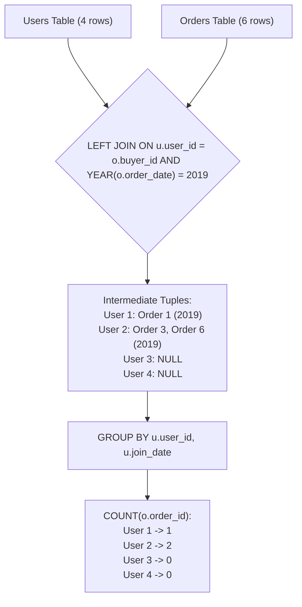

# Guided Example: Market Analysis I

We trace the relational execution of left outer join semantics, join-condition predicate placement, and null-safe aggregation to report the 2019 purchase volume for every registered user.

- **Input:**
  - `Users`: 4 records (users 1, 2, 3, 4)
  - `Orders`: 6 transactions across 2018 and 2019
  - `Items`: 4 catalog items
- **Required output:**
  - User 1: `join_date = '2018-01-01'`, `orders_in_2019 = 1`
  - User 2: `join_date = '2018-02-09'`, `orders_in_2019 = 2`
  - User 3: `join_date = '2018-01-19'`, `orders_in_2019 = 0`
  - User 4: `join_date = '2018-05-21'`, `orders_in_2019 = 0`

This instance highlights how outer joins preserve non-transacting entities, why temporal filters must reside in the join predicate rather than the `WHERE` clause, and how `COUNT(column)` differs fundamentally from `COUNT(*)`.

---

## 1. Instance & Teaching Goal

The objective is to produce a consolidated summary showing each user's identifier, registration date, and the exact count of orders they placed as a **buyer** during calendar year 2019.

A common failure mode in SQL queries is filtering outer-joined data in the `WHERE` clause:

```text
The WHERE-Clause Annihilation Trap:

SELECT u.user_id AS buyer_id, u.join_date, COUNT(o.order_id) AS orders_in_2019
FROM Users u
LEFT JOIN Orders o ON u.user_id = o.buyer_id
WHERE o.order_date >= '2019-01-01' AND o.order_date <= '2019-12-31'
GROUP BY u.user_id, u.join_date;

Why this fails:
  For users 3 and 4, no 2019 order exists.
  The LEFT JOIN produces rows with o.order_date = NULL.
  The WHERE condition evaluates: NULL >= '2019-01-01' -> UNKNOWN / FALSE.
  Users 3 and 4 are completely filtered out!
  The LEFT JOIN collapses into an INNER JOIN, omitting inactive users.
```

The teaching goal is to master three relational database principles:
1. **Preserving Dimensions:** Using `Users` as the left table guarantees every user appears in the output, even with zero activity.
2. **Predicate Placement in Outer Joins:** Placing the date filter inside the `ON` condition filters candidate order rows *before* outer extension, preserving unmatched users with `NULL` order attributes.
3. **Null-Aware Aggregation:** `COUNT(o.order_id)` ignores `NULL` entries, yielding `0` for users without orders, whereas `COUNT(*)` incorrectly counts `NULL` rows as `1`.

---

## 2. Conceptual Foundation & Invariants

Let $\mathcal{U}$ denote the relation `Users` and $\mathcal{O}$ denote the relation `Orders`.

The relational algebra expression is:

$$\Pi_{user\_id \to buyer\_id, \, join\_date, \, \text{COUNT}(order\_id) \to orders\_in\_2019} \left( \mathcal{U} \ \ \text{LEFT JOIN}_{u.user\_id = o.buyer\_id \ \wedge \ o.order\_date \in [2019-01-01, 2019-12-31]} \ \ \mathcal{O} \right)$$

| Relational Component | Source Table | Semantic Responsibility |
|---|---|---|
| Left Table $\mathcal{U}$ | `Users` | Master entity dimension; guarantees inclusion of all users |
| Right Table $\mathcal{O}$ | `Orders` | Transaction log; restricted to buyer role and 2019 dates |
| Equi-Join Predicate | $u.user\_id = o.buyer\_id$ | Matches buyer transactions to user identities (ignores $seller\_id$) |
| Join Filter Predicate | $o.order\_date \in [2019-01-01, 2019-12-31]$ | Excludes non-2019 orders before outer padding |
| Aggregate Expression | $\text{COUNT}(o.order\_id)$ | Tally of non-null order IDs per user group |



> **Dimensional Preservation Invariant.** For every row in `Users`, exactly one row must be emitted in the aggregated output. The aggregate `COUNT(o.order_id)` must equal the number of matching 2019 purchase transactions, mapping empty match sets to 0.

---

## 3. Step-by-Step Worked Execution

We trace the join evaluation on the provided sample data.

### Step 1: Filter Candidate Orders via the Join Predicate

The condition is:

$$u.user\_id = o.buyer\_id \quad \text{AND} \quad o.order\_date \ge \text{'2019-01-01'} \quad \text{AND} \quad o.order\_date \le \text{'2019-12-31'}$$

We test each transaction in `Orders`:
- `order_id = 1`: `date = 2019-08-01`, `buyer_id = 1` $\implies$ Matches User 1.
- `order_id = 2`: `date = 2018-08-02`, `buyer_id = 1` $\implies$ Year is 2018 $\implies$ Discarded.
- `order_id = 3`: `date = 2019-08-03`, `buyer_id = 2` $\implies$ Matches User 2.
- `order_id = 4`: `date = 2018-08-04`, `buyer_id = 4` $\implies$ Year is 2018 $\implies$ Discarded.
- `order_id = 5`: `date = 2018-08-04`, `buyer_id = 3` $\implies$ Year is 2018 $\implies$ Discarded.
- `order_id = 6`: `date = 2019-08-05`, `buyer_id = 2` $\implies$ Matches User 2.

Only orders $1, 3, 6$ qualify for the join.

---

### Step 2: Form the Left Outer Join Tuples

Every user from `Users` is joined against qualifying orders. Unmatched users are paired with `NULL`:

- **User 1:** Matches `order_id = 1`.
  - Tuple: $(user\_id = 1, join\_date = \text{'2018-01-01'}, order\_id = 1)$
- **User 2:** Matches `order_id = 3` and `order_id = 6`.
  - Tuple A: $(user\_id = 2, join\_date = \text{'2018-02-09'}, order\_id = 3)$
  - Tuple B: $(user\_id = 2, join\_date = \text{'2018-02-09'}, order\_id = 6)$
- **User 3:** No qualifying 2019 orders. Outer join fills attributes with `NULL`.
  - Tuple: $(user\_id = 3, join\_date = \text{'2018-01-19'}, order\_id = \text{NULL})$
- **User 4:** No qualifying 2019 orders. Outer join fills attributes with `NULL`.
  - Tuple: $(user\_id = 4, join\_date = \text{'2018-05-21'}, order\_id = \text{NULL})$

---

### Step 3: Grouping and Aggregation

Group by $(user\_id, join\_date)$ and compute $\text{COUNT}(o.order\_id)$:

| Group Key $(user\_id, join\_date)$ | Associated $order\_id$ Values | $\text{COUNT}(o.order\_id)$ Evaluation | Result Row |
|---|---|---|---|
| $(1, \text{'2018-01-01'})$ | $\{1\}$ | One non-null value $\implies 1$ | `(1, '2018-01-01', 1)` |
| $(2, \text{'2018-02-09'})$ | $\{3, 6\}$ | Two non-null values $\implies 2$ | `(2, '2018-02-09', 2)` |
| $(3, \text{'2018-01-19'})$ | $\{\text{NULL}\}$ | Zero non-null values $\implies 0$ | `(3, '2018-01-19', 0)` |
| $(4, \text{'2018-05-21'})$ | $\{\text{NULL}\}$ | Zero non-null values $\implies 0$ | `(4, '2018-05-21', 0)` |

---

## 4. Complete Execution Trace

| User ID | Join Date | Favorite Brand | Matching 2019 Order IDs | Count of Orders | Final `orders_in_2019` |
|---|---|---|---|---|---|
| $1$ | $2018-01-01$ | Lenovo | $\{1\}$ | $1$ non-null | $1$ |
| $2$ | $2018-02-09$ | Samsung | $\{3, 6\}$ | $2$ non-null | $2$ |
| $3$ | $2018-01-19$ | LG | $\emptyset \ (\text{NULL})$ | $0$ non-null | $0$ |
| $4$ | $2018-05-21$ | HP | $\emptyset \ (\text{NULL})$ | $0$ non-null | $0$ |

```text
Join Predicate Mechanics Comparison:

CORRECT: Condition in ON clause
  Users LEFT JOIN Orders ON u.user_id = o.buyer_id AND YEAR(order_date) = 2019
  Result:
    User 1 -> 1 order
    User 2 -> 2 orders
    User 3 -> NULL -> COUNT = 0  [PRESERVED]
    User 4 -> NULL -> COUNT = 0  [PRESERVED]

INCORRECT: Condition in WHERE clause
  Users LEFT JOIN Orders ON u.user_id = o.buyer_id
  WHERE YEAR(order_date) = 2019
  Result:
    User 1 -> 1 order
    User 2 -> 2 orders
    (Users 3 and 4 eliminated because NULL = 2019 evaluates to FALSE)
```

---

## 5. Algorithmic Correctness

**Theorem (Preservation of Zero-Activity Dimension Records).**
1. By the semantics of SQL `LEFT OUTER JOIN`, every row $u \in \mathcal{U}$ produces at least one row in the join result:
   - If $\{\omega \in \mathcal{O} \mid P(u, \omega)\} \ne \emptyset$, each matching row produces a tuple.
   - If $\{\omega \in \mathcal{O} \mid P(u, \omega)\} = \emptyset$, a single tuple $(u, \text{NULL})$ is produced.
2. The aggregate function $\text{COUNT}(expr)$ returns the number of rows where $expr$ is not null. For an unmatched user, $o.order\_id$ is null, so $\text{COUNT}(o.order\_id) = 0$.
3. Since $user\_id$ is the primary key of `Users`, grouping by $u.user\_id$ creates exactly $|\mathcal{U}|$ disjoint groups, guaranteeing that every user is represented exactly once with their true 2019 purchase count.

---

## 6. Traps This Instance Exposes

| Trap Category | Hazard Scenario | Root Cause | Preventive Design Invariant |
|---|---|---|---|
| **WHERE Filter Collapse** | `WHERE YEAR(order_date) = 2019` | Rows with `NULL` order dates evaluate to unknown and are discarded, removing inactive users. | Keep date filtering inside the `ON` clause of the `LEFT JOIN`. |
| **`COUNT(*)` vs `COUNT(col)`** | Using `COUNT(*)` instead of `COUNT(o.order_id)` | `COUNT(*)` counts the row itself; for an unmatched user with `NULL`, it incorrectly counts 1. | Use `COUNT(o.order_id)` to tally only non-null matched orders. |
| **Buyer vs Seller Attribute** | Joining on `u.user_id = o.seller_id` | Tallying sales volume instead of purchase volume. | Join explicitly on $u.user\_id = o.buyer\_id$. |
| **Redundant Catalog Join** | Joining the `Items` table | The query only requires order counts, not item brands or details. | Omit `Items` entirely to prevent unnecessary join overhead. |

---

## 7. Complexity Derivation

### Time Complexity

1. **Join Phase:**
   - Scanning `Users` takes $\mathcal{O}(U)$ where $U = |Users|$.
   - Filtering and scanning `Orders` takes $\mathcal{O}(O)$ where $O = |Orders|$.
   - Using a hash join on $buyer\_id$ or index lookup takes $\mathcal{O}(U + O)$ expected time.
2. **Aggregation Phase:**
   - Grouping $U$ distinct user records and aggregating order counts takes $\mathcal{O}(U + O)$ time.
3. **Overall Time Complexity:**

$$\mathcal{O}(U + O)$$

With standard database indexing on `Orders(buyer_id, order_date)`, performance is linear with respect to table sizes.

### Auxiliary Space Complexity

- Intermediate hash tables or sort buffers for `GROUP BY u.user_id` store up to $U$ distinct groups.
- Overall Space Complexity:

$$\mathcal{O}(U)$$
