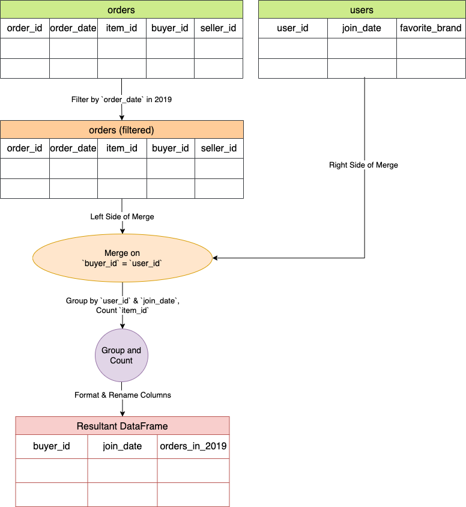

[TOC]

# Solution

---

### Overview

Overview

The problem revolves around an online shopping platform where users can both buy and sell items.

 - **Users Table:** Contains information about individual users, such as when they joined.
 - **Orders Table:** Captures transactions, detailing who bought what, and when.
 - **Items Table:** Lists available items and their associated brands.

The main objective is to determine for each user:
 - When they joined.
 - How many items they purchased in the year 2019.

This analysis helps in understanding user engagement on the platform for that specific year.

---

## pandas
### Approach 1: Right Join and GroupBy

**Flowchart**



#### Intuition

Let's break down the intuition behind the approach:

**Purpose**:
The function $\text{market}_{analysis}$ aims to analyze the number of items each user purchased in the year 2019. It takes three dataframes (`users`, `orders`, and `items`) as input and returns a dataframe summarizing the number of orders each user made in 2019, along with their joining date.

**Step-by-step Intuition**:

1. **Filtering 2019 Orders**:
   ```python
   orders.query("order_date.dt.year==2019")
   ```
   Here, the algorithm starts by filtering the `orders` dataframe to only include rows where the $\text{order}_{date}$ is from the year 2019.

2. **Merging Data**:
   ```python
   merge(users, left_on="buyer_id", right_on="user_id", how="right")
   ```
   The filtered orders from 2019 are then merged (joined) with the `users` dataframe. This joining happens based on the $\text{buyer}_{id}$ from the `orders` dataframe and $\text{user}_{id}$ from the `users` dataframe.

   The key point here is the use of `how="right"`, which is a right join. This ensures that all users are included in the resulting dataframe, even if they didn't make any purchases in 2019. For users without any purchases in 2019, order-related columns will have null values.

3. **Grouping & Counting**:
   ```python
   df.groupby(["user_id", "join_date"]).item_id.count()
   ```
   The merged dataframe is grouped by $\text{user}_{id}$ and $\text{join}_{date}$. For each group (essentially each user), the algorithm counts the number of $\text{item}_{id}$s, which represents the number of orders the user made in 2019.

4. **Formatting the Output**:
   ```python
   .reset_index().rename(columns={"user_id": "buyer_id", "item_id": "orders_in_2019"})
   ```
   The output from the grouping operation is formatted to present the data in a clearer manner. The index is reset to make $\text{user}_{id}$ and $\text{join}_{date}$ regular columns. Then, column names are renamed for clarity:
   - $\text{user}_{id}$ is renamed to $\text{buyer}_{id}$.
   - The count of $\text{item}_{id}$ (representing order count) is renamed to `orders_in_2019`.

The algorithm efficiently combines and transforms data from the `orders` and `users` dataframes to produce a user-centric summary of purchase activity in 2019. Users with zero purchases are not excluded, ensuring a comprehensive overview of all users.

#### Implementation

```python

import pandas as pd

def market_analysis(
    users: pd.DataFrame, orders: pd.DataFrame, items: pd.DataFrame
) -> pd.DataFrame:

    # Step 1: Filter the orders dataframe to only include orders from the year 2019.
    df = orders.query("order_date.dt.year==2019").merge(
        # Step 2: Merge the filtered orders with the users dataframe on buyer_id and user_id.
        users,
        left_on="buyer_id",
        right_on="user_id",
        how="right",
    )

    # Step 3: Group the merged dataframe by user_id and join_date, then count the number of items (orders) for each user.
    result = df.groupby(["user_id", "join_date"]).item_id.count()

    # Step 4: Format the output by resetting the index and renaming the columns for clarity.
    return result.reset_index().rename(
        columns={"user_id": "buyer_id", "item_id": "orders_in_2019"}
    )
```

---

## Database
### Approach 1: Left Join and Aggregation

#### Intuition

The query aims to capture the purchasing behavior of each user in 2019 by leveraging a left join. By joining the users to their respective orders, it ensures all users are represented, tallying up each user's purchases in that year, while also including those who made no purchases.

**Step-by-step Intuition**:

1. **Base Table (FROM Clause)**:
   The query starts with the `Users` table, aliased as `u`. This table will serve as the foundation of our result, ensuring that all users will be represented in the output, regardless of whether they made any purchases in 2019 or not.

2. **Joining with Orders (LEFT JOIN)**:
   ```sql
   LEFT JOIN Orders o ON u.user_id = o.buyer_id AND YEAR(order_date) = '2019'
   ```
   The query then performs a `LEFT JOIN` with the `Orders` table (aliased as `o`). This kind of join ensures that even users without matching orders (i.e., users who made no purchases) will still be included in the result.

   Two conditions are applied for the join:
   - Matching users in the `Users` table with buyers in the `Orders` table based on their IDs.
   - Filtering the orders to only include those from the year 2019.

3. **Aggregation (GROUP BY)**:
   ```sql
   GROUP BY u.user_id
   ```
   The query groups the combined data by $\text{user}_{id}$. This is done to consolidate all the orders of each user into a single row.

4. **Selecting Relevant Columns**:
   The following columns are selected for the final output:
   - $u.\text{user}_{id}$ (aliased as $\text{buyer}_{id}$): The ID of the user.
   - $\text{join}_{date}$: The date the user joined.
   - $COUNT(o.\text{order}_{id}) AS orders_in_2019$: This counts the number of orders (from 2019) for each user. If a user didn't make any orders in 2019, this value will be 0, thanks to the nature of the LEFT JOIN.

5. **Ordering the Output**:
   ```sql
   ORDER BY u.user_id
   ```
   The result is then sorted by $\text{user}_{id}$ in ascending order to present the data in a structured manner.

The SQL code is designed to provide insights into the purchasing behavior of users for the year 2019. It's efficient in ensuring that even users with zero purchases are included in the output, giving a comprehensive overview of all users on the platform for that year.

#### Implementation

```sql
SELECT
  u.user_id AS buyer_id,
  join_date,
  COUNT(o.order_id) AS orders_in_2019
FROM
  Users u
  LEFT JOIN Orders o ON u.user_id = o.buyer_id
  AND YEAR(order_date)= '2019'
GROUP BY
  u.user_id
ORDER BY
  u.user_id

```