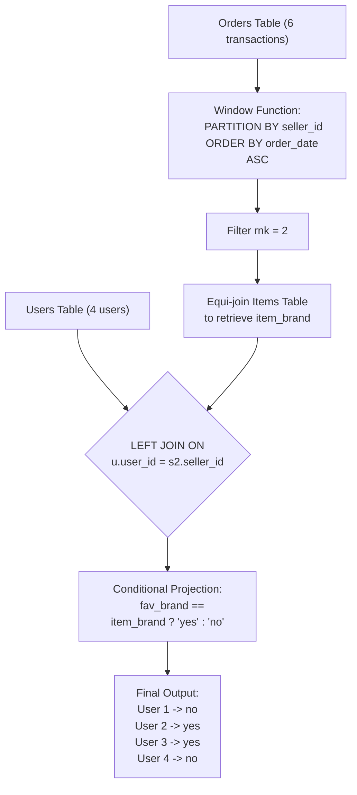

# Guided Example: Market Analysis II

We trace the relational pipeline utilizing window ranking, entity-attribute join resolution, and conditional outer-projection to determine whether each seller's second sale corresponds to their designated favorite brand.

- **Input:**
  - `Users`: 4 registered users with declared favorite brands
  - `Orders`: 6 transactions across users in buyer and seller capacities
  - `Items`: 4 catalog items mapped to brands
- **Required output:**
  - User 1: `seller_id = 1`, `2nd_item_fav_brand = 'no'` (0 items sold)
  - User 2: `seller_id = 2`, `2nd_item_fav_brand = 'yes'` (second sale brand is Samsung, matches favorite)
  - User 3: `seller_id = 3`, `2nd_item_fav_brand = 'yes'` (second sale brand is LG, matches favorite)
  - User 4: `seller_id = 4`, `2nd_item_fav_brand = 'no'` (second sale brand is Lenovo, favorite is HP)

This instance demonstrates partitioned window ordering, handling entities with sparse histories ($< 2$ sales), role differentiation between buyers and sellers, and three-valued boolean logic in conditional projection.

---

## 1. Instance & Teaching Goal

The objective is to evaluate each seller's second chronological sale. If a user sold fewer than two items in total, the reported outcome must be `'no'`. If they sold two or more items, the report checks whether the brand of that second sold item matches their declared `favorite_brand`.

A naive relational strategy relies on correlated subqueries to locate the second minimum date for each seller:

```text
The Correlated Subquery Overhead:

For each user u in Users:
  Subquery 1: Count total sales where seller_id = u.user_id.
  Subquery 2: If count >= 2, select min(order_date) where order_date > min(order_date).
  Subquery 3: Find item_id and brand corresponding to that second date.
  Comparison: Check if brand == favorite_brand.

Cost: O(U * O) repeated scans over Orders, scanning the table for every user.
```

The teaching goal is to structure this evaluation as a streamlined, single-pass relational pipeline:
1. **Partitioned Chronological Ranking:** Use `ROW_NUMBER()` or `RANK()` partitioned by `seller_id` and ordered by `order_date ASC` to index sales sequentially in $\mathcal{O}(O \log O)$ time.
2. **Dimension Preservation:** Left-join the base `Users` relation with the filtered subset of second sales ($rank = 2$) joined to `Items`.
3. **Total Coverage Invariant:** Users with 0 or 1 sale yield `NULL` attributes upon outer joining, cleanly resolving to `'no'` under `CASE WHEN favorite_brand = item_brand THEN 'yes' ELSE 'no' END`.

---

## 2. Conceptual Foundation & Invariants

Let $\mathcal{U}$ denote `Users`, $\mathcal{O}$ denote `Orders`, and $\mathcal{I}$ denote `Items`.

The pipeline executes in three stages:

### Stage 1: Windowed Sale Ordering

$$\mathcal{O}_{\text{ranked}} = \Pi_{seller\_id, \, item\_id, \, order\_date, \, \text{ROW\_NUMBER}() \text{ OVER (PARTITION BY } seller\_id \text{ ORDER BY } order\_date \text{ ASC}) \to rnk}(\mathcal{O})$$

Because the problem guarantees that no seller sells more than one item on the same calendar day, $order\_date$ is strictly monotonically increasing within each seller's partition. Consequently, `ROW_NUMBER()`, `RANK()`, and `DENSE_RANK()` produce identical, strictly unique integer ranks $\{1, 2, \dots\}$.

### Stage 2: Second-Sale Item Resolution

Filter $\mathcal{O}_{\text{ranked}}$ for $rnk = 2$ and equi-join with `Items`:

$$\mathcal{S}_2 = \Pi_{seller\_id, \, item\_brand} \left( \sigma_{rnk = 2}(\mathcal{O}_{\text{ranked}}) \ \bowtie_{o.item\_id = i.item\_id} \ \mathcal{I} \right)$$

### Stage 3: Left Outer Join and Conditional Mapping

$$\Pi_{u.user\_id \to seller\_id, \, \text{CASE WHEN } u.favorite\_brand = s_2.item\_brand \text{ THEN 'yes' ELSE 'no' END} \to 2nd\_item\_fav\_brand} \left( \mathcal{U} \ \ \text{LEFT JOIN}_{u.user\_id = s_2.seller\_id} \ \ \mathcal{S}_2 \right)$$

| Relational Stage | Operation | Role in Transformation |
|---|---|---|
| Window Partition | `PARTITION BY seller_id ORDER BY order_date` | Isolates each seller's chronological timeline |
| Rank Filter | `WHERE rnk = 2` | Filters exclusively for the critical second transaction |
| Brand Equi-Join | `JOIN Items ON item_id` | Enriches second transaction with its manufacturer brand |
| User Outer Join | `Users LEFT JOIN ... ON user_id = seller_id` | Guarantees all users appear in output, including zero/one-sale users |
| Conditional Projection | `CASE WHEN fav = brand THEN 'yes' ELSE 'no' END` | Maps brand matching and `NULL` states to binary outcome |



> **Universal Seller Evaluation Invariant.** Every user in `Users` appears exactly once in the final result. If a seller has fewer than two sales, $item\_brand$ evaluates to `NULL`, which evaluates the equality $favorite\_brand = NULL$ to `UNKNOWN` (falsy), correctly producing `'no'`.

---

## 3. Step-by-Step Worked Execution

We trace the 4 users and 6 orders step by step.

### Step 1: Chronological Ranking by Seller

Group transactions by $seller\_id$ and sort by $order\_date$:

- **Seller 2:**
  - Order 1: `order_date = 2019-08-01`, `item_id = 4` $\implies \mathbf{rnk = 1}$
  - Order 4: `order_date = 2019-08-04`, `item_id = 1` $\implies \mathbf{rnk = 2}$
- **Seller 3:**
  - Order 2: `order_date = 2019-08-02`, `item_id = 2` $\implies \mathbf{rnk = 1}$
  - Order 3: `order_date = 2019-08-03`, `item_id = 3` $\implies \mathbf{rnk = 2}$
- **Seller 4:**
  - Order 5: `order_date = 2019-08-04`, `item_id = 1` $\implies \mathbf{rnk = 1}$
  - Order 6: `order_date = 2019-08-05`, `item_id = 2` $\implies \mathbf{rnk = 2}$
- **Seller 1:**
  - Has zero sales entries in `Orders` $\implies$ no ranks produced.

---

### Step 2: Extract Second Orders and Retrieve Item Brand

Filter transactions where $rnk = 2$ and join with `Items`:

| Seller ID | Second Order ID | $item\_id$ | Brand Lookup in `Items` | $item\_brand$ |
|---|---|---|---|---|
| $2$ | $4$ | $1$ | Item 1: Samsung | **Samsung** |
| $3$ | $3$ | $3$ | Item 3: LG | **LG** |
| $4$ | $6$ | $2$ | Item 2: Lenovo | **Lenovo** |

Sellers with no second order: Seller 1 has 0 sales.

---

### Step 3: Left Join with `Users` and Evaluate Match

We perform `Users LEFT JOIN SecondSale`:

| User ID ($seller\_id$) | Declared $favorite\_brand$ | Joined $item\_brand$ of 2nd Sale | Equality Check ($favorite\_brand = item\_brand$) | Result |
|---|---|---|---|---|
| $1$ | Lenovo | `NULL` (sold 0 items) | `Lenovo = NULL` $\implies$ `UNKNOWN` | **no** |
| $2$ | Samsung | Samsung (Order 4) | `Samsung = Samsung` $\implies$ `TRUE` | **yes** |
| $3$ | LG | LG (Order 3) | `LG = LG` $\implies$ `TRUE` | **yes** |
| $4$ | HP | Lenovo (Order 6) | `HP = Lenovo` $\implies$ `FALSE` | **no** |

---

## 4. Complete Execution Trace

```text
Seller Timeline and Evaluation Grid:

User 1: [Lenovo]  -> Sales: (none)                              -> 2nd sale: NONE    -> no
User 2: [Samsung] -> Sales: 2019-08-01 (HP), 2019-08-04 (Samsung)-> 2nd sale: Samsung -> yes
User 3: [LG]      -> Sales: 2019-08-02 (Lenovo), 2019-08-03 (LG)-> 2nd sale: LG      -> yes
User 4: [HP]      -> Sales: 2019-08-04 (Samsung), 2019-08-05 (Lenovo) -> 2nd sale: Lenovo -> no
```

| User ID | Favorite Brand | Total Sales Count | 1st Sale Date (Item) | 2nd Sale Date (Item) | 2nd Item Brand | Brand Matches Favorite? | Output Value |
|---|---|---|---|---|---|---|---|
| $1$ | Lenovo | $0$ | None | None | `NULL` | No (Insufficient sales) | `no` |
| $2$ | Samsung | $2$ | 2019-08-01 (HP) | 2019-08-04 (Samsung) | Samsung | Yes (`Samsung == Samsung`) | `yes` |
| $3$ | LG | $2$ | 2019-08-02 (Lenovo) | 2019-08-03 (LG) | LG | Yes (`LG == LG`) | `yes` |
| $4$ | HP | $2$ | 2019-08-04 (Samsung) | 2019-08-05 (Lenovo) | Lenovo | No (`Lenovo != HP`) | `no` |

---

## 5. Algorithmic Correctness

**Theorem (Uniqueness and Completeness of Second Sale Classification).**
1. **Unambiguous Ranking:** By problem specification, no seller makes more than one sale per calendar date. The ordering key $(seller\_id, order\_date)$ defines a strict total order for each seller. Thus, for any seller with at least two sales, the tuple with rank $2$ is unique.
2. **Exhaustive Inclusion:** Starting from `Users` as the left relation in a `LEFT OUTER JOIN` guarantees that every registered user is retained in the output relation.
3. **Null-Safety of Three-Valued Logic:** For users with $< 2$ sales, the outer join yields `NULL` for the second item's attributes. In SQL ternary logic:
   $$\text{CASE WHEN } favorite\_brand = NULL \text{ THEN 'yes' ELSE 'no' END}$$
   The comparison evaluates to `UNKNOWN`, bypassing the `THEN` branch and executing the `ELSE` branch to return `'no'`. This satisfies the requirement without requiring separate conditional checks for zero or one sale.

---

## 6. Traps This Instance Exposes

| Trap Category | Hazard Scenario | Root Cause | Preventive Design Invariant |
|---|---|---|---|
| **Role Inversion Trap** | Ranking on $buyer\_id$ instead of $seller\_id$ | Conflating buyer activity with seller activity. | Partition strictly by $seller\_id$. |
| **Inner Join Discard** | `JOIN Users` on $user\_id = seller\_id$ | Omits sellers with 0 or 1 sale from the report entirely. | Always use `Users LEFT JOIN` to preserve every user. |
| **Tied Dates Assumption** | Using `DENSE_RANK()` without tie-breaking | If a seller could sell twice on the same day, multiple items could share rank 2. | The problem explicitly guarantees at most one sale per day per seller. |
| **Column Renaming Omission** | Returning `user_id` as the output column name | The problem contract requires the output column to be named `seller_id`. | Alias $u.user\_id \text{ AS } seller\_id$ in the final `SELECT` projection. |

---

## 7. Complexity Derivation

### Time Complexity

1. **Window Sorting:** Sorting $O$ order rows partitioned by $seller\_id$ takes $\mathcal{O}(O \log O)$ time.
2. **Filtering and Item Lookup:**
   - Filtering rows with $rnk = 2$ produces at most $\min(U, O)$ rows.
   - Equi-join with `Items` table of size $I$ takes $\mathcal{O}(\min(U, O) + I)$ via hash join or primary key index.
3. **User Outer Join:** Joining the $U$ user records with the filtered second-sale table takes $\mathcal{O}(U)$ time.
4. **Overall Time Complexity:**

$$\mathcal{O}(O \log O + U + I)$$

For realistic database benchmarks with $O, U, I \le 10^5$, this runs in fractions of a second.

### Auxiliary Space Complexity

- Intermediate buffers for the window sorting and hash joins store at most $\mathcal{O}(O + U)$ records.
- Overall Space Complexity:

$$\mathcal{O}(O + U)$$
