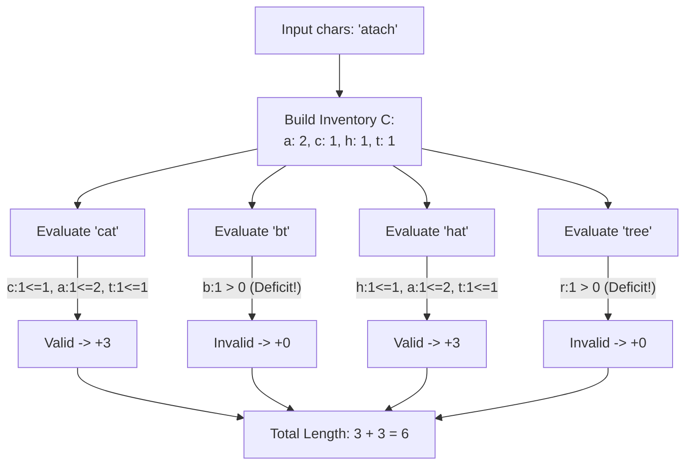

# Guided Example: Find Words That Can Be Formed by Characters

We trace the multiset frequency containment algorithm to identify which candidate words can be constructed from a fixed character pool, accumulating their total length.

- **Input:** $words = [\text{"cat"}, \text{"bt"}, \text{"hat"}, \text{"tree"}], \ chars = \text{"atach"}$
- **Required output:** `6`

This instance illustrates multiset frequency profiling, component-wise vector domination, independent candidate evaluation, and early-exit validation.

---

## 1. Instance & Teaching Goal

Given a string $chars$ and a collection of candidate strings $words$, a word is **good** if its constituent characters can be drawn from $chars$ without exceeding the multiplicity of any letter. Each candidate word is evaluated independently: forming one word does not consume or deplete characters available for subsequent words.

A naive approach might repeatedly search and delete characters from a copy of $chars$ for every candidate word. For $M$ words of average length $L$ and inventory size $K$:

$$\text{String copying and linear character deletion} = \mathcal{O}(M \cdot (K + L \cdot K)) = \mathcal{O}(M \cdot L \cdot K)$$

For $1000$ words of length $100$ and $K = 100$, this performs $10^7$ operations with heavy string reallocation overhead.

```text
Naive String Mutation vs. Multiset Frequency Vector Comparison:

Naive Approach:
  For each word:
    Make copy of chars: "atach"
    Find 'c' -> delete -> "atah"
    Find 'a' -> delete -> "tah"
    Find 't' -> delete -> "ah"   (O(K) per char)

Vector Comparison:
  Precompute Inventory once: [a:2, c:1, h:1, t:1]
  For "cat":
    'c': 1 <= 1 (OK)
    'a': 1 <= 2 (OK)
    't': 1 <= 1 (OK)  -> Formable! Add len 3.
```

The primary teaching goal is to model character collections as integer frequency vectors $\mathbf{v} \in \mathbb{N}^{26}$. A word $w$ is formable if and only if its frequency vector is component-wise less than or equal to the inventory vector:

$$\mathbf{v}_w \le \mathbf{v}_{chars} \iff \forall c \in \{\text{'a'}, \dots, \text{'z'}\}, \ \mathbf{v}_w[c] \le \mathbf{v}_{chars}[c]$$

---

## 2. Conceptual Foundation & Invariants

Let $\Sigma$ denote the lowercase English alphabet ($\{0, 1, \dots, 25\}$ indexed by $c - \text{'a'}$).

1. **Inventory Vector $\mathbf{C}$:** Built once from $chars$:
   $$C[k] = \sum_{j=0}^{|chars|-1} \mathbf{1}[chars[j] - \text{'a'} = k]$$
2. **Word Multiset $\mathbf{W}$:** For candidate word $w$, count character occurrences:
   $$W[k] = \sum_{j=0}^{|w|-1} \mathbf{1}[w[j] - \text{'a'} = k]$$
3. **Feasibility Predicate:**
   $$\text{Formable}(w) \equiv \bigwedge_{k \in \Sigma} (W[k] \le C[k])$$

| State Tracker | Type | Invariant Role |
|---|---|---|
| Inventory Vector $\mathbf{C}$ | Fixed array $[0 \dots 25]$ | Global character supply; immutable across word checks |
| Candidate Vector $\mathbf{W}$ | Temporary array $[0 \dots 25]$ | Demand vector for the currently evaluated word |
| Early Exit Predicate | Boolean condition | If for any character $k$, $W[k] > C[k]$, immediately reject word |
| Length Accumulator | Integer scalar | Sum of lengths $|w|$ for all verified good words |



> **Multiset Independence Invariant.** Each word in $words$ is evaluated strictly against the initial immutable inventory vector $\mathbf{C}$. The acceptance or rejection of one word has no side effects on the availability of characters for any other word.

---

## 3. Step-by-Step Worked Execution

We trace $words = [\text{"cat"}, \text{"bt"}, \text{"hat"}, \text{"tree"}]$ against $chars = \text{"atach"}$.

### Step 0: Precompute Inventory Vector $\mathbf{C}$

Scanning $chars = \text{"atach"}$:
- `'a'` appears at index 0 and 2 $\implies C[\text{'a'}] = 2$
- `'t'` appears at index 1 $\implies C[\text{'t'}] = 1$
- `'c'` appears at index 3 $\implies C[\text{'c'}] = 1$
- `'h'` appears at index 4 $\implies C[\text{'h'}] = 1$
- All other 22 letters have count $0$.

Initialize accumulator $\text{total\_len} = 0$.

---

### Step 1: Evaluate Word 1: `"cat"`

- Demand: $\text{'c'}: 1, \ \text{'a'}: 1, \ \text{'t'}: 1$.
- Check against $\mathbf{C}$:
  - $\text{'c'}: 1 \le C[\text{'c'}] \ (1)$ $\implies$ Pass
  - $\text{'a'}: 1 \le C[\text{'a'}] \ (2)$ $\implies$ Pass
  - $\text{'t'}: 1 \le C[\text{'t'}] \ (1)$ $\implies$ Pass
- Result: Valid word.
- Update: $\text{total\_len} = 0 + 3 = 3$.

---

### Step 2: Evaluate Word 2: `"bt"`

- Demand: $\text{'b'}: 1, \ \text{'t'}: 1$.
- Check against $\mathbf{C}$:
  - $\text{'b'}: 1 > C[\text{'b'}] \ (0)$ $\implies$ Deficit detected!
- Short-circuit: Immediately reject `"bt"` without inspecting `'t'`.
- Result: Invalid word.
- Update: $\text{total\_len} = 3$.

---

### Step 3: Evaluate Word 3: `"hat"`

- Demand: $\text{'h'}: 1, \ \text{'a'}: 1, \ \text{'t'}: 1$.
- Check against $\mathbf{C}$:
  - $\text{'h'}: 1 \le C[\text{'h'}] \ (1)$ $\implies$ Pass
  - $\text{'a'}: 1 \le C[\text{'a'}] \ (2)$ $\implies$ Pass
  - $\text{'t'}: 1 \le C[\text{'t'}] \ (1)$ $\implies$ Pass
- Result: Valid word.
- Update: $\text{total\_len} = 3 + 3 = 6$.

---

### Step 4: Evaluate Word 4: `"tree"`

- Demand: $\text{'t'}: 1, \ \text{'r'}: 1, \ \text{'e'}: 2$.
- Check against $\mathbf{C}$:
  - $\text{'t'}: 1 \le C[\text{'t'}] \ (1)$ $\implies$ Pass
  - $\text{'r'}: 1 > C[\text{'r'}] \ (0)$ $\implies$ Deficit detected!
- Short-circuit: Immediately reject `"tree"`.
- Result: Invalid word.
- Final Output: `6`.

---

## 4. Complete Execution Trace

| Word $w$ | Length | Character Frequency Breakdown | Inventory Comparison vs $\mathbf{C}$ | Formable? | Added Length | Cumulative Total |
|---|---|---|---|---|---|---|
| `"cat"` | $3$ | `'c': 1, 'a': 1, 't': 1` | $1 \le 1, 1 \le 2, 1 \le 1$ | **Yes** | $+3$ | $3$ |
| `"bt"` | $2$ | `'b': 1, 't': 1` | `'b': 1 > 0` (Missing `'b'`) | **No** | $+0$ | $3$ |
| `"hat"` | $3$ | `'h': 1, 'a': 1, 't': 1` | $1 \le 1, 1 \le 2, 1 \le 1$ | **Yes** | $+3$ | $6$ |
| `"tree"` | $4$ | `'t': 1, 'r': 1, 'e': 2` | `'r': 1 > 0` (Missing `'r'`) | **No** | $+0$ | $6$ |

```text
Multiset Comparison Diagnostic:

Inventory C: { a: 2, c: 1, h: 1, t: 1 }

"cat":  { a: 1, c: 1, t: 1 }       <= C  --> SUFFICIENT
"bt":   { b: 1, t: 1 }             <= C  --> DEFICIT: missing 'b'
"hat":  { a: 1, h: 1, t: 1 }       <= C  --> SUFFICIENT
"tree": { e: 2, r: 1, t: 1 }       <= C  --> DEFICIT: missing 'e', 'r'
```

---

## 5. Algorithmic Correctness

**Theorem (Multiset Containment Equivalence).**
1. A string $w$ can be formed by rearranging a sub-multiset of characters from $chars$ if and only if there exists an injective function $f: \{0, \dots, |w|-1\} \to \{0, \dots, |chars|-1\}$ such that $w[j] = chars[f(j)]$ for all $j$.
2. By the pigeonhole principle on discrete symbols, such an injection exists if and only if for every distinct symbol $\sigma \in \Sigma$, the count of $\sigma$ in $w$ does not exceed the count of $\sigma$ in $chars$:
   $$\text{count}(w, \sigma) \le \text{count}(chars, \sigma)$$
3. Since each word's check is non-destructive, the inventory is invariant. Every word satisfying the component-wise inequality is added to the length sum, ensuring completeness and soundness.

---

## 6. Traps This Instance Exposes

| Trap Category | Hazard Scenario | Root Cause | Preventive Design Invariant |
|---|---|---|---|
| **Inventory Depletion Trap** | Subtracting characters from $\mathbf{C}$ when `"cat"` is formed, leaving insufficient `'a'`s for `"hat"` | Misunderstanding the problem as global character consumption across all words. | Treat $\mathbf{C}$ as strictly read-only; each word draws from the original pool independently. |
| **Set Containment Trap** | Checking `set(w) <= set(chars)` | Set containment discards multiplicity: `"tree"` would match `"tre"` because duplicate `'e'` is lost. | Always compare multiset frequencies, not unique character sets. |
| **Unbounded Hash Map Allocations** | Creating dynamic hash tables inside inner loops | Generating and destroying heap objects for 1000 iterations adds significant runtime overhead. | Use a fixed-size stack array of size $26$ (`int[26]`) for $\mathcal{O}(1)$ direct indexing. |
| **Missing Early Break** | Continuing to count remaining letters of a word after finding a missing character | Wasting cycles on guaranteed-invalid candidates. | Break out of the character comparison loop upon the first violation. |

---

## 7. Complexity Derivation

### Time Complexity

1. **Inventory Construction:** Scanning $chars$ of length $K$:

$$T_{\text{chars}} = \mathcal{O}(K)$$

2. **Word Evaluation:**
   - For word $w_i$, tallying frequencies takes $\mathcal{O}(|w_i|)$ time.
   - Comparing frequencies takes at most $|\Sigma| = 26$ iterations: $\mathcal{O}(|\Sigma|) = \mathcal{O}(1)$.
   - Across all $M$ words, summing lengths $\sum_{i=1}^M |w_i|$:

$$T_{\text{words}} = \mathcal{O}\left(\sum_{i=1}^M |w_i| + M \cdot |\Sigma|\right)$$

3. **Overall Time Complexity:**

$$\mathcal{O}\left(K + \sum_{i=1}^M |w_i|\right)$$

Given $K \le 100$ and $M \le 1000$ with $|w_i| \le 100$, total character operations are $\le 100 + 1000 \times 100 \approx 10^5$, executing in under $2 \text{ ms}$.

### Auxiliary Space Complexity

- Inventory array $\mathbf{C}$: exactly $26$ integers.
- Candidate word array $\mathbf{W}$: exactly $26$ integers.
- Total Auxiliary Space Complexity:

$$\mathcal{O}(|\Sigma|) = \mathcal{O}(1)$$
