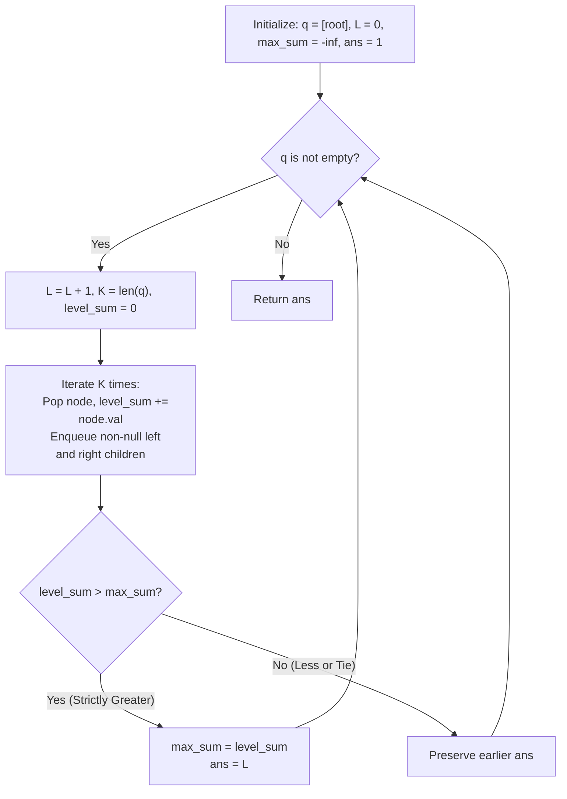

# Guided Example: Maximum Level Sum of a Binary Tree

We trace the level-order snapshot breadth-first search (BFS) algorithm to determine the smallest 1-indexed level of a binary tree that achieves the maximal cumulative node value.

- **Input:** `root = [1, 7, 0, 7, -8, null, null]`
- **Required output:** `2`

This instance illustrates batch queue processing, boundary handling for negative node values, strict inequality tie-breaking, and separating level frontiers.

---

## 1. Instance & Teaching Goal

Given the root of a binary tree, each node has an integer value $node.val \in [-10^5, 10^5]$. The level of the root is defined as $1$, its children are at level $2$, and so on. We seek the **smallest level $X$** such that the sum of all node values at level $X$ is maximal.

A recursive or unstructured traversal that fails to isolate levels cleanly risks incorrect summation or exponential overhead:

```text
Tree Topology and Level Partitions:

Level 1:           ( 1 )                 Sum = 1
                  /     \
Level 2:       ( 7 )   ( 0 )             Sum = 7 + 0 = 7
               /   \
Level 3:    ( 7 ) (-8)                   Sum = 7 + (-8) = -1

Maximal Level Sum: 7 at Level 2.
```

The fundamental teaching goals are:
1. **Level-Synchronized Queue Sizing:** Freezing the queue size $K = |q|$ before processing each tier ensures that children pushed to the back are not conflated with parents currently being popped from the front.
2. **Negative Domain Discipline:** Because node values can be negative, level sums can be strictly negative. Initializing the running maximum to $0$ is an immediate flaw; it must be initialized to $-\infty$.
3. **Smallest Level Tie-Breaking:** When two levels achieve identical maximum sums, the problem requires the *smallest* level number. We maintain this invariant by updating the record only on **strictly greater** comparisons ($sum > max\_sum$).

---

## 2. Conceptual Foundation & Invariants

Let $\mathcal{T}$ be a binary tree with $N$ nodes. A breadth-first search uses a first-in, first-out queue $q$.

### Level-Order Snapshot Invariant

At the boundary of iteration $L \ge 1$:
- The queue $q$ contains exactly the set of nodes residing at tree depth $L - 1$ (1-indexed level $L$).
- The count $K = |q|$ captures the exact population of level $L$.
- Popping exactly $K$ nodes and accumulating their values computes $\sum_{u \in \text{Level } L} u.val$ without interference from newly enqueued children at level $L + 1$.

| State Variable | Type / Domain | Algorithmic Role |
|---|---|---|
| $L$ | Integer $\ge 1$ | 1-indexed indicator of the current tree level |
| $K = \lvert q \rvert$ | Integer $\ge 1$ | Snapshot size of the current level frontier |
| $level\_sum$ | Integer $\in [-10^9, 10^9]$ | Sum of values for all nodes at level $L$ |
| $max\_sum$ | Integer, initialized to $-\infty$ | Global maximum level sum encountered so far |
| $ans$ | Integer $\ge 1$ | Smallest level index attaining $max\_sum$ |



> **Tie-Breaking Invariant.** By using the strict comparison $level\_sum > max\_sum$, any subsequent level $L' > L$ that merely ties the current maximum ($level\_sum = max\_sum$) is ignored, preserving the minimal level index $L$.

---

## 3. Step-by-Step Worked Execution

We trace $root = [1, 7, 0, 7, -8, null, null]$.

### Initialization

- Queue $q = [\text{Node}(1)]$.
- Current level index $L = 0$.
- Record tracker $max\_sum = -\infty$, $ans = 0$.

---

### Step 1: Processing Level 1 ($L = 1$)

1. **Snapshot Queue Size:** $K = |q| = 1$. Nodes: $[\text{Node}(1)]$.
2. **Batch Consumption:**
   - Pop $\text{Node}(1)$: $level\_sum = 0 + 1 = 1$.
   - Left child $\text{Node}(7)$ is non-null $\implies$ append to $q$.
   - Right child $\text{Node}(0)$ is non-null $\implies$ append to $q$.
3. **Compare with Record:**
   - $level\_sum = 1 > max\_sum \ (-\infty)$.
   - Update: $max\_sum = 1$, $ans = 1$.
4. **Queue at End of Step:** $[\text{Node}(7), \text{Node}(0)]$.

---

### Step 2: Processing Level 2 ($L = 2$)

1. **Snapshot Queue Size:** $K = |q| = 2$.
2. **Batch Consumption:**
   - Pop $\text{Node}(7)$: $level\_sum = 7$.
     - Append left child $\text{Node}(7)$ to $q$.
     - Append right child $\text{Node}(-8)$ to $q$.
   - Pop $\text{Node}(0)$: $level\_sum = 7 + 0 = 7$.
     - Left and right children are null.
3. **Compare with Record:**
   - $level\_sum = 7 > max\_sum \ (1)$.
   - Update: $max\_sum = 7$, $ans = 2$.
4. **Queue at End of Step:** $[\text{Node}(7), \text{Node}(-8)]$.

---

### Step 3: Processing Level 3 ($L = 3$)

1. **Snapshot Queue Size:** $K = |q| = 2$.
2. **Batch Consumption:**
   - Pop $\text{Node}(7)$: $level\_sum = 7$. Both children null.
   - Pop $\text{Node}(-8)$: $level\_sum = 7 + (-8) = -1$. Both children null.
3. **Compare with Record:**
   - $level\_sum = -1 \ngtr max\_sum \ (7)$.
   - No update: $max\_sum = 7$, $ans = 2$.
4. **Queue at End of Step:** Empty.

---

### Termination

Queue $q$ is empty. Emit $ans = 2$.

---

## 4. Complete Execution Trace

| Level ($L$) | Frontier Snapshot ($K$) | Popped Node Values | Level Sum Calculation | Evaluated Condition | Updated $max\_sum$ | Updated $ans$ | Frontier for Next Level |
|---|---|---|---|---|---|---|---|
| $1$ | $1$ | $[1]$ | $1$ | $1 > -\infty$ (True) | $1$ | $1$ | $[\text{Node}(7), \text{Node}(0)]$ |
| $2$ | $2$ | $[7, 0]$ | $7 + 0 = 7$ | $7 > 1$ (True) | $7$ | **2** | $[\text{Node}(7), \text{Node}(-8)]$ |
| $3$ | $2$ | $[7, -8]$ | $7 + (-8) = -1$ | $-1 > 7$ (False) | $7$ | $2$ | $\emptyset$ (Terminates) |

```text
Comparison of Tie-Breaking Rules:

Suppose Level 2 sum = 7 and Level 5 sum = 7:
  Using strict inequality (level_sum > max_sum):
    Level 2: 7 > -inf -> ans = 2
    Level 5: 7 > 7 is FALSE -> ans remains 2  [CORRECT: smallest level]

  Using non-strict inequality (level_sum >= max_sum):
    Level 2: 7 >= -inf -> ans = 2
    Level 5: 7 >= 7 is TRUE  -> ans overwritten to 5 [INCORRECT: largest level]
```

---

## 5. Algorithmic Correctness

**Theorem (Level Partition Soundness).**
1. By induction on depth $d$, a breadth-first search queue processes all nodes at depth $d$ before any node at depth $d+1$.
2. Freezing $K = |q|$ before entering the inner loop ensures that all nodes popped in that iteration have depth $d$, and any child added to $q$ has depth $d+1$.
3. Thus, $level\_sum$ represents the exact mathematical sum of values of all nodes at level $L$:
   $$level\_sum = \sum_{u \in \text{depth}(L-1)} u.val$$
4. Since every node is visited exactly once, the set of level sums is complete. Strict comparison ensures that if $\mathcal{L}_{\max} = \{l \mid \text{sum}(l) = \max_j \text{sum}(j)\}$, the algorithm emits $\min \mathcal{L}_{\max}$.

---

## 6. Traps This Instance Exposes

| Trap Category | Hazard Scenario | Root Cause | Preventive Design Invariant |
|---|---|---|---|
| **Negative Root Default Trap** | A tree with $root = [-100]$ | Initializing $max\_sum = 0$ causes the algorithm to reject $-100$, leaving $ans = 0$ or incorrect. | Initialize $max\_sum = -\infty$ so any real level sum overwrites it. |
| **Dynamic Queue Boundary Bleed** | Using `while len(q) > 0:` without fixed snapshot $K$ | Newly enqueued children of level $L$ are popped in the same loop, merging multiple levels into one corrupted sum. | Capture $K = \lvert q \rvert$ in a local variable before the inner pop loop. |
| **Tie-Breaker Inversion** | Using `level_sum >= max_sum` | Overwrites earlier optimal levels with later levels of equal sum. | Use strict inequality `level_sum > max_sum`. |
| **0-Based Level Indexing** | Starting $L = 0$ and returning $L$ | The problem specification explicitly declares the root to be at level 1. | Maintain 1-based indexing for levels. |

---

## 7. Complexity Derivation

### Time Complexity

- Every node $u \in \mathcal{T}$ is enqueued exactly once and dequeued exactly once.
- For each node, summing its value and enqueuing its children takes $\mathcal{O}(1)$ time.
- Total time complexity:

$$\mathcal{O}(N)$$

For $N = 10{,}000$ nodes, this takes $\approx 20{,}000$ primitive queue operations, executing in under $3 \text{ ms}$.

### Auxiliary Space Complexity

- The queue $q$ holds at most the maximum number of nodes at any single level (the maximum width $W$ of the tree).
- In a full or complete binary tree, the leaf level contains $\lceil N / 2 \rceil$ nodes:

$$\mathcal{O}(W) \le \mathcal{O}(N)$$

Total auxiliary space is bounded by $\mathcal{O}(N)$ in the worst case.