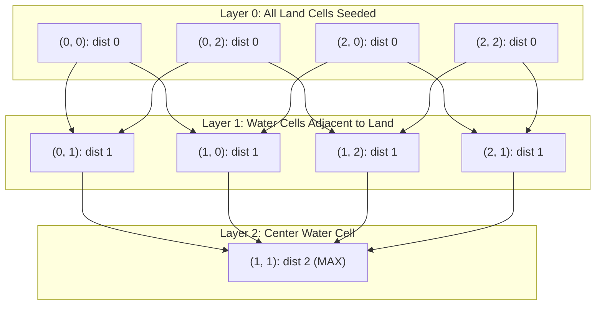

# Guided Example: As Far from Land as Possible

We trace the multi-source breadth-first search (BFS) algorithm to determine the water cell whose Manhattan distance to the nearest land cell is maximized.

- **Input:** `grid = [[1, 0, 1], [0, 0, 0], [1, 0, 1]]`
- **Required output:** `2`

This instance illustrates multi-source frontier initialization, radial wavefront propagation, boundary condition detection (all land / all water), and unit-step distance expansion.

---

## 1. Instance & Teaching Goal

Given an $N \times N$ matrix $grid$ where $0$ represents water and $1$ represents land, we seek:

$$\max_{(r, c): grid[r][c] = 0} \left( \min_{(lr, lc): grid[lr][lc] = 1} (|r - lr| + |c - lc|) \right)$$

If the grid contains no water cells (all 1s) or no land cells (all 0s), no valid distance can be computed, and we must return `-1`.

A naive search initiates a separate BFS from every water cell to find its nearest land cell. For an $N \times N$ grid with $W$ water cells:

$$\mathcal{O}(W \cdot N^2) \le \mathcal{O}(N^4) \approx 100^4 = 10^8 \text{ operations (Time Limit Exceeded)}$$

```text
Individual Water Scans vs. Unified Multi-Source Wavefront:

Naive Individual Searches:
  Water (0, 1) -> runs BFS until land found (distance 1)
  Water (1, 1) -> runs BFS until land found (distance 2)
  Repeats redundant path explorations over the entire grid.

Multi-Source BFS:
  Enqueue all land cells simultaneously as Distance 0.
  Wave 1 expands to all water cells adjacent to any land (Distance 1).
  Wave 2 expands to the interior water cells (Distance 2).
  Every cell is visited exactly once in O(N^2) total time!
```

The fundamental insight is to reverse the direction of search: simultaneously expand outward from all land cells. In a unit-weight grid graph, the multi-source BFS wavefront visits every cell at its exact minimal Manhattan distance to the land set.

---

## 2. Conceptual Foundation & Invariants

Let $\mathcal{L} = \{(r, c) \mid grid[r][c] = 1\}$ be the set of all land coordinates.

We construct an implicit graph where a virtual source $S^*$ connects to every land cell with an edge of weight 0, and all orthogonally adjacent grid cells share bidirectional edges of weight 1.

### Multi-Source Wavefront Invariant

At any point during execution:
1. The BFS queue holds nodes ordered non-decreasingly by their distance $d$ from the nearest land cell.
2. When cell $(r, c)$ is first enqueued from neighbor $(pr, pc)$ at distance $d$, its true shortest distance to any land cell is $d + 1$.
3. Any cell already enqueued is marked visited, preventing duplicate processing.

| Component | Type | Semantics |
|---|---|---|
| Initial Queue $q$ | FIFO Queue | Seeded with all coordinates $(r, c) \in \mathcal{L}$ at distance 0 |
| Visited / Dist Matrix | 2D Array $[N \times N]$ | Stores confirmed shortest distance; $-1$ indicates unvisited water |
| Frontier Distance $d$ | Non-negative integer | Current radial wave radius |
| Direction Vectors | Orthogonal offsets | $(\Delta r, \Delta c) \in \{(-1, 0), (1, 0), (0, -1), (0, 1)\}$ |



> **First-Arrival Optimality Invariant.** Because every step advances through a unit-cost orthogonal edge, the first time the multi-source BFS reaches a water cell $(r, c)$, the distance assigned is strictly minimal across all possible paths from any land cell in the grid.

---

## 3. Step-by-Step Worked Execution

We trace the $3 \times 3$ grid:

$$\begin{pmatrix} 1 & 0 & 1 \\ 0 & 0 & 0 \\ 1 & 0 & 1 \end{pmatrix}$$

### Step 0: Seeding the Multi-Source Queue

Scan all cells $(r, c) \in [0, 2] \times [0, 2]$:
- Land cells ($grid[r][c] = 1$): $(0, 0), (0, 2), (2, 0), (2, 2)$.
- Water cells count: $9 - 4 = 5 > 0$.
- Land cells count: $4 > 0$.
- Boundary check: Both water and land exist, so proceed.

Seed queue $q = [(0, 0), (0, 2), (2, 0), (2, 2)]$.
Initialize distance matrix with $0$ for land cells, and $\infty$ (or $-1$) for water cells:

$$\text{Dist Matrix: } \begin{pmatrix} 0 & \infty & 0 \\ \infty & \infty & \infty \\ 0 & \infty & 0 \end{pmatrix}$$

---

### Step 1: Processing Wavefront Layer 0 (Radius $d = 0 \to 1$)

Queue size $K = 4$. Dequeue all land cells and inspect 4-directional neighbors:

1. **Pop $(0, 0)$:**
   - Neighbor $(0, 1)$ is water: set $dist[0][1] = 1$, enqueue $(0, 1)$.
   - Neighbor $(1, 0)$ is water: set $dist[1][0] = 1$, enqueue $(1, 0)$.
2. **Pop $(0, 2)$:**
   - Neighbor $(0, 1)$ already visited.
   - Neighbor $(1, 2)$ is water: set $dist[1][2] = 1$, enqueue $(1, 2)$.
3. **Pop $(2, 0)$:**
   - Neighbor $(1, 0)$ already visited.
   - Neighbor $(2, 1)$ is water: set $dist[2][1] = 1$, enqueue $(2, 1)$.
4. **Pop $(2, 2)$:**
   - Neighbor $(1, 2)$ and $(2, 1)$ already visited.

Queue for next tier: $[(0, 1), (1, 0), (1, 2), (2, 1)]$. Current max distance = $1$.

$$\text{Dist Matrix: } \begin{pmatrix} 0 & 1 & 0 \\ 1 & \infty & 1 \\ 0 & 1 & 0 \end{pmatrix}$$

---

### Step 2: Processing Wavefront Layer 1 (Radius $d = 1 \to 2$)

Queue size $K = 4$. Dequeue all distance-1 water cells:

1. **Pop $(0, 1)$:**
   - Neighbor $(1, 1)$ is unvisited water: set $dist[1][1] = 2$, enqueue $(1, 1)$.
2. **Pop $(1, 0)$:**
   - Neighbor $(1, 1)$ already visited.
3. **Pop $(1, 2)$:**
   - Neighbor $(1, 1)$ already visited.
4. **Pop $(2, 1)$:**
   - Neighbor $(1, 1)$ already visited.

Queue for next tier: $[(1, 1)]$. Current max distance = $2$.

$$\text{Dist Matrix: } \begin{pmatrix} 0 & 1 & 0 \\ 1 & 2 & 1 \\ 0 & 1 & 0 \end{pmatrix}$$

---

### Step 3: Processing Wavefront Layer 2 (Radius $d = 2 \to 3$)

Queue size $K = 1$.
1. **Pop $(1, 1)$:**
   - All 4 neighbors $(0, 1), (2, 1), (1, 0), (1, 2)$ are already visited.
   - No new cells enqueued.

Queue is now empty. Search terminates.
Maximum distance observed for any water cell is **2**.

---

## 4. Complete Execution Trace

| Wave Layer ($d$) | Frontier Size ($K$) | Dequeued Cells | Newly Discovered Water Cells | Assigned Distance | Queue State at Wave End |
|---|---|---|---|---|---|
| $0$ (Seeds) | $4$ | $(0,0), (0,2), (2,0), (2,2)$ | $(0,1), (1,0), (1,2), (2,1)$ | $1$ | $[(0,1), (1,0), (1,2), (2,1)]$ |
| $1$ | $4$ | $(0,1), (1,0), (1,2), (2,1)$ | $(1,1)$ | $2$ | $[(1,1)]$ |
| $2$ | $1$ | $(1,1)$ | None (All cells visited) | — | $\emptyset$ (Terminates) |

```text
Radial Wavefront Progression Heatmap:

Stage 0 (Land Seeds):     Stage 1 (Wave 1):         Stage 2 (Wave 2 - Complete):
  [ L  .  L ]               [ L  1  L ]               [ L  1  L ]
  [ .  .  . ]       -->     [ 1  .  1 ]       -->     [ 1  2  1 ]
  [ L  .  L ]               [ L  1  L ]               [ L  1  L ]

Center cell (1, 1) achieves the maximum shortest-distance value: 2.
```

---

## 5. Algorithmic Correctness

**Theorem (Correctness of Multi-Source BFS Distance Field).**
1. **Equivalent Virtual Source Formulation:** Consider an augmented graph $G' = (V \cup \{S^*\}, E \cup \{(S^*, u) \mid u \in \mathcal{L}\})$ with edge weights $w(S^*, u) = 0$ and unit weights on grid adjacencies. The shortest distance from $S^*$ to any water node $v$ in $G'$ equals:
   $$\text{dist}_{G'}(S^*, v) = \min_{u \in \mathcal{L}} \text{dist}_G(u, v)$$
2. **BFS Monotonicity:** Standard BFS from $S^*$ explores nodes in non-decreasing order of distance. Seeding the queue with all $u \in \mathcal{L}$ is mathematically isomorphic to executing the first step from $S^*$.
3. **Termination:** The final wave processed by BFS contains the node(s) with the maximum shortest distance from $S^*$. Hence, the returned value is strictly $\max_{v \in \mathcal{W}} \min_{u \in \mathcal{L}} \text{dist}(u, v)$.

---

## 6. Traps This Instance Exposes

| Trap Category | Hazard Scenario | Root Cause | Preventive Design Invariant |
|---|---|---|---|
| **Homogeneous Grid Trap** | Grid contains only water ($\lvert L \rvert = 0$) or only land ($\lvert L \rvert = N^2$) | No pair of water-land exists, so problem contract requires `-1`. | Check boundary immediately: if $\lvert L \rvert = 0$ or $\lvert L \rvert = N^2$, return `-1`. |
| **Enqueue vs Dequeue Mark Trap** | Marking a water cell as visited upon popping rather than enqueuing | Multiple frontier nodes can attempt to enqueue the same water neighbor simultaneously, causing exponential queue bloat and memory exhaustion. | Mark cell visited and assign its distance immediately when enqueuing. |
| **Off-by-One in Wave Counting** | Returning the total number of BFS while-loop passes without subtracting the base land layer | Land nodes form wave 0; returning total waves increments the answer by 1. | Track distance explicitly inside the queue or via a 2D distance grid. |
| **Memory Limit Exceeded on Queues** | Storing redundant path objects | Storing full path histories in queue tuples. | Store only coordinate pairs `(r, c)`. |

---

## 7. Complexity Derivation

### Time Complexity

- **Grid Scan:** Scanning the $N \times N$ matrix to find initial land seeds takes $\mathcal{O}(N^2)$ time.
- **BFS Traversal:**
  - Each cell in the $N \times N$ grid is enqueued at most once and dequeued at most once.
  - For each dequeued cell, exactly $4$ orthogonal neighbor cells are checked.
  - Boundary and visited checks take $\mathcal{O}(1)$ time per neighbor.
- **Total Time Complexity:**

$$\mathcal{O}(N^2)$$

For $N = 100$, $N^2 = 10{,}000$ cells and $40{,}000$ edge traversals, completing in under $5 \text{ ms}$.

### Auxiliary Space Complexity

- The queue $q$ holds at most $\mathcal{O}(N^2)$ coordinate pairs simultaneously.
- The visited/distance matrix takes $\mathcal{O}(N^2)$ integers (or $\mathcal{O}(1)$ auxiliary space if reusing the input `grid` in-place).
- Total Auxiliary Space Complexity:

$$\mathcal{O}(N^2)$$
