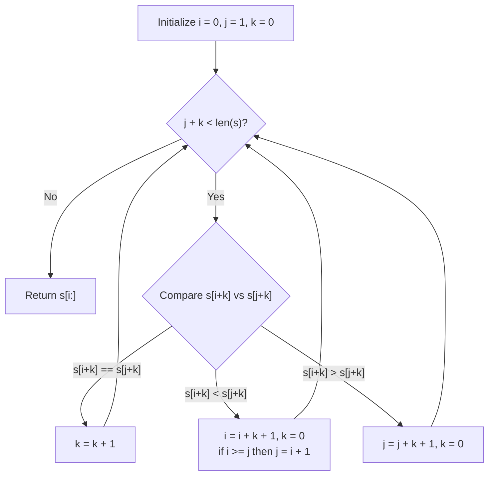

# Guided Example: Last Substring in Lexicographical Order

We trace the linear-time two-pointer suffix elimination algorithm (derived from Duval's Lyndon factorization principles) to find the lexicographically maximum substring of a string.

- **Input:** $s = \text{"abab"}$
- **Required output:** `"bab"`

This instance illustrates suffix reduction, character-by-character prefix expansion, multi-index block elimination, and pointer synchronization.

---

## 1. Instance & Teaching Goal

Given a string $s$ of length $N$, we want to find the substring of $s$ that appears latest in alphabetical (lexicographical) order.

A crucial mathematical property simplifies the problem:

> **The Suffix Maximality Theorem.** Any candidate for the lexicographically latest substring of $s$ must extend all the way to the end of the string; that is, **it must be a suffix of $s$**.

*Proof:* Consider any proper substring $t = s[p \dots q]$ where $q < N - 1$. Compare $t$ with the full suffix $t' = s[p \dots N - 1]$. By construction, $t$ is a non-empty proper prefix of $t'$. In standard lexicographical ordering, any string is strictly smaller than any of its proper extensions (e.g., `"ba" < "bab"`). Therefore, $t$ can never be the lexicographical maximum while $t'$ exists. The search space immediately reduces from $\binom{N+1}{2} = \mathcal{O}(N^2)$ substrings to exactly $N$ suffixes!

Comparing all pairs of suffixes naively takes $\mathcal{O}(N^2)$ time:

$$\text{For } N = 4 \times 10^5: \quad \frac{N^2}{2} = 8 \times 10^{10} \text{ operations (Time Limit Exceeded)}$$

```text
Brute-Force Pairwise Comparison vs. Block Suffix Elimination:

String:  a  b  a  b
Index:   0  1  2  3

All Suffixes:
  Suffix 0: "abab"
  Suffix 1: "bab"    <-- Lexicographically Largest!
  Suffix 2: "ab"
  Suffix 3: "b"

Duval Two-Pointer Optimization:
  Compare Suffix 0 vs Suffix 1 at offset k=0:
    s[0] ('a') < s[1] ('b') -> Suffix 0 eliminated immediately!
  Compare Suffix 1 vs Suffix 2:
    s[1] ('b') > s[2] ('a') -> Suffix 2 eliminated immediately!
  Compare Suffix 1 vs Suffix 3:
    s[1] ('b') == s[3] ('b') -> match! Offset k advances to 1.
    Challenger runs out of characters. Suffix 1 wins in O(N) time!
```

The teaching goal is to demonstrate how matching identical prefixes allows skipping multiple redundant start indices simultaneously in $\mathcal{O}(N)$ total time.

---

## 2. Conceptual Foundation & Invariants

We maintain three index pointers $(i, j, k)$:
- $i$: The starting index of the leading candidate suffix.
- $j$: The starting index of the challenger suffix ($j > i$).
- $k$: The length of the common prefix matched so far: $s[i \dots i+k-1] = s[j \dots j+k-1]$.

### Block Elimination Logic

When comparing $s[i + k]$ against $s[j + k]$:
1. **Match ($s[i + k] = s[j + k]$):** Both suffixes agree for $k+1$ characters. Increment $k \leftarrow k + 1$ to inspect the next character.
2. **Challenger Dominates ($s[i + k] < s[j + k]$):**
   - Suffix $j$ is strictly larger than suffix $i$.
   - Furthermore, for any offset $t \in [0, k]$, suffix $i + t$ shares its prefix with suffix $j + t$ up to the mismatch where character $j + k$ is strictly larger. Thus, every starting position in the range $[i, i + k]$ is strictly inferior to $j + t$.
   - We safely advance: $i \leftarrow i + k + 1$ and reset $k \leftarrow 0$.
   - If $i \ge j$, we enforce distinctness by setting $j \leftarrow i + 1$.
3. **Leader Dominates ($s[i + k] > s[j + k]$):**
   - Suffix $i$ is strictly larger than suffix $j$.
   - Suffixes starting in $[j, j + k]$ are eliminated.
   - We safely advance: $j \leftarrow j + k + 1$ and reset $k \leftarrow 0$.

| Pointer | Role | Invariant Property |
|---|---|---|
| $i$ | Current champion suffix start | No suffix starting at $p < i$ can exceed suffix $i$ |
| $j$ | Current challenger suffix start | Always satisfies $j > i$ at step boundaries |
| $k$ | Matched prefix length | Identical substring slice: $s[i \dots i+k-1] = s[j \dots j+k-1]$ |
| Elimination step | Jump $i \mathrel{+}= k + 1$ or $j \mathrel{+}= k + 1$ | Discards all $k+1$ intermediate starting indices at once |



> **Candidate Pruning Invariant.** At every point in the algorithm, every starting position $p < \min(i, j)$ that has been bypassed is mathematically proven to produce a suffix lexicographically smaller than the surviving candidates.

---

## 3. Step-by-Step Worked Execution

We trace $s = \text{"abab"}$ of length $N = 4$.

### Initialization

- $i = 0$ (candidate: suffix $0$ `"abab"`)
- $j = 1$ (challenger: suffix $1$ `"bab"`)
- $k = 0$

---

### Step 1: Compare $s[0]$ vs $s[1]$

- Inspect $s[i + k] = s[0 + 0] = \text{'a'}$.
- Inspect $s[j + k] = s[1 + 0] = \text{'b'}$.
- Comparison: $\text{'a'} < \text{'b'}$.
- **Action:**
  - Challenger suffix $1$ dominates candidate suffix $0$.
  - Advance $i$: $i \leftarrow i + k + 1 = 0 + 0 + 1 = 1$.
  - Reset $k \leftarrow 0$.
  - Pointer check: $i = 1 \ge j \ (1)$. Enforce $j > i$: set $j \leftarrow i + 1 = 2$.
- State at end of step: $i = 1, j = 2, k = 0$.

---

### Step 2: Compare $s[1]$ vs $s[2]$

- Inspect $s[i + k] = s[1 + 0] = \text{'b'}$.
- Inspect $s[j + k] = s[2 + 0] = \text{'a'}$.
- Comparison: $\text{'b'} > \text{'a'}$.
- **Action:**
  - Candidate suffix $1$ dominates challenger suffix $2$.
  - Advance $j$: $j \leftarrow j + k + 1 = 2 + 0 + 1 = 3$.
  - Reset $k \leftarrow 0$.
- State at end of step: $i = 1, j = 3, k = 0$.

---

### Step 3: Compare $s[1]$ vs $s[3]$

- Inspect $s[i + k] = s[1 + 0] = \text{'b'}$.
- Inspect $s[j + k] = s[3 + 0] = \text{'b'}$.
- Comparison: $\text{'b'} == \text{'b'}$.
- **Action:**
  - Characters match.
  - Increment common prefix length: $k \leftarrow k + 1 = 1$.
- State at end of step: $i = 1, j = 3, k = 1$.

---

### Step 4: Boundary Evaluation

- Check loop condition: $j + k = 3 + 1 = 4 = N$.
- The challenger suffix $3$ (`"b"`) has no remaining characters to compare.
- Loop terminates.

---

### Result Extraction

The winning suffix starts at index $i = 1$:

$$s[1:] = \text{"bab"}$$

---

## 4. Complete Execution Trace

| Iteration | $i$ | $j$ | $k$ | $s[i+k]$ | $s[j+k]$ | Outcome | Elimination / Advancement | Next $(i, j, k)$ |
|---|---|---|---|---|---|---|---|---|
| $1$ | $0$ | $1$ | $0$ | `'a'` | `'b'` | `'a' < 'b'` | Suffix $0$ eliminated; $i \leftarrow 1$, sync $j \leftarrow 2$ | $(1, 2, 0)$ |
| $2$ | $1$ | $2$ | $0$ | `'b'` | `'a'` | `'b' > 'a'` | Suffix $2$ eliminated; $j \leftarrow 3$ | $(1, 3, 0)$ |
| $3$ | $1$ | $3$ | $0$ | `'b'` | `'b'` | Match | Match extended; $k \leftarrow 1$ | $(1, 3, 1)$ |
| $4$ | $1$ | $3$ | $1$ | — | — | $j + k = 4 = N$ | Challenger exhausted; Loop ends | Emit $s[1:] = \text{"bab"}$ |

```text
Suffix Comparison Verification:

Suffix 0: a b a b
Suffix 1: b a b       <-- LARGEST (starts with 'b', length 3)
Suffix 2: a b
Suffix 3: b

Alphabetical Sorting:
  "a"     (substring)
  "ab"    (suffix 2)
  "aba"   (substring)
  "abab"  (suffix 0)
  "b"     (suffix 3)
  "ba"    (substring)
  "bab"   (suffix 1)  <-- Rank 7 (Maximum)
```

---

## 5. Algorithmic Correctness

**Theorem (Soundness of Suffix Block Skipping).**
Let $s[i \dots i+k-1] = s[j \dots j+k-1]$ and $s[i+k] < s[j+k]$. For any integer offset $t \in [0, k]$, the suffix $s[i+t:]$ is lexicographically smaller than the suffix $s[j+t:]$.

*Proof:*
1. The common prefix of length $k - t$ guarantees that:
   $$s[i+t \dots i+k-1] = s[j+t \dots j+k-1]$$
2. At the subsequent character, $s[i+k] < s[j+k]$.
3. Therefore, at the very first point of divergence, suffix $s[j+t:]$ has a strictly greater character than suffix $s[i+t:]$.
4. Hence, $s[i+t:] < s[j+t:]$ for all $t \in [0, k]$.
5. None of the indices in $\{i, i+1, \dots, i+k\}$ can be the globally maximal suffix. Advancing $i$ directly to $i + k + 1$ discards only non-maximal suffixes, preserving global optimality.

---

## 6. Traps This Instance Exposes

| Trap Category | Hazard Scenario | Root Cause | Preventive Design Invariant |
|---|---|---|---|
| **Non-Suffix Substring Fallacy** | Searching for arbitrary substrings $[start, end]$ | Overlooking that extending any substring to the end of $s$ strictly increases its lexicographical rank. | Search exclusively among the $N$ suffixes of $s$. |
| **Pointer Overlap Deadlock** | When $i$ catches or passes $j$ ($i \ge j$), leaving $j \le i$ | Causes comparing a suffix against itself or inverted pair order. | Enforce $j = i + 1$ whenever $i \ge j$. |
| **Quadratic Degeneracy on Repetitions** | String $s = \text{"aaaa...ab"}$ | Resetting pointer $i$ to $i + 1$ instead of $i + k + 1$ results in $\mathcal{O}(N^2)$ re-comparisons. | Always advance the losing pointer by $k + 1$ to discard the full matched prefix block. |
| **String Slicing Inside Comparison Loop** | Doing `s[i+k:] < s[j+k:]` inside the while loop | Generates new string objects costing $\mathcal{O}(N)$ per iteration, reverting complexity to $\mathcal{O}(N^2)$. | Compare single characters `s[i+k]` and `s[j+k]` in $\mathcal{O}(1)$ time. |

---

## 7. Complexity Derivation

### Time Complexity

- In every iteration of the `while` loop:
  - Either $k$ increases by $1$.
  - Or $i$ advances by $k + 1$, and $k$ is reset to $0$.
  - Or $j$ advances by $k + 1$, and $k$ is reset to $0$.
- Because each character index of $s$ is visited at most a constant number of times across all comparisons:

$$\text{Total Loop Iterations} \le 2N$$

Each loop iteration executes $\mathcal{O}(1)$ primitive character comparisons and pointer increments. Slicing the final answer $s[i:]$ takes $\mathcal{O}(N)$ time.

$$\mathcal{O}(N) \text{ Total Time}$$

For $N = 4 \times 10^5$, this executes in under $50 \text{ ms}$.

### Auxiliary Space Complexity

- The algorithm maintains only three integer registers: $i, j, k$.
- No auxiliary tables, trees, or recursion stacks are created.

$$\mathcal{O}(1) \text{ Auxiliary Space}$$
